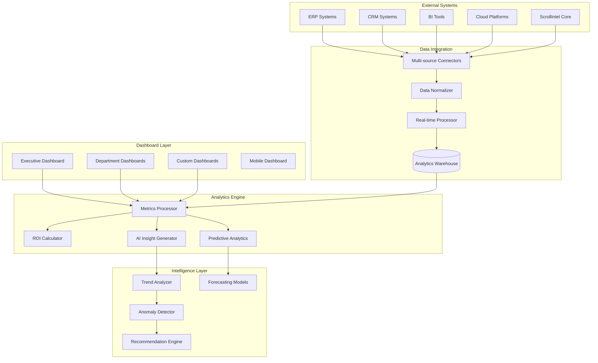

# Advanced Analytics Dashboard System Design Document

## Overview

The Advanced Analytics Dashboard System provides comprehensive executive analytics with unified business intelligence, ROI tracking, predictive metrics, and automated insight generation. Built with real-time data processing and AI-powered analytics, the system enables executives to monitor and optimize all technology initiatives from a single, intelligent dashboard.

## Architecture

### High-Level Architecture



## Components and Interfaces

### 1. Executive Dashboard System

**Purpose**: Role-specific dashboards with real-time executive metrics

**Key Components**:
- `DashboardManager`: Create and manage executive dashboards
- `TemplateEngine`: Industry-specific dashboard templates
- `PermissionManager`: Role-based dashboard access control

**Interface**:
```python
class DashboardManager:
    def create_executive_dashboard(self, role: ExecutiveRole, config: DashboardConfig) -> Dashboard
    def update_dashboard_metrics(self, dashboard_id: str, metrics: List[Metric]) -> bool
    def get_dashboard_data(self, dashboard_id: str, time_range: TimeRange) -> DashboardData
    def share_dashboard(self, dashboard_id: str, permissions: SharePermissions) -> ShareLink
```

### 2. ROI Calculator Engine

**Purpose**: Comprehensive ROI tracking and financial impact analysis

**Key Components**:
- `CostTracker`: Track direct and indirect costs
- `BenefitCalculator`: Measure business benefits and savings
- `ROIAnalyzer`: Calculate and analyze ROI metrics

**Interface**:
```python
class ROICalculator:
    def track_project_costs(self, project_id: str, costs: List[Cost]) -> CostSummary
    def calculate_benefits(self, project_id: str, metrics: List[BusinessMetric]) -> BenefitSummary
    def compute_roi(self, project_id: str, time_period: TimePeriod) -> ROIAnalysis
    def generate_roi_report(self, project_ids: List[str]) -> ROIReport
```

### 3. AI Insight Generator

**Purpose**: Automated insight generation with natural language explanations

**Key Components**:
- `PatternDetector`: Identify significant data patterns
- `InsightEngine`: Generate natural language insights
- `ContextAnalyzer`: Provide business context for findings

**Interface**:
```python
class InsightGenerator:
    def analyze_data_patterns(self, data: AnalyticsData) -> List[Pattern]
    def generate_insights(self, patterns: List[Pattern]) -> List[Insight]
    def explain_anomaly(self, anomaly: Anomaly, context: BusinessContext) -> Explanation
    def suggest_actions(self, insights: List[Insight]) -> List[ActionRecommendation]
```

### 4. Predictive Analytics Engine

**Purpose**: Forecasting and predictive modeling for business metrics

**Key Components**:
- `ForecastingModels`: Time series and ML forecasting models
- `ScenarioModeler`: What-if analysis and scenario planning
- `RiskPredictor`: Identify and predict business risks

**Interface**:
```python
class PredictiveEngine:
    def forecast_metrics(self, metric: BusinessMetric, horizon: int) -> Forecast
    def model_scenario(self, scenario: ScenarioConfig) -> ScenarioResult
    def predict_risks(self, context: BusinessContext) -> List[RiskPrediction]
    def update_predictions(self, new_data: AnalyticsData) -> PredictionUpdate
```

## Data Models

### Core Entities

```python
class Dashboard:
    id: str
    name: str
    type: DashboardType
    owner_id: str
    config: DashboardConfig
    widgets: List[Widget]
    permissions: List[Permission]
    created_at: datetime
    updated_at: datetime

class BusinessMetric:
    id: str
    name: str
    category: MetricCategory
    value: float
    unit: str
    timestamp: datetime
    source: str
    context: Dict[str, Any]

class ROIAnalysis:
    project_id: str
    total_investment: float
    total_benefits: float
    roi_percentage: float
    payback_period: int
    npv: float
    irr: float
    analysis_date: datetime

class Insight:
    id: str
    type: InsightType
    title: str
    description: str
    significance: float
    confidence: float
    recommendations: List[str]
    created_at: datetime
```

## Testing Strategy

### Unit Testing
- Dashboard creation and management
- ROI calculation algorithms
- Insight generation logic
- Predictive model accuracy

### Integration Testing
- Multi-source data integration
- Real-time dashboard updates
- Cross-platform analytics
- Permission and security systems

### End-to-End Testing
- Complete executive dashboard workflows
- ROI tracking scenarios
- Predictive analytics accuracy
- Performance under load