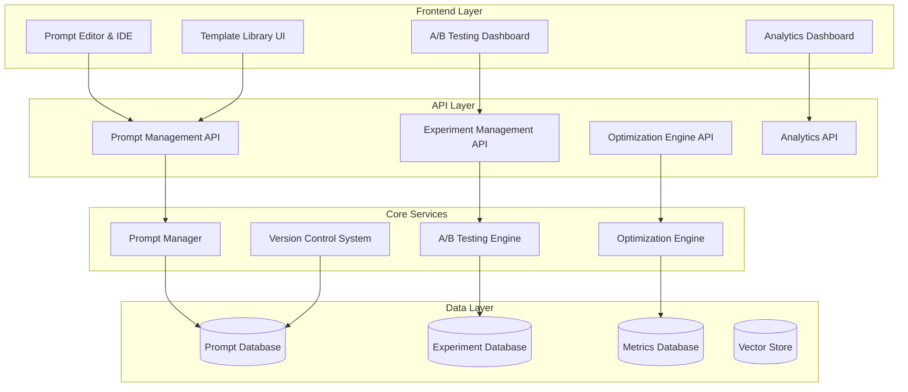

# Advanced Prompt Management System Design Document

## Overview

The Advanced Prompt Management System provides enterprise-grade prompt engineering capabilities with template libraries, version control, A/B testing, automated optimization, and comprehensive analytics. Built with a microservices architecture, the system enables systematic prompt improvement and collaborative prompt development.

## Architecture

### High-Level Architecture



## Components and Interfaces

### 1. Prompt Management System

**Purpose**: Centralized prompt storage, versioning, and organization

**Key Components**:
- `PromptManager`: CRUD operations for prompts and templates
- `TemplateLibrary`: Categorized prompt template management
- `VersionControl`: Git-like versioning for prompt changes

**Interface**:
```python
class PromptManager:
    def create_prompt(self, prompt: PromptTemplate) -> str
    def update_prompt(self, prompt_id: str, changes: PromptChanges) -> PromptVersion
    def search_prompts(self, query: SearchQuery) -> List[PromptTemplate]
    def get_prompt_history(self, prompt_id: str) -> List[PromptVersion]
```

### 2. A/B Testing Engine

**Purpose**: Systematic prompt experimentation and performance comparison

**Key Components**:
- `ExperimentEngine`: Design and run A/B tests
- `MetricsCollector`: Gather performance data
- `StatisticalAnalyzer`: Analyze experiment results

**Interface**:
```python
class ExperimentEngine:
    def create_experiment(self, config: ExperimentConfig) -> Experiment
    def run_experiment(self, experiment_id: str) -> ExperimentResults
    def analyze_results(self, experiment_id: str) -> StatisticalAnalysis
    def promote_winner(self, experiment_id: str, variant_id: str) -> bool
```

### 3. Optimization Engine

**Purpose**: Automated prompt improvement using ML techniques

**Key Components**:
- `GeneticOptimizer`: Evolutionary prompt optimization
- `ReinforcementOptimizer`: RL-based prompt tuning
- `PerformanceEvaluator`: Multi-metric performance assessment

**Interface**:
```python
class OptimizationEngine:
    def optimize_prompt(self, prompt_id: str, config: OptimizationConfig) -> OptimizationJob
    def evaluate_performance(self, prompt: str, test_cases: List[TestCase]) -> PerformanceMetrics
    def get_optimization_status(self, job_id: str) -> OptimizationStatus
```

## Data Models

### Core Entities

```python
class PromptTemplate:
    id: str
    name: str
    content: str
    category: str
    tags: List[str]
    variables: List[PromptVariable]
    created_by: str
    created_at: datetime
    updated_at: datetime

class PromptVersion:
    id: str
    prompt_id: str
    version: str
    content: str
    changes: str
    created_by: str
    created_at: datetime

class Experiment:
    id: str
    name: str
    prompt_variants: List[PromptVariant]
    test_config: TestConfig
    status: ExperimentStatus
    results: Optional[ExperimentResults]
    created_at: datetime

class OptimizationJob:
    id: str
    prompt_id: str
    algorithm: OptimizationAlgorithm
    config: OptimizationConfig
    status: JobStatus
    results: Optional[OptimizationResults]
    created_at: datetime
```

## Testing Strategy

### Unit Testing
- Prompt CRUD operations
- Version control functionality
- Optimization algorithms
- Statistical analysis methods

### Integration Testing
- API endpoint functionality
- Database operations
- External AI service integration
- Experiment workflow testing

### End-to-End Testing
- Complete prompt optimization workflows
- A/B testing scenarios
- Template library usage
- Performance analytics generation