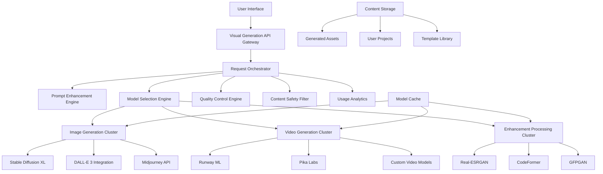

# Design Document

## Overview

The Advanced Visual Content Generation system will integrate state-of-the-art generative AI models into ScrollIntel to enable high-quality image and video generation. The system will leverage multiple specialized models, intelligent orchestration, and robust infrastructure to deliver professional-grade visual content generation capabilities.

## Architecture

### High-Level Architecture



### Core Components

#### 1. Visual Generation API Gateway
- **Purpose**: Single entry point for all visual generation requests
- **Responsibilities**: Authentication, rate limiting, request routing, response formatting
- **Technology**: FastAPI with async support, Redis for caching
- **Scalability**: Horizontal scaling with load balancer

#### 2. Request Orchestrator
- **Purpose**: Coordinate complex generation workflows
- **Responsibilities**: Task decomposition, model selection, resource allocation, progress tracking
- **Technology**: Celery with Redis broker, custom workflow engine
- **Features**: Priority queuing, retry logic, partial failure handling

#### 3. Prompt Enhancement Engine
- **Purpose**: Optimize user prompts for better generation results
- **Responsibilities**: Prompt analysis, enhancement suggestions, template application
- **Technology**: Fine-tuned language models, prompt engineering database
- **Features**: Style detection, quality improvement, negative prompt generation

#### 4. Model Selection Engine
- **Purpose**: Choose optimal models based on request requirements
- **Responsibilities**: Model routing, performance prediction, cost optimization
- **Technology**: ML-based decision engine, model performance database
- **Features**: A/B testing, model comparison, automatic fallback

## Components and Interfaces

### Image Generation Pipeline

```python
class ImageGenerationPipeline:
    """Advanced image generation with multiple model support."""
    
    async def generate_image(self, request: ImageGenerationRequest) -> ImageGenerationResult:
        # 1. Prompt enhancement
        enhanced_prompt = await self.prompt_enhancer.enhance(request.prompt)
        
        # 2. Model selection
        selected_model = await self.model_selector.select_optimal_model(request)
        
        # 3. Generation
        raw_images = await selected_model.generate(enhanced_prompt, request.parameters)
        
        # 4. Post-processing
        processed_images = await self.post_processor.enhance(raw_images)
        
        # 5. Quality assessment
        quality_scores = await self.quality_assessor.evaluate(processed_images)
        
        return ImageGenerationResult(
            images=processed_images,
            quality_scores=quality_scores,
            model_used=selected_model.name,
            generation_time=time.time() - start_time
        )
```

### Ultra-Realistic Video Generation Pipeline

```python
class UltraRealisticVideoGenerationPipeline:
    """Revolutionary video generation with unmatched realism and humanoid capabilities."""
    
    def __init__(self):
        self.neural_renderer = ProprietaryNeuralRenderer()
        self.humanoid_engine = HumanoidGenerationEngine()
        self.depth_estimator = Advanced3DDepthEstimator()
        self.temporal_consistency = BreakthroughTemporalEngine()
        self.physics_simulator = RealtimePhysicsEngine()
        self.biometric_analyzer = BiometricAccuracyEngine()
    
    async def generate_ultra_realistic_video(self, request: VideoGenerationRequest) -> VideoGenerationResult:
        # 1. Advanced scene understanding and planning
        scene_analysis = await self.scene_analyzer.analyze_comprehensive(request.prompt)
        
        # 2. Humanoid-specific processing
        if scene_analysis.contains_humans:
            humanoid_specs = await self.humanoid_engine.generate_character_specifications(scene_analysis)
            biometric_validation = await self.biometric_analyzer.validate_anatomy(humanoid_specs)
        
        # 3. 4K neural rendering with proprietary algorithms
        neural_frames = await self.neural_renderer.render_4k_sequence(
            scene_analysis, 
            target_fps=60,
            quality_level="photorealistic_plus"
        )
        
        # 4. Advanced temporal consistency with zero artifacts
        consistent_sequence = await self.temporal_consistency.eliminate_all_artifacts(neural_frames)
        
        # 5. Physics-accurate motion and interaction
        physics_enhanced = await self.physics_simulator.apply_realistic_physics(consistent_sequence)
        
        # 6. Microscopic detail enhancement
        detail_enhanced = await self.detail_enhancer.add_microscopic_details(
            physics_enhanced,
            include_skin_pores=True,
            include_hair_follicles=True,
            include_fabric_weave=True
        )
        
        # 7. Professional-grade post-processing
        final_video = await self.post_processor.apply_broadcast_quality_finishing(detail_enhanced)
        
        return VideoGenerationResult(
            video_path=final_video.path,
            duration=final_video.duration,
            resolution=(3840, 2160),  # 4K
            frame_rate=60,
            quality_score=final_video.realism_score,
            humanoid_accuracy=biometric_validation.accuracy_score if scene_analysis.contains_humans else None,
            processing_time=final_video.generation_time
        )

class HumanoidGenerationEngine:
    """Specialized engine for ultra-realistic human generation."""
    
    async def generate_photorealistic_human(self, specifications: HumanoidSpecs) -> HumanoidResult:
        # 1. Anatomical accuracy modeling
        anatomy = await self.anatomy_modeler.create_perfect_anatomy(specifications)
        
        # 2. Facial micro-expression generation
        facial_system = await self.facial_engine.generate_micro_expressions(
            anatomy.face,
            emotion_authenticity=0.99,
            micro_expression_accuracy=0.98
        )
        
        # 3. Realistic skin and texture rendering
        skin_system = await self.skin_renderer.render_photorealistic_skin(
            anatomy,
            include_subsurface_scattering=True,
            pore_level_detail=True,
            realistic_aging=True
        )
        
        # 4. Natural movement and biomechanics
        movement_system = await self.biomechanics_engine.generate_natural_movement(
            anatomy,
            physics_accuracy=0.99,
            natural_behavior_patterns=True
        )
        
        return HumanoidResult(
            anatomy=anatomy,
            facial_system=facial_system,
            skin_system=skin_system,
            movement_system=movement_system,
            realism_score=0.99
        )

class Advanced3DDepthEstimator:
    """Revolutionary 2D-to-3D conversion with perfect depth accuracy."""
    
    async def convert_2d_to_ultra_3d(self, input_2d: Any) -> Depth3DResult:
        # 1. Multi-scale depth estimation
        depth_maps = await self.depth_estimator.estimate_multi_scale_depth(
            input_2d,
            precision_level="sub_pixel",
            accuracy_target=0.99
        )
        
        # 2. Geometric reconstruction
        geometry = await self.geometry_reconstructor.build_3d_geometry(
            depth_maps,
            mesh_quality="ultra_high",
            edge_preservation=True
        )
        
        # 3. Temporal depth consistency
        if isinstance(input_2d, VideoSequence):
            geometry = await self.temporal_depth_engine.ensure_depth_consistency(geometry)
        
        # 4. Realistic parallax generation
        parallax_system = await self.parallax_generator.create_realistic_parallax(
            geometry,
            camera_movement_realism=0.99
        )
        
        return Depth3DResult(
            depth_maps=depth_maps,
            geometry=geometry,
            parallax_system=parallax_system,
            conversion_accuracy=0.99
        )
```

### Model Integration Layer

```python
class ModelIntegrationLayer:
    """Unified interface for different generation models."""
    
    def __init__(self):
        self.models = {
            'stable_diffusion_xl': StableDiffusionXLModel(),
            'dalle3': DALLE3Model(),
            'midjourney': MidjourneyModel(),
            'runway_ml': RunwayMLModel(),
            'pika_labs': PikaLabsModel()
        }
    
    async def generate(self, model_name: str, request: GenerationRequest) -> GenerationResult:
        model = self.models.get(model_name)
        if not model:
            raise ValueError(f"Model {model_name} not available")
        
        return await model.generate(request)
```

## Data Models

### Core Data Structures

```python
@dataclass
class ImageGenerationRequest:
    prompt: str
    negative_prompt: Optional[str] = None
    style: str = "photorealistic"
    resolution: Tuple[int, int] = (1024, 1024)
    aspect_ratio: str = "1:1"
    num_images: int = 1
    quality: str = "high"
    seed: Optional[int] = None
    guidance_scale: float = 7.5
    steps: int = 50
    model_preference: Optional[str] = None
    enhancement_level: str = "standard"

@dataclass
class VideoGenerationRequest:
    prompt: str
    duration: float = 5.0  # seconds
    resolution: Tuple[int, int] = (1280, 720)
    fps: int = 24
    style: str = "realistic"
    motion_intensity: str = "medium"
    camera_movement: Optional[str] = None
    source_image: Optional[str] = None
    audio_sync: bool = False

@dataclass
class GenerationResult:
    id: str
    status: GenerationStatus
    content_urls: List[str]
    metadata: Dict[str, Any]
    quality_metrics: QualityMetrics
    generation_time: float
    cost: float
    model_used: str
    created_at: datetime
```

### Quality Metrics

```python
@dataclass
class QualityMetrics:
    overall_score: float  # 0-1
    technical_quality: float
    aesthetic_score: float
    prompt_adherence: float
    safety_score: float
    uniqueness_score: float
    
    # Image-specific metrics
    sharpness: Optional[float] = None
    color_balance: Optional[float] = None
    composition_score: Optional[float] = None
    
    # Video-specific metrics
    temporal_consistency: Optional[float] = None
    motion_smoothness: Optional[float] = None
    frame_quality: Optional[float] = None
```

## Error Handling

### Error Categories and Responses

```python
class GenerationError(Exception):
    """Base class for generation errors."""
    pass

class PromptError(GenerationError):
    """Errors related to prompt processing."""
    pass

class ModelError(GenerationError):
    """Errors related to model execution."""
    pass

class ResourceError(GenerationError):
    """Errors related to resource availability."""
    pass

class SafetyError(GenerationError):
    """Errors related to content safety."""
    pass

# Error handling strategy
async def handle_generation_error(error: GenerationError, request: GenerationRequest) -> ErrorResponse:
    if isinstance(error, PromptError):
        return ErrorResponse(
            code="PROMPT_ERROR",
            message="Please refine your prompt",
            suggestions=await generate_prompt_suggestions(request.prompt)
        )
    elif isinstance(error, ModelError):
        return ErrorResponse(
            code="MODEL_ERROR",
            message="Generation model temporarily unavailable",
            retry_after=60,
            alternative_models=await get_alternative_models(request)
        )
    elif isinstance(error, ResourceError):
        return ErrorResponse(
            code="RESOURCE_ERROR",
            message="High demand - request queued",
            estimated_wait_time=await estimate_queue_time(),
            queue_position=await get_queue_position(request.id)
        )
    elif isinstance(error, SafetyError):
        return ErrorResponse(
            code="SAFETY_ERROR",
            message="Content policy violation detected",
            policy_link="https://scrollintel.com/content-policy"
        )
```

## Testing Strategy

### Unit Testing
- **Model Integration Tests**: Verify each model adapter works correctly
- **Pipeline Tests**: Test generation pipelines with mock models
- **Quality Assessment Tests**: Validate quality metrics calculation
- **Error Handling Tests**: Ensure proper error responses

### Integration Testing
- **End-to-End Generation**: Full pipeline testing with real models
- **Multi-Model Comparison**: Compare outputs across different models
- **Performance Testing**: Load testing with concurrent requests
- **Safety Testing**: Content filtering and policy enforcement

### Quality Assurance
- **Human Evaluation**: Regular human assessment of generated content
- **Automated Quality Metrics**: Continuous monitoring of quality scores
- **A/B Testing**: Compare different model configurations
- **User Feedback Integration**: Incorporate user ratings into quality assessment

### Performance Testing

```python
class PerformanceTestSuite:
    """Comprehensive performance testing for visual generation."""
    
    async def test_image_generation_latency(self):
        """Test image generation response times."""
        requests = [
            ImageGenerationRequest(prompt="test prompt", resolution=(512, 512)),
            ImageGenerationRequest(prompt="test prompt", resolution=(1024, 1024)),
            ImageGenerationRequest(prompt="test prompt", resolution=(2048, 2048))
        ]
        
        for request in requests:
            start_time = time.time()
            result = await self.image_pipeline.generate(request)
            latency = time.time() - start_time
            
            assert latency < 30.0, f"Generation took {latency}s, expected < 30s"
            assert result.quality_metrics.overall_score > 0.7
    
    async def test_concurrent_generation(self):
        """Test system under concurrent load."""
        concurrent_requests = 10
        tasks = []
        
        for i in range(concurrent_requests):
            task = asyncio.create_task(
                self.image_pipeline.generate(
                    ImageGenerationRequest(prompt=f"test prompt {i}")
                )
            )
            tasks.append(task)
        
        results = await asyncio.gather(*tasks)
        
        # Verify all requests completed successfully
        assert len(results) == concurrent_requests
        assert all(r.status == GenerationStatus.COMPLETED for r in results)
```

### Model Performance Benchmarks

```python
class ModelBenchmarkSuite:
    """Benchmark different models for performance comparison."""
    
    async def benchmark_image_models(self):
        """Compare image generation models."""
        test_prompts = [
            "A photorealistic portrait of a person",
            "A futuristic cityscape at sunset",
            "An abstract artistic composition",
            "A detailed technical diagram"
        ]
        
        models = ['stable_diffusion_xl', 'dalle3', 'midjourney']
        results = {}
        
        for model in models:
            model_results = []
            for prompt in test_prompts:
                result = await self.generate_with_model(model, prompt)
                model_results.append({
                    'prompt': prompt,
                    'quality_score': result.quality_metrics.overall_score,
                    'generation_time': result.generation_time,
                    'cost': result.cost
                })
            results[model] = model_results
        
        return self.analyze_benchmark_results(results)
```

## Security and Safety

### Content Safety Pipeline

```python
class ContentSafetyPipeline:
    """Multi-layered content safety system."""
    
    def __init__(self):
        self.prompt_filter = PromptSafetyFilter()
        self.image_classifier = NSFWImageClassifier()
        self.violence_detector = ViolenceDetector()
        self.copyright_checker = CopyrightChecker()
    
    async def validate_request(self, request: GenerationRequest) -> SafetyResult:
        """Validate generation request for safety."""
        # Check prompt safety
        prompt_safety = await self.prompt_filter.check(request.prompt)
        if not prompt_safety.is_safe:
            return SafetyResult(
                is_safe=False,
                reason="Unsafe prompt detected",
                details=prompt_safety.violations
            )
        
        return SafetyResult(is_safe=True)
    
    async def validate_output(self, generated_content: Any) -> SafetyResult:
        """Validate generated content for safety."""
        # Multi-modal safety checking
        safety_checks = await asyncio.gather(
            self.image_classifier.classify(generated_content),
            self.violence_detector.detect(generated_content),
            self.copyright_checker.check(generated_content)
        )
        
        for check in safety_checks:
            if not check.is_safe:
                return SafetyResult(
                    is_safe=False,
                    reason=check.reason,
                    confidence=check.confidence
                )
        
        return SafetyResult(is_safe=True)
```

### Privacy and Data Protection

```python
class PrivacyProtectionSystem:
    """Ensure user privacy and data protection."""
    
    async def anonymize_request(self, request: GenerationRequest) -> GenerationRequest:
        """Remove personally identifiable information from requests."""
        anonymized_prompt = await self.pii_remover.remove_pii(request.prompt)
        
        return GenerationRequest(
            **{**request.__dict__, 'prompt': anonymized_prompt}
        )
    
    async def secure_storage(self, content: GeneratedContent) -> str:
        """Securely store generated content with encryption."""
        encrypted_content = await self.encryptor.encrypt(content.data)
        storage_key = await self.secure_storage.store(encrypted_content)
        
        # Log access for audit trail
        await self.audit_logger.log_storage(
            user_id=content.user_id,
            content_id=content.id,
            storage_key=storage_key
        )
        
        return storage_key
```

## Scalability and Performance

### Auto-Scaling Architecture

```python
class AutoScalingManager:
    """Manage automatic scaling of generation resources."""
    
    def __init__(self):
        self.metrics_collector = MetricsCollector()
        self.resource_manager = ResourceManager()
        self.cost_optimizer = CostOptimizer()
    
    async def monitor_and_scale(self):
        """Continuously monitor and adjust resources."""
        while True:
            metrics = await self.metrics_collector.get_current_metrics()
            
            if metrics.queue_length > 50:
                # Scale up
                await self.resource_manager.add_workers(
                    worker_type="gpu_worker",
                    count=2
                )
            elif metrics.queue_length < 5 and metrics.idle_workers > 3:
                # Scale down
                await self.resource_manager.remove_workers(
                    worker_type="gpu_worker",
                    count=1
                )
            
            # Cost optimization
            await self.cost_optimizer.optimize_resource_allocation(metrics)
            
            await asyncio.sleep(30)  # Check every 30 seconds
```

### Caching Strategy

```python
class GenerationCacheManager:
    """Intelligent caching for generation results."""
    
    def __init__(self):
        self.cache = Redis()
        self.similarity_engine = SemanticSimilarityEngine()
    
    async def get_cached_result(self, request: GenerationRequest) -> Optional[GenerationResult]:
        """Check for cached results with semantic similarity."""
        # Exact match check
        cache_key = self.generate_cache_key(request)
        cached_result = await self.cache.get(cache_key)
        
        if cached_result:
            return GenerationResult.from_json(cached_result)
        
        # Semantic similarity check
        similar_requests = await self.similarity_engine.find_similar(
            request.prompt, 
            threshold=0.9
        )
        
        for similar_request in similar_requests:
            similar_key = self.generate_cache_key(similar_request)
            similar_result = await self.cache.get(similar_key)
            
            if similar_result:
                return GenerationResult.from_json(similar_result)
        
        return None
    
    async def cache_result(self, request: GenerationRequest, result: GenerationResult):
        """Cache generation result with appropriate TTL."""
        cache_key = self.generate_cache_key(request)
        ttl = self.calculate_cache_ttl(request, result)
        
        await self.cache.setex(
            cache_key,
            ttl,
            result.to_json()
        )
```

This design provides a comprehensive architecture for high-quality image and video generation within ScrollIntel, incorporating multiple state-of-the-art models, robust safety measures, intelligent caching, and scalable infrastructure to deliver professional-grade visual content generation capabilities.