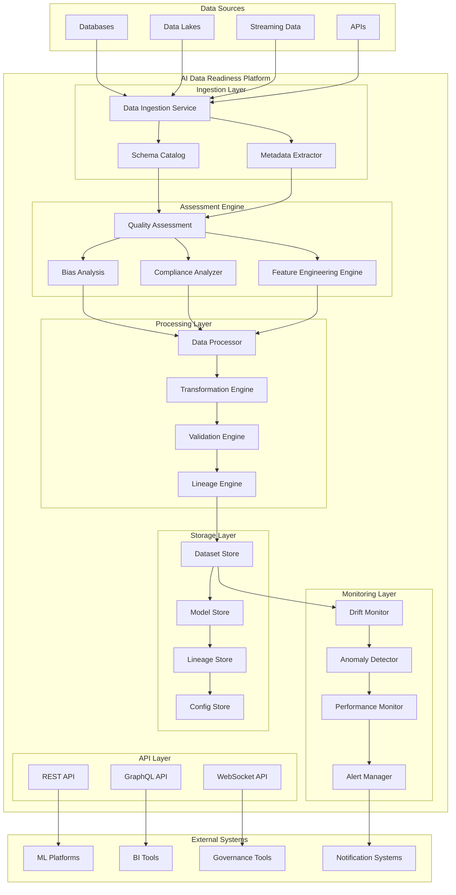

# Design Document - AI Data Readiness Platform

## Overview

The AI Data Readiness Platform is a comprehensive system that transforms raw data into AI-ready datasets through automated assessment, preparation, and continuous monitoring. The platform integrates with existing data infrastructure to provide intelligent data quality evaluation, feature engineering recommendations, bias detection, and compliance validation specifically tailored for AI and machine learning applications.

## Architecture

### High-Level Architecture



### Component Architecture

The platform follows a microservices architecture with the following core components:

1. **Data Ingestion Service**: Handles data intake from multiple sources
2. **Assessment Engine**: Evaluates data quality, bias, and compliance
3. **Processing Layer**: Transforms and prepares data for AI applications
4. **Monitoring Layer**: Continuously monitors data and model performance
5. **Storage Layer**: Manages datasets, models, and metadata
6. **API Layer**: Provides programmatic access to platform capabilities

## Components and Interfaces

### Data Ingestion Service

**Purpose**: Unified data intake from diverse sources with automatic schema detection and metadata extraction.

**Key Features**:
- Multi-format support (CSV, JSON, Parquet, Avro, etc.)
- Streaming and batch processing capabilities
- Automatic schema inference and validation
- Data sampling for large datasets

**Interfaces**:
```python
class DataIngestionService:
    def ingest_batch_data(self, source_config: SourceConfig) -> DatasetMetadata
    def ingest_streaming_data(self, stream_config: StreamConfig) -> StreamHandler
    def validate_schema(self, dataset_id: str, schema: Schema) -> ValidationResult
    def extract_metadata(self, dataset_id: str) -> DatasetMetadata
```

### Quality Assessment Engine

**Purpose**: Comprehensive data quality evaluation with AI-specific metrics and recommendations.

**Key Features**:
- Multi-dimensional quality scoring (completeness, accuracy, consistency, validity)
- AI-specific quality metrics (feature correlation, target leakage detection)
- Statistical analysis and distribution profiling
- Automated remediation recommendations

**Interfaces**:
```python
class QualityAssessmentEngine:
    def assess_quality(self, dataset_id: str) -> QualityReport
    def calculate_ai_readiness_score(self, dataset_id: str) -> AIReadinessScore
    def detect_anomalies(self, dataset_id: str) -> AnomalyReport
    def recommend_improvements(self, quality_report: QualityReport) -> RecommendationList
```

### Bias Analysis Engine

**Purpose**: Detects and quantifies bias across protected attributes and demographic groups.

**Key Features**:
- Statistical bias detection across multiple dimensions
- Fairness metric calculations
- Protected attribute identification
- Bias mitigation recommendations

**Interfaces**:
```python
class BiasAnalysisEngine:
    def detect_bias(self, dataset_id: str, protected_attributes: List[str]) -> BiasReport
    def calculate_fairness_metrics(self, dataset_id: str, target_column: str) -> FairnessMetrics
    def recommend_mitigation(self, bias_report: BiasReport) -> MitigationStrategy
    def validate_fairness(self, dataset_id: str, fairness_constraints: FairnessConstraints) -> ValidationResult
```

### Feature Engineering Engine

**Purpose**: Intelligent feature engineering recommendations based on data characteristics and model requirements.

**Key Features**:
- Automated feature discovery and selection
- Model-specific transformation recommendations
- Categorical encoding optimization
- Time-series feature engineering

**Interfaces**:
```python
class FeatureEngineeringEngine:
    def recommend_features(self, dataset_id: str, model_type: ModelType) -> FeatureRecommendations
    def apply_transformations(self, dataset_id: str, transformations: List[Transformation]) -> TransformedDataset
    def optimize_encoding(self, dataset_id: str, categorical_columns: List[str]) -> EncodingStrategy
    def generate_temporal_features(self, dataset_id: str, time_column: str) -> TemporalFeatures
```

### Drift Monitor

**Purpose**: Continuous monitoring of data distribution changes and model performance degradation.

**Key Features**:
- Statistical drift detection (KL divergence, PSI, etc.)
- Feature-level drift analysis
- Model performance correlation
- Automated alerting and recommendations

**Interfaces**:
```python
class DriftMonitor:
    def monitor_drift(self, dataset_id: str, reference_dataset_id: str) -> DriftReport
    def calculate_drift_metrics(self, current_data: DataFrame, reference_data: DataFrame) -> DriftMetrics
    def set_drift_thresholds(self, dataset_id: str, thresholds: DriftThresholds) -> None
    def get_drift_alerts(self, dataset_id: str) -> List[DriftAlert]
```

## Data Models

### Core Data Models

```python
@dataclass
class Dataset:
    id: str
    name: str
    description: str
    schema: Schema
    metadata: DatasetMetadata
    quality_score: float
    ai_readiness_score: float
    created_at: datetime
    updated_at: datetime
    version: str
    lineage: DataLineage

@dataclass
class QualityReport:
    dataset_id: str
    overall_score: float
    completeness_score: float
    accuracy_score: float
    consistency_score: float
    validity_score: float
    issues: List[QualityIssue]
    recommendations: List[Recommendation]
    generated_at: datetime

@dataclass
class BiasReport:
    dataset_id: str
    protected_attributes: List[str]
    bias_metrics: Dict[str, float]
    fairness_violations: List[FairnessViolation]
    mitigation_strategies: List[MitigationStrategy]
    generated_at: datetime

@dataclass
class AIReadinessScore:
    overall_score: float
    data_quality_score: float
    feature_quality_score: float
    bias_score: float
    compliance_score: float
    scalability_score: float
    dimensions: Dict[str, DimensionScore]
    improvement_areas: List[ImprovementArea]

@dataclass
class DriftReport:
    dataset_id: str
    reference_dataset_id: str
    drift_score: float
    feature_drift_scores: Dict[str, float]
    statistical_tests: Dict[str, StatisticalTest]
    alerts: List[DriftAlert]
    recommendations: List[DriftRecommendation]
    generated_at: datetime
```

### Configuration Models

```python
@dataclass
class SourceConfig:
    source_type: str
    connection_params: Dict[str, Any]
    data_format: str
    sampling_config: SamplingConfig
    validation_rules: List[ValidationRule]

@dataclass
class ProcessingConfig:
    transformation_pipeline: List[TransformationStep]
    quality_thresholds: QualityThresholds
    bias_constraints: BiasConstraints
    compliance_requirements: ComplianceRequirements

@dataclass
class MonitoringConfig:
    drift_thresholds: DriftThresholds
    alert_rules: List[AlertRule]
    monitoring_frequency: str
    notification_settings: NotificationSettings
```

## Error Handling

### Error Categories

1. **Data Ingestion Errors**
   - Invalid data formats
   - Schema validation failures
   - Connection timeouts
   - Access permission issues

2. **Processing Errors**
   - Transformation failures
   - Memory/compute limitations
   - Data type conversion errors
   - Feature engineering failures

3. **Quality Assessment Errors**
   - Insufficient data for analysis
   - Statistical computation failures
   - Bias detection limitations
   - Compliance validation errors

4. **Monitoring Errors**
   - Drift calculation failures
   - Alert delivery failures
   - Performance monitoring issues
   - Resource exhaustion

### Error Handling Strategy

```python
class AIDataReadinessError(Exception):
    """Base exception for AI Data Readiness Platform"""
    pass

class DataIngestionError(AIDataReadinessError):
    """Errors during data ingestion process"""
    pass

class QualityAssessmentError(AIDataReadinessError):
    """Errors during quality assessment"""
    pass

class BiasDetectionError(AIDataReadinessError):
    """Errors during bias analysis"""
    pass

class DriftMonitoringError(AIDataReadinessError):
    """Errors during drift monitoring"""
    pass

# Error handling with retry logic and graceful degradation
def handle_processing_error(error: Exception, context: ProcessingContext) -> ProcessingResult:
    if isinstance(error, DataIngestionError):
        return retry_with_backoff(context.operation, max_retries=3)
    elif isinstance(error, QualityAssessmentError):
        return provide_partial_results(context)
    else:
        return escalate_error(error, context)
```

## Testing Strategy

### Unit Testing

- **Component Testing**: Individual service and engine testing
- **Data Quality Testing**: Validation of quality assessment algorithms
- **Bias Detection Testing**: Fairness metric calculation validation
- **Feature Engineering Testing**: Transformation logic verification

### Integration Testing

- **End-to-End Pipeline Testing**: Complete data processing workflows
- **API Integration Testing**: REST and GraphQL endpoint validation
- **External System Integration**: ML platform and BI tool connectivity
- **Performance Testing**: Scalability and throughput validation

### Data Testing

- **Synthetic Data Testing**: Generated datasets with known characteristics
- **Real Data Testing**: Production-like datasets with privacy protection
- **Edge Case Testing**: Handling of unusual data patterns and formats
- **Compliance Testing**: Regulatory requirement validation

### Testing Framework

```python
class AIDataReadinessTestSuite:
    def test_quality_assessment_accuracy(self):
        """Test quality assessment algorithm accuracy"""
        pass
    
    def test_bias_detection_sensitivity(self):
        """Test bias detection sensitivity and specificity"""
        pass
    
    def test_drift_monitoring_performance(self):
        """Test drift monitoring performance and accuracy"""
        pass
    
    def test_feature_engineering_recommendations(self):
        """Test feature engineering recommendation quality"""
        pass
    
    def test_end_to_end_pipeline(self):
        """Test complete data processing pipeline"""
        pass
```

### Performance Testing

- **Load Testing**: High-volume data processing capabilities
- **Stress Testing**: System behavior under extreme conditions
- **Scalability Testing**: Horizontal and vertical scaling validation
- **Latency Testing**: Real-time processing performance measurement

### Security Testing

- **Access Control Testing**: Authentication and authorization validation
- **Data Privacy Testing**: PII detection and anonymization verification
- **Compliance Testing**: GDPR, CCPA, and other regulatory compliance
- **Vulnerability Testing**: Security scanning and penetration testing