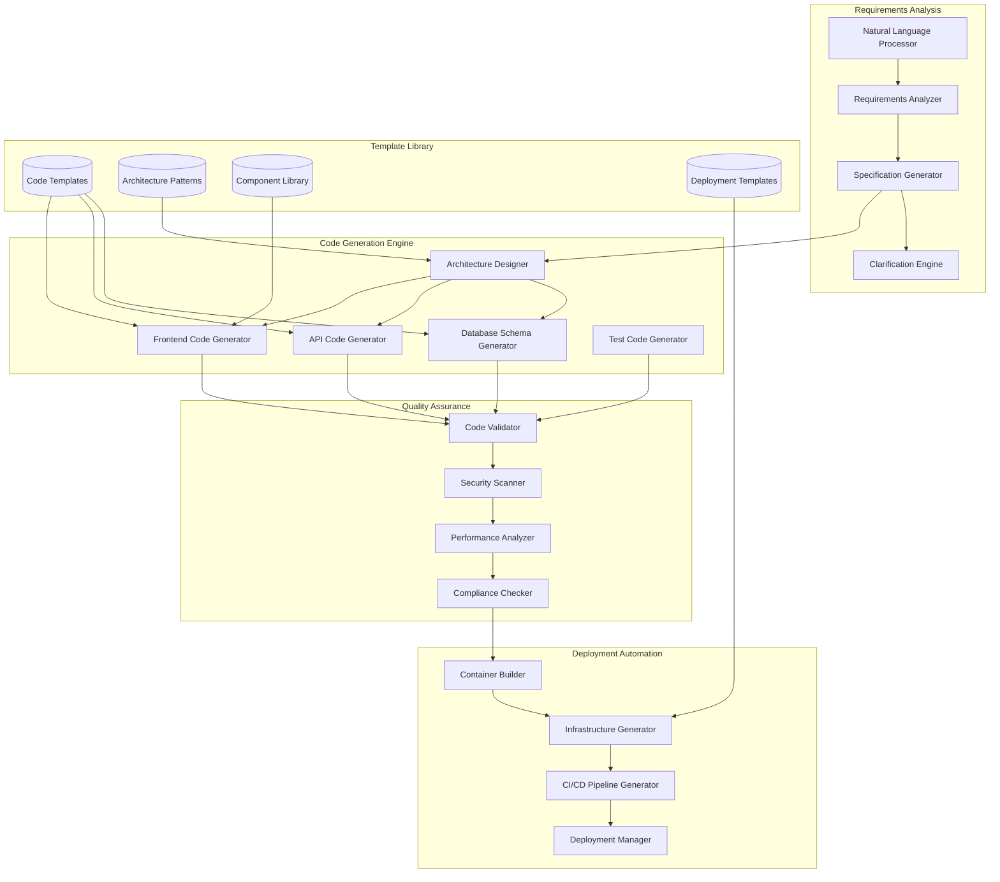

# Automated Code Generation System Design Document

## Overview

The Automated Code Generation System transforms natural language requirements into complete, production-ready applications. Using advanced AI models and code generation templates, the system creates full-stack applications with frontend, backend, database, and deployment configurations, enabling non-technical users to build software solutions through conversational interfaces.

## Architecture

### High-Level Architecture



## Components and Interfaces

### 1. Natural Language Processing Engine

**Purpose**: Parse and understand natural language requirements

**Key Components**:
- `RequirementsParser`: Extract structured requirements from natural language
- `IntentClassifier`: Classify user intents and feature requests
- `EntityExtractor`: Identify business entities and relationships

**Interface**:
```python
class NLProcessor:
    def parse_requirements(self, text: str) -> ParsedRequirements
    def classify_intent(self, requirement: str) -> Intent
    def extract_entities(self, text: str) -> List[Entity]
    def generate_clarifying_questions(self, requirements: ParsedRequirements) -> List[Question]
```

### 2. Code Generation Engine

**Purpose**: Generate complete application code from specifications

**Key Components**:
- `ArchitectureDesigner`: Design application architecture
- `CodeGenerator`: Generate code using templates and AI
- `ComponentAssembler`: Assemble generated components into applications

**Interface**:
```python
class CodeGenerator:
    def design_architecture(self, requirements: Requirements) -> Architecture
    def generate_database_schema(self, entities: List[Entity]) -> DatabaseSchema
    def generate_api_code(self, schema: DatabaseSchema, architecture: Architecture) -> APICode
    def generate_frontend_code(self, api_spec: APISpec, ui_requirements: UIRequirements) -> FrontendCode
    def generate_tests(self, code: GeneratedCode) -> TestSuite
```

### 3. Quality Assurance System

**Purpose**: Validate generated code for quality, security, and performance

**Key Components**:
- `CodeValidator`: Validate syntax and logic
- `SecurityScanner`: Scan for security vulnerabilities
- `PerformanceAnalyzer`: Analyze performance characteristics

**Interface**:
```python
class QualityAssurance:
    def validate_code(self, code: GeneratedCode) -> ValidationResult
    def scan_security(self, code: GeneratedCode) -> SecurityReport
    def analyze_performance(self, code: GeneratedCode) -> PerformanceReport
    def check_compliance(self, code: GeneratedCode, standards: List[Standard]) -> ComplianceReport
```

### 4. Deployment Automation System

**Purpose**: Generate deployment configurations and automate application deployment

**Key Components**:
- `ContainerBuilder`: Create Docker containers
- `InfrastructureGenerator`: Generate IaC templates
- `CICDGenerator`: Create CI/CD pipeline configurations

**Interface**:
```python
class DeploymentAutomation:
    def build_containers(self, application: GeneratedApplication) -> ContainerConfig
    def generate_infrastructure(self, requirements: DeploymentRequirements) -> InfrastructureCode
    def create_cicd_pipeline(self, application: GeneratedApplication) -> PipelineConfig
    def deploy_application(self, application: GeneratedApplication, environment: Environment) -> DeploymentResult
```

## Data Models

### Core Entities

```python
class GeneratedApplication:
    id: str
    name: str
    description: str
    requirements: Requirements
    architecture: Architecture
    code_components: List[CodeComponent]
    tests: TestSuite
    deployment_config: DeploymentConfig
    created_at: datetime
    updated_at: datetime

class CodeComponent:
    id: str
    name: str
    type: ComponentType
    language: str
    code: str
    dependencies: List[str]
    tests: List[Test]

class Requirements:
    id: str
    raw_text: str
    parsed_requirements: List[ParsedRequirement]
    entities: List[Entity]
    relationships: List[Relationship]
    clarifications: List[Clarification]

class Architecture:
    id: str
    pattern: ArchitecturePattern
    components: List[ArchitectureComponent]
    data_flow: DataFlow
    technology_stack: TechnologyStack
```

## Testing Strategy

### Unit Testing
- Natural language processing accuracy
- Code generation logic
- Template rendering
- Quality validation rules

### Integration Testing
- End-to-end code generation workflows
- Generated code compilation and execution
- Deployment automation
- Multi-component integration

### End-to-End Testing
- Complete application generation scenarios
- Generated application functionality
- Deployment and scaling
- User acceptance testing