# Big Tech CTO Capabilities Design Document

## Overview

The Big Tech CTO Capabilities system elevates ScrollIntel to hyperscale, enabling it to replace CTOs at companies like Amazon, Google, Meta, Microsoft, and OpenAI. Built with advanced AI research capabilities, hyperscale infrastructure management, and strategic innovation leadership, this system handles billions of users, breakthrough research, and 10+ year technology vision.

## Architecture

### Hyperscale Architecture

```mermaid
graph TB
    subgraph "Innovation Leadership Layer"
        BreakthroughEngine[Breakthrough Innovation Engine]
        ResearchDirector[AI Research Director]
        TrendPredictor[Technology Trend Predictor]
        PatentAnalyzer[Patent & IP Analyzer]
    end
    
    subgraph "Hyperscale Management Layer"
        GlobalInfraManager[Global Infrastructure Manager]
        AutoScaler[Hyperscale Auto-Scaler]
        PerformanceOptimizer[Performance Optimizer]
        CostOptimizer[Cost Optimization Engine]
    end
    
    subgraph "Strategic Planning Layer"
        StrategicPlanner[10+ Year Strategic Planner]
        DisruptionPredictor[Disruption Predictor]
        InvestmentAnalyzer[Technology Investment Analyzer]
        CompetitiveIntel[Competitive Intelligence]
    end
    
    subgraph "Research & Development Layer"
        FundamentalResearch[Fundamental Research Engine]
        ExperimentDesigner[Experiment Designer]
        PaperGenerator[Research Paper Generator]
        BreakthroughDetector[Breakthrough Detector]
    end
    
    subgraph "Ecosystem Management Layer"
        TeamOptimizer[10K+ Engineer Optimizer]
        PartnershipManager[Partnership Manager]
        AcquisitionAnalyzer[Acquisition Analyzer]
        OrgDesigner[Organization Designer]
    end
    
    subgraph "Governance & Ethics Layer"
        AIGovernance[AI Governance Engine]
        EthicsFramework[Ethics Framework]
        RegulatoryCompliance[Regulatory Compliance]
        PublicPolicy[Public Policy Engine]
    end
    
    subgraph "Global Data Sources"
        ResearchPapers[(Research Papers)]
        PatentDatabases[(Patent Databases)]
        InfrastructureMetrics[(Infrastructure Metrics)]
        MarketIntelligence[(Market Intelligence)]
        CompetitorData[(Competitor Data)]
    end
    
    BreakthroughEngine --> ResearchDirector
    ResearchDirector --> TrendPredictor
    TrendPredictor --> PatentAnalyzer
    
    GlobalInfraManager --> AutoScaler
    AutoScaler --> PerformanceOptimizer
    PerformanceOptimizer --> CostOptimizer
    
    StrategicPlanner --> DisruptionPredictor
    DisruptionPredictor --> InvestmentAnalyzer
    InvestmentAnalyzer --> CompetitiveIntel
    
    FundamentalResearch --> ExperimentDesigner
    ExperimentDesigner --> PaperGenerator
    PaperGenerator --> BreakthroughDetector
    
    TeamOptimizer --> PartnershipManager
    PartnershipManager --> AcquisitionAnalyzer
    AcquisitionAnalyzer --> OrgDesigner
    
    AIGovernance --> EthicsFramework
    EthicsFramework --> RegulatoryCompliance
    RegulatoryCompliance --> PublicPolicy
    
    ResearchPapers --> FundamentalResearch
    PatentDatabases --> BreakthroughEngine
    InfrastructureMetrics --> GlobalInfraManager
    MarketIntelligence --> StrategicPlanner
    CompetitorData --> CompetitiveIntel
```



## Components and Interfaces

### 1. Breakthrough Innovation Engine

**Purpose**: Generate breakthrough technology concepts and innovation strategies

**Key Components**:
- `InnovationGenerator`: Create novel technology concepts
- `MarketCreator`: Identify new market opportunities
- `DisruptionAnalyzer`: Predict industry disruptions

**Interface**:
```python
class BreakthroughEngine:
    def generate_breakthrough_concepts(self, domain: TechnologyDomain) -> List[BreakthroughConcept]
    def analyze_innovation_potential(self, concept: TechnologyConcept) -> InnovationPotential
    def predict_market_disruption(self, technology: Technology, timeframe: int) -> DisruptionPrediction
    def recommend_research_directions(self, current_capabilities: List[Capability]) -> List[ResearchDirection]
```

### 2. Hyperscale Infrastructure Manager

**Purpose**: Manage global infrastructure at billion-user scale

**Key Components**:
- `GlobalLoadBalancer`: Distribute traffic across regions
- `AutoScaler`: Scale resources based on demand
- `PerformanceMonitor`: Monitor global system performance

**Interface**:
```python
class HyperscaleManager:
    def optimize_global_infrastructure(self, metrics: GlobalMetrics) -> OptimizationPlan
    def auto_scale_resources(self, demand_forecast: DemandForecast) -> ScalingPlan
    def detect_performance_issues(self, system_state: SystemState) -> List[PerformanceIssue]
    def optimize_costs(self, usage_patterns: UsagePatterns) -> CostOptimizationPlan
```

### 3. Strategic Planning Engine

**Purpose**: Create 10+ year technology roadmaps and strategic plans

**Key Components**:
- `LongTermPlanner`: Generate multi-decade strategic plans
- `TechnologyForecaster`: Predict technology evolution
- `InvestmentOptimizer`: Optimize technology investments

**Interface**:
```python
class StrategicPlanner:
    def create_longterm_roadmap(self, vision: TechnologyVision, horizon: int) -> StrategicRoadmap
    def evaluate_technology_bets(self, investments: List[TechnologyInvestment]) -> InvestmentAnalysis
    def predict_industry_evolution(self, industry: Industry, timeframe: int) -> IndustryForecast
    def recommend_strategic_pivots(self, market_changes: List[MarketChange]) -> List[StrategicPivot]
```

### 4. Fundamental Research Engine

**Purpose**: Conduct breakthrough research and generate novel scientific insights

**Key Components**:
- `HypothesisGenerator`: Generate research hypotheses
- `ExperimentDesigner`: Design breakthrough experiments
- `InsightExtractor`: Extract novel insights from results

**Interface**:
```python
class FundamentalResearch:
    def generate_research_hypotheses(self, domain: ResearchDomain) -> List[Hypothesis]
    def design_experiments(self, hypothesis: Hypothesis) -> ExperimentDesign
    def analyze_research_results(self, results: ExperimentResults) -> ResearchInsights
    def generate_research_paper(self, insights: ResearchInsights) -> ResearchPaper
```

## Data Models

### Core Entities

```python
class BreakthroughConcept:
    id: str
    name: str
    description: str
    technology_domain: TechnologyDomain
    innovation_potential: float
    market_size_potential: float
    development_timeline: int
    required_capabilities: List[Capability]
    competitive_advantage: float

class HyperscaleMetrics:
    id: str
    timestamp: datetime
    global_requests_per_second: int
    active_users: int
    infrastructure_utilization: Dict[str, float]
    performance_metrics: Dict[str, float]
    cost_metrics: Dict[str, float]
    regional_distribution: Dict[str, RegionalMetrics]

class StrategicRoadmap:
    id: str
    vision: TechnologyVision
    time_horizon: int
    milestones: List[StrategicMilestone]
    technology_bets: List[TechnologyBet]
    risk_assessments: List[RiskAssessment]
    success_metrics: List[SuccessMetric]

class ResearchBreakthrough:
    id: str
    title: str
    domain: ResearchDomain
    hypothesis: Hypothesis
    methodology: ResearchMethodology
    results: ExperimentResults
    insights: List[ResearchInsight]
    implications: List[Implication]
    publication_potential: float
```

## Testing Strategy

### Hyperscale Testing
- Billion-user simulation testing
- Global infrastructure stress testing
- Multi-region failover testing
- Performance optimization validation

### Innovation Testing
- Breakthrough concept validation
- Market disruption prediction accuracy
- Strategic planning effectiveness
- Research hypothesis quality assessment

### Integration Testing
- Cross-system coordination testing
- Real-time decision making under load
- Global team coordination simulation
- Regulatory compliance validation