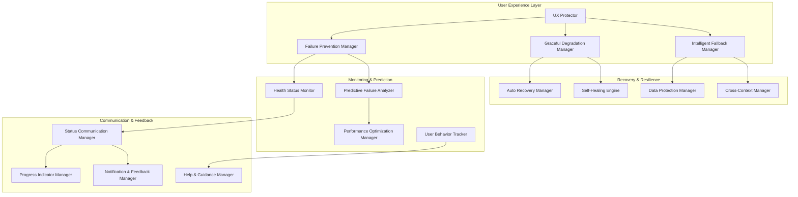

# Design Document - Bulletproof User Experience

## Overview

The Bulletproof User Experience system creates an unbreakable user experience layer that sits above all ScrollIntel components, ensuring users never encounter failures, errors, or disruptions. The system combines proactive failure prevention, intelligent fallbacks, graceful degradation, and predictive optimization to create a seamless experience that adapts to any condition.

## Architecture

### Core Components



### System Integration

The bulletproof system integrates with existing ScrollIntel infrastructure:

- **Extends existing decorators** in `never_fail_decorators.py`
- **Enhances failure prevention** in `failure_prevention.py`
- **Builds on graceful degradation** in `graceful_degradation.py`
- **Integrates with user protection** in `user_experience_protection.py`

## Components and Interfaces

### 1. UX Protector (Core Orchestrator)

**Purpose**: Central coordinator that ensures all user interactions are protected

**Key Interfaces**:
```python
class UXProtector:
    async def protect_user_action(self, action: UserAction) -> ProtectedResult
    async def handle_system_event(self, event: SystemEvent) -> None
    async def ensure_user_success(self, context: UserContext) -> SuccessGuarantee
    async def adapt_to_conditions(self, conditions: SystemConditions) -> AdaptationPlan
```

**Responsibilities**:
- Intercept all user actions before execution
- Apply appropriate protection strategies
- Coordinate with other protection components
- Ensure every user action has a successful outcome

### 2. Failure Prevention Manager

**Purpose**: Proactively prevents failures before they occur

**Key Interfaces**:
```python
class FailurePreventionManager:
    async def predict_potential_failures(self, context: ExecutionContext) -> List[PotentialFailure]
    async def apply_preventive_measures(self, failures: List[PotentialFailure]) -> PreventionPlan
    async def monitor_system_health(self) -> HealthStatus
    async def trigger_proactive_scaling(self, metrics: SystemMetrics) -> ScalingAction
```

**Strategies**:
- Resource pre-scaling based on usage patterns
- Dependency health monitoring and failover preparation
- User input validation and correction
- Proactive cache warming and data preparation

### 3. Graceful Degradation Manager

**Purpose**: Provides reduced but functional alternatives when systems fail

**Key Interfaces**:
```python
class GracefulDegradationManager:
    async def assess_degradation_options(self, failure: SystemFailure) -> List[DegradationOption]
    async def apply_degradation(self, option: DegradationOption) -> DegradedService
    async def monitor_degraded_services(self) -> DegradationStatus
    async def restore_full_service(self, service: str) -> RestorationResult
```

**Degradation Levels**:
- **Level 1**: Full functionality with performance optimization
- **Level 2**: Core functionality with simplified UI
- **Level 3**: Essential functionality with basic interface
- **Level 4**: Read-only mode with cached data
- **Level 5**: Offline mode with local storage

### 4. Intelligent Fallback Manager

**Purpose**: Provides meaningful alternatives when primary functionality fails

**Key Interfaces**:
```python
class IntelligentFallbackManager:
    async def generate_fallback_content(self, request: ContentRequest) -> FallbackContent
    async def provide_alternative_actions(self, failed_action: Action) -> List[AlternativeAction]
    async def create_fallback_visualization(self, data: Any) -> FallbackVisualization
    async def suggest_workarounds(self, blocked_workflow: Workflow) -> List[Workaround]
```

**Fallback Types**:
- **Content Fallbacks**: Cached data, sample data, placeholder content
- **Functionality Fallbacks**: Alternative workflows, simplified operations
- **Visualization Fallbacks**: Simple charts, tables, text summaries
- **AI Fallbacks**: Rule-based responses, template responses, help suggestions

### 5. Health Status Monitor

**Purpose**: Continuously monitors system health and predicts issues

**Key Interfaces**:
```python
class HealthStatusMonitor:
    async def collect_health_metrics(self) -> HealthMetrics
    async def analyze_trends(self, metrics: List[HealthMetrics]) -> TrendAnalysis
    async def detect_anomalies(self, current: HealthMetrics) -> List[Anomaly]
    async def predict_failures(self, trends: TrendAnalysis) -> List[PredictedFailure]
```

**Monitored Metrics**:
- Response times and throughput
- Error rates and types
- Resource utilization (CPU, memory, disk, network)
- User satisfaction indicators
- Dependency health status
- Data quality metrics

### 6. Auto Recovery Manager

**Purpose**: Automatically recovers from failures without user intervention

**Key Interfaces**:
```python
class AutoRecoveryManager:
    async def detect_failure(self, component: str) -> FailureDetection
    async def execute_recovery_plan(self, failure: FailureDetection) -> RecoveryResult
    async def verify_recovery(self, component: str) -> VerificationResult
    async def learn_from_failure(self, failure: FailureDetection, recovery: RecoveryResult) -> None
```

**Recovery Strategies**:
- Service restart and health check
- Database connection pool refresh
- Cache invalidation and rebuild
- Load balancer reconfiguration
- Dependency circuit breaker reset
- Memory cleanup and garbage collection

### 7. Data Protection Manager

**Purpose**: Ensures user data is never lost and always recoverable

**Key Interfaces**:
```python
class DataProtectionManager:
    async def auto_save_user_work(self, user_id: str, work_data: Any) -> SaveResult
    async def create_recovery_point(self, context: UserContext) -> RecoveryPoint
    async def detect_data_corruption(self, data: Any) -> CorruptionReport
    async def restore_from_backup(self, recovery_point: RecoveryPoint) -> RestoreResult
```

**Protection Mechanisms**:
- Continuous auto-save with versioning
- Multi-tier backup strategy (local, remote, distributed)
- Data integrity verification and repair
- Conflict resolution for concurrent edits
- Point-in-time recovery capabilities
- Cross-device synchronization

### 8. Status Communication Manager

**Purpose**: Keeps users informed about system status and actions

**Key Interfaces**:
```python
class StatusCommunicationManager:
    async def communicate_status(self, status: SystemStatus, user_context: UserContext) -> None
    async def show_progress(self, operation: Operation) -> ProgressIndicator
    async def explain_degradation(self, degradation: DegradationStatus) -> UserMessage
    async def provide_guidance(self, situation: UserSituation) -> GuidanceMessage
```

**Communication Types**:
- Real-time status indicators
- Progress bars and completion estimates
- Degradation explanations and alternatives
- Recovery notifications
- Proactive help and suggestions
- Maintenance and update notices

## Data Models

### Core Data Structures

```python
@dataclass
class UserAction:
    user_id: str
    action_type: str
    parameters: Dict[str, Any]
    context: UserContext
    timestamp: datetime
    priority: ActionPriority

@dataclass
class ProtectedResult:
    success: bool
    result: Any
    fallback_used: bool
    degradation_level: int
    user_message: Optional[str]
    recovery_suggestions: List[str]

@dataclass
class SystemHealth:
    overall_status: HealthStatus
    component_health: Dict[str, ComponentHealth]
    performance_metrics: PerformanceMetrics
    predicted_issues: List[PredictedIssue]
    recommended_actions: List[RecommendedAction]

@dataclass
class FallbackContent:
    content_type: str
    data: Any
    confidence: float
    staleness: Optional[timedelta]
    alternatives: List[AlternativeContent]
    user_explanation: str
```

### State Management

```python
class BulletproofState:
    def __init__(self):
        self.active_protections: Dict[str, Protection] = {}
        self.degraded_services: Dict[str, DegradationLevel] = {}
        self.user_contexts: Dict[str, UserContext] = {}
        self.recovery_points: Dict[str, List[RecoveryPoint]] = {}
        self.health_history: List[HealthSnapshot] = []
        self.learning_data: LearningDatabase = LearningDatabase()
```

## Error Handling

### Multi-Layer Error Handling

1. **Prevention Layer**: Stop errors before they occur
2. **Interception Layer**: Catch errors at the boundary
3. **Recovery Layer**: Automatically recover from errors
4. **Fallback Layer**: Provide alternatives when recovery fails
5. **Communication Layer**: Inform users appropriately

### Error Classification

```python
class ErrorSeverity(Enum):
    CRITICAL = "critical"      # System-wide impact
    HIGH = "high"             # Feature-level impact
    MEDIUM = "medium"         # Component-level impact
    LOW = "low"               # Minor degradation
    NEGLIGIBLE = "negligible" # No user impact

class ErrorRecovery(Enum):
    AUTO_RECOVERABLE = "auto"     # Can be fixed automatically
    DEGRADABLE = "degradable"     # Can provide reduced functionality
    FALLBACK = "fallback"         # Can provide alternative
    USER_ACTION = "user_action"   # Requires user intervention
    ESCALATION = "escalation"     # Requires admin intervention
```

### Recovery Strategies

```python
class RecoveryStrategy:
    async def attempt_auto_recovery(self, error: SystemError) -> RecoveryResult
    async def apply_graceful_degradation(self, error: SystemError) -> DegradationResult
    async def provide_fallback(self, error: SystemError) -> FallbackResult
    async def guide_user_action(self, error: SystemError) -> UserGuidance
    async def escalate_to_admin(self, error: SystemError) -> EscalationResult
```

## Testing Strategy

### Chaos Engineering

- **Failure Injection**: Systematically inject failures to test resilience
- **Load Testing**: Verify performance under extreme conditions
- **Network Partitioning**: Test behavior with connectivity issues
- **Resource Exhaustion**: Test behavior when resources are limited
- **Dependency Failures**: Test behavior when external services fail

### User Experience Testing

- **Journey Testing**: Test complete user workflows under various failure conditions
- **Accessibility Testing**: Ensure fallbacks maintain accessibility
- **Performance Testing**: Verify fallbacks don't degrade performance
- **Cross-Device Testing**: Test continuity across different devices
- **Offline Testing**: Test offline and degraded connectivity scenarios

### Automated Testing

```python
class BulletproofTestSuite:
    async def test_failure_scenarios(self) -> TestResults
    async def test_recovery_mechanisms(self) -> TestResults
    async def test_fallback_quality(self) -> TestResults
    async def test_user_experience_continuity(self) -> TestResults
    async def test_performance_under_stress(self) -> TestResults
```

### Monitoring and Metrics

- **User Success Rate**: Percentage of user actions that complete successfully
- **Recovery Time**: Time to recover from failures
- **Fallback Quality**: User satisfaction with fallback experiences
- **Prediction Accuracy**: Accuracy of failure predictions
- **Prevention Effectiveness**: Percentage of failures prevented

## Implementation Phases

### Phase 1: Foundation (Weeks 1-2)
- Extend existing failure prevention infrastructure
- Implement core UX Protector
- Basic health monitoring
- Simple fallback mechanisms

### Phase 2: Intelligence (Weeks 3-4)
- Predictive failure analysis
- Intelligent fallback generation
- Auto-recovery mechanisms
- Status communication system

### Phase 3: Optimization (Weeks 5-6)
- Performance optimization
- Advanced degradation strategies
- Cross-device continuity
- Learning and adaptation

### Phase 4: Perfection (Weeks 7-8)
- Chaos engineering validation
- User experience refinement
- Advanced prediction models
- Complete integration testing

This design ensures that ScrollIntel becomes truly bulletproof from a user perspective, building on your existing infrastructure while adding comprehensive protection layers that guarantee users never experience failures.