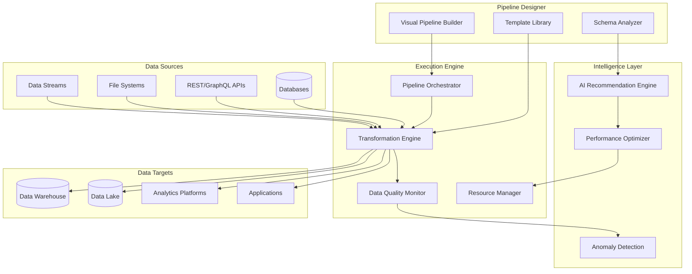

# Data Pipeline Automation System Design Document

## Overview

The Data Pipeline Automation System provides enterprise-grade ETL/ELT automation with visual pipeline building, intelligent data quality monitoring, and automated optimization. Built with cloud-native architecture and AI-powered recommendations, the system enables CTOs to automate complex data workflows with minimal technical overhead.

## Architecture

### High-Level Architecture



## Components and Interfaces

### 1. Visual Pipeline Builder

**Purpose**: Drag-and-drop interface for designing data pipelines

**Key Components**:
- `PipelineDesigner`: Visual canvas for pipeline creation
- `ComponentLibrary`: Pre-built transformation components
- `ConnectionManager`: Data source and target connections

**Interface**:
```python
class PipelineBuilder:
    def create_pipeline(self, name: str, description: str) -> Pipeline
    def add_data_source(self, pipeline_id: str, source_config: DataSourceConfig) -> DataNode
    def add_transformation(self, pipeline_id: str, transform_config: TransformConfig) -> TransformNode
    def connect_nodes(self, source_node_id: str, target_node_id: str) -> Connection
    def validate_pipeline(self, pipeline_id: str) -> ValidationResult
```

### 2. Data Quality Monitor

**Purpose**: Automated data quality validation and anomaly detection

**Key Components**:
- `QualityValidator`: Rule-based data validation
- `AnomalyDetector`: ML-based anomaly detection
- `AlertManager`: Quality issue notifications

**Interface**:
```python
class DataQualityMonitor:
    def validate_data_batch(self, data: DataBatch, rules: List[QualityRule]) -> QualityReport
    def detect_anomalies(self, data: DataBatch, baseline: DataProfile) -> List[Anomaly]
    def create_quality_rule(self, rule: QualityRule) -> str
    def get_quality_metrics(self, pipeline_id: str, time_range: TimeRange) -> QualityMetrics
```

### 3. AI Recommendation Engine

**Purpose**: Intelligent suggestions for pipeline optimization and transformations

**Key Components**:
- `TransformationRecommender`: Suggest data transformations
- `PerformanceOptimizer`: Pipeline performance recommendations
- `SchemaMapper`: Automatic schema mapping suggestions

**Interface**:
```python
class RecommendationEngine:
    def recommend_transformations(self, source_schema: Schema, target_schema: Schema) -> List[Transformation]
    def suggest_optimizations(self, pipeline: Pipeline, metrics: PerformanceMetrics) -> List[Optimization]
    def recommend_join_strategy(self, left_dataset: Dataset, right_dataset: Dataset) -> JoinRecommendation
    def analyze_data_patterns(self, data_sample: DataSample) -> DataPatternAnalysis
```

## Data Models

### Core Entities

```python
class Pipeline:
    id: str
    name: str
    description: str
    nodes: List[PipelineNode]
    connections: List[Connection]
    schedule: Schedule
    status: PipelineStatus
    created_at: datetime
    updated_at: datetime

class DataNode:
    id: str
    type: NodeType
    config: Dict[str, Any]
    schema: DataSchema
    position: Position
    pipeline_id: str

class QualityRule:
    id: str
    name: str
    rule_type: QualityRuleType
    conditions: List[Condition]
    severity: Severity
    actions: List[Action]

class PipelineExecution:
    id: str
    pipeline_id: str
    status: ExecutionStatus
    start_time: datetime
    end_time: Optional[datetime]
    metrics: ExecutionMetrics
    logs: List[LogEntry]
```

## Testing Strategy

### Unit Testing
- Pipeline validation logic
- Data transformation functions
- Quality rule evaluation
- Recommendation algorithms

### Integration Testing
- End-to-end pipeline execution
- Data source connectivity
- Quality monitoring workflows
- Performance optimization

### End-to-End Testing
- Complete data pipeline scenarios
- Multi-source data integration
- Real-time streaming pipelines
- Failure recovery procedures