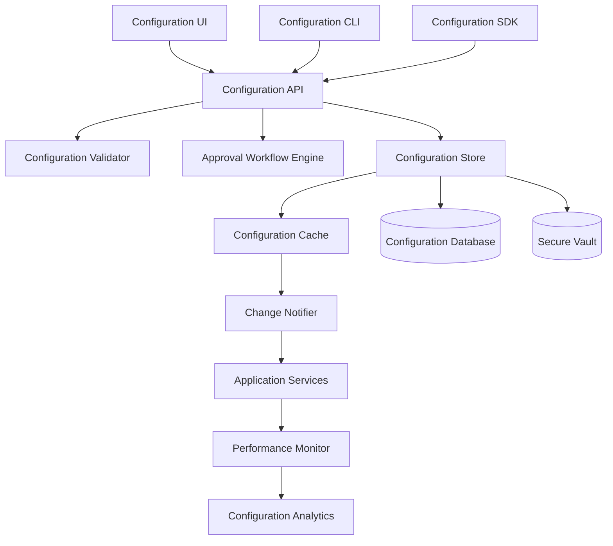

# Design Document

## Overview

The Dynamic Configuration Management System is a comprehensive solution that eliminates hardcoded values throughout the ScrollIntel platform. It provides a centralized, hierarchical configuration system with runtime updates, environment management, validation, approval workflows, and performance monitoring. The system follows a layered architecture with clear separation between configuration definition, storage, validation, and application.

## Architecture

### High-Level Architecture



### Core Components

1. **Configuration API Layer**: RESTful API for all configuration operations
2. **Configuration Store**: Multi-tier storage with caching and persistence
3. **Schema Engine**: Dynamic schema definition and validation
4. **Change Management**: Workflow engine for approvals and deployments
5. **Runtime Engine**: Real-time configuration application and monitoring
6. **Security Layer**: Encryption, access control, and audit logging

### Data Flow

1. Configuration schemas are defined programmatically or through UI
2. Values are stored with environment and precedence hierarchies
3. Changes trigger validation and approval workflows
4. Approved changes are propagated to runtime systems
5. Performance impacts are monitored and analyzed

## Components and Interfaces

### Configuration Schema Engine

**Purpose**: Manages configuration parameter definitions, types, constraints, and metadata.

**Key Classes**:
- `ConfigurationSchema`: Defines parameter structure and validation rules
- `ParameterDefinition`: Individual parameter with type, constraints, and metadata
- `SchemaRegistry`: Central registry for all configuration schemas
- `SchemaValidator`: Validates configuration values against schemas

**Interfaces**:
```python
class IConfigurationSchema:
    def define_parameter(self, name: str, param_type: Type, constraints: Dict, metadata: Dict) -> None
    def validate_value(self, parameter: str, value: Any) -> ValidationResult
    def get_default_value(self, parameter: str) -> Any
    def get_parameter_metadata(self, parameter: str) -> Dict

class ISchemaRegistry:
    def register_schema(self, namespace: str, schema: IConfigurationSchema) -> None
    def get_schema(self, namespace: str) -> IConfigurationSchema
    def list_schemas(self) -> List[str]
```

### Configuration Store

**Purpose**: Provides hierarchical storage with environment precedence, caching, and persistence.

**Key Classes**:
- `ConfigurationStore`: Main storage interface with hierarchy support
- `EnvironmentManager`: Manages environment-specific configurations
- `ConfigurationCache`: High-performance caching layer
- `SecureVault`: Encrypted storage for sensitive configurations

**Interfaces**:
```python
class IConfigurationStore:
    def get_value(self, key: str, environment: str = None, context: Dict = None) -> Any
    def set_value(self, key: str, value: Any, environment: str = None, metadata: Dict = None) -> None
    def delete_value(self, key: str, environment: str = None) -> None
    def list_keys(self, namespace: str = None, environment: str = None) -> List[str]

class IEnvironmentManager:
    def create_environment(self, name: str, parent: str = None) -> None
    def get_environment_hierarchy(self, environment: str) -> List[str]
    def resolve_value(self, key: str, environment: str) -> Tuple[Any, str]
```

### Runtime Configuration Engine

**Purpose**: Provides real-time configuration access to application services with change notifications.

**Key Classes**:
- `RuntimeConfigurationManager`: Main interface for application services
- `ConfigurationWatcher`: Monitors and propagates configuration changes
- `ChangeNotifier`: Publishes configuration change events
- `ConfigurationProxy`: Type-safe configuration access wrapper

**Interfaces**:
```python
class IRuntimeConfiguration:
    def get_config(self, key: str, default: Any = None) -> Any
    def get_typed_config(self, key: str, config_type: Type, default: Any = None) -> Any
    def watch_config(self, key: str, callback: Callable[[str, Any], None]) -> str
    def unwatch_config(self, watch_id: str) -> None

class IChangeNotifier:
    def subscribe(self, pattern: str, callback: Callable[[ConfigurationChange], None]) -> str
    def unsubscribe(self, subscription_id: str) -> None
    def publish_change(self, change: ConfigurationChange) -> None
```

### Approval Workflow Engine

**Purpose**: Manages configuration change approvals, scheduling, and deployment.

**Key Classes**:
- `WorkflowEngine`: Orchestrates approval processes
- `ApprovalRule`: Defines approval requirements for configuration changes
- `ChangeRequest`: Represents a pending configuration change
- `DeploymentScheduler`: Manages scheduled configuration deployments

**Interfaces**:
```python
class IWorkflowEngine:
    def submit_change_request(self, request: ChangeRequest) -> str
    def approve_change(self, request_id: str, approver: str, comments: str = None) -> None
    def reject_change(self, request_id: str, approver: str, reason: str) -> None
    def get_pending_approvals(self, approver: str) -> List[ChangeRequest]

class IApprovalRule:
    def requires_approval(self, change: ConfigurationChange) -> bool
    def get_required_approvers(self, change: ConfigurationChange) -> List[str]
    def is_emergency_change(self, change: ConfigurationChange) -> bool
```

### Configuration Analytics Engine

**Purpose**: Monitors configuration performance impact and provides optimization recommendations.

**Key Classes**:
- `PerformanceMonitor`: Tracks metrics before and after configuration changes
- `ConfigurationAnalyzer`: Analyzes configuration effectiveness
- `OptimizationEngine`: Provides configuration improvement recommendations
- `ImpactAssessment`: Evaluates potential impact of configuration changes

**Interfaces**:
```python
class IPerformanceMonitor:
    def record_baseline(self, config_keys: List[str]) -> str
    def record_post_change_metrics(self, baseline_id: str) -> PerformanceComparison
    def get_performance_trends(self, config_key: str, timeframe: timedelta) -> List[MetricPoint]

class IOptimizationEngine:
    def analyze_configuration(self, namespace: str) -> OptimizationReport
    def recommend_changes(self, performance_data: PerformanceData) -> List[ConfigurationRecommendation]
    def predict_impact(self, proposed_changes: List[ConfigurationChange]) -> ImpactPrediction
```

## Data Models

### Configuration Parameter Model

```python
@dataclass
class ConfigurationParameter:
    key: str
    value: Any
    parameter_type: str
    environment: str
    namespace: str
    created_at: datetime
    updated_at: datetime
    created_by: str
    updated_by: str
    version: int
    metadata: Dict[str, Any]
    is_sensitive: bool
    validation_rules: Dict[str, Any]
```

### Configuration Change Model

```python
@dataclass
class ConfigurationChange:
    change_id: str
    parameter_key: str
    old_value: Any
    new_value: Any
    environment: str
    change_type: ChangeType  # CREATE, UPDATE, DELETE
    requested_by: str
    requested_at: datetime
    approved_by: List[str]
    approved_at: datetime
    applied_at: datetime
    status: ChangeStatus  # PENDING, APPROVED, REJECTED, APPLIED, ROLLED_BACK
    impact_assessment: ImpactAssessment
    rollback_data: Dict[str, Any]
```

### Environment Hierarchy Model

```python
@dataclass
class Environment:
    name: str
    parent: str
    description: str
    precedence_level: int
    is_production: bool
    approval_required: bool
    auto_sync_enabled: bool
    created_at: datetime
    metadata: Dict[str, Any]
```

## Error Handling

### Configuration Validation Errors

- **InvalidParameterType**: When configuration value doesn't match expected type
- **ConstraintViolation**: When configuration value violates defined constraints
- **MissingRequiredParameter**: When required configuration parameter is not set
- **CircularDependency**: When configuration parameters have circular dependencies

### Runtime Errors

- **ConfigurationNotFound**: When requested configuration parameter doesn't exist
- **EnvironmentNotFound**: When specified environment doesn't exist
- **AccessDenied**: When user lacks permission to access/modify configuration
- **ValidationTimeout**: When configuration validation takes too long

### Workflow Errors

- **ApprovalRequired**: When configuration change requires approval but none provided
- **InsufficientApprovers**: When change doesn't have required number of approvers
- **ConflictingChange**: When multiple conflicting changes are submitted simultaneously
- **DeploymentFailed**: When approved configuration change fails to apply

### Error Recovery Strategies

1. **Graceful Degradation**: Fall back to default values when configuration is unavailable
2. **Automatic Retry**: Retry failed configuration operations with exponential backoff
3. **Circuit Breaker**: Temporarily disable configuration updates if system is unstable
4. **Rollback Capability**: Automatically rollback changes that cause system issues

## Testing Strategy

### Unit Testing

- **Schema Validation**: Test all parameter types, constraints, and validation rules
- **Storage Operations**: Test CRUD operations across all storage layers
- **Environment Resolution**: Test precedence rules and hierarchy resolution
- **Change Workflows**: Test approval processes and state transitions

### Integration Testing

- **End-to-End Workflows**: Test complete configuration change lifecycle
- **Cross-Service Communication**: Test configuration propagation between services
- **Performance Impact**: Test system performance with various configuration loads
- **Security Integration**: Test encryption, access control, and audit logging

### Performance Testing

- **Configuration Retrieval**: Test response times for configuration access
- **Change Propagation**: Test speed of configuration change distribution
- **Cache Performance**: Test cache hit rates and invalidation strategies
- **Concurrent Access**: Test system behavior under high concurrent load

### Security Testing

- **Access Control**: Test role-based permissions and authorization
- **Data Encryption**: Test encryption of sensitive configuration data
- **Audit Logging**: Test completeness and integrity of audit trails
- **Input Validation**: Test protection against injection and manipulation attacks

## Deployment Considerations

### Infrastructure Requirements

- **Database**: PostgreSQL or MongoDB for configuration persistence
- **Cache**: Redis or Memcached for high-performance configuration access
- **Message Queue**: RabbitMQ or Apache Kafka for change notifications
- **Vault**: HashiCorp Vault or AWS Secrets Manager for sensitive data

### Scalability Design

- **Horizontal Scaling**: Support multiple configuration service instances
- **Read Replicas**: Use read replicas for high-availability configuration access
- **Caching Strategy**: Multi-level caching with intelligent invalidation
- **Load Balancing**: Distribute configuration requests across service instances

### Monitoring and Observability

- **Metrics Collection**: Track configuration access patterns and performance
- **Health Checks**: Monitor configuration service availability and responsiveness
- **Alerting**: Alert on configuration validation failures and performance issues
- **Distributed Tracing**: Trace configuration changes across service boundaries