# Enterprise Integration System Design Document

## Overview

The Enterprise Integration System provides comprehensive connectivity with existing enterprise infrastructure including SSO/LDAP authentication, data source integrations, BI tool connectivity, CI/CD pipeline integration, and workflow automation. Built with enterprise-grade security and scalability, the system enables seamless adoption within existing IT environments.

## Architecture

### High-Level Architecture

```mermaid
graph TB
    subgraph "Authentication Layer"
        SSOGateway[SSO Gateway]
        LDAPConnector[LDAP/AD Connector]
        AuthProvider[Auth Provider]
    end
    
    subgraph "Data Integration Layer"
        DataConnectors[Data Source Connectors]
        APIGateway[API Gateway]
        DataPipeline[Data Pipeline]
    end
    
    subgraph "BI Integration Layer"
        BIConnectors[BI Tool Connectors]
        EmbedEngine[Embed Engine]
        ExportEngine[Export Engine]
    end
    
    subgraph "DevOps Integration"
        CICDIntegration[CI/CD Integration]
        DeploymentHooks[Deployment Hooks]
        MonitoringBridge[Monitoring Bridge]
    end
    
    subgraph "Workflow Integration"
        WorkflowEngine[Workflow Engine]
        WebhookManager[Webhook Manager]
        AutomationBridge[Automation Bridge]
    end
    
    subgraph "Security & Audit"
        AuditLogger[Audit Logger]
        SIEMConnector[SIEM Connector]
        ComplianceEngine[Compliance Engine]
    end
    
    SSOGateway --> LDAPConnector
    DataConnectors --> DataPipeline
    BIConnectors --> ExportEngine
    CICDIntegration --> DeploymentHooks
    WorkflowEngine --> WebhookManager
    AuditLogger --> SIEMConnector
```



## Components and Interfaces

### 1. Authentication Integration System

**Purpose**: Enterprise SSO and identity management integration

**Key Components**:
- `SSOProvider`: Handle SAML, OAuth2, OIDC authentication
- `LDAPConnector`: Synchronize with LDAP/Active Directory
- `UserSyncEngine`: Maintain user profile synchronization

**Interface**:
```python
class SSOProvider:
    def authenticate_user(self, token: str) -> AuthResult
    def sync_user_attributes(self, user_id: str) -> UserProfile
    def validate_permissions(self, user_id: str, resource: str) -> bool
    def logout_user(self, user_id: str) -> bool
```

### 2. Data Source Integration System

**Purpose**: Connect to enterprise data sources and APIs

**Key Components**:
- `DatabaseConnector`: Connect to enterprise databases
- `APIConnector`: Integrate with REST/GraphQL/SOAP APIs
- `CloudStorageConnector`: Access cloud storage services

**Interface**:
```python
class DataSourceManager:
    def create_connection(self, config: ConnectionConfig) -> Connection
    def test_connection(self, connection_id: str) -> ConnectionStatus
    def sync_data(self, connection_id: str, sync_config: SyncConfig) -> SyncResult
    def get_schema(self, connection_id: str) -> DataSchema
```

### 3. BI Tool Integration System

**Purpose**: Integrate with existing business intelligence tools

**Key Components**:
- `TableauConnector`: Tableau integration and embedding
- `PowerBIConnector`: Microsoft Power BI integration
- `LookerConnector`: Looker integration and API access

**Interface**:
```python
class BIIntegration:
    def export_dashboard(self, dashboard_id: str, format: ExportFormat) -> ExportResult
    def create_embed_token(self, dashboard_id: str, user_id: str) -> EmbedToken
    def sync_data_source(self, bi_tool: BITool, data_source: DataSource) -> SyncResult
```

## Data Models

### Core Entities

```python
class EnterpriseConnection:
    id: str
    name: str
    type: ConnectionType
    config: Dict[str, Any]
    credentials: EncryptedCredentials
    status: ConnectionStatus
    last_sync: datetime
    created_at: datetime

class SSOConfiguration:
    id: str
    provider: SSOProvider
    config: Dict[str, Any]
    user_mapping: Dict[str, str]
    is_active: bool
    created_at: datetime

class IntegrationAuditLog:
    id: str
    integration_type: str
    action: str
    user_id: str
    details: Dict[str, Any]
    timestamp: datetime
    status: str
```

## Testing Strategy

### Unit Testing
- Authentication provider integrations
- Data connector functionality
- BI tool API integrations
- Webhook and automation systems

### Integration Testing
- End-to-end SSO workflows
- Data synchronization processes
- BI tool embedding and exports
- CI/CD pipeline integrations

### End-to-End Testing
- Complete enterprise integration scenarios
- Multi-system workflow testing
- Security and compliance validation
- Performance under enterprise load