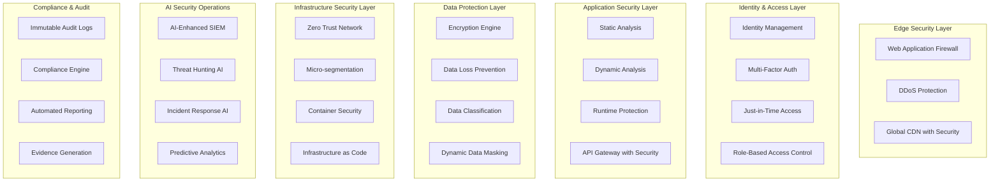

# Design Document

## Overview

This design document outlines the architecture and implementation approach for hardening the ScrollIntel codespace to enterprise-grade security standards that exceed those of Palantir, Databricks, and other industry leaders. The design implements a layered security approach with zero-trust principles, advanced AI-driven operations, and comprehensive compliance frameworks.

## Architecture

### High-Level Architecture



### Core Components

#### 1. Zero-Trust Security Framework
- **Network Micro-segmentation**: Implement Kubernetes NetworkPolicies and service mesh (Istio) for traffic control
- **Identity Verification**: Every request authenticated and authorized regardless of source
- **Least Privilege Access**: Dynamic permission assignment based on context and risk
- **Continuous Monitoring**: Real-time verification of all network communications

#### 2. AI-Enhanced Security Operations Center (SOC)
- **Machine Learning SIEM**: Custom ML models for threat detection and false positive reduction
- **Behavioral Analytics**: User and entity behavior analytics (UEBA) for anomaly detection
- **Automated Response**: Orchestrated incident response with SOAR capabilities
- **Threat Intelligence**: Integration with multiple threat feeds and custom intelligence

#### 3. Advanced Data Protection Engine
- **Intelligent Classification**: ML-based data discovery and classification
- **Format-Preserving Encryption**: Maintain data utility while ensuring protection
- **Dynamic Masking**: Context-aware data masking based on user roles and risk
- **Privacy Engineering**: Built-in privacy-by-design principles

## Components and Interfaces

### Security Infrastructure Components

#### Container Security Platform
```yaml
apiVersion: v1
kind: SecurityPolicy
metadata:
  name: enterprise-container-security
spec:
  podSecurityStandards:
    enforce: "restricted"
    audit: "restricted"
    warn: "restricted"
  securityContextConstraints:
    runAsNonRoot: true
    readOnlyRootFilesystem: true
    allowPrivilegeEscalation: false
    capabilities:
      drop: ["ALL"]
  networkPolicies:
    defaultDeny: true
    allowedConnections:
      - from: "same-namespace"
      - to: "approved-services"
```

#### Zero-Trust Network Architecture
```python
class ZeroTrustGateway:
    def __init__(self):
        self.policy_engine = PolicyEngine()
        self.identity_verifier = IdentityVerifier()
        self.risk_assessor = RiskAssessor()
    
    def authorize_request(self, request):
        # Verify identity
        identity = self.identity_verifier.verify(request.credentials)
        
        # Assess risk
        risk_score = self.risk_assessor.calculate_risk(
            identity, request.resource, request.context
        )
        
        # Apply policy
        decision = self.policy_engine.evaluate(
            identity, request.resource, risk_score
        )
        
        return decision
```

### AI Security Operations Components

#### ML-Enhanced SIEM Engine
```python
class AISecurityEngine:
    def __init__(self):
        self.anomaly_detector = AnomalyDetectionModel()
        self.threat_classifier = ThreatClassificationModel()
        self.false_positive_reducer = FalsePositiveModel()
    
    def analyze_security_event(self, event):
        # Reduce false positives
        if self.false_positive_reducer.is_false_positive(event):
            return None
        
        # Detect anomalies
        anomaly_score = self.anomaly_detector.score(event)
        
        # Classify threat
        threat_type = self.threat_classifier.classify(event)
        
        return SecurityAlert(
            event=event,
            anomaly_score=anomaly_score,
            threat_type=threat_type,
            confidence=self.calculate_confidence(event)
        )
```

#### Automated Incident Response
```python
class IncidentResponseOrchestrator:
    def __init__(self):
        self.playbook_engine = PlaybookEngine()
        self.automation_engine = AutomationEngine()
        self.escalation_manager = EscalationManager()
    
    def handle_incident(self, alert):
        # Select appropriate playbook
        playbook = self.playbook_engine.select_playbook(alert)
        
        # Execute automated response
        response_result = self.automation_engine.execute(playbook, alert)
        
        # Escalate if needed
        if response_result.requires_human_intervention:
            self.escalation_manager.escalate(alert, response_result)
        
        return response_result
```

### Data Protection Components

#### Intelligent Data Classification
```python
class DataClassificationEngine:
    def __init__(self):
        self.ml_classifier = MLDataClassifier()
        self.pattern_matcher = PatternMatcher()
        self.context_analyzer = ContextAnalyzer()
    
    def classify_data(self, data_source):
        # ML-based classification
        ml_classification = self.ml_classifier.classify(data_source)
        
        # Pattern-based classification
        pattern_classification = self.pattern_matcher.match(data_source)
        
        # Context analysis
        context = self.context_analyzer.analyze(data_source)
        
        # Combine results
        final_classification = self.combine_classifications(
            ml_classification, pattern_classification, context
        )
        
        return final_classification
```

#### Format-Preserving Encryption
```python
class FormatPreservingEncryption:
    def __init__(self, key_manager):
        self.key_manager = key_manager
        self.fpe_engine = FPEEngine()
    
    def encrypt_field(self, data, field_type, encryption_key):
        # Maintain format while encrypting
        if field_type == "credit_card":
            return self.fpe_engine.encrypt_cc(data, encryption_key)
        elif field_type == "ssn":
            return self.fpe_engine.encrypt_ssn(data, encryption_key)
        elif field_type == "phone":
            return self.fpe_engine.encrypt_phone(data, encryption_key)
        
        return self.fpe_engine.encrypt_generic(data, encryption_key)
```

### Enterprise Integration Components

#### Auto-Discovery Integration Engine
```python
class EnterpriseIntegrationEngine:
    def __init__(self):
        self.schema_discoverer = SchemaDiscoverer()
        self.connector_generator = ConnectorGenerator()
        self.etl_optimizer = ETLOptimizer()
    
    def integrate_data_source(self, connection_params):
        # Auto-discover schema
        schema = self.schema_discoverer.discover(connection_params)
        
        # Generate connector
        connector = self.connector_generator.generate(schema, connection_params)
        
        # Optimize ETL pipeline
        etl_pipeline = self.etl_optimizer.optimize(schema, connector)
        
        return IntegrationResult(
            schema=schema,
            connector=connector,
            etl_pipeline=etl_pipeline
        )
```

## Data Models

### Security Event Model
```python
@dataclass
class SecurityEvent:
    event_id: str
    timestamp: datetime
    source_ip: str
    user_id: Optional[str]
    event_type: str
    severity: SecuritySeverity
    raw_data: Dict[str, Any]
    normalized_data: Dict[str, Any]
    risk_score: float
    threat_indicators: List[ThreatIndicator]
    context: SecurityContext
```

### Compliance Record Model
```python
@dataclass
class ComplianceRecord:
    record_id: str
    compliance_framework: str  # SOC2, GDPR, HIPAA, etc.
    control_id: str
    status: ComplianceStatus
    evidence: List[Evidence]
    last_assessment: datetime
    next_assessment: datetime
    responsible_party: str
    remediation_actions: List[RemediationAction]
```

### Data Classification Model
```python
@dataclass
class DataClassification:
    data_id: str
    classification_level: ClassificationLevel  # PUBLIC, INTERNAL, CONFIDENTIAL, RESTRICTED
    data_categories: List[DataCategory]  # PII, PHI, PCI, etc.
    sensitivity_score: float
    retention_policy: RetentionPolicy
    access_controls: List[AccessControl]
    encryption_requirements: EncryptionRequirement
```

## Error Handling

### Security Error Handling Strategy
```python
class SecurityErrorHandler:
    def __init__(self):
        self.logger = SecurityLogger()
        self.alerting = SecurityAlerting()
        self.incident_manager = IncidentManager()
    
    def handle_security_error(self, error, context):
        # Log security error
        self.logger.log_security_error(error, context)
        
        # Determine severity
        severity = self.assess_error_severity(error, context)
        
        # Alert if critical
        if severity >= SecuritySeverity.HIGH:
            self.alerting.send_alert(error, context, severity)
        
        # Create incident if critical
        if severity >= SecuritySeverity.CRITICAL:
            self.incident_manager.create_incident(error, context)
        
        # Implement defensive measures
        self.implement_defensive_measures(error, context)
```

### Graceful Degradation for Security Services
```python
class SecurityServiceFallback:
    def __init__(self):
        self.primary_services = {}
        self.fallback_services = {}
        self.circuit_breakers = {}
    
    def execute_with_fallback(self, service_name, operation, *args, **kwargs):
        circuit_breaker = self.circuit_breakers[service_name]
        
        if circuit_breaker.is_open():
            return self.execute_fallback(service_name, operation, *args, **kwargs)
        
        try:
            result = self.primary_services[service_name].execute(operation, *args, **kwargs)
            circuit_breaker.record_success()
            return result
        except Exception as e:
            circuit_breaker.record_failure()
            return self.execute_fallback(service_name, operation, *args, **kwargs)
```

## Testing Strategy

### Security Testing Framework
```python
class SecurityTestSuite:
    def __init__(self):
        self.penetration_tester = PenetrationTester()
        self.vulnerability_scanner = VulnerabilityScanner()
        self.compliance_tester = ComplianceTester()
        self.load_tester = SecurityLoadTester()
    
    def run_comprehensive_security_tests(self):
        results = {}
        
        # Penetration testing
        results['penetration'] = self.penetration_tester.run_tests()
        
        # Vulnerability scanning
        results['vulnerabilities'] = self.vulnerability_scanner.scan()
        
        # Compliance testing
        results['compliance'] = self.compliance_tester.test_all_frameworks()
        
        # Security load testing
        results['load'] = self.load_tester.test_under_attack_conditions()
        
        return SecurityTestResults(results)
```

### Chaos Engineering for Security
```python
class SecurityChaosEngineering:
    def __init__(self):
        self.attack_simulator = AttackSimulator()
        self.failure_injector = FailureInjector()
        self.resilience_tester = ResilienceTester()
    
    def run_security_chaos_tests(self):
        # Simulate various attack scenarios
        attack_scenarios = [
            'ddos_attack',
            'credential_stuffing',
            'sql_injection',
            'privilege_escalation',
            'data_exfiltration'
        ]
        
        results = []
        for scenario in attack_scenarios:
            result = self.attack_simulator.simulate(scenario)
            resilience = self.resilience_tester.measure_resilience(result)
            results.append(ChaosTestResult(scenario, result, resilience))
        
        return results
```

### Performance Testing Under Security Load
```python
class SecurityPerformanceTester:
    def __init__(self):
        self.load_generator = LoadGenerator()
        self.security_monitor = SecurityMonitor()
        self.performance_analyzer = PerformanceAnalyzer()
    
    def test_security_performance(self):
        # Generate load with security processing
        load_config = LoadConfig(
            concurrent_users=100000,
            security_scanning_enabled=True,
            encryption_enabled=True,
            audit_logging_enabled=True
        )
        
        # Run load test
        load_result = self.load_generator.generate_load(load_config)
        
        # Monitor security metrics
        security_metrics = self.security_monitor.collect_metrics(load_result)
        
        # Analyze performance impact
        performance_impact = self.performance_analyzer.analyze(
            load_result, security_metrics
        )
        
        return SecurityPerformanceResult(
            load_result, security_metrics, performance_impact
        )
```

This design provides a comprehensive, enterprise-grade security architecture that exceeds current industry standards while remaining practical and implementable. The AI-enhanced security operations, advanced data protection, and intelligent infrastructure resilience will position us ahead of competitors like Palantir and Databricks.