# Global Influence Network System Design Document

## Overview

The Global Influence Network System is a comprehensive platform for building, managing, and leveraging worldwide networks of influence, partnerships, and strategic relationships. It enables ScrollIntel to establish and maintain influence networks that surpass any individual human CTO's reach through automated relationship building, real-time influence mapping, and strategic network orchestration.

## Architecture

### High-Level Architecture

```mermaid
graph TB
    subgraph "Global Influence Network System"
        subgraph "Relationship Management Layer"
            RM[Relationship Manager]
            NB[Network Builder]
            IM[Influence Mapper]
            SC[Strategic Connector]
        end
        
        subgraph "Intelligence Layer"
            IA[Influence Analyzer]
            NI[Network Intelligence]
            SI[Strategic Intelligence]
            CI[Competitive Intelligence]
        end
        
        subgraph "Communication Layer"
            CC[Campaign Coordinator]
            MC[Multi-Channel Manager]
            NM[Narrative Manager]
            RM_COMM[Reputation Manager]
        end
        
        subgraph "Ecosystem Layer"
            EA[Ecosystem Architect]
            PA[Partnership Analyzer]
            NE[Network Effects Engine]
            ED[Ecosystem Developer]
        end
    end
    
    subgraph "External Systems"
        SM[Social Media Platforms]
        IN[Industry Networks]
        ME[Media Outlets]
        EV[Event Platforms]
        PR[Professional Networks]
    end
    
    subgraph "Data Sources"
        ID[Industry Databases]
        NW[News & Web Scraping]
        SO[Social Listening]
        EI[Event Intelligence]
    end
    
    RM --> IA
    NB --> NI
    IM --> SI
    SC --> CI
    
    CC --> MC
    MC --> NM
    NM --> RM_COMM
    
    EA --> PA
    PA --> NE
    NE --> ED
    
    IA --> SM
    NI --> IN
    SI --> ME
    CI --> EV
    
    ID --> IA
    NW --> NI
    SO --> SI
    EI --> CI
```



## Components and Interfaces

### 1. Relationship Management Layer

#### RelationshipManager
- **Purpose**: Automated relationship building and maintenance
- **Key Features**:
  - Contact discovery and prioritization
  - Automated outreach and follow-up
  - Relationship scoring and tracking
  - Interaction history and analytics

#### NetworkBuilder
- **Purpose**: Strategic network construction and expansion
- **Key Features**:
  - Network gap analysis
  - Strategic connection recommendations
  - Network growth optimization
  - Relationship pathway mapping

#### InfluenceMapper
- **Purpose**: Real-time influence mapping and analysis
- **Key Features**:
  - Influence network visualization
  - Power structure analysis
  - Influence flow tracking
  - Network centrality metrics

#### StrategicConnector
- **Purpose**: Strategic relationship orchestration
- **Key Features**:
  - Partnership opportunity identification
  - Strategic introduction facilitation
  - Relationship leverage optimization
  - Network activation strategies

### 2. Intelligence Layer

#### InfluenceAnalyzer
- **Purpose**: Deep analysis of influence patterns and opportunities
- **Key Features**:
  - Influence pattern recognition
  - Power dynamics analysis
  - Influence opportunity scoring
  - Competitive influence assessment

#### NetworkIntelligence
- **Purpose**: Comprehensive network intelligence gathering
- **Key Features**:
  - Network topology analysis
  - Relationship strength assessment
  - Network vulnerability identification
  - Strategic positioning analysis

#### StrategicIntelligence
- **Purpose**: Strategic intelligence for network optimization
- **Key Features**:
  - Strategic opportunity identification
  - Competitive threat assessment
  - Market positioning analysis
  - Strategic timing optimization

#### CompetitiveIntelligence
- **Purpose**: Competitive network analysis and counter-strategies
- **Key Features**:
  - Competitor network mapping
  - Competitive advantage analysis
  - Counter-strategy development
  - Defensive network positioning

### 3. Communication Layer

#### CampaignCoordinator
- **Purpose**: Multi-channel influence campaign orchestration
- **Key Features**:
  - Campaign strategy development
  - Multi-channel coordination
  - Message synchronization
  - Campaign performance tracking

#### MultiChannelManager
- **Purpose**: Management of multiple communication channels
- **Key Features**:
  - Channel optimization
  - Message adaptation
  - Audience targeting
  - Channel performance analytics

#### NarrativeManager
- **Purpose**: Strategic narrative development and management
- **Key Features**:
  - Narrative strategy creation
  - Message consistency management
  - Narrative impact measurement
  - Counter-narrative development

#### ReputationManager
- **Purpose**: Comprehensive reputation management
- **Key Features**:
  - Reputation monitoring
  - Crisis response coordination
  - Positive narrative amplification
  - Reputation recovery strategies

### 4. Ecosystem Layer

#### EcosystemArchitect
- **Purpose**: Strategic ecosystem design and development
- **Key Features**:
  - Ecosystem strategy development
  - Partnership architecture design
  - Network effects optimization
  - Ecosystem governance frameworks

#### PartnershipAnalyzer
- **Purpose**: Partnership opportunity analysis and optimization
- **Key Features**:
  - Partnership opportunity scoring
  - Strategic fit analysis
  - Partnership value assessment
  - Partnership risk evaluation

#### NetworkEffectsEngine
- **Purpose**: Network effects creation and amplification
- **Key Features**:
  - Network effects identification
  - Viral growth mechanisms
  - Network value optimization
  - Platform effects creation

#### EcosystemDeveloper
- **Purpose**: Ecosystem development and management
- **Key Features**:
  - Ecosystem building strategies
  - Partner onboarding automation
  - Ecosystem health monitoring
  - Ecosystem evolution management

## Data Models

### Core Entities

```python
# Relationship Models
class GlobalContact:
    id: str
    name: str
    title: str
    organization: str
    industry: str
    influence_score: float
    relationship_strength: float
    contact_methods: List[str]
    interaction_history: List[Dict]
    strategic_value: float
    created_at: datetime
    updated_at: datetime

class InfluenceNetwork:
    id: str
    name: str
    description: str
    network_type: str
    members: List[str]  # Contact IDs
    influence_metrics: Dict[str, float]
    network_health: float
    strategic_importance: float
    created_at: datetime
    updated_at: datetime

class Relationship:
    id: str
    contact_a_id: str
    contact_b_id: str
    relationship_type: str
    strength: float
    direction: str  # bidirectional, a_to_b, b_to_a
    interaction_frequency: float
    last_interaction: datetime
    relationship_history: List[Dict]
    strategic_value: float

# Campaign Models
class InfluenceCampaign:
    id: str
    name: str
    objective: str
    target_audience: List[str]
    channels: List[str]
    messages: Dict[str, str]
    timeline: Dict[str, datetime]
    success_metrics: Dict[str, float]
    status: str
    results: Dict[str, Any]

class NetworkStrategy:
    id: str
    name: str
    strategic_objective: str
    target_networks: List[str]
    tactics: List[Dict]
    timeline: Dict[str, datetime]
    success_criteria: Dict[str, float]
    execution_status: str
    results: Dict[str, Any]

# Ecosystem Models
class StrategicEcosystem:
    id: str
    name: str
    ecosystem_type: str
    core_partners: List[str]
    extended_network: List[str]
    value_propositions: Dict[str, str]
    network_effects: Dict[str, float]
    governance_model: Dict[str, Any]
    health_metrics: Dict[str, float]

class Partnership:
    id: str
    partner_a_id: str
    partner_b_id: str
    partnership_type: str
    strategic_value: float
    collaboration_areas: List[str]
    success_metrics: Dict[str, float]
    status: str
    created_at: datetime
    performance_data: Dict[str, Any]
```

## Error Handling

### Error Categories

1. **Network Errors**
   - Connection failures
   - API rate limits
   - Data synchronization issues
   - Network topology conflicts

2. **Relationship Errors**
   - Contact verification failures
   - Relationship mapping conflicts
   - Influence calculation errors
   - Network analysis failures

3. **Campaign Errors**
   - Message delivery failures
   - Channel synchronization issues
   - Campaign coordination conflicts
   - Performance tracking errors

4. **Ecosystem Errors**
   - Partnership negotiation failures
   - Ecosystem coordination issues
   - Network effects calculation errors
   - Governance framework conflicts

### Error Handling Strategy

```python
class GlobalInfluenceError(Exception):
    def __init__(self, message: str, error_code: str, context: Dict = None):
        self.message = message
        self.error_code = error_code
        self.context = context or {}
        super().__init__(self.message)

class NetworkErrorHandler:
    def handle_network_error(self, error: Exception) -> NetworkResponse
    def handle_relationship_error(self, error: Exception) -> RelationshipResponse
    def handle_campaign_error(self, error: Exception) -> CampaignResponse
    def handle_ecosystem_error(self, error: Exception) -> EcosystemResponse
```

**Recovery Mechanisms**:
- Automatic retry with exponential backoff
- Fallback to alternative networks
- Graceful degradation of influence capabilities
- Emergency network activation protocols

## Testing Strategy

### Unit Testing
- Individual component functionality
- Relationship mapping algorithms
- Influence calculation methods
- Network analysis functions

### Integration Testing
- Cross-component communication
- External API integrations
- Database operations
- Real-time data synchronization

### End-to-End Testing
- Complete influence campaigns
- Network building workflows
- Ecosystem development processes
- Multi-channel coordination scenarios

### Performance Testing
- Large-scale network analysis
- Real-time influence tracking
- Concurrent campaign management
- Global network synchronization

### Security Testing
- Data privacy protection
- Secure communication channels
- Access control validation
- Influence manipulation prevention

## Deployment Strategy

### Infrastructure Requirements
- **Global Distribution**: Multi-region deployment for worldwide coverage
- **Real-time Processing**: Low-latency network analysis and response
- **Scalable Architecture**: Handle millions of relationships and interactions
- **Secure Communications**: End-to-end encryption for sensitive relationship data

### Integration Points
- **Social Media APIs**: Twitter, LinkedIn, Facebook, Instagram
- **Professional Networks**: Industry associations, conference platforms
- **Media Outlets**: News APIs, press release services
- **Event Platforms**: Conference systems, webinar platforms
- **CRM Systems**: Salesforce, HubSpot, custom relationship databases

### Monitoring and Analytics
- **Network Health Monitoring**: Real-time network topology analysis
- **Influence Tracking**: Continuous influence metric calculation
- **Campaign Performance**: Multi-channel campaign effectiveness
- **Relationship Analytics**: Relationship strength and growth tracking

### Security and Compliance
- **Data Privacy**: GDPR, CCPA compliance for relationship data
- **Ethical Guidelines**: Responsible influence and relationship building
- **Transparency**: Clear disclosure of automated relationship activities
- **Audit Trails**: Complete logging of all influence activities