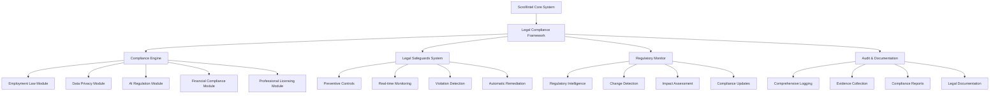

# Legal Compliance Framework Design

## Overview

The Legal Compliance Framework is a comprehensive system designed to ensure ScrollIntel operates within all applicable laws and regulations across multiple jurisdictions. This framework provides proactive compliance monitoring, automated legal safeguards, and comprehensive audit capabilities while maintaining ScrollIntel's advanced AI capabilities.

## Architecture

### High-Level Architecture



### System Integration

The Legal Compliance Framework integrates with ScrollIntel's core systems through:

1. **Middleware Integration**: Compliance checks embedded in all system operations
2. **API Gateway**: Legal validation for all external interactions
3. **Data Pipeline**: Privacy and regulatory compliance for all data processing
4. **Agent Framework**: Legal constraints and safeguards for all AI agents
5. **User Interface**: Compliance notifications and legal disclaimers

## Components and Interfaces

### 1. Compliance Engine

**Purpose**: Core compliance checking and validation system

**Key Components**:
- `LegalComplianceEngine`: Main orchestration engine
- `JurisdictionManager`: Manages jurisdiction-specific requirements
- `ComplianceRuleEngine`: Executes compliance rules and policies
- `ViolationDetector`: Identifies potential legal violations
- `RemediationOrchestrator`: Coordinates violation remediation

**Interfaces**:
```python
class LegalComplianceEngine:
    async def validate_operation(self, operation: Operation, context: ComplianceContext) -> ComplianceResult
    async def check_jurisdiction_compliance(self, jurisdiction: str, operation: Operation) -> JurisdictionResult
    async def assess_legal_risk(self, action: Action, context: Context) -> RiskAssessment
    async def generate_compliance_report(self, scope: str, timeframe: TimeRange) -> ComplianceReport
```

### 2. Legal Safeguards System

**Purpose**: Proactive prevention of legal violations

**Key Components**:
- `PreventiveControlsManager`: Implements preventive legal controls
- `RealTimeMonitor`: Monitors operations for legal compliance
- `AutomaticRemediationSystem`: Automatically fixes compliance issues
- `LegalConstraintEngine`: Enforces legal constraints on AI operations

**Interfaces**:
```python
class LegalSafeguardsSystem:
    async def apply_preventive_controls(self, operation: Operation) -> ControlResult
    async def monitor_real_time_compliance(self, stream: OperationStream) -> MonitoringResult
    async def trigger_automatic_remediation(self, violation: Violation) -> RemediationResult
    async def enforce_legal_constraints(self, ai_operation: AIOperation) -> ConstraintResult
```

### 3. Regulatory Monitor

**Purpose**: Continuous monitoring of regulatory changes and updates

**Key Components**:
- `RegulatoryIntelligenceSystem`: Monitors regulatory changes globally
- `ChangeDetectionEngine`: Detects relevant regulatory updates
- `ImpactAssessmentFramework`: Assesses impact of regulatory changes
- `ComplianceUpdateManager`: Updates compliance systems based on changes

**Interfaces**:
```python
class RegulatoryMonitor:
    async def monitor_regulatory_changes(self, jurisdictions: List[str]) -> ChangeNotifications
    async def assess_change_impact(self, change: RegulatoryChange) -> ImpactAssessment
    async def update_compliance_framework(self, updates: List[ComplianceUpdate]) -> UpdateResult
    async def generate_regulatory_alerts(self, changes: List[Change]) -> AlertResult
```

### 4. Employment Law Compliance Module

**Purpose**: Ensures compliance with employment and labor laws

**Key Components**:
- `WorkforceTransitionManager`: Manages workforce transition programs
- `LaborLawComplianceChecker`: Validates labor law compliance
- `UnionRelationsManager`: Handles union-related compliance
- `WARNActComplianceSystem`: Ensures WARN Act compliance

**Design Decisions**:
- Gradual implementation approach to minimize workforce disruption
- Comprehensive retraining and transition support programs
- Automated compliance with notice requirements
- Integration with HR systems for workforce management

### 5. Data Privacy Compliance Module

**Purpose**: Comprehensive data privacy and protection compliance

**Key Components**:
- `GDPRComplianceEngine`: Full GDPR compliance implementation
- `CCPAComplianceSystem`: California Consumer Privacy Act compliance
- `HIPAAComplianceFramework`: Healthcare data protection
- `DataSubjectRightsManager`: Manages data subject rights and requests
- `ConsentManagementSystem`: Comprehensive consent management
- `DataMinimizationEngine`: Implements data minimization principles

**Design Decisions**:
- Privacy by design and by default implementation
- Automated data subject rights fulfillment
- Real-time consent management
- Comprehensive audit trails for all data processing

### 6. AI Regulation Compliance Module

**Purpose**: Compliance with AI-specific regulations and standards

**Key Components**:
- `EUAIActComplianceSystem`: EU AI Act compliance for high-risk systems
- `AlgorithmicTransparencyEngine`: Provides AI decision transparency
- `BiasDetectionAndMitigation`: Detects and mitigates algorithmic bias
- `AIImpactAssessmentFramework`: Conducts AI impact assessments
- `ExplainabilitySystem`: Provides AI decision explanations

**Design Decisions**:
- Comprehensive AI system documentation and transparency
- Real-time bias detection and mitigation
- Human oversight and control mechanisms
- Explainable AI for all critical decisions

### 7. Financial Compliance Module

**Purpose**: Compliance with financial and securities regulations

**Key Components**:
- `SecuritiesComplianceEngine`: Securities law compliance
- `InsiderTradingPreventionSystem`: Prevents insider trading violations
- `FinancialReportingCompliance`: Ensures accurate financial reporting
- `AMLComplianceFramework`: Anti-money laundering compliance
- `InvestmentAdviceDisclaimerSystem`: Manages investment advice disclaimers

**Design Decisions**:
- Strict separation of public and non-public information
- Automated disclaimer generation for financial content
- Comprehensive audit trails for financial operations
- Real-time monitoring of financial activities

### 8. Professional Licensing Module

**Purpose**: Ensures compliance with professional licensing requirements

**Key Components**:
- `ProfessionalPracticeRestrictions`: Enforces professional practice limitations
- `LicensedProfessionalOversight`: Requires professional oversight for regulated activities
- `DisclaimerManagementSystem`: Manages professional service disclaimers
- `ProfessionalStandardsCompliance`: Ensures compliance with professional standards

**Design Decisions**:
- Clear AI-generated content identification
- Professional oversight requirements for critical applications
- Comprehensive disclaimer systems
- Respect for professional licensing boundaries

## Data Models

### Core Compliance Models

```python
@dataclass
class ComplianceContext:
    jurisdiction: str
    user_location: str
    data_types: List[str]
    operation_type: str
    risk_level: RiskLevel
    applicable_regulations: List[str]

@dataclass
class ComplianceResult:
    is_compliant: bool
    violations: List[Violation]
    warnings: List[Warning]
    required_actions: List[Action]
    risk_assessment: RiskAssessment

@dataclass
class Violation:
    violation_id: str
    regulation: str
    severity: ViolationSeverity
    description: str
    remediation_steps: List[str]
    deadline: datetime
    status: ViolationStatus

@dataclass
class LegalSafeguard:
    safeguard_id: str
    safeguard_type: SafeguardType
    applicable_regulations: List[str]
    implementation_status: str
    effectiveness_metrics: Dict[str, Any]
```

### Regulatory Monitoring Models

```python
@dataclass
class RegulatoryChange:
    change_id: str
    jurisdiction: str
    regulation_name: str
    change_type: ChangeType
    effective_date: datetime
    impact_level: ImpactLevel
    description: str
    compliance_requirements: List[str]

@dataclass
class ImpactAssessment:
    assessment_id: str
    regulatory_change: RegulatoryChange
    affected_systems: List[str]
    required_updates: List[str]
    implementation_timeline: Timeline
    risk_level: RiskLevel
```

## Error Handling

### Compliance Error Categories

1. **Critical Violations**: Immediate system shutdown and legal notification
2. **High-Risk Violations**: Automatic remediation and legal review
3. **Medium-Risk Violations**: Automated correction with audit trail
4. **Low-Risk Violations**: Logging and periodic review
5. **Compliance Warnings**: User notification and guidance

### Error Handling Strategy

```python
class ComplianceErrorHandler:
    async def handle_critical_violation(self, violation: CriticalViolation):
        # Immediate system protection
        await self.emergency_shutdown(violation.affected_systems)
        await self.notify_legal_team(violation)
        await self.preserve_evidence(violation)
        await self.initiate_crisis_response(violation)
    
    async def handle_high_risk_violation(self, violation: HighRiskViolation):
        # Automatic remediation
        await self.implement_immediate_controls(violation)
        await self.escalate_to_legal_review(violation)
        await self.document_violation_response(violation)
    
    async def handle_compliance_failure(self, failure: ComplianceFailure):
        # Graceful degradation
        await self.enable_safe_mode(failure.affected_operations)
        await self.notify_compliance_team(failure)
        await self.log_compliance_incident(failure)
```

## Testing Strategy

### Compliance Testing Framework

1. **Regulatory Simulation Testing**: Simulate various regulatory scenarios
2. **Jurisdiction-Specific Testing**: Test compliance across different jurisdictions
3. **Violation Detection Testing**: Verify violation detection accuracy
4. **Remediation Testing**: Test automatic remediation systems
5. **Integration Testing**: Test compliance integration with core systems

### Test Categories

```python
class ComplianceTestSuite:
    async def test_gdpr_compliance(self):
        # Test GDPR data processing compliance
        pass
    
    async def test_employment_law_compliance(self):
        # Test workforce transition compliance
        pass
    
    async def test_ai_regulation_compliance(self):
        # Test AI-specific regulation compliance
        pass
    
    async def test_financial_compliance(self):
        # Test financial regulation compliance
        pass
    
    async def test_cross_jurisdiction_compliance(self):
        # Test multi-jurisdiction compliance
        pass
```

### Continuous Compliance Monitoring

1. **Real-time Compliance Dashboards**: Monitor compliance status continuously
2. **Automated Compliance Reports**: Generate regular compliance reports
3. **Violation Trend Analysis**: Analyze violation patterns and trends
4. **Regulatory Change Impact Tracking**: Track impact of regulatory changes
5. **Compliance Effectiveness Metrics**: Measure compliance system effectiveness

## Security Considerations

### Legal Data Protection

1. **Attorney-Client Privilege**: Protect privileged legal communications
2. **Legal Hold Procedures**: Implement litigation hold capabilities
3. **Evidence Preservation**: Maintain tamper-proof evidence storage
4. **Confidential Information**: Protect confidential legal information
5. **Regulatory Communication**: Secure communication with regulators

### Compliance System Security

1. **Access Controls**: Strict access controls for compliance systems
2. **Audit Trail Integrity**: Tamper-proof audit trail maintenance
3. **Compliance Data Encryption**: Encrypt all compliance-related data
4. **Secure Communication**: Secure channels for legal communications
5. **Incident Response**: Rapid response to compliance security incidents

## Performance Requirements

### Compliance System Performance

1. **Real-time Compliance Checking**: Sub-second compliance validation
2. **Scalable Monitoring**: Handle high-volume operation monitoring
3. **Rapid Violation Detection**: Immediate violation detection and alerting
4. **Efficient Remediation**: Fast automatic remediation implementation
5. **Comprehensive Reporting**: Efficient generation of compliance reports

### System Integration Performance

1. **Minimal Latency Impact**: Compliance checks with minimal system impact
2. **High Availability**: 99.9% uptime for compliance systems
3. **Fault Tolerance**: Graceful handling of compliance system failures
4. **Load Balancing**: Distribute compliance processing load effectively
5. **Resource Optimization**: Efficient use of system resources for compliance

This comprehensive legal compliance framework ensures ScrollIntel operates within all applicable laws and regulations while maintaining its advanced AI capabilities and providing robust protection against legal violations.