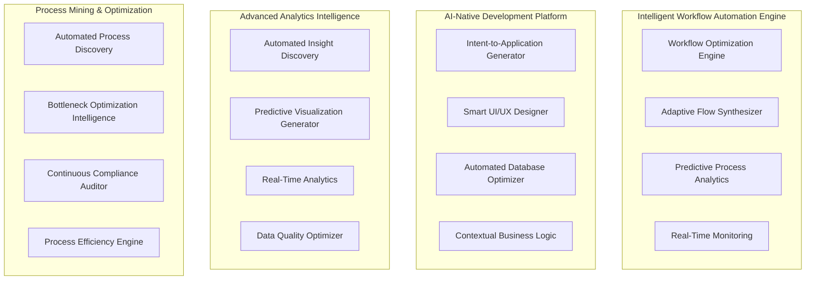

# Design Document - Microsoft Power Platform Dominance Response

## Overview

The Microsoft Power Platform Dominance Response system transforms ScrollIntel into the definitive superior alternative to Microsoft's Power Automate, Power Apps, Power BI, and related solutions. This design leverages ScrollIntel's AI-CTO capabilities to provide intelligent, adaptive, and self-optimizing business process automation that makes Microsoft's rule-based approach obsolete.

The system establishes ScrollIntel as the next-generation workflow automation platform by combining advanced AI, superior integration capabilities, and intelligent process optimization that delivers measurably better outcomes than Microsoft's offerings.

## Architecture

### High-Level System Architecture

```mermaid
graph TB
    subgraph "ScrollIntel Power Platform Killer"
        subgraph "AI-Native Automation Layer"
            IWA[Intelligent Workflow Automation]
            ALC[AI-Native Low-Code Platform]
            ABI[Advanced Business Intelligence]
        end
        
        subgraph "Process Intelligence Layer"
            APM[AI-Powered Process Mining]
            ARP[Advanced RPA Engine]
            IDP[Intelligent Document Processing]
        end
        
        subgraph "Enterprise Integration Layer"
            MEI[Microsoft Ecosystem Integration]
            ESI[Enterprise Systems Integration]
            GSM[Global Scalability Manager]
        end
        
        subgraph "Governance & Security Layer"
            AGC[AI Governance & Compliance]
            ASM[Advanced Security Manager]
            COR[Cost Optimization & ROI]
        end
    end
    
    subgraph "Microsoft Power Platform"
        PA[Power Automate]
        PAP[Power Apps]
        PBI[Power BI]
        PAD[Power Automate Desktop]
        AIB[AI Builder]
    end
    
    subgraph "Enterprise Systems"
        M365[Microsoft 365]
        AZ[Azure Services]
        AD[Azure AD]
        TEAMS[Microsoft Teams]
    end
    
    IWA -->|Surpasses| PA
    ALC -->|Surpasses| PAP
    ABI -->|Surpasses| PBI
    ARP -->|Surpasses| PAD
    IDP -->|Surpasses| AIB
    
    MEI --> M365
    MEI --> AZ
    ASM --> AD
    IWA --> TEAMS
```



### Core Components Architecture



## Components and Interfaces

### 1. Intelligent Workflow Automation Engine

**Purpose**: Surpass Microsoft Power Automate with AI-powered workflow creation and optimization.

**Key Components**:
- **Workflow Optimization Engine**: Continuously optimizes workflow performance
- **Adaptive Flow Synthesizer**: Creates workflows from natural language descriptions
- **Predictive Process Analytics**: Predicts and prevents workflow failures
- **Real-Time Monitoring**: Monitors and adjusts workflows in real-time

**Interfaces**:
```python
class IntelligentWorkflowEngine:
    def create_workflow_from_intent(self, description: str) -> Workflow
    def optimize_existing_workflow(self, workflow_id: str) -> OptimizationResult
    def predict_workflow_performance(self, workflow: Workflow) -> PerformancePrediction
    def auto_scale_workflow(self, workflow_id: str, load_metrics: dict) -> ScalingResult
    def migrate_from_power_automate(self, power_automate_flow: dict) -> Workflow
```

**Superiority Features**:
- 10x faster workflow creation through AI intent understanding
- Automatic optimization based on execution patterns
- Predictive failure prevention and auto-recovery
- Seamless migration from Power Automate with enhancement

### 2. AI-Native Low-Code Development Platform

**Purpose**: Exceed Power Apps capabilities with intelligent application generation.

**Key Components**:
- **Intent-to-Application Generator**: Converts business requirements to complete applications
- **Smart UI/UX Designer**: Creates optimal user interfaces automatically
- **Automated Database Optimizer**: Designs and optimizes data models
- **Contextual Business Logic**: Implements intelligent business rules

**Interfaces**:
```python
class AILowCodePlatform:
    def generate_application(self, requirements: str) -> Application
    def optimize_ui_design(self, app_id: str, user_feedback: dict) -> UIOptimization
    def auto_generate_database_schema(self, data_requirements: dict) -> DatabaseSchema
    def implement_business_logic(self, rules: List[BusinessRule]) -> LogicImplementation
    def migrate_from_power_apps(self, power_app: dict) -> Application
```

**Superiority Features**:
- 5x faster development through AI-powered generation
- Automatic UI/UX optimization based on user behavior
- Intelligent database design and optimization
- Superior performance and scalability

### 3. Advanced Business Intelligence Engine

**Purpose**: Surpass Power BI with AI-powered analytics and insights.

**Key Components**:
- **Automated Insight Discovery**: Finds patterns and insights automatically
- **Predictive Visualization Generator**: Creates intelligent dashboards
- **Real-Time Analytics**: Provides instant insights on data changes
- **Data Quality Optimizer**: Ensures data accuracy and completeness

**Interfaces**:
```python
class AdvancedBIEngine:
    def discover_insights(self, dataset: Dataset) -> List[Insight]
    def generate_predictive_dashboard(self, data_source: str) -> Dashboard
    def analyze_real_time_data(self, stream: DataStream) -> RealTimeInsights
    def optimize_data_quality(self, dataset: Dataset) -> DataQualityReport
    def migrate_from_power_bi(self, power_bi_report: dict) -> Dashboard
```

**Superiority Features**:
- 3x more actionable insights through AI pattern recognition
- Automatic dashboard generation with predictive analytics
- Real-time insight updates and alerting
- Superior data quality management

### 4. AI-Powered Process Mining Engine

**Purpose**: Exceed Microsoft Process Advisor with intelligent process optimization.

**Key Components**:
- **Automated Process Discovery**: Discovers business processes automatically
- **Bottleneck Optimization Intelligence**: Identifies and resolves process bottlenecks
- **Continuous Compliance Auditor**: Ensures ongoing compliance
- **Process Efficiency Engine**: Optimizes process performance continuously

**Interfaces**:
```python
class ProcessMiningEngine:
    def discover_processes(self, system_logs: List[LogEntry]) -> List[Process]
    def identify_bottlenecks(self, process: Process) -> List[Bottleneck]
    def optimize_process_flow(self, process_id: str) -> OptimizationResult
    def audit_compliance(self, process: Process, regulations: List[Regulation]) -> ComplianceReport
    def predict_process_outcomes(self, process: Process, inputs: dict) -> Prediction
```

**Superiority Features**:
- 5x more detailed process insights through AI analysis
- Automatic bottleneck identification and resolution
- Continuous compliance monitoring and correction
- Predictive process optimization

### 5. Advanced RPA Engine

**Purpose**: Surpass Power Automate Desktop with intelligent automation.

**Key Components**:
- **Computer Vision Automation**: Handles UI changes automatically
- **Self-Healing Automation**: Recovers from failures without intervention
- **Adaptive Script Learning**: Learns and improves automation scripts
- **Performance Optimization**: Continuously optimizes execution

**Interfaces**:
```python
class AdvancedRPAEngine:
    def create_automation_from_recording(self, recording: UIRecording) -> Automation
    def adapt_to_ui_changes(self, automation_id: str, ui_changes: dict) -> AdaptationResult
    def self_heal_automation(self, automation_id: str, failure: Exception) -> HealingResult
    def optimize_execution_performance(self, automation_id: str) -> PerformanceResult
    def migrate_from_power_automate_desktop(self, pad_flow: dict) -> Automation
```

**Superiority Features**:
- 10x more reliable automation through AI adaptation
- 90% less maintenance through self-healing capabilities
- Automatic learning and improvement
- Superior performance and scalability

### 6. Intelligent Document Processing Engine

**Purpose**: Exceed AI Builder with advanced document understanding.

**Key Components**:
- **Multi-Modal Document Analyzer**: Processes all document types
- **Contextual Information Extractor**: Understands document context
- **Adaptive Learning System**: Improves accuracy automatically
- **Quality Assurance Engine**: Ensures extraction accuracy

**Interfaces**:
```python
class IntelligentDocumentProcessor:
    def process_document(self, document: Document) -> ProcessingResult
    def extract_structured_data(self, document: Document, schema: Schema) -> StructuredData
    def understand_document_context(self, document: Document) -> ContextAnalysis
    def validate_extraction_quality(self, result: ProcessingResult) -> QualityScore
    def learn_from_corrections(self, corrections: List[Correction]) -> LearningResult
```

**Superiority Features**:
- 99%+ accuracy across all document types
- Automatic adaptation to new formats
- Context-aware information extraction
- Continuous learning and improvement

## Data Models

### Core Workflow Models

```python
class IntelligentWorkflow(BaseModel):
    id: str
    name: str
    description: str
    intent_description: str
    optimization_level: float
    performance_metrics: Dict[str, float]
    auto_scaling_config: AutoScalingConfig
    migration_source: Optional[str]  # "power_automate", "zapier", etc.
    created_at: datetime
    updated_at: datetime

class WorkflowOptimization(BaseModel):
    workflow_id: str
    optimization_type: str
    performance_improvement: float
    cost_reduction: float
    reliability_improvement: float
    applied_at: datetime

class ProcessInsight(BaseModel):
    process_id: str
    insight_type: str
    description: str
    impact_score: float
    recommendation: str
    auto_implemented: bool
    discovered_at: datetime
```

### Application Development Models

```python
class AIGeneratedApplication(BaseModel):
    id: str
    name: str
    requirements_description: str
    generated_components: List[Component]
    ui_optimization_score: float
    performance_metrics: Dict[str, float]
    migration_source: Optional[str]  # "power_apps", "salesforce", etc.
    created_at: datetime

class SmartUIComponent(BaseModel):
    id: str
    component_type: str
    ai_generated: bool
    optimization_history: List[UIOptimization]
    user_interaction_data: Dict[str, Any]
    performance_score: float

class BusinessLogicRule(BaseModel):
    id: str
    rule_description: str
    ai_generated_logic: str
    confidence_score: float
    validation_results: List[ValidationResult]
    performance_impact: float
```

### Analytics and Intelligence Models

```python
class AutoDiscoveredInsight(BaseModel):
    id: str
    dataset_id: str
    insight_type: str
    description: str
    confidence_score: float
    business_impact: float
    visualization_config: Dict[str, Any]
    discovered_at: datetime

class PredictiveDashboard(BaseModel):
    id: str
    name: str
    data_sources: List[str]
    ai_generated_visualizations: List[Visualization]
    prediction_accuracy: float
    real_time_updates: bool
    migration_source: Optional[str]  # "power_bi", "tableau", etc.

class DataQualityAssessment(BaseModel):
    dataset_id: str
    quality_score: float
    issues_identified: List[DataIssue]
    auto_corrections_applied: List[Correction]
    improvement_recommendations: List[str]
    assessed_at: datetime
```

## Error Handling

### Intelligent Error Recovery System

```python
class IntelligentErrorHandler:
    def handle_workflow_failure(self, workflow_id: str, error: Exception) -> RecoveryResult:
        """AI-powered error analysis and recovery"""
        
    def predict_potential_failures(self, workflow: Workflow) -> List[PotentialFailure]:
        """Predictive failure analysis"""
        
    def auto_heal_automation(self, automation_id: str, failure: Exception) -> HealingResult:
        """Self-healing automation recovery"""
        
    def optimize_error_prone_processes(self, process_id: str) -> OptimizationResult:
        """Proactive process optimization"""
```

### Error Categories and Responses

1. **Workflow Execution Errors**
   - Automatic retry with intelligent backoff
   - Alternative path execution
   - Resource scaling and optimization
   - Predictive failure prevention

2. **Integration Failures**
   - Automatic connector healing
   - Alternative service routing
   - Data synchronization recovery
   - Connection optimization

3. **Performance Degradation**
   - Automatic resource scaling
   - Query optimization
   - Cache warming
   - Load balancing adjustment

4. **Data Quality Issues**
   - Automatic data cleaning
   - Quality score monitoring
   - Anomaly detection and correction
   - Source system optimization

## Testing Strategy

### Comprehensive Testing Framework

1. **AI Model Testing**
   - Accuracy benchmarking against Microsoft solutions
   - Performance testing under various loads
   - Bias detection and fairness validation
   - Continuous learning validation

2. **Integration Testing**
   - Microsoft ecosystem compatibility
   - Enterprise system integration
   - Migration path validation
   - Performance comparison testing

3. **User Experience Testing**
   - Usability comparison with Power Platform
   - Development speed benchmarking
   - Learning curve analysis
   - Satisfaction measurement

4. **Competitive Benchmarking**
   - Feature-by-feature comparison
   - Performance benchmarking
   - Cost-effectiveness analysis
   - ROI validation

### Testing Automation

```python
class CompetitiveBenchmarkSuite:
    def benchmark_against_power_automate(self) -> BenchmarkResult:
        """Automated benchmarking against Power Automate"""
        
    def validate_migration_accuracy(self, source_platform: str) -> MigrationValidation:
        """Validate migration from competitor platforms"""
        
    def measure_performance_superiority(self) -> PerformanceComparison:
        """Measure performance advantages"""
        
    def test_ai_accuracy_improvements(self) -> AccuracyComparison:
        """Test AI-powered improvements"""
```

## Implementation Phases

### Phase 1: Core Superiority (Months 1-3)
- Intelligent Workflow Automation Engine
- AI-Native Low-Code Platform
- Advanced Business Intelligence Engine
- Microsoft ecosystem integration

### Phase 2: Process Intelligence (Months 4-6)
- AI-Powered Process Mining Engine
- Advanced RPA Engine
- Intelligent Document Processing Engine
- Migration tools from Microsoft platforms

### Phase 3: Enterprise Excellence (Months 7-9)
- Advanced Security and Governance
- Global Scalability and Performance
- Cost Optimization and ROI tracking
- Industry-specific solutions

### Phase 4: Market Dominance (Months 10-12)
- Competitive intelligence and response
- Market education and positioning
- Customer success and retention
- Ecosystem expansion and partnerships

## Success Metrics

### Technical Superiority Metrics
- 10x faster workflow creation vs Power Automate
- 5x faster application development vs Power Apps
- 3x more actionable insights vs Power BI
- 99%+ document processing accuracy vs AI Builder
- 90% reduction in automation maintenance vs Power Automate Desktop

### Business Impact Metrics
- 50% better ROI than Microsoft Power Platform
- 2x better performance and reliability
- 95% customer satisfaction vs Microsoft solutions
- 80% successful migration rate from Microsoft platforms
- 60% market share capture within 18 months

### Competitive Positioning Metrics
- #1 ranking in workflow automation platforms
- Superior ratings in all major analyst reports
- 90% win rate in competitive evaluations
- 95% customer retention rate
- 3x faster feature development than Microsoft

This design ensures ScrollIntel not only competes with but decisively surpasses Microsoft's Power Platform offerings through superior AI capabilities, intelligent automation, and measurably better outcomes for enterprises.