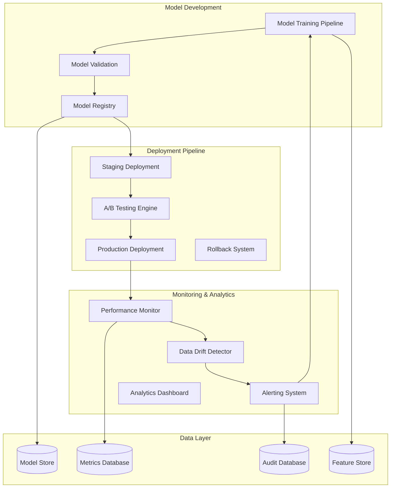

# Model Lifecycle Management System Design Document

## Overview

The Model Lifecycle Management System provides comprehensive MLOps capabilities with automated retraining, A/B testing, performance monitoring, rollback mechanisms, and deployment automation. Built with cloud-native architecture, the system ensures models remain accurate, performant, and compliant throughout their operational lifecycle.

## Architecture

### High-Level Architecture



## Components and Interfaces

### 1. Model Training and Validation Pipeline

**Purpose**: Automated model training with comprehensive validation

**Key Components**:
- `TrainingPipeline`: Orchestrate model training workflows
- `ModelValidator`: Validate model performance and quality
- `HyperparameterOptimizer`: Optimize model parameters

**Interface**:
```python
class TrainingPipeline:
    def trigger_training(self, config: TrainingConfig) -> TrainingJob
    def validate_model(self, model_id: str, validation_data: Dataset) -> ValidationResults
    def register_model(self, model: Model, metadata: ModelMetadata) -> str
    def get_training_status(self, job_id: str) -> TrainingStatus
```

### 2. A/B Testing and Deployment Engine

**Purpose**: Safe model deployment with gradual rollout and testing

**Key Components**:
- `ABTestingEngine`: Manage model A/B tests
- `DeploymentManager`: Handle model deployments
- `TrafficSplitter`: Control traffic routing between model versions

**Interface**:
```python
class ABTestingEngine:
    def create_ab_test(self, config: ABTestConfig) -> ABTest
    def update_traffic_split(self, test_id: str, split_config: TrafficSplit) -> bool
    def analyze_test_results(self, test_id: str) -> TestResults
    def promote_winner(self, test_id: str) -> DeploymentResult
```

### 3. Performance Monitoring System

**Purpose**: Continuous model performance monitoring and alerting

**Key Components**:
- `PerformanceMonitor`: Track model metrics in real-time
- `DriftDetector`: Detect data and concept drift
- `AlertManager`: Send alerts based on performance thresholds

**Interface**:
```python
class PerformanceMonitor:
    def track_prediction(self, model_id: str, prediction: Prediction, actual: Optional[Any]) -> None
    def get_performance_metrics(self, model_id: str, time_range: TimeRange) -> PerformanceMetrics
    def detect_drift(self, model_id: str) -> DriftAnalysis
    def create_alert_rule(self, rule: AlertRule) -> str
```

## Data Models

### Core Entities

```python
class ModelVersion:
    id: str
    model_id: str
    version: str
    algorithm: str
    parameters: Dict[str, Any]
    training_data_hash: str
    performance_metrics: Dict[str, float]
    status: ModelStatus
    created_at: datetime

class ABTest:
    id: str
    name: str
    model_versions: List[str]
    traffic_split: Dict[str, float]
    success_metrics: List[str]
    status: TestStatus
    results: Optional[TestResults]
    created_at: datetime

class PerformanceMetric:
    id: str
    model_id: str
    metric_name: str
    value: float
    timestamp: datetime
    metadata: Dict[str, Any]

class AlertRule:
    id: str
    model_id: str
    metric_name: str
    threshold: float
    comparison: ComparisonOperator
    notification_channels: List[str]
    is_active: bool
```

## Testing Strategy

### Unit Testing
- Model training pipeline components
- Validation algorithms
- A/B testing logic
- Performance monitoring functions

### Integration Testing
- End-to-end training workflows
- Deployment pipeline testing
- Monitoring system integration
- Alert system functionality

### End-to-End Testing
- Complete model lifecycle scenarios
- Multi-model A/B testing
- Rollback and recovery procedures
- Performance under load