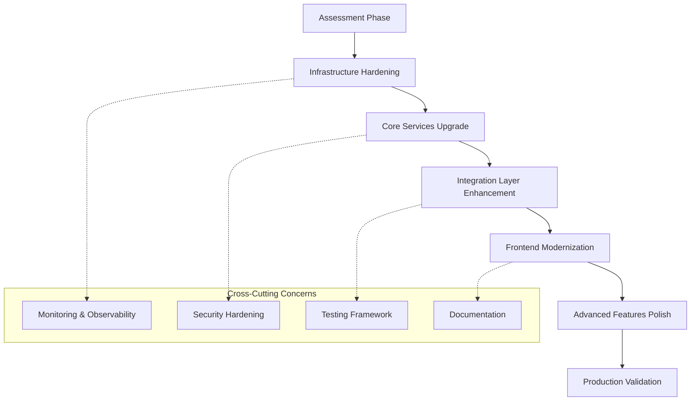
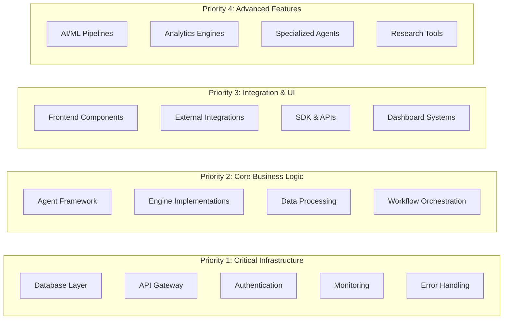

# Production Readiness Upgrade Design

## Overview

This design outlines a systematic approach to upgrade all existing ScrollIntel AI system components from skeleton implementations to production-ready, enterprise-grade solutions. The upgrade will be executed in phases, prioritizing critical infrastructure components first, then core business logic, and finally advanced features.

## Architecture

### Upgrade Strategy Architecture



### Component Prioritization Matrix



## Components and Interfaces

### 1. Production Upgrade Framework

#### Core Upgrade Engine
```python
class ProductionUpgradeEngine:
    def __init__(self):
        self.assessment_engine = ComponentAssessmentEngine()
        self.upgrade_planner = UpgradePlanner()
        self.execution_engine = UpgradeExecutionEngine()
        self.validation_engine = ValidationEngine()
    
    async def upgrade_component(self, component_path: str) -> UpgradeResult:
        # Assess current state
        assessment = await self.assessment_engine.assess(component_path)
        
        # Plan upgrade steps
        plan = await self.upgrade_planner.create_plan(assessment)
        
        # Execute upgrade
        result = await self.execution_engine.execute(plan)
        
        # Validate results
        validation = await self.validation_engine.validate(result)
        
        return UpgradeResult(assessment, plan, result, validation)
```

#### Component Assessment Engine
```python
class ComponentAssessmentEngine:
    def __init__(self):
        self.code_analyzer = CodeQualityAnalyzer()
        self.dependency_analyzer = DependencyAnalyzer()
        self.security_scanner = SecurityScanner()
        self.performance_profiler = PerformanceProfiler()
    
    async def assess(self, component_path: str) -> ComponentAssessment:
        return ComponentAssessment(
            code_quality=await self.code_analyzer.analyze(component_path),
            dependencies=await self.dependency_analyzer.analyze(component_path),
            security=await self.security_scanner.scan(component_path),
            performance=await self.performance_profiler.profile(component_path)
        )
```

### 2. Enhanced Error Handling Framework

#### Global Error Handler
```python
class ProductionErrorHandler:
    def __init__(self):
        self.logger = StructuredLogger()
        self.alerting = AlertingSystem()
        self.recovery = RecoveryManager()
        self.metrics = MetricsCollector()
    
    async def handle_error(self, error: Exception, context: ErrorContext) -> ErrorResponse:
        # Log with correlation ID
        correlation_id = await self.logger.log_error(error, context)
        
        # Collect metrics
        await self.metrics.record_error(error, context)
        
        # Attempt recovery
        recovery_result = await self.recovery.attempt_recovery(error, context)
        
        # Alert if critical
        if context.severity >= Severity.CRITICAL:
            await self.alerting.send_alert(error, context, correlation_id)
        
        return ErrorResponse(
            correlation_id=correlation_id,
            recovery_attempted=recovery_result.attempted,
            recovery_successful=recovery_result.successful,
            user_message=self._generate_user_message(error, context)
        )
```

### 3. Production Monitoring System

#### Comprehensive Monitoring Stack
```python
class ProductionMonitoringSystem:
    def __init__(self):
        self.metrics_collector = PrometheusMetricsCollector()
        self.log_aggregator = StructuredLogAggregator()
        self.trace_collector = DistributedTraceCollector()
        self.health_checker = HealthCheckManager()
        self.alerting = AlertingManager()
    
    async def initialize_monitoring(self):
        # Set up metrics collection
        await self.metrics_collector.setup_default_metrics()
        
        # Configure log aggregation
        await self.log_aggregator.configure_structured_logging()
        
        # Initialize distributed tracing
        await self.trace_collector.setup_tracing()
        
        # Start health checks
        await self.health_checker.start_health_checks()
        
        # Configure alerting rules
        await self.alerting.load_alerting_rules()
```

### 4. Scalability Enhancement Framework

#### Auto-Scaling Manager
```python
class AutoScalingManager:
    def __init__(self):
        self.resource_monitor = ResourceMonitor()
        self.scaling_policies = ScalingPolicyManager()
        self.load_balancer = IntelligentLoadBalancer()
        self.capacity_planner = CapacityPlanner()
    
    async def manage_scaling(self):
        while True:
            # Monitor current resource usage
            metrics = await self.resource_monitor.get_current_metrics()
            
            # Check scaling policies
            scaling_decision = await self.scaling_policies.evaluate(metrics)
            
            # Execute scaling if needed
            if scaling_decision.should_scale:
                await self._execute_scaling(scaling_decision)
            
            # Update load balancing
            await self.load_balancer.update_routing(metrics)
            
            await asyncio.sleep(30)  # Check every 30 seconds
```

### 5. Security Hardening Framework

#### Security Enhancement Engine
```python
class SecurityHardeningEngine:
    def __init__(self):
        self.auth_manager = EnhancedAuthManager()
        self.encryption_manager = EncryptionManager()
        self.audit_logger = SecurityAuditLogger()
        self.threat_detector = ThreatDetectionEngine()
    
    async def harden_component(self, component: Component) -> SecurityReport:
        # Implement authentication
        auth_result = await self.auth_manager.implement_auth(component)
        
        # Add encryption
        encryption_result = await self.encryption_manager.add_encryption(component)
        
        # Set up audit logging
        audit_result = await self.audit_logger.setup_auditing(component)
        
        # Configure threat detection
        threat_result = await self.threat_detector.setup_monitoring(component)
        
        return SecurityReport(auth_result, encryption_result, audit_result, threat_result)
```

## Data Models

### Upgrade Tracking Models
```python
@dataclass
class ComponentAssessment:
    component_path: str
    current_version: str
    code_quality_score: float
    security_score: float
    performance_score: float
    test_coverage: float
    documentation_score: float
    production_readiness_score: float
    identified_issues: List[Issue]
    upgrade_recommendations: List[Recommendation]

@dataclass
class UpgradePlan:
    component_path: str
    current_assessment: ComponentAssessment
    target_state: ProductionStandards
    upgrade_steps: List[UpgradeStep]
    estimated_effort: timedelta
    dependencies: List[str]
    risk_level: RiskLevel

@dataclass
class UpgradeStep:
    step_id: str
    description: str
    category: UpgradeCategory
    priority: Priority
    estimated_duration: timedelta
    prerequisites: List[str]
    validation_criteria: List[ValidationCriterion]
```

### Production Standards Models
```python
@dataclass
class ProductionStandards:
    min_code_quality_score: float = 8.5
    min_security_score: float = 9.0
    min_performance_score: float = 8.0
    min_test_coverage: float = 90.0
    min_documentation_score: float = 8.0
    required_monitoring: List[MonitoringRequirement]
    required_security_controls: List[SecurityControl]
    required_error_handling: List[ErrorHandlingRequirement]
```

## Error Handling

### Production Error Handling Strategy

1. **Graceful Degradation**: Components fail gracefully without affecting the entire system
2. **Circuit Breaker Pattern**: Prevent cascading failures through circuit breakers
3. **Retry Logic**: Implement exponential backoff for transient failures
4. **Dead Letter Queues**: Handle failed messages appropriately
5. **Health Checks**: Continuous health monitoring with automatic recovery

### Error Categories and Responses
```python
class ErrorHandlingStrategy:
    STRATEGIES = {
        ErrorCategory.TRANSIENT: RetryWithBackoffStrategy(),
        ErrorCategory.RESOURCE_EXHAUSTION: BackpressureStrategy(),
        ErrorCategory.DEPENDENCY_FAILURE: CircuitBreakerStrategy(),
        ErrorCategory.DATA_CORRUPTION: IsolateAndRecoverStrategy(),
        ErrorCategory.SECURITY_VIOLATION: ImmediateAlertStrategy(),
        ErrorCategory.CONFIGURATION_ERROR: SafeModeStrategy()
    }
```

## Testing Strategy

### Multi-Layer Testing Approach

1. **Unit Tests**: 90%+ coverage for all components
2. **Integration Tests**: Test component interactions
3. **Contract Tests**: Validate API contracts
4. **Performance Tests**: Load and stress testing
5. **Security Tests**: Automated security scanning
6. **End-to-End Tests**: Complete workflow validation
7. **Chaos Engineering**: Resilience testing

### Testing Framework Enhancement
```python
class ProductionTestingFramework:
    def __init__(self):
        self.unit_test_runner = EnhancedUnitTestRunner()
        self.integration_test_runner = IntegrationTestRunner()
        self.performance_test_runner = PerformanceTestRunner()
        self.security_test_runner = SecurityTestRunner()
        self.chaos_test_runner = ChaosTestRunner()
    
    async def run_comprehensive_tests(self, component: str) -> TestResults:
        results = TestResults()
        
        # Run all test categories
        results.unit_tests = await self.unit_test_runner.run(component)
        results.integration_tests = await self.integration_test_runner.run(component)
        results.performance_tests = await self.performance_test_runner.run(component)
        results.security_tests = await self.security_test_runner.run(component)
        results.chaos_tests = await self.chaos_test_runner.run(component)
        
        return results
```

## Implementation Phases

### Phase 1: Infrastructure Foundation (Weeks 1-2)
- Database layer hardening
- API gateway enhancement
- Authentication system upgrade
- Basic monitoring implementation
- Core error handling framework

### Phase 2: Core Services Enhancement (Weeks 3-4)
- Agent framework production upgrade
- Engine implementations hardening
- Data processing pipeline enhancement
- Workflow orchestration improvement

### Phase 3: Integration and UI Polish (Weeks 5-6)
- Frontend component enhancement
- External integration hardening
- SDK and API improvements
- Dashboard system upgrade

### Phase 4: Advanced Features Production (Weeks 7-8)
- AI/ML pipeline hardening
- Analytics engine enhancement
- Specialized agent improvements
- Research tool production readiness

### Phase 5: Validation and Optimization (Weeks 9-10)
- Comprehensive testing
- Performance optimization
- Security validation
- Documentation completion
- Production deployment preparation

## Success Metrics

### Production Readiness KPIs
- System uptime: 99.9%+
- Error rate: <0.1%
- Response time: <200ms p95
- Test coverage: >90%
- Security score: >9.0/10
- Documentation completeness: >95%
- Monitoring coverage: 100%