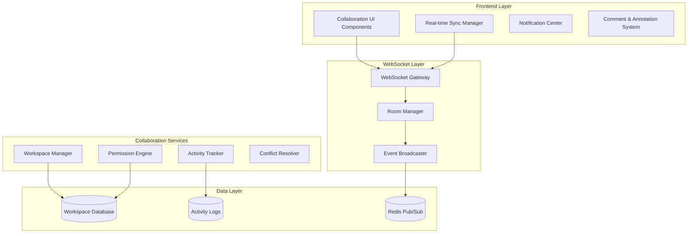

# Real-time Collaboration System Design Document

## Overview

The Real-time Collaboration System provides enterprise-grade multi-user workspace management with real-time synchronization, role-based access control, and collaborative decision-making capabilities. Built on WebSocket technology with Redis pub/sub for scalability, the system enables seamless teamwork across all ScrollIntel features.

## Architecture

### High-Level Architecture



## Components and Interfaces

### 1. Workspace Management System

**Purpose**: Manage multi-user workspaces with role-based access control

**Key Components**:
- `WorkspaceManager`: Create and manage collaborative workspaces
- `MembershipManager`: Handle user invitations and role assignments
- `PermissionEngine`: Enforce access controls and data policies

**Interface**:
```python
class WorkspaceManager:
    def create_workspace(self, name: str, owner_id: str, settings: WorkspaceSettings) -> Workspace
    def invite_member(self, workspace_id: str, user_email: str, role: WorkspaceRole) -> Invitation
    def update_permissions(self, workspace_id: str, user_id: str, permissions: List[Permission]) -> bool
    def get_workspace_activity(self, workspace_id: str, since: datetime) -> List[Activity]
```

### 2. Real-time Synchronization Engine

**Purpose**: Provide real-time updates and conflict resolution

**Key Components**:
- `SyncEngine`: Manage real-time data synchronization
- `ConflictResolver`: Handle simultaneous edit conflicts
- `EventBroadcaster`: Distribute updates to workspace members

**Interface**:
```python
class SyncEngine:
    def broadcast_update(self, workspace_id: str, event: CollaborationEvent) -> None
    def resolve_conflict(self, conflict: DataConflict) -> ConflictResolution
    def sync_user_state(self, user_id: str, workspace_id: str) -> UserState
```

### 3. Activity Tracking and Analytics

**Purpose**: Monitor team activity and provide collaboration insights

**Key Components**:
- `ActivityTracker`: Log all user actions and system events
- `CollaborationAnalytics`: Generate team performance metrics
- `NotificationEngine`: Send relevant updates to team members

## Data Models

### Core Entities

```python
class Workspace:
    id: str
    name: str
    owner_id: str
    settings: WorkspaceSettings
    created_at: datetime
    updated_at: datetime

class WorkspaceMember:
    workspace_id: str
    user_id: str
    role: WorkspaceRole
    permissions: List[Permission]
    joined_at: datetime

class CollaborationEvent:
    id: str
    workspace_id: str
    user_id: str
    event_type: EventType
    resource_id: str
    data: Dict[str, Any]
    timestamp: datetime

class Comment:
    id: str
    workspace_id: str
    resource_id: str
    user_id: str
    content: str
    thread_id: Optional[str]
    created_at: datetime
```

## Testing Strategy

### Unit Testing
- Workspace creation and management
- Permission enforcement
- Real-time event broadcasting
- Conflict resolution algorithms

### Integration Testing
- WebSocket connection handling
- Multi-user scenario testing
- Database consistency checks
- Redis pub/sub functionality

### End-to-End Testing
- Complete collaboration workflows
- Cross-browser compatibility
- Network failure recovery
- Concurrent user stress testing