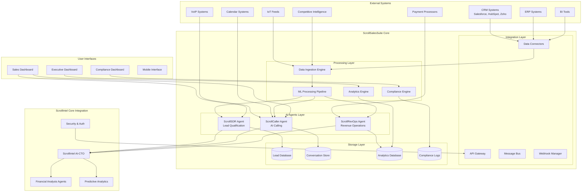

# ScrollSalesSuite Design Document

## Overview

ScrollSalesSuite is architected as a high-performance, enterprise-grade sales intelligence and revenue automation module that integrates seamlessly with ScrollIntel's core AI-CTO platform. The system employs a microservices architecture with three specialized AI agents (ScrollSDR, ScrollCaller, ScrollRevOps) that work in concert to deliver superior sales performance metrics compared to AltaHQ.

The design emphasizes real-time processing, multi-source data integration, advanced AI/ML capabilities, and enterprise-level security and compliance. The system is built to handle global operations with multi-language support while maintaining sub-30-second response times for critical operations.

## Architecture

### High-Level Architecture



### Microservices Architecture

The system follows a microservices pattern with the following core services:

1. **Agent Services**: ScrollSDR, ScrollCaller, ScrollRevOps
2. **Data Services**: Ingestion, Processing, Analytics
3. **Integration Services**: API Gateway, Connectors, Webhooks
4. **Compliance Services**: Monitoring, Reporting, Audit
5. **UI Services**: Dashboard APIs, Real-time Updates

## Components and Interfaces

### ScrollSDR Agent

**Purpose**: Autonomous lead prospecting and qualification with sub-30-second response times.

**Key Components**:
- **Lead Scoring Engine**: Multi-factor scoring algorithm using ML models
- **Data Fusion Module**: Combines CRM, public, and competitive intelligence data
- **Qualification Processor**: Real-time lead assessment and routing
- **Integration Adapters**: CRM system connectors (Salesforce, HubSpot, Zoho)

**Interfaces**:
- REST API for lead submission and retrieval
- WebSocket for real-time lead updates
- Message queue integration for async processing
- CRM webhook endpoints for data synchronization

**Performance Targets**:
- Lead qualification: < 30 seconds
- Scoring accuracy: 98%
- Concurrent lead processing: 10,000+

### ScrollCaller Agent

**Purpose**: Emotion-aware AI calling with 98% personalization accuracy and real-time compliance.

**Key Components**:
- **Conversation Engine**: Natural language processing with emotion detection
- **Personalization Module**: Dynamic conversation adaptation based on lead data
- **Compliance Monitor**: Real-time call compliance checking and intervention
- **Multi-Language Processor**: Support for 20+ languages with cultural adaptation
- **VoIP Integration**: Direct integration with calling systems
- **Meeting Scheduler**: Calendar integration for automated booking

**Interfaces**:
- VoIP API integration (Twilio, RingCentral, etc.)
- Calendar APIs (Google Calendar, Outlook, etc.)
- Real-time audio processing streams
- Compliance reporting endpoints

**Performance Targets**:
- Personalization accuracy: 98%
- Meeting booking rate: 60%
- Language support: 20+
- Real-time compliance monitoring: 100%

### ScrollRevOps Agent

**Purpose**: Complete revenue operations automation with 95% forecast accuracy.

**Key Components**:
- **Forecasting Engine**: Advanced ML models for revenue prediction
- **Proposal Generator**: Automated proposal creation and customization
- **Performance Analytics**: Real-time KPI calculation and reporting
- **Financial Integration**: Connection to enterprise financial systems
- **Payment Processing**: Integration with payment processors
- **Executive Reporting**: Automated dashboard and report generation

**Interfaces**:
- Financial system APIs (ERP, accounting software)
- Payment processor APIs (Stripe, PayPal, etc.)
- BI tool integrations (Tableau, Power BI, etc.)
- Executive dashboard APIs

**Performance Targets**:
- Forecast accuracy: 95%
- Proposal generation: < 15 minutes
- Conversion rate improvement: 50%
- Real-time KPI updates: < 5 seconds

### Data Integration Layer

**Purpose**: Unified data ingestion and processing from multiple sources.

**Key Components**:
- **Universal Data Connectors**: Standardized interfaces for various data sources
- **Real-time Stream Processor**: High-throughput data processing pipeline
- **Data Quality Engine**: Validation, cleansing, and enrichment
- **Schema Registry**: Centralized data schema management
- **Event Sourcing**: Complete audit trail of all data changes

**Supported Data Sources**:
- CRM systems (Salesforce, HubSpot, Zoho, Pipedrive)
- ERP systems (SAP, Oracle, Microsoft Dynamics)
- BI tools (Tableau, Power BI, Looker)
- IoT feeds and sensor data
- Competitive intelligence platforms
- Social media and web scraping
- Email and communication platforms

### Compliance and Security Framework

**Purpose**: Enterprise-grade security and automated compliance management.

**Key Components**:
- **Compliance Monitor**: Real-time compliance checking across all operations
- **Audit Logger**: Comprehensive logging of all system activities
- **Data Privacy Engine**: GDPR, CCPA, and regional privacy law compliance
- **Security Gateway**: Authentication, authorization, and threat detection
- **Encryption Manager**: End-to-end encryption for data at rest and in transit

**Compliance Standards**:
- GDPR (General Data Protection Regulation)
- SOC2 Type II
- HIPAA (where applicable)
- PCI DSS (for payment processing)
- Regional data protection laws

## Data Models

### Lead Data Model

```json
{
  "leadId": "string",
  "contactInfo": {
    "name": "string",
    "email": "string",
    "phone": "string",
    "company": "string",
    "title": "string"
  },
  "scoring": {
    "overallScore": "number (0-100)",
    "demographicScore": "number",
    "behavioralScore": "number",
    "intentScore": "number",
    "confidenceLevel": "number"
  },
  "qualification": {
    "status": "enum (qualified, unqualified, pending)",
    "qualificationDate": "datetime",
    "qualificationAgent": "string",
    "qualificationReason": "string"
  },
  "interactions": [
    {
      "type": "enum (call, email, meeting, proposal)",
      "timestamp": "datetime",
      "agent": "string",
      "outcome": "string",
      "notes": "string"
    }
  ],
  "compliance": {
    "consentStatus": "enum (given, withdrawn, pending)",
    "dataRetentionDate": "datetime",
    "privacyFlags": ["string"]
  }
}
```

### Conversation Data Model

```json
{
  "conversationId": "string",
  "leadId": "string",
  "agent": "string",
  "startTime": "datetime",
  "endTime": "datetime",
  "language": "string",
  "transcript": [
    {
      "speaker": "enum (agent, prospect)",
      "timestamp": "datetime",
      "text": "string",
      "sentiment": "number (-1 to 1)",
      "emotion": "string",
      "confidence": "number"
    }
  ],
  "outcomes": {
    "meetingScheduled": "boolean",
    "proposalRequested": "boolean",
    "nextSteps": ["string"],
    "followUpDate": "datetime"
  },
  "compliance": {
    "consentRecorded": "boolean",
    "complianceFlags": ["string"],
    "auditTrail": ["string"]
  }
}
```

### Revenue Forecast Model

```json
{
  "forecastId": "string",
  "period": {
    "startDate": "date",
    "endDate": "date",
    "type": "enum (monthly, quarterly, annual)"
  },
  "predictions": {
    "totalRevenue": "number",
    "confidenceInterval": {
      "lower": "number",
      "upper": "number"
    },
    "accuracy": "number",
    "factors": [
      {
        "name": "string",
        "impact": "number",
        "confidence": "number"
      }
    ]
  },
  "breakdown": {
    "byProduct": "object",
    "byRegion": "object",
    "byChannel": "object",
    "byAgent": "object"
  },
  "metadata": {
    "modelVersion": "string",
    "generatedAt": "datetime",
    "dataSourcesUsed": ["string"]
  }
}
```

## Error Handling

### Error Classification

1. **System Errors**: Infrastructure, database, or service failures
2. **Integration Errors**: External API failures or data inconsistencies
3. **Business Logic Errors**: Invalid data or business rule violations
4. **Compliance Errors**: Privacy or regulatory violations
5. **Performance Errors**: Timeout or resource exhaustion issues

### Error Handling Strategy

**Graceful Degradation**:
- Fallback to cached data when real-time sources are unavailable
- Reduced functionality modes for partial system failures
- Automatic retry mechanisms with exponential backoff

**Error Recovery**:
- Automatic healing for transient failures
- Circuit breaker patterns for external service protection
- Dead letter queues for failed message processing

**Monitoring and Alerting**:
- Real-time error tracking and alerting
- Performance degradation detection
- Automated escalation procedures

### Compliance Error Handling

**Immediate Response**:
- Automatic call termination for compliance violations
- Data processing halt for privacy violations
- Immediate notification to compliance officers

**Remediation**:
- Automated data deletion for retention violations
- Consent re-collection workflows
- Audit trail preservation for investigations

## Testing Strategy

### Unit Testing
- Individual component testing with 90%+ code coverage
- Mock external dependencies for isolated testing
- Automated test execution in CI/CD pipeline

### Integration Testing
- End-to-end workflow testing across all agents
- External system integration validation
- Performance testing under load

### Compliance Testing
- Automated compliance rule validation
- Privacy law adherence testing
- Security penetration testing

### Performance Testing
- Load testing for concurrent user scenarios
- Stress testing for system limits
- Benchmark testing against AltaHQ metrics

### User Acceptance Testing
- Executive dashboard usability testing
- Sales team workflow validation
- Compliance officer approval processes

### Competitive Benchmarking
- Weekly automated comparison with AltaHQ metrics
- A/B testing for feature improvements
- Performance regression detection

## Deployment Architecture

### Cloud Infrastructure
- Multi-region deployment for global availability
- Auto-scaling based on demand
- Container orchestration with Kubernetes
- Microservices deployment with service mesh

### Data Storage
- Distributed database architecture for scalability
- Real-time data replication across regions
- Automated backup and disaster recovery
- Data encryption at rest and in transit

### Monitoring and Observability
- Comprehensive logging and metrics collection
- Real-time performance monitoring
- Distributed tracing for request flows
- Automated alerting and incident response

### Security
- Zero-trust network architecture
- Multi-factor authentication for all access
- Regular security audits and penetration testing
- Compliance monitoring and reporting automation