# Design Document

## Overview

This design implements cutting-edge real-world improvements to ScrollIntel, incorporating autonomous problem discovery, quantum computing, emotional intelligence, sustainability optimization, edge computing, augmented reality, blockchain verification, swarm intelligence, biometric integration, generative AI, digital twins, neuromorphic computing, autonomous ethics, predictive maintenance, and cross-reality problem-solving capabilities.

## Architecture

### Advanced Real-World Problem-Solving Architecture

```mermaid
graph TB
    subgraph "Autonomous Discovery Layer"
        APD[Autonomous Problem Discovery]
        AIS[Autonomous Intervention System]
        PPS[Predictive Problem Scanner]
        EWS[Early Warning System]
    end
    
    subgraph "Quantum-Enhanced Computing"
        QPS[Quantum Problem Solver]
        HQC[Hybrid Quantum-Classical]
        QOE[Quantum Optimization Engine]
        QVS[Quantum Validation System]
    end
    
    subgraph "Human-Centric Intelligence"
        EIA[Emotional Intelligence Analyzer]
        PSM[Psychological Safety Monitor]
        BIS[Biometric Integration System]
        SRA[Stress Response Adapter]
    end
    
    subgraph "Sustainability Engine"
        CEA[Carbon Emission Analyzer]
        SEO[Sustainability Optimizer]
        RES[Renewable Energy Scheduler]
        COS[Carbon Offset System]
    end
    
    subgraph "Edge Intelligence Network"
        EDM[Edge Deployment Manager]
        DIN[Distributed Intelligence Network]
        ECC[Edge Computing Coordinator]
        IWD[Intelligent Workload Distributor]
    end
    
    subgraph "Immersive Reality Systems"
        ARV[AR Visualization Engine]
        VRS[VR Scenario Generator]
        MRC[Mixed Reality Coordinator]
        CRS[Cross-Reality Synchronizer]
    end
    
    subgraph "Trust and Verification"
        BAT[Blockchain Audit Trail]
        SVS[Solution Verification System]
        ITR[Immutable Trust Registry]
        CCS[Cryptographic Compliance System]
    end
    
    subgraph "Collective Intelligence"
        SIC[Swarm Intelligence Coordinator]
        AAS[Agent Assembly System]
        CIA[Collective Intelligence Aggregator]
        EBG[Emergent Behavior Guide]
    end
    
    subgraph "Advanced AI Systems"
        GAI[Generative AI Engine]
        NCP[Neuromorphic Computing Platform]
        DTI[Digital Twin Integrator]
        AED[Autonomous Ethics Decider]
    end
    
    subgraph "Predictive Systems"
        PMS[Predictive Maintenance System]
        SHS[Self-Healing System]
        FPS[Failure Prediction System]
        ARS[Automatic Recovery System]
    end
    
    APD --> AIS
    AIS --> PPS
    PPS --> EWS
    
    QPS --> HQC
    HQC --> QOE
    QOE --> QVS
    
    EIA --> PSM
    PSM --> BIS
    BIS --> SRA
    
    CEA --> SEO
    SEO --> RES
    RES --> COS
    
    EDM --> DIN
    DIN --> ECC
    ECC --> IWD
    
    ARV --> VRS
    VRS --> MRC
    MRC --> CRS
    
    BAT --> SVS
    SVS --> ITR
    ITR --> CCS
    
    SIC --> AAS
    AAS --> CIA
    CIA --> EBG
    
    GAI --> NCP
    NCP --> DTI
    DTI --> AED
    
    PMS --> SHS
    SHS --> FPS
    FPS --> ARS
    
    APD --> QPS
    EIA --> GAI
    CEA --> EDM
    ARV --> BAT
    SIC --> PMS
```



## Components and Interfaces

### Autonomous Problem Discovery System

**Purpose**: Proactively identifies emerging problems and implements preventive interventions without human intervention.

**Key Features**:
- Pattern recognition for early problem detection
- Risk assessment and intervention planning
- Autonomous implementation of low-risk solutions
- Continuous monitoring and adjustment
- Human escalation for high-risk interventions

**Interface**:
```typescript
interface AutonomousProblemDiscovery {
  // Problem Discovery
  scanForEmergingProblems(systems: System[]): Promise<EmergingProblem[]>
  assessProblemSeverity(problem: EmergingProblem): Promise<SeverityAssessment>
  predictProblemEvolution(problem: EmergingProblem): Promise<EvolutionPrediction>
  
  // Autonomous Intervention
  generateInterventions(problem: EmergingProblem): Promise<Intervention[]>
  assessInterventionRisk(intervention: Intervention): Promise<RiskAssessment>
  implementAutonomousIntervention(intervention: Intervention): Promise<ImplementationResult>
  
  // Monitoring and Adjustment
  monitorInterventionEffectiveness(interventionId: string): Promise<EffectivenessMetrics>
  adjustIntervention(interventionId: string, adjustments: Adjustment[]): Promise<AdjustmentResult>
  escalateToHuman(problem: EmergingProblem, reason: EscalationReason): Promise<EscalationResult>
}

interface EmergingProblem {
  id: string
  type: ProblemType
  severity: SeverityLevel
  confidence: number
  timeToImpact: Duration
  affectedSystems: System[]
  potentialImpact: ImpactAssessment
  detectionSignals: DetectionSignal[]
  evolutionPrediction: EvolutionPrediction
}

interface Intervention {
  id: string
  type: InterventionType
  description: string
  riskLevel: RiskLevel
  expectedEffectiveness: number
  implementationSteps: Step[]
  rollbackPlan: RollbackPlan
  monitoringPlan: MonitoringPlan
}
```

### Quantum-Enhanced Problem Solver

**Purpose**: Leverages quantum computing capabilities for exponentially faster problem-solving of complex optimization problems.

**Key Features**:
- Quantum algorithm selection and optimization
- Hybrid classical-quantum solution generation
- Quantum resource management and scheduling
- Quantum result validation and integration
- Classical fallback for non-quantum problems

**Interface**:
```typescript
interface QuantumProblemSolver {
  // Quantum Capability Assessment
  assessQuantumApplicability(problem: Problem): Promise<QuantumApplicability>
  selectQuantumAlgorithm(problem: Problem): Promise<QuantumAlgorithm>
  estimateQuantumAdvantage(problem: Problem, algorithm: QuantumAlgorithm): Promise<AdvantageEstimate>
  
  // Quantum Solution Generation
  generateQuantumSolution(problem: Problem, algorithm: QuantumAlgorithm): Promise<QuantumSolution>
  createHybridSolution(problem: Problem): Promise<HybridSolution>
  validateQuantumResults(solution: QuantumSolution): Promise<ValidationResult>
  
  // Resource Management
  checkQuantumResourceAvailability(): Promise<ResourceAvailability>
  scheduleQuantumExecution(job: QuantumJob): Promise<ScheduleResult>
  optimizeQuantumCircuit(circuit: QuantumCircuit): Promise<OptimizedCircuit>
}

interface QuantumSolution {
  id: string
  algorithm: QuantumAlgorithm
  result: QuantumResult
  confidence: number
  quantumAdvantage: number
  executionTime: Duration
  resourceUsage: QuantumResourceUsage
  classicalComparison: ClassicalComparison
}

interface HybridSolution {
  id: string
  quantumComponents: QuantumComponent[]
  classicalComponents: ClassicalComponent[]
  integrationStrategy: IntegrationStrategy
  overallPerformance: PerformanceMetrics
}
```

### Emotional Intelligence and Psychological Safety System

**Purpose**: Understands and responds to emotional dynamics and psychological safety concerns in problem-solving contexts.

**Key Features**:
- Emotional state recognition and analysis
- Psychological safety assessment and monitoring
- Stress and burnout detection and intervention
- Team dynamics analysis and mediation
- Solution adaptation based on emotional context

**Interface**:
```typescript
interface EmotionalIntelligenceSystem {
  // Emotional Analysis
  analyzeEmotionalState(interactions: Interaction[]): Promise<EmotionalState>
  assessPsychologicalSafety(team: Team): Promise<PsychologicalSafetyAssessment>
  detectStressIndicators(user: User, context: Context): Promise<StressIndicators>
  
  // Intervention and Support
  recommendStressReduction(stressIndicators: StressIndicators): Promise<StressReductionPlan>
  mediateTeamConflict(conflict: TeamConflict): Promise<MediationPlan>
  adaptSolutionForEmotionalContext(solution: Solution, emotionalContext: EmotionalContext): Promise<AdaptedSolution>
  
  // Monitoring and Adjustment
  monitorTeamMorale(team: Team): Promise<MoraleMetrics>
  trackPsychologicalImpact(solution: Solution, team: Team): Promise<PsychologicalImpact>
  adjustForWellbeing(solution: Solution, wellbeingMetrics: WellbeingMetrics): Promise<AdjustedSolution>
}

interface EmotionalState {
  userId: string
  emotions: Emotion[]
  overallMood: MoodLevel
  stressLevel: StressLevel
  cognitiveLoad: CognitiveLoad
  socialConnection: SocialConnectionLevel
  confidence: number
  timestamp: Date
}

interface PsychologicalSafetyAssessment {
  teamId: string
  safetyLevel: SafetyLevel
  riskFactors: RiskFactor[]
  protectiveFactors: ProtectiveFactor[]
  recommendations: SafetyRecommendation[]
  interventions: SafetyIntervention[]
}
```

### Sustainability and Carbon Optimization Engine

**Purpose**: Optimizes all solutions for sustainability and carbon neutrality while maintaining effectiveness.

**Key Features**:
- Carbon footprint calculation and optimization
- Renewable energy integration and scheduling
- Sustainability metrics tracking and reporting
- Carbon offset strategy generation
- Environmental impact assessment

**Interface**:
```typescript
interface SustainabilityEngine {
  // Carbon Analysis
  calculateCarbonFootprint(solution: Solution): Promise<CarbonFootprint>
  optimizeForSustainability(solution: Solution): Promise<SustainableSolution>
  assessEnvironmentalImpact(solution: Solution): Promise<EnvironmentalImpact>
  
  // Energy Optimization
  scheduleRenewableEnergy(energyNeeds: EnergyRequirement[]): Promise<EnergySchedule>
  optimizeEnergyConsumption(operations: Operation[]): Promise<EnergyOptimization>
  integrateGreenTechnology(solution: Solution): Promise<GreenIntegration>
  
  // Offset and Reporting
  generateOffsetStrategy(emissions: CarbonEmission[]): Promise<OffsetStrategy>
  trackSustainabilityMetrics(timeRange: TimeRange): Promise<SustainabilityMetrics>
  generateSustainabilityReport(period: ReportingPeriod): Promise<SustainabilityReport>
}

interface CarbonFootprint {
  totalEmissions: number
  emissionSources: EmissionSource[]
  offsetPotential: number
  reductionOpportunities: ReductionOpportunity[]
  complianceStatus: ComplianceStatus
}

interface SustainableSolution {
  originalSolution: Solution
  sustainabilityOptimizations: Optimization[]
  carbonReduction: number
  renewableEnergyUsage: number
  sustainabilityScore: number
  tradeoffAnalysis: TradeoffAnalysis
}
```

### Edge Intelligence Network

**Purpose**: Provides distributed intelligence capabilities across edge devices with intelligent coordination and failover.

**Key Features**:
- Intelligent model distribution and deployment
- Edge node collaboration and coordination
- Workload distribution and optimization
- Automatic failover and recovery
- Distributed learning and improvement

**Interface**:
```typescript
interface EdgeIntelligenceNetwork {
  // Edge Deployment
  deployToEdge(model: Model, edgeNodes: EdgeNode[]): Promise<EdgeDeployment>
  optimizeEdgeDistribution(workload: Workload, nodes: EdgeNode[]): Promise<DistributionPlan>
  manageEdgeResources(nodes: EdgeNode[]): Promise<ResourceManagement>
  
  // Collaboration and Coordination
  coordinateEdgeNodes(nodes: EdgeNode[], task: Task): Promise<CoordinationResult>
  enableNodeCollaboration(nodes: EdgeNode[]): Promise<CollaborationNetwork>
  synchronizeEdgeIntelligence(nodes: EdgeNode[]): Promise<SynchronizationResult>
  
  // Failover and Recovery
  detectNodeFailure(node: EdgeNode): Promise<FailureDetection>
  implementFailover(failedNode: EdgeNode, backupNodes: EdgeNode[]): Promise<FailoverResult>
  recoverFailedNode(node: EdgeNode): Promise<RecoveryResult>
  
  // Distributed Learning
  aggregateEdgeLearning(learningResults: EdgeLearning[]): Promise<AggregatedLearning>
  distributeUpdates(updates: ModelUpdate[], nodes: EdgeNode[]): Promise<DistributionResult>
  optimizeDistributedTraining(trainingData: TrainingData[], nodes: EdgeNode[]): Promise<TrainingOptimization>
}

interface EdgeNode {
  id: string
  location: Location
  capabilities: EdgeCapability[]
  resources: EdgeResource[]
  connectivity: ConnectivityStatus
  models: DeployedModel[]
  status: NodeStatus
  performance: PerformanceMetrics
}

interface EdgeDeployment {
  deploymentId: string
  targetNodes: EdgeNode[]
  deployedModels: DeployedModel[]
  distributionStrategy: DistributionStrategy
  performanceExpectations: PerformanceExpectation[]
  monitoringPlan: MonitoringPlan
}
```

### Augmented Reality Problem Visualization

**Purpose**: Provides immersive AR visualization and guidance for complex problem-solving and solution implementation.

**Key Features**:
- 3D problem visualization and spatial analysis
- Step-by-step AR implementation guidance
- Real-world object recognition and overlay
- Safety warnings and protective guidance
- Multi-user collaborative AR environments

**Interface**:
```typescript
interface ARVisualizationEngine {
  // Problem Visualization
  generateARVisualization(problem: Problem): Promise<ARVisualization>
  createSpatialAnalysis(problem: SpatialProblem): Promise<SpatialAnalysis>
  renderComplexData(data: ComplexData): Promise<ARDataVisualization>
  
  // Solution Guidance
  createImplementationGuide(solution: Solution): Promise<ARImplementationGuide>
  generateStepByStepAR(steps: Step[]): Promise<ARStepGuide>
  provideContextualInformation(object: RealWorldObject): Promise<ContextualOverlay>
  
  // Safety and Warnings
  generateSafetyOverlays(hazards: Hazard[]): Promise<SafetyOverlay[]>
  createWarningSystem(risks: Risk[]): Promise<ARWarningSystem>
  implementProtectiveGuidance(protections: Protection[]): Promise<ProtectiveGuidance>
  
  // Collaborative AR
  createCollaborativeSpace(users: User[]): Promise<CollaborativeARSpace>
  synchronizeARViews(users: User[], space: ARSpace): Promise<SynchronizationResult>
  enableARCommunication(users: User[]): Promise<ARCommunicationChannel>
}

interface ARVisualization {
  id: string
  problemId: string
  visualElements: ARElement[]
  interactionPoints: InteractionPoint[]
  spatialAnchors: SpatialAnchor[]
  animationSequences: AnimationSequence[]
  userInstructions: ARInstruction[]
}

interface ARImplementationGuide {
  id: string
  solutionId: string
  guidanceSteps: ARGuidanceStep[]
  safetyOverlays: SafetyOverlay[]
  progressTracking: ProgressTracker
  completionValidation: CompletionValidator
}
```

### Blockchain Trust and Verification System

**Purpose**: Provides immutable audit trails and cryptographic verification for all solutions and decisions.

**Key Features**:
- Immutable solution provenance recording
- Cryptographic decision verification
- Tamper-proof outcome tracking
- Regulatory compliance documentation
- Dispute resolution evidence

**Interface**:
```typescript
interface BlockchainTrustSystem {
  // Provenance Recording
  recordSolutionProvenance(solution: Solution): Promise<ProvenanceRecord>
  createDecisionAuditTrail(decision: Decision): Promise<AuditTrail>
  documentOutcome(outcome: Outcome): Promise<OutcomeRecord>
  
  // Verification and Validation
  verifySolutionIntegrity(solutionId: string): Promise<IntegrityVerification>
  validateDecisionProcess(decisionId: string): Promise<ProcessValidation>
  confirmOutcomeAuthenticity(outcomeId: string): Promise<AuthenticityConfirmation>
  
  // Compliance and Auditing
  generateComplianceReport(timeRange: TimeRange): Promise<ComplianceReport>
  createRegulatoryAudit(regulations: Regulation[]): Promise<RegulatoryAudit>
  provideDisputeEvidence(disputeId: string): Promise<DisputeEvidence>
  
  // Trust Network
  establishTrustRelationships(entities: Entity[]): Promise<TrustNetwork>
  validateTrustChain(chain: TrustChain): Promise<ChainValidation>
  updateTrustScores(interactions: TrustInteraction[]): Promise<TrustScoreUpdate>
}

interface ProvenanceRecord {
  recordId: string
  solutionId: string
  creationTimestamp: Date
  creator: Entity
  inputData: DataHash[]
  processSteps: ProcessStep[]
  cryptographicSignature: Signature
  blockchainHash: Hash
}

interface AuditTrail {
  trailId: string
  decisionId: string
  decisionMaker: Entity
  inputFactors: Factor[]
  reasoningProcess: ReasoningStep[]
  alternatives: Alternative[]
  finalDecision: Decision
  cryptographicProof: Proof
}
```

### Swarm Intelligence Coordinator

**Purpose**: Coordinates multiple AI agents in swarm intelligence patterns for collective problem-solving.

**Key Features**:
- Dynamic agent swarm assembly
- Emergent behavior guidance
- Collective intelligence aggregation
- Consensus mechanism implementation
- Swarm optimization and coordination

**Interface**:
```typescript
interface SwarmIntelligenceCoordinator {
  // Swarm Assembly
  assembleSwarm(problem: Problem, requirements: SwarmRequirements): Promise<AgentSwarm>
  selectSwarmAgents(capabilities: Capability[], problem: Problem): Promise<Agent[]>
  configureSwarmBehavior(swarm: AgentSwarm, objectives: Objective[]): Promise<SwarmConfiguration>
  
  // Coordination and Communication
  coordinateSwarmActivity(swarm: AgentSwarm, task: Task): Promise<CoordinationResult>
  facilitateAgentCommunication(agents: Agent[]): Promise<CommunicationNetwork>
  synchronizeSwarmState(swarm: AgentSwarm): Promise<SynchronizationResult>
  
  // Collective Intelligence
  aggregateSwarmInputs(inputs: AgentInput[]): Promise<AggregatedIntelligence>
  synthesizeSwarmSolutions(solutions: AgentSolution[]): Promise<SynthesizedSolution>
  buildSwarmConsensus(opinions: AgentOpinion[]): Promise<SwarmConsensus>
  
  // Emergent Behavior
  guideEmergentBehavior(swarm: AgentSwarm, goals: Goal[]): Promise<BehaviorGuidance>
  detectEmergentPatterns(swarm: AgentSwarm): Promise<EmergentPattern[]>
  optimizeSwarmPerformance(swarm: AgentSwarm, metrics: PerformanceMetric[]): Promise<OptimizationResult>
}

interface AgentSwarm {
  swarmId: string
  agents: SwarmAgent[]
  topology: SwarmTopology
  communicationProtocol: CommunicationProtocol
  coordinationStrategy: CoordinationStrategy
  objectives: Objective[]
  performance: SwarmPerformance
}

interface SwarmAgent {
  agentId: string
  capabilities: Capability[]
  specialization: Specialization
  position: SwarmPosition
  connections: Connection[]
  state: AgentState
  contribution: Contribution
}
```

### Biometric Integration and Stress Response System

**Purpose**: Integrates biometric data to understand user stress and cognitive load, adapting solutions accordingly.

**Key Features**:
- Real-time biometric monitoring and analysis
- Stress and cognitive load detection
- Adaptive solution complexity adjustment
- Health concern identification and intervention
- Performance optimization based on physiological state

**Interface**:
```typescript
interface BiometricIntegrationSystem {
  // Biometric Monitoring
  monitorBiometrics(user: User, sensors: BiometricSensor[]): Promise<BiometricData>
  analyzeStressLevels(biometricData: BiometricData): Promise<StressAnalysis>
  assessCognitiveLoad(biometricData: BiometricData, task: Task): Promise<CognitiveLoadAssessment>
  
  // Adaptive Response
  adaptSolutionComplexity(solution: Solution, cognitiveLoad: CognitiveLoadAssessment): Promise<AdaptedSolution>
  adjustInformationPresentation(information: Information, stressLevel: StressLevel): Promise<AdjustedPresentation>
  optimizeUserInterface(interface: UserInterface, biometricData: BiometricData): Promise<OptimizedInterface>
  
  // Health and Wellness
  detectHealthConcerns(biometricData: BiometricData): Promise<HealthConcern[]>
  recommendInterventions(healthConcerns: HealthConcern[]): Promise<HealthIntervention[]>
  monitorWellbeing(user: User, timeRange: TimeRange): Promise<WellbeingReport>
  
  // Performance Optimization
  optimizePerformance(user: User, task: Task, biometricData: BiometricData): Promise<PerformanceOptimization>
  predictPerformanceDecline(biometricTrends: BiometricTrend[]): Promise<PerformanceDeclinePrediction>
  recommendRecovery(fatigue: FatigueLevel): Promise<RecoveryRecommendation>
}

interface BiometricData {
  userId: string
  timestamp: Date
  heartRate: number
  heartRateVariability: number
  bloodPressure: BloodPressure
  skinConductance: number
  bodyTemperature: number
  respirationRate: number
  eyeTracking: EyeTrackingData
  brainActivity: BrainActivityData
  stressIndicators: StressIndicator[]
}

interface StressAnalysis {
  overallStressLevel: StressLevel
  stressFactors: StressFactor[]
  physiologicalIndicators: PhysiologicalIndicator[]
  cognitiveImpact: CognitiveImpact
  recommendations: StressRecommendation[]
  interventions: StressIntervention[]
}
```

## Data Models

### Advanced Problem and Solution Models

```typescript
interface AdvancedProblem {
  id: string
  type: AdvancedProblemType
  complexity: ComplexityMetrics
  quantumApplicability: QuantumApplicability
  emotionalContext: EmotionalContext
  sustainabilityRequirements: SustainabilityRequirement[]
  edgeDeploymentNeeds: EdgeDeploymentNeed[]
  realityContext: RealityContext
  trustRequirements: TrustRequirement[]
  swarmSuitability: SwarmSuitability
  biometricConsiderations: BiometricConsideration[]
  ethicalDimensions: EthicalDimension[]
  predictiveMaintenanceNeeds: MaintenanceNeed[]
}

interface AdvancedSolution {
  id: string
  problemId: string
  solutionType: AdvancedSolutionType
  quantumComponents: QuantumComponent[]
  emotionalAdaptations: EmotionalAdaptation[]
  sustainabilityOptimizations: SustainabilityOptimization[]
  edgeDeploymentPlan: EdgeDeploymentPlan
  arVisualization: ARVisualization
  blockchainVerification: BlockchainVerification
  swarmImplementation: SwarmImplementation
  biometricAdaptations: BiometricAdaptation[]
  ethicalValidation: EthicalValidation
  predictiveElements: PredictiveElement[]
  crossRealitySupport: CrossRealitySupport
}
```

### Quantum Computing Models

```typescript
interface QuantumProblemModel {
  problemType: QuantumProblemType
  quantumAdvantage: QuantumAdvantage
  requiredQubits: number
  circuitDepth: number
  errorTolerance: ErrorTolerance
  classicalPreprocessing: ClassicalPreprocessing
  quantumAlgorithms: QuantumAlgorithm[]
  hybridStrategy: HybridStrategy
}

interface QuantumSolutionModel {
  quantumCircuit: QuantumCircuit
  measurementResults: MeasurementResult[]
  quantumState: QuantumState
  entanglementStructure: EntanglementStructure
  decoherenceAnalysis: DecoherenceAnalysis
  errorCorrection: ErrorCorrection
  classicalPostprocessing: ClassicalPostprocessing
}
```

### Emotional and Psychological Models

```typescript
interface EmotionalContextModel {
  individualEmotions: IndividualEmotion[]
  teamDynamics: TeamDynamics
  psychologicalSafety: PsychologicalSafety
  stressFactors: StressFactor[]
  motivationalFactors: MotivationalFactor[]
  cognitiveLoad: CognitiveLoad
  emotionalIntelligence: EmotionalIntelligence
  wellbeingMetrics: WellbeingMetric[]
}

interface PsychologicalSafetyModel {
  safetyLevel: SafetyLevel
  trustMetrics: TrustMetric[]
  vulnerabilityComfort: VulnerabilityComfort
  errorTolerance: ErrorTolerance
  inclusionMetrics: InclusionMetric[]
  speakUpBehavior: SpeakUpBehavior
  learningOrientation: LearningOrientation
}
```

### Sustainability and Environmental Models

```typescript
interface SustainabilityModel {
  carbonFootprint: CarbonFootprint
  energyConsumption: EnergyConsumption
  renewableEnergyUsage: RenewableEnergyUsage
  wasteGeneration: WasteGeneration
  resourceEfficiency: ResourceEfficiency
  circularEconomyMetrics: CircularEconomyMetric[]
  biodiversityImpact: BiodiversityImpact
  socialSustainability: SocialSustainability
}

interface CarbonOptimizationModel {
  emissionSources: EmissionSource[]
  reductionStrategies: ReductionStrategy[]
  offsetMechanisms: OffsetMechanism[]
  carbonNeutralityPlan: CarbonNeutralityPlan
  sustainabilityGoals: SustainabilityGoal[]
  environmentalCompliance: EnvironmentalCompliance
}
```

## Testing Strategy

### Advanced Testing Framework

```typescript
interface AdvancedTestingFramework {
  // Quantum Testing
  testQuantumAlgorithms(algorithms: QuantumAlgorithm[]): Promise<QuantumTestResult[]>
  validateQuantumAdvantage(problems: Problem[]): Promise<AdvantageValidation[]>
  
  // Emotional Intelligence Testing
  testEmotionalRecognition(scenarios: EmotionalScenario[]): Promise<RecognitionTestResult[]>
  validatePsychologicalSafety(interventions: SafetyIntervention[]): Promise<SafetyValidation[]>
  
  // Sustainability Testing
  testCarbonOptimization(solutions: Solution[]): Promise<CarbonTestResult[]>
  validateSustainabilityMetrics(metrics: SustainabilityMetric[]): Promise<MetricValidation[]>
  
  // Edge Computing Testing
  testEdgeDeployment(deployments: EdgeDeployment[]): Promise<EdgeTestResult[]>
  validateDistributedIntelligence(networks: EdgeNetwork[]): Promise<IntelligenceValidation[]>
  
  // AR/VR Testing
  testARVisualization(visualizations: ARVisualization[]): Promise<ARTestResult[]>
  validateCrossRealityExperience(experiences: CrossRealityExperience[]): Promise<RealityValidation[]>
  
  // Blockchain Testing
  testBlockchainIntegrity(records: BlockchainRecord[]): Promise<IntegrityTestResult[]>
  validateTrustMechanisms(mechanisms: TrustMechanism[]): Promise<TrustValidation[]>
  
  // Swarm Intelligence Testing
  testSwarmCoordination(swarms: AgentSwarm[]): Promise<SwarmTestResult[]>
  validateCollectiveIntelligence(intelligence: CollectiveIntelligence[]): Promise<IntelligenceValidation[]>
  
  // Biometric Integration Testing
  testBiometricAccuracy(sensors: BiometricSensor[]): Promise<AccuracyTestResult[]>
  validateStressResponse(responses: StressResponse[]): Promise<ResponseValidation[]>
}
```

## Deployment and Operations

### Advanced Production Deployment

```typescript
interface AdvancedDeployment {
  // Quantum Infrastructure
  deployQuantumResources(requirements: QuantumRequirement[]): Promise<QuantumDeployment>
  manageQuantumScheduling(jobs: QuantumJob[]): Promise<SchedulingResult>
  
  // Edge Network Deployment
  deployEdgeNetwork(topology: NetworkTopology): Promise<EdgeNetworkDeployment>
  manageEdgeOrchestration(nodes: EdgeNode[]): Promise<OrchestrationResult>
  
  // Blockchain Infrastructure
  deployBlockchainNetwork(configuration: BlockchainConfig): Promise<BlockchainDeployment>
  manageTrustInfrastructure(trustNetwork: TrustNetwork): Promise<TrustManagement>
  
  // AR/VR Infrastructure
  deployRealityInfrastructure(requirements: RealityRequirement[]): Promise<RealityDeployment>
  manageCrossRealitySync(systems: RealitySystem[]): Promise<SyncManagement>
  
  // Sustainability Infrastructure
  deploySustainabilityMonitoring(metrics: SustainabilityMetric[]): Promise<SustainabilityDeployment>
  manageGreenComputing(resources: ComputingResource[]): Promise<GreenManagement>
}
```

This advanced design creates a next-generation ScrollIntel platform that addresses cutting-edge real-world challenges through autonomous intelligence, quantum computing, emotional awareness, sustainability optimization, edge computing, immersive reality, blockchain trust, swarm intelligence, biometric integration, and predictive systems. The platform becomes truly transformative for solving complex, interconnected problems at scale while maintaining spiritual alignment and ethical integrity.