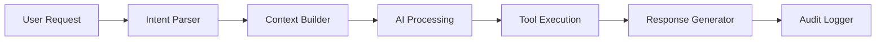

# ScrollIntel™ v4.0+ Design Document (ScrollSanctified HyperSovereign Edition™)

## Overview

ScrollIntel™ v4.0+ is the world's most advanced sovereign AI-CTO replacement platform, architected as a multi-agent platform that surpasses DataRobot, H2O.ai, Kiro, GPT-4o, Vertex AI, Claude, and all known AI platforms. The system follows a production-grade microservices architecture with advanced intelligence layers, explainable AI engines, federated learning capabilities, multimodal processing, ethical AI frameworks, XR visualization, mobile/edge deployment, scientific AI workflows, and complete monetization infrastructure.

The core philosophy is "scroll-sanctified sovereign AI intelligence" - each agent operates autonomously within its domain while maintaining coordination through a central registry, shared data layer, advanced cognitive core that simulates AGI reasoning, comprehensive audit trails, and ScrollCoin + fiat billing infrastructure for complete CTO replacement capabilities.

## Architecture

### High-Level Architecture v2.0+

```mermaid
graph TB
    subgraph "Frontend Layer - UI Components (15+)"
        UI[Vite + React + Tailwind + ShadCN UI]
        Dashboard[ScrollPulse Dashboards]
        MultimodalChat[MultimodalChat - Text/Audio/Image/Video]
        PromptLab[PromptLab - A/B Testing & Optimization]
        ExplainDash[ExplainabilityDashboard - SHAP/LIME Viz]
        DriftUI[DriftMonitorUI - Performance Trends]
        VaultViewer[VaultViewer - Encrypted Insight Browsing]
        AutoReportBuilder[AutoReportBuilder - Scheduled Reports]
        ScrollCoinWallet[ScrollCoinWalletUI - Digital Transactions]
        APIHub[ScrollAPIHub - Key Management & Docs]
        EthicsLog[EthicsComplianceLog - Audit Trails]
        MobileExporter[MobileModelExporter - Edge Optimization]
        FineTuneUI[FineTuneUI - LoRA Configuration]
        XRVisualizer[XRDataVisualizer - Immersive Experiences]
        BillingDash[BillingDashboard - Usage & Payments]
        NarrativeComposer[NarrativeComposerUI - Data Stories]
        SecureShareUI[SecureReportLinkUI - Encrypted Sharing]
    end
    
    subgraph "API Gateway"
        Gateway[FastAPI Gateway + EXOUSIA Auth]
        Router[Intelligent Agent Router]
        Middleware[Security + Audit Middleware]
    end
    
    subgraph "Core Agent Layer"
        CTO[ScrollCTO]
        DS[ScrollDataScientist]
        MLE[ScrollMLEngineer]
        AIE[ScrollAIEngineer - Memory Enhanced]
        Analyst[ScrollAnalyst]
        BI[ScrollBI]
    end
    
    subgraph "Advanced Agent Layer - Autonomous Agents (20+)"
        AutoDev[ScrollAutoDev - Prompt Engineering]
        RL[ScrollRLAgent - Reinforcement Learning]
        Ethics[EthicsAgent - Bias Detection]
        Multimodal[MultimodalAgent - Audio/Image/Text]
        Scientific[ScrollScientificAgent - Bio/Legal/Scientific AI]
        EdgeDeploy[ScrollEdgeDeployAgent - Mobile/Edge Deployment]
        Compliance[ScrollComplianceAgent - GDPR/SOC2 Auditing]
        Narrative[ScrollNarrativeAgent - Insight Storytelling]
        Studio[ScrollStudioAgent - AI-Powered IDE]
        Drift[ScrollDriftAgent - Model Drift Detection]
        ModelTuner[ScrollModelTuner - Hyperparameter Optimization]
        Search[ScrollSearchAgent - Semantic Neural Search]
        Mobile[ScrollMobileAgent - Mobile Optimization]
        Legal[ScrollLegalAgent - Legal Analysis]
        Security[ScrollSecurityAgent - Security Auditing]
        APIManager[ScrollAPIManager - API Lifecycle]
    end
    
    subgraph "Intelligence Engines - Core Engines (15+)"
        Registry[Agent Registry]
        Orchestrator[Task Orchestrator]
        AutoModel[AutoModel Engine]
        QA[ScrollQA Engine]
        Viz[ScrollViz Engine]
        Forecast[ScrollForecast Engine]
        XAI[ExplainXEngine - SHAP/LIME]
        Federated[FederatedEngine - PySyft/TFF]
        Vault[ScrollVaultEngine - Secure Storage]
        Reports[ReportBuilderEngine - PDF/Word/LaTeX]
        Cognitive[CognitiveCore - AGI Simulator]
        LoRAStudio[ScrollLoRAFineTuneStudio - Low-Rank Adaptation]
        SearchAI[ScrollSearchAI - Semantic Neural Search]
        XRStudio[ScrollXRStudio - Immersive Data Visualization]
        Billing[ScrollBillingEngine - ScrollCoin + Fiat]
        SecureShare[ScrollSecureShareEngine - Encrypted Link Sharing]
        NarrativeBuilder[ScrollNarrativeBuilder - Story Generation]
        Fire[ScrollFireAgent - High-Performance Computing]
        Chronos[ScrollChronosAgent - Time-Series Analysis]
        EthicsEngine[EthicsEngine - AI Ethics Framework]
        MultimodalEngine[MultimodalEngine - Cross-Modal Processing]
        ModelZoo[ScrollModelZooEngine - Model Management]
        DriftMonitor[ScrollDriftMonitor - Performance Monitoring]
        MobileEdgeAI[ScrollMobileEdgeAI - Edge Optimization]
        ScientificEngine[ScrollScientificEngine - Domain-Specific AI]
    end
    
    subgraph "Data Layer"
        Postgres[(PostgreSQL)]
        Vector[(Pinecone/Supabase Vector)]
        Cache[(Redis Cache)]
        Files[Encrypted File Storage]
        Audit[(Audit Database)]
        Memory[(Long-term Memory Store)]
    end
    
    subgraph "External AI Services"
        OpenAI[GPT-4/ChatGPT]
        Claude[Anthropic Claude 3]
        Whisper[OpenAI Whisper]
        HuggingFace[HuggingFace Transformers]
        EdgeDevices[Federated Edge Devices]
    end
    
    subgraph "Monitoring & Security"
        PostHog[PostHog Analytics]
        Sentry[Sentry Error Tracking]
        Prometheus[Prometheus Metrics]
        EXOUSIA[EXOUSIA Security Framework]
    end
    
    UI --> Gateway
    Dashboard --> Gateway
    Chat --> Gateway
    PromptOpt --> Gateway
    VaultView --> Gateway
    ExplainUI --> Gateway
    
    Gateway --> Middleware
    Middleware --> Router
    
    Router --> CTO
    Router --> DS
    Router --> MLE
    Router --> AIE
    Router --> Analyst
    Router --> BI
    Router --> AutoDev
    Router --> RL
    Router --> Ethics
    Router --> Multimodal
    
    CTO --> Registry
    DS --> AutoModel
    MLE --> AutoModel
    AIE --> QA
    Analyst --> Viz
    BI --> Forecast
    AutoDev --> XAI
    RL --> Federated
    Ethics --> Vault
    Multimodal --> Reports
    
    Registry --> Orchestrator
    Orchestrator --> Cognitive
    
    AutoModel --> Postgres
    QA --> Vector
    Viz --> Cache
    Forecast --> Files
    XAI --> Audit
    Federated --> Memory
    Vault --> Files
    Reports --> Files
    Cognitive --> Memory
    
    Orchestrator --> OpenAI
    Orchestrator --> Claude
    Orchestrator --> Whisper
    Orchestrator --> HuggingFace
    Federated --> EdgeDevices
    
    EXOUSIA --> Audit
    PostHog --> Cache
    Sentry --> Audit
    Prometheus --> Cache
```



### Agent Architecture Pattern

Each ScrollIntel agent follows a consistent architecture:



## Components and Interfaces

### 1. Agent Registry System

**Purpose**: Central coordination and discovery of all AI agents

**Key Components**:
- `AgentRegistry`: Maintains active agent instances and capabilities
- `AgentProxy`: Handles inter-agent communication
- `CapabilityMatcher`: Routes requests to appropriate agents

**Interface**:
```python
class AgentRegistry:
    def register_agent(self, agent: BaseAgent) -> str
    def get_agent(self, agent_id: str) -> BaseAgent
    def route_request(self, request: AgentRequest) -> AgentResponse
    def get_capabilities(self) -> List[AgentCapability]
```

### 2. Core AI Agents

#### ScrollCTOAgent
- **Responsibilities**: Technical architecture, stack decisions, scaling strategy
- **AI Model**: GPT-4 with technical knowledge base
- **Tools**: Architecture templates, technology comparisons, cost analysis

#### ScrollDataScientist
- **Responsibilities**: EDA, hypothesis testing, statistical modeling
- **AI Model**: Claude 3 + specialized data science prompts
- **Tools**: Pandas, NumPy, SciPy, Statsmodels integration

#### ScrollMLEngineer
- **Responsibilities**: ML pipeline setup, model training/deployment
- **AI Model**: GPT-4 with MLOps knowledge
- **Tools**: Scikit-learn, XGBoost, TensorFlow, PyTorch, MLflow

#### ScrollAIEngineer (Memory-Enhanced)
- **Responsibilities**: LLM integration, RAG, embeddings, vector operations, long-term memory
- **AI Model**: GPT-4 + Claude 3 hybrid with memory persistence
- **Tools**: LangChain, vector databases, embedding models, memory chains

#### ScrollAnalyst
- **Responsibilities**: SQL queries, KPI generation, business insights
- **AI Model**: GPT-4 with business intelligence training
- **Tools**: SQL generation, pandas, business metrics libraries

#### ScrollBI
- **Responsibilities**: Dashboard creation, visualization, alerts
- **AI Model**: GPT-4 with visualization expertise
- **Tools**: Recharts, Plotly, Vega-Lite, D3.js

### 3. Advanced AI Agents (New in v2.0+)

#### ScrollAutoDev (Prompt Engineering Agent)
- **Responsibilities**: Prompt optimization, testing, and explanation
- **AI Model**: GPT-4 with prompt engineering expertise
- **Tools**: A/B testing framework, prompt templates, performance metrics

#### ScrollRLAgent (Reinforcement Learning)
- **Responsibilities**: RL model training, policy optimization, environment simulation
- **AI Model**: Custom RL algorithms with GPT-4 guidance
- **Tools**: Q-Learning, A2C, OpenAI Gym, multi-agent scenarios

#### EthicsAgent (Bias Detection & AI Ethics)
- **Responsibilities**: Fairness auditing, bias detection, ethical AI compliance
- **AI Model**: Specialized fairness models with GPT-4 analysis
- **Tools**: Fairness metrics, bias detection algorithms, compliance frameworks

#### MultimodalAgent (Audio/Image/Text Processing)
- **Responsibilities**: Cross-modal analysis, multimedia processing, fusion pipelines
- **AI Model**: Multimodal transformers with GPT-4 coordination
- **Tools**: Computer vision, speech processing, OCR, cross-modal embeddings

#### ScrollScientificAgent (Scientific AI Workflows)
- **Responsibilities**: Bioinformatics, legal analysis, scientific research automation
- **AI Model**: Domain-specific scientific models with GPT-4 integration
- **Tools**: BioPython, legal NLP, scientific paper analysis, research automation

#### ScrollEdgeDeployAgent (Mobile/Edge Deployment)
- **Responsibilities**: Model optimization for mobile and edge devices
- **AI Model**: Model compression and quantization expertise
- **Tools**: TensorFlow Lite, ONNX, CoreML, mobile SDK generation

#### ScrollComplianceAgent (Regulatory Compliance)
- **Responsibilities**: GDPR, SOC2, ISO compliance auditing and reporting
- **AI Model**: Compliance-focused analysis with regulatory knowledge
- **Tools**: Compliance frameworks, audit trail generation, risk assessment

#### ScrollNarrativeAgent (Insight Storytelling)
- **Responsibilities**: Data storytelling, policy briefs, executive narratives
- **AI Model**: Narrative generation with business context understanding
- **Tools**: Story templates, presentation generation, stakeholder communication

#### ScrollStudioAgent (AI-Powered IDE)
- **Responsibilities**: Intelligent code generation, debugging, architecture guidance
- **AI Model**: Code-specialized models with development best practices
- **Tools**: Code completion, bug detection, documentation generation, architecture recommendations

### 4. Core Processing Engines

#### AutoModel Engine
- **Purpose**: Automated ML model training and comparison
- **Features**:
  - Multi-algorithm testing (Random Forest, XGBoost, Neural Networks)
  - Automated hyperparameter tuning
  - Cross-validation and performance metrics
  - Model export and API generation

#### ScrollQA Engine
- **Purpose**: Natural language querying of all data sources
- **Features**:
  - SQL generation from natural language
  - Vector similarity search
  - Context-aware responses
  - Multi-source data integration

#### ScrollViz Engine
- **Purpose**: Automated visualization generation
- **Features**:
  - Chart type recommendation
  - Interactive dashboard creation
  - Real-time data binding
  - Export capabilities (PNG, SVG, PDF)

#### ScrollForecast Engine
- **Purpose**: Time series forecasting and prediction
- **Features**:
  - Multiple forecasting models (Prophet, ARIMA, LSTM)
  - Seasonal decomposition
  - Confidence intervals
  - Automated model selection

### 5. Advanced Intelligence Engines (New in v2.0+)

#### ExplainXEngine (Explainable AI)
- **Purpose**: Model interpretability and explanation generation
- **Features**:
  - SHAP (SHapley Additive exPlanations) integration
  - LIME (Local Interpretable Model-agnostic Explanations)
  - Attention visualization for transformers
  - Feature importance analysis
  - Counterfactual explanations

#### EthicsEngine (AI Ethics & Bias Detection)
- **Purpose**: Fairness auditing and ethical AI compliance
- **Features**:
  - Bias detection across protected attributes
  - Fairness metrics (demographic parity, equalized odds)
  - AI transparency reporting
  - Regulatory compliance checking
  - Ethical decision frameworks

#### FederatedEngine (Federated Learning)
- **Purpose**: Distributed learning across edge devices
- **Features**:
  - PySyft integration for privacy-preserving ML
  - TensorFlow Federated (TFF) support
  - Differential privacy mechanisms
  - Secure aggregation protocols
  - Edge device simulation

#### MultimodalEngine (Cross-Modal Intelligence)
- **Purpose**: Audio, image, and text fusion processing
- **Features**:
  - Cross-modal embeddings and alignment
  - Audio processing (speech-to-text, audio analysis)
  - Computer vision (object detection, OCR)
  - Text-image-audio fusion pipelines
  - Multimodal transformer integration

#### ScrollVaultEngine (Secure Insight Storage)
- **Purpose**: Encrypted storage and retrieval of AI insights
- **Features**:
  - End-to-end encryption for sensitive insights
  - Version control and change tracking
  - Semantic search across stored insights
  - Access control and audit trails
  - Data retention policy enforcement

#### ReportBuilderEngine (Automated Report Generation)
- **Purpose**: Comprehensive report creation in multiple formats
- **Features**:
  - PDF, Word, and LaTeX report generation
  - Executive summary creation
  - Custom branding and templates
  - Scheduled report delivery
  - Interactive report elements

#### CognitiveCore (AGI Simulator)
- **Purpose**: Simulated AGI reasoning for strategic planning
- **Features**:
  - Multi-step reasoning chains
  - Strategic planning and decision trees
  - Cross-domain knowledge integration
  - Long-term memory and context retention
  - Meta-cognitive awareness and self-reflection

#### ScrollLoRAFineTuneStudio (Low-Rank Adaptation)
- **Purpose**: Efficient fine-tuning of large language models
- **Features**:
  - GUI-based LoRA configuration
  - Parameter-efficient fine-tuning
  - Experiment tracking and comparison
  - Automated hyperparameter optimization
  - Model deployment integration

#### ScrollSearchAI (Semantic Neural Search)
- **Purpose**: Advanced semantic and hybrid neural search
- **Features**:
  - Multimodal search across text, images, audio, video
  - Contextual and graph-based search
  - Real-time indexing and retrieval
  - Semantic similarity scoring
  - Knowledge graph integration

#### ScrollXRStudio (Immersive Data Visualization)
- **Purpose**: XR-based data storytelling and visualization
- **Features**:
  - 3D spatial data visualization
  - Multi-user collaborative XR sessions
  - WebXR and Unity integration
  - Immersive analytics experiences
  - XR presentation export

#### ScrollSecureShareEngine (Encrypted Link Sharing)
- **Purpose**: Secure sharing of reports and insights
- **Features**:
  - Encrypted sharing links with expiration
  - Role-based access control
  - Audit trails for shared content
  - Time-limited access management
  - Revocation capabilities

#### ScrollNarrativeBuilder (Story Generation)
- **Purpose**: Automated narrative and presentation generation
- **Features**:
  - Data-driven story creation
  - Executive summary generation
  - Slide deck and presentation creation
  - Policy brief generation
  - Stakeholder-specific narratives

### 4. EXOUSIA Security System

**Purpose**: Role-based access control and audit logging

**Components**:
- `RoleManager`: Defines and manages user roles
- `PermissionEngine`: Enforces access controls
- `AuditLogger`: Tracks all system operations
- `SessionManager`: Handles JWT authentication

**Security Levels**:
- **Admin**: Full system access
- **Analyst**: Data analysis and visualization
- **Viewer**: Read-only dashboard access
- **API**: Programmatic access with rate limiting

## Data Models

### Core Entities

```python
# Agent Models
class Agent:
    id: str
    name: str
    type: AgentType
    capabilities: List[str]
    status: AgentStatus
    created_at: datetime
    updated_at: datetime

class AgentRequest:
    id: str
    user_id: str
    agent_id: str
    prompt: str
    context: Dict[str, Any]
    priority: int
    created_at: datetime

class AgentResponse:
    id: str
    request_id: str
    content: str
    artifacts: List[str]
    execution_time: float
    status: ResponseStatus

# Data Models
class Dataset:
    id: str
    name: str
    source_type: str
    schema: Dict[str, str]
    row_count: int
    file_path: Optional[str]
    connection_string: Optional[str]
    created_at: datetime

class MLModel:
    id: str
    name: str
    algorithm: str
    dataset_id: str
    parameters: Dict[str, Any]
    metrics: Dict[str, float]
    model_path: str
    api_endpoint: Optional[str]
    created_at: datetime

class Dashboard:
    id: str
    name: str
    user_id: str
    config: Dict[str, Any]
    charts: List[Dict[str, Any]]
    refresh_interval: int
    is_public: bool
    created_at: datetime

# Security Models
class User:
    id: str
    email: str
    role: UserRole
    permissions: List[str]
    last_login: datetime
    created_at: datetime

class AuditLog:
    id: str
    user_id: str
    action: str
    resource_type: str
    resource_id: str
    details: Dict[str, Any]
    ip_address: str
    timestamp: datetime
```

### Database Schema Design v2.0+

**PostgreSQL Tables (30+ Models)**:
- `users` - User accounts and authentication (Users model)
- `projects` - Project workspaces and permissions (Projects model)
- `agents` - Agent registry and metadata (Agents model)
- `reports` - Generated report metadata and storage (Reports model)
- `vault_insights` - Encrypted insight storage with versioning (VaultInsights model)
- `training_jobs` - ML training experiments and tracking (TrainingJobs model)
- `prompt_runs` - Prompt optimization and testing history (PromptRuns model)
- `federated_clients` - Federated learning edge device management (FederatedClients model)
- `fine_tune_sessions` - LoRA fine-tuning experiments (FineTuneSessions model)
- `scroll_coin_wallet` - ScrollCoin digital asset management (ScrollCoinWallet model)
- `scroll_billing_records` - ScrollCoin and fiat transactions (ScrollBillingRecords model)
- `scroll_audit_logs` - ScrollSanctified compliance audit trails (ScrollAuditLogs model)
- `model_comparisons` - Model performance benchmarks (ModelComparisons model)
- `lora_experiments` - LoRA fine-tuning experiments and results (LoRAExperiments model)
- `scroll_narratives` - Generated narratives and stories (ScrollNarratives model)
- `scroll_xr_assets` - XR visualization assets and configurations (ScrollXRAssets model)
- `datasets` - Data source information and metadata
- `ml_models` - Trained model metadata and artifacts
- `dashboards` - Dashboard configurations and layouts
- `agent_requests` - Request history and tracking
- `agent_responses` - Response history and artifacts
- `audit_logs` - Security and operation logs
- `explanations` - Model explanations and interpretability data
- `federated_models` - Federated learning model metadata
- `multimodal_assets` - Audio, image, and text asset storage
- `memory_chains` - Long-term memory and conversation history
- `ethics_audits` - Bias detection and fairness audit results
- `scroll_api_keys` - API key management and usage tracking
- `compliance_reports` - Regulatory compliance audit reports
- `secure_shares` - Encrypted sharing links and access logs
- `edge_deployments` - Mobile and edge model deployments
- `scientific_workflows` - Scientific AI workflow configurations
- `xr_sessions` - XR collaboration session data
- `drift_monitoring` - Model drift detection and alerts
- `search_indices` - Semantic search indexing and metadata
- `billing_analytics` - Usage analytics and cost optimization
- `narrative_templates` - Story generation templates and frameworks

**Vector Database (Pinecone/Supabase)**:
- Document embeddings for RAG
- Dataset schema embeddings
- Query similarity matching
- Knowledge base vectors
- Cross-modal embeddings (text-image-audio)
- Insight semantic embeddings for vault search
- Memory embeddings for long-term context

**Redis Cache**:
- Session storage
- Frequently accessed data
- Real-time dashboard data
- Agent state management
- Prompt optimization cache
- Multimodal processing cache
- Federated learning coordination

**Encrypted File Storage**:
- Model artifacts and checkpoints
- Generated reports (PDF, Word, LaTeX)
- Multimodal assets (audio, images, videos)
- Vault insights with end-to-end encryption
- Backup and versioning data

## Error Handling

### Error Categories

1. **Agent Errors**
   - Agent unavailable
   - Processing timeout
   - Invalid input format
   - Resource exhaustion

2. **Data Errors**
   - File format not supported
   - Data quality issues
   - Schema mismatch
   - Connection failures

3. **AI Service Errors**
   - API rate limits
   - Model unavailable
   - Token limits exceeded
   - Invalid responses

4. **Security Errors**
   - Authentication failure
   - Permission denied
   - Session expired
   - Suspicious activity

### Error Handling Strategy

```python
class ScrollIntelError(Exception):
    def __init__(self, message: str, error_code: str, details: Dict = None):
        self.message = message
        self.error_code = error_code
        self.details = details or {}
        super().__init__(self.message)

class ErrorHandler:
    def handle_agent_error(self, error: Exception) -> AgentResponse
    def handle_data_error(self, error: Exception) -> DataResponse
    def handle_ai_service_error(self, error: Exception) -> AIResponse
    def handle_security_error(self, error: Exception) -> SecurityResponse
```

**Recovery Mechanisms**:
- Automatic retry with exponential backoff
- Fallback to alternative AI models
- Graceful degradation of features
- User notification with actionable guidance

## Testing Strategy

### Unit Testing
- Individual agent functionality
- Core engine components
- Data model validation
- Security permission checks

### Integration Testing
- Agent-to-agent communication
- Database operations
- External AI service integration
- File upload and processing

### End-to-End Testing
- Complete user workflows
- Dashboard generation
- ML model training pipelines
- Multi-agent collaboration scenarios

### Performance Testing
- Concurrent user load
- Large dataset processing
- Real-time dashboard updates
- Memory and CPU usage optimization

### Security Testing
- Authentication and authorization
- Input validation and sanitization
- SQL injection prevention
- Rate limiting effectiveness

### Test Framework Structure

```python
# Test Categories
tests/
├── unit/
│   ├── agents/
│   ├── engines/
│   ├── models/
│   └── security/
├── integration/
│   ├── agent_communication/
│   ├── database/
│   ├── ai_services/
│   └── file_processing/
├── e2e/
│   ├── user_workflows/
│   ├── dashboard_creation/
│   ├── ml_pipelines/
│   └── multi_agent_scenarios/
├── performance/
│   ├── load_testing/
│   ├── stress_testing/
│   └── scalability/
└── security/
    ├── auth_testing/
    ├── permission_testing/
    └── vulnerability_scanning/
```

**Testing Tools**:
- **Unit**: pytest, unittest.mock
- **Integration**: pytest-asyncio, testcontainers
- **E2E**: Playwright, Selenium
- **Performance**: locust, pytest-benchmark
- **Security**: bandit, safety, OWASP ZAP
- **AI/ML**: pytest-ml, model validation frameworks
- **Multimodal**: audio/image processing test suites
- **Federated**: PySyft testing, edge simulation
- **Ethics**: fairness testing, bias detection validation

## Deployment Strategy v2.0+

### Technology Stack v4.0+ (ScrollSanctified HyperSovereign Edition™)
- **Frontend**: React + Tailwind + Vite (modern, responsive UI)
- **Backend**: FastAPI + Celery (high-performance API and background processing)
- **Database**: PostgreSQL + Redis (data persistence and caching)
- **DevOps**: Docker + GitHub Actions + Kubernetes (containerized deployment)
- **Monitoring**: Grafana + Prometheus + Sentry + PostHog (comprehensive observability)
- **Auth**: EXOUSIA roles + OAuth2 + JWT (enterprise security)
- **Integrations**: OpenAI, Anthropic, Pinecone, HuggingFace, Stripe, Supabase (best-in-class services)
- **Mobile SDK**: Flutter + Expo (cross-platform mobile development)
- **XR**: WebXR / Unity streaming (immersive data visualization)
- **Compliance**: ScrollSanctified Audit Trail + GDPR/ISO Export (regulatory adherence)
- **AI Models**: GPT-4, Claude 3, Whisper, HuggingFace Transformers, Custom Scientific Models
- **Vector Stores**: Pinecone/Weaviate/Qdrant for semantic search and RAG
- **Billing**: Stripe + ScrollCoin + Usage-based API monetization
- **Security**: ScrollArmor + Comprehensive AuditLogs + End-to-end encryption

### Infrastructure Components
- **Container Orchestration**: Docker + Kubernetes
- **Load Balancing**: NGINX + HAProxy
- **Database**: PostgreSQL with read replicas
- **Vector Store**: Pinecone/Supabase Vector
- **Cache**: Redis Cluster
- **File Storage**: AWS S3/MinIO with encryption
- **Monitoring**: Prometheus + Grafana + AlertManager
- **Security**: Vault for secrets, WAF for protection

### Scaling Strategy
- **Horizontal Scaling**: Kubernetes auto-scaling for agents
- **Database Scaling**: Read replicas and connection pooling
- **Cache Scaling**: Redis Cluster with sharding
- **AI Model Scaling**: Model serving with GPU clusters
- **Edge Computing**: Federated learning edge deployment
- **CDN**: Global content delivery for static assets

### Security Framework
- **Authentication**: Multi-factor JWT with refresh tokens
- **Authorization**: RBAC with fine-grained permissions
- **Encryption**: End-to-end encryption for sensitive data
- **Audit**: Comprehensive logging with tamper-proof storage
- **Compliance**: GDPR, HIPAA, SOX compliance frameworks
- **Monitoring**: Real-time security event detection