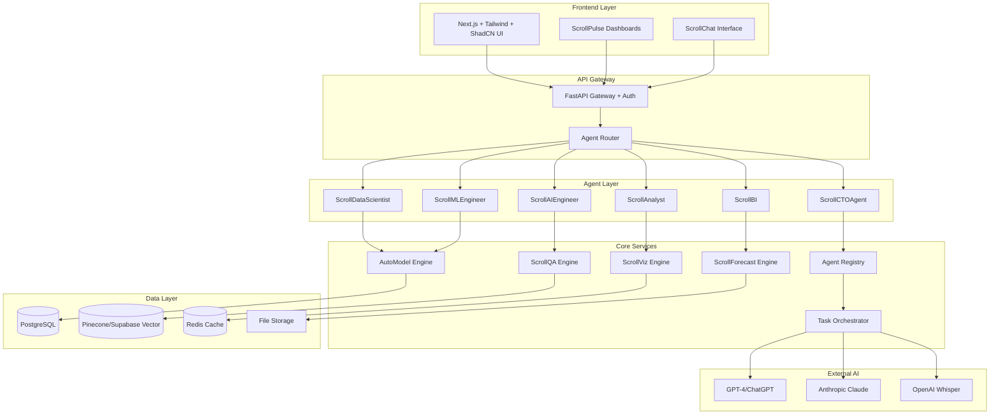
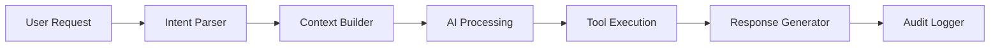

# ScrollIntel™ Design Document

## Overview

ScrollIntel™ is a comprehensive AI system architected as a multi-agent platform that replaces traditional data/AI teams through autonomous, specialized AI agents. The system follows a microservices architecture with a central orchestration layer, secure role-based access control (EXOUSIA), and real-time data processing capabilities.

The core philosophy is "sovereign AI intelligence" - each agent operates autonomously within its domain while maintaining coordination through a central registry and shared data layer.

## Architecture

### High-Level Architecture



### Agent Architecture Pattern

Each ScrollIntel agent follows a consistent architecture:



## Components and Interfaces

### 1. Agent Registry System

**Purpose**: Central coordination and discovery of all AI agents

**Key Components**:
- `AgentRegistry`: Maintains active agent instances and capabilities
- `AgentProxy`: Handles inter-agent communication
- `CapabilityMatcher`: Routes requests to appropriate agents

**Interface**:
```python
class AgentRegistry:
    def register_agent(self, agent: BaseAgent) -> str
    def get_agent(self, agent_id: str) -> BaseAgent
    def route_request(self, request: AgentRequest) -> AgentResponse
    def get_capabilities(self) -> List[AgentCapability]
```

### 2. Core AI Agents

#### ScrollCTOAgent
- **Responsibilities**: Technical architecture, stack decisions, scaling strategy
- **AI Model**: GPT-4 with technical knowledge base
- **Tools**: Architecture templates, technology comparisons, cost analysis

#### ScrollDataScientist
- **Responsibilities**: EDA, hypothesis testing, statistical modeling
- **AI Model**: Claude + specialized data science prompts
- **Tools**: Pandas, NumPy, SciPy, Statsmodels integration

#### ScrollMLEngineer
- **Responsibilities**: ML pipeline setup, model training/deployment
- **AI Model**: GPT-4 with MLOps knowledge
- **Tools**: Scikit-learn, XGBoost, TensorFlow, PyTorch, MLflow

#### ScrollAIEngineer
- **Responsibilities**: LLM integration, RAG, embeddings, vector operations
- **AI Model**: GPT-4 + Claude hybrid
- **Tools**: LangChain, vector databases, embedding models

#### ScrollAnalyst
- **Responsibilities**: SQL queries, KPI generation, business insights
- **AI Model**: GPT-4 with business intelligence training
- **Tools**: SQL generation, pandas, business metrics libraries

#### ScrollBI
- **Responsibilities**: Dashboard creation, visualization, alerts
- **AI Model**: GPT-4 with visualization expertise
- **Tools**: Recharts, Plotly, Vega-Lite, D3.js

### 3. Core Processing Engines

#### AutoModel Engine
- **Purpose**: Automated ML model training and comparison
- **Features**:
  - Multi-algorithm testing (Random Forest, XGBoost, Neural Networks)
  - Automated hyperparameter tuning
  - Cross-validation and performance metrics
  - Model export and API generation

#### ScrollQA Engine
- **Purpose**: Natural language querying of all data sources
- **Features**:
  - SQL generation from natural language
  - Vector similarity search
  - Context-aware responses
  - Multi-source data integration

#### ScrollViz Engine
- **Purpose**: Automated visualization generation
- **Features**:
  - Chart type recommendation
  - Interactive dashboard creation
  - Real-time data binding
  - Export capabilities (PNG, SVG, PDF)

#### ScrollForecast Engine
- **Purpose**: Time series forecasting and prediction
- **Features**:
  - Multiple forecasting models (Prophet, ARIMA, LSTM)
  - Seasonal decomposition
  - Confidence intervals
  - Automated model selection

### 4. EXOUSIA Security System

**Purpose**: Role-based access control and audit logging

**Components**:
- `RoleManager`: Defines and manages user roles
- `PermissionEngine`: Enforces access controls
- `AuditLogger`: Tracks all system operations
- `SessionManager`: Handles JWT authentication

**Security Levels**:
- **Admin**: Full system access
- **Analyst**: Data analysis and visualization
- **Viewer**: Read-only dashboard access
- **API**: Programmatic access with rate limiting

## Data Models

### Core Entities

```python
# Agent Models
class Agent:
    id: str
    name: str
    type: AgentType
    capabilities: List[str]
    status: AgentStatus
    created_at: datetime
    updated_at: datetime

class AgentRequest:
    id: str
    user_id: str
    agent_id: str
    prompt: str
    context: Dict[str, Any]
    priority: int
    created_at: datetime

class AgentResponse:
    id: str
    request_id: str
    content: str
    artifacts: List[str]
    execution_time: float
    status: ResponseStatus

# Data Models
class Dataset:
    id: str
    name: str
    source_type: str
    schema: Dict[str, str]
    row_count: int
    file_path: Optional[str]
    connection_string: Optional[str]
    created_at: datetime

class MLModel:
    id: str
    name: str
    algorithm: str
    dataset_id: str
    parameters: Dict[str, Any]
    metrics: Dict[str, float]
    model_path: str
    api_endpoint: Optional[str]
    created_at: datetime

class Dashboard:
    id: str
    name: str
    user_id: str
    config: Dict[str, Any]
    charts: List[Dict[str, Any]]
    refresh_interval: int
    is_public: bool
    created_at: datetime

# Security Models
class User:
    id: str
    email: str
    role: UserRole
    permissions: List[str]
    last_login: datetime
    created_at: datetime

class AuditLog:
    id: str
    user_id: str
    action: str
    resource_type: str
    resource_id: str
    details: Dict[str, Any]
    ip_address: str
    timestamp: datetime
```

### Database Schema Design

**PostgreSQL Tables**:
- `users` - User accounts and authentication
- `agents` - Agent registry and metadata
- `datasets` - Data source information
- `ml_models` - Trained model metadata
- `dashboards` - Dashboard configurations
- `agent_requests` - Request history
- `agent_responses` - Response history
- `audit_logs` - Security and operation logs

**Vector Database (Pinecone/Supabase)**:
- Document embeddings for RAG
- Dataset schema embeddings
- Query similarity matching
- Knowledge base vectors

**Redis Cache**:
- Session storage
- Frequently accessed data
- Real-time dashboard data
- Agent state management

## Error Handling

### Error Categories

1. **Agent Errors**
   - Agent unavailable
   - Processing timeout
   - Invalid input format
   - Resource exhaustion

2. **Data Errors**
   - File format not supported
   - Data quality issues
   - Schema mismatch
   - Connection failures

3. **AI Service Errors**
   - API rate limits
   - Model unavailable
   - Token limits exceeded
   - Invalid responses

4. **Security Errors**
   - Authentication failure
   - Permission denied
   - Session expired
   - Suspicious activity

### Error Handling Strategy

```python
class ScrollIntelError(Exception):
    def __init__(self, message: str, error_code: str, details: Dict = None):
        self.message = message
        self.error_code = error_code
        self.details = details or {}
        super().__init__(self.message)

class ErrorHandler:
    def handle_agent_error(self, error: Exception) -> AgentResponse
    def handle_data_error(self, error: Exception) -> DataResponse
    def handle_ai_service_error(self, error: Exception) -> AIResponse
    def handle_security_error(self, error: Exception) -> SecurityResponse
```

**Recovery Mechanisms**:
- Automatic retry with exponential backoff
- Fallback to alternative AI models
- Graceful degradation of features
- User notification with actionable guidance

## Testing Strategy

### Unit Testing
- Individual agent functionality
- Core engine components
- Data model validation
- Security permission checks

### Integration Testing
- Agent-to-agent communication
- Database operations
- External AI service integration
- File upload and processing

### End-to-End Testing
- Complete user workflows
- Dashboard generation
- ML model training pipelines
- Multi-agent collaboration scenarios

### Performance Testing
- Concurrent user load
- Large dataset processing
- Real-time dashboard updates
- Memory and CPU usage optimization

### Security Testing
- Authentication and authorization
- Input validation and sanitization
- SQL injection prevention
- Rate limiting effectiveness

### Test Framework Structure

```python
# Test Categories
tests/
├── unit/
│   ├── agents/
│   ├── engines/
│   ├── models/
│   └── security/
├── integration/
│   ├── agent_communication/
│   ├── database/
│   ├── ai_services/
│   └── file_processing/
├── e2e/
│   ├── user_workflows/
│   ├── dashboard_creation/
│   ├── ml_pipelines/
│   └── multi_agent_scenarios/
├── performance/
│   ├── load_testing/
│   ├── stress_testing/
│   └── scalability/
└── security/
    ├── auth_testing/
    ├── permission_testing/
    └── vulnerability_scanning/
```

**Testing Tools**:
- **Unit**: pytest, unittest.mock
- **Integration**: pytest-asyncio, testcontainers
- **E2E**: Playwright, Selenium
- **Performance**: locust, pytest-benchmark
- **Security**: bandit, safety, OWASP ZAP