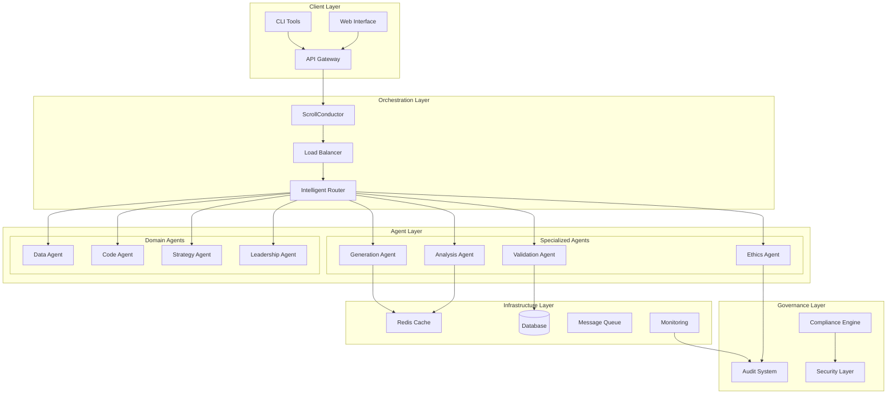

# Design Document

## Overview

This design transforms ScrollIntel into a production-ready, enterprise-grade AI platform through systematic architectural improvements. The design implements industry best practices including microservices architecture, intelligent orchestration, comprehensive monitoring, and responsible AI governance to create a scalable, maintainable, and reliable system.

## Architecture

### High-Level Architecture



### Component Architecture

The system follows a layered microservices architecture with clear separation of concerns:

1. **Client Layer**: User interfaces and API access points
2. **Orchestration Layer**: Request routing and workflow management
3. **Agent Layer**: Specialized processing units with narrow responsibilities
4. **Infrastructure Layer**: Shared services and data storage
5. **Governance Layer**: Security, compliance, and audit capabilities

## Components and Interfaces

### ScrollConductor (Master Orchestrator)

**Purpose**: Central orchestration engine that manages complex workflows and coordinates sub-agents.

**Key Features**:
- Workflow definition and execution
- Sub-agent lifecycle management
- Error handling and recovery
- Result aggregation
- Performance monitoring

**Interface**:
```typescript
interface ScrollConductor {
  executeWorkflow(workflow: WorkflowDefinition): Promise<WorkflowResult>
  registerAgent(agent: AgentDefinition): Promise<void>
  monitorExecution(workflowId: string): Promise<ExecutionStatus>
  handleFailure(error: WorkflowError): Promise<RecoveryAction>
}

interface WorkflowDefinition {
  id: string
  steps: WorkflowStep[]
  errorHandling: ErrorPolicy
  timeout: number
  retryPolicy: RetryPolicy
}

interface WorkflowResult {
  id: string
  status: 'success' | 'failure' | 'partial'
  results: Record<string, any>
  metrics: ExecutionMetrics
  trace: ExecutionTrace[]
}
```

### Intelligent Load Balancer

**Purpose**: Routes requests to optimal agents based on capabilities, performance, and current load.

**Key Features**:
- Multi-factor routing decisions
- Real-time performance monitoring
- Automatic failover
- Capacity-based scaling
- Request queuing and prioritization

**Interface**:
```typescript
interface IntelligentLoadBalancer {
  routeRequest(request: AgentRequest): Promise<AgentAssignment>
  updateAgentMetrics(agentId: string, metrics: AgentMetrics): void
  getAvailableAgents(capabilities: string[]): Promise<Agent[]>
  handleAgentFailure(agentId: string): Promise<void>
}

interface AgentRequest {
  id: string
  type: string
  capabilities: string[]
  priority: number
  payload: any
  timeout: number
}

interface AgentAssignment {
  agentId: string
  estimatedDuration: number
  queuePosition?: number
  alternativeAgents: string[]
}
```

### Specialized Agent Framework

**Purpose**: Base framework for creating focused, single-responsibility agents.

**Key Features**:
- Standardized agent interface
- Schema validation
- Performance monitoring
- Health checking
- Graceful degradation

**Interface**:
```typescript
interface SpecializedAgent {
  id: string
  capabilities: string[]
  schema: JSONSchema
  
  process(request: AgentRequest): Promise<AgentResponse>
  healthCheck(): Promise<HealthStatus>
  getMetrics(): Promise<AgentMetrics>
  shutdown(): Promise<void>
}

interface AgentResponse {
  id: string
  status: 'success' | 'error' | 'partial'
  data: any
  confidence: number
  processingTime: number
  metadata: Record<string, any>
}

interface HealthStatus {
  status: 'healthy' | 'degraded' | 'unhealthy'
  checks: HealthCheck[]
  lastUpdated: Date
}
```

### Schema Validation System

**Purpose**: Ensures all agent communications use structured, validated formats.

**Key Features**:
- JSON Schema validation
- Type safety enforcement
- Error reporting
- Schema versioning
- Backward compatibility

**Interface**:
```typescript
interface SchemaValidator {
  validateRequest(request: any, schema: JSONSchema): ValidationResult
  validateResponse(response: any, schema: JSONSchema): ValidationResult
  registerSchema(name: string, version: string, schema: JSONSchema): void
  getSchema(name: string, version?: string): JSONSchema
}

interface ValidationResult {
  valid: boolean
  errors: ValidationError[]
  warnings: ValidationWarning[]
}

interface ValidationError {
  path: string
  message: string
  code: string
  value: any
}
```

### Feedback and Audit System

**Purpose**: Collects user feedback, monitors system performance, and maintains audit trails.

**Key Features**:
- Real-time feedback collection
- Performance analytics
- Audit trail generation
- Compliance reporting
- Anomaly detection

**Interface**:
```typescript
interface FeedbackSystem {
  collectFeedback(feedback: UserFeedback): Promise<void>
  analyzeFeedback(timeRange: TimeRange): Promise<FeedbackAnalysis>
  generateReport(type: ReportType): Promise<Report>
  detectAnomalies(): Promise<Anomaly[]>
}

interface UserFeedback {
  sessionId: string
  agentId: string
  rating: number
  categories: FeedbackCategory[]
  comments?: string
  timestamp: Date
}

interface FeedbackAnalysis {
  averageRating: number
  categoryBreakdown: Record<string, number>
  trends: Trend[]
  recommendations: Recommendation[]
}
```

### Performance Optimization Engine

**Purpose**: Manages caching, model optimization, and resource efficiency.

**Key Features**:
- Intelligent caching strategies
- Model quantization and distillation
- Resource monitoring
- Auto-scaling
- Cost optimization

**Interface**:
```typescript
interface PerformanceOptimizer {
  optimizeModel(modelId: string, constraints: OptimizationConstraints): Promise<OptimizedModel>
  manageCaching(strategy: CachingStrategy): Promise<void>
  monitorResources(): Promise<ResourceMetrics>
  scaleResources(demand: ResourceDemand): Promise<ScalingAction>
}

interface OptimizationConstraints {
  maxLatency: number
  maxMemory: number
  minAccuracy: number
  costBudget: number
}

interface OptimizedModel {
  id: string
  originalSize: number
  optimizedSize: number
  performanceGain: number
  accuracyLoss: number
}
```

## Data Models

### Agent Registry

```typescript
interface AgentRegistration {
  id: string
  name: string
  type: string
  version: string
  capabilities: string[]
  status: AgentStatus
  endpoint: string
  healthCheckUrl: string
  schema: JSONSchema
  metrics: AgentMetrics
  configuration: AgentConfiguration
  registrationTime: Date
  lastHeartbeat: Date
}

interface AgentMetrics {
  totalRequests: number
  successfulRequests: number
  failedRequests: number
  averageResponseTime: number
  currentLoad: number
  resourceUsage: ResourceUsage
  performanceScore: number
}

interface AgentConfiguration {
  maxConcurrentRequests: number
  timeout: number
  retryAttempts: number
  healthCheckInterval: number
  autoScaling: boolean
  resourceLimits: ResourceLimits
}
```

### Workflow Management

```typescript
interface WorkflowExecution {
  id: string
  workflowId: string
  status: ExecutionStatus
  startTime: Date
  endTime?: Date
  steps: StepExecution[]
  results: Record<string, any>
  errors: ExecutionError[]
  metrics: ExecutionMetrics
}

interface StepExecution {
  stepId: string
  agentId: string
  status: StepStatus
  input: any
  output: any
  startTime: Date
  endTime?: Date
  duration: number
  retryCount: number
}

interface ExecutionMetrics {
  totalDuration: number
  agentTime: number
  queueTime: number
  networkTime: number
  resourceUsage: ResourceUsage
  costEstimate: number
}
```

### Audit and Compliance

```typescript
interface AuditRecord {
  id: string
  timestamp: Date
  userId: string
  sessionId: string
  action: string
  resource: string
  details: Record<string, any>
  outcome: string
  riskLevel: RiskLevel
  complianceFlags: string[]
}

interface ComplianceCheck {
  id: string
  type: ComplianceType
  status: CheckStatus
  findings: ComplianceFinding[]
  recommendations: string[]
  lastChecked: Date
  nextCheck: Date
}

interface ComplianceFinding {
  severity: Severity
  category: string
  description: string
  evidence: any[]
  remediation: string
}
```

## Error Handling

### Hierarchical Error Management

The system implements a multi-layered error handling strategy:

1. **Agent Level**: Individual agents handle their specific errors
2. **Orchestration Level**: ScrollConductor manages workflow errors
3. **System Level**: Global error handlers manage infrastructure issues
4. **User Level**: Graceful error presentation and recovery options

### Error Types and Responses

```typescript
enum ErrorType {
  VALIDATION_ERROR = 'validation_error',
  AGENT_TIMEOUT = 'agent_timeout',
  AGENT_UNAVAILABLE = 'agent_unavailable',
  RESOURCE_EXHAUSTED = 'resource_exhausted',
  SCHEMA_VIOLATION = 'schema_violation',
  SECURITY_VIOLATION = 'security_violation',
  COMPLIANCE_VIOLATION = 'compliance_violation'
}

interface ErrorResponse {
  type: ErrorType
  message: string
  code: string
  details: Record<string, any>
  recoveryOptions: RecoveryOption[]
  timestamp: Date
}

interface RecoveryOption {
  type: 'retry' | 'fallback' | 'manual'
  description: string
  action: string
  estimatedTime?: number
}
```

### Circuit Breaker Pattern

Implements circuit breakers for agent communication to prevent cascade failures:

```typescript
interface CircuitBreaker {
  state: 'closed' | 'open' | 'half-open'
  failureThreshold: number
  recoveryTimeout: number
  lastFailureTime: Date
  
  execute<T>(operation: () => Promise<T>): Promise<T>
  recordSuccess(): void
  recordFailure(): void
  reset(): void
}
```

## Testing Strategy

### Multi-Level Testing Approach

1. **Unit Testing**: Individual agent and component testing
2. **Integration Testing**: Agent interaction and workflow testing
3. **Performance Testing**: Load and stress testing
4. **Security Testing**: Penetration and vulnerability testing
5. **Compliance Testing**: Regulatory requirement validation

### Test Automation Framework

```typescript
interface TestSuite {
  unitTests: UnitTest[]
  integrationTests: IntegrationTest[]
  performanceTests: PerformanceTest[]
  securityTests: SecurityTest[]
  complianceTests: ComplianceTest[]
}

interface PerformanceTest {
  name: string
  scenario: TestScenario
  expectedMetrics: PerformanceMetrics
  thresholds: PerformanceThresholds
}

interface TestScenario {
  concurrentUsers: number
  requestsPerSecond: number
  duration: number
  dataSize: number
}
```

### Continuous Testing Pipeline

- Automated test execution on code changes
- Performance regression detection
- Security vulnerability scanning
- Compliance validation
- User acceptance testing automation

## Security Architecture

### Multi-Layer Security Model

1. **Network Security**: TLS encryption, VPN access, firewall rules
2. **Authentication**: Multi-factor authentication, SSO integration
3. **Authorization**: Role-based access control, fine-grained permissions
4. **Data Security**: Encryption at rest and in transit, data masking
5. **Audit Security**: Tamper-proof audit logs, integrity verification

### Security Components

```typescript
interface SecurityManager {
  authenticate(credentials: Credentials): Promise<AuthResult>
  authorize(user: User, resource: string, action: string): Promise<boolean>
  encrypt(data: any, context: EncryptionContext): Promise<EncryptedData>
  decrypt(encryptedData: EncryptedData): Promise<any>
  auditAccess(access: AccessEvent): Promise<void>
}

interface AuthResult {
  success: boolean
  token?: string
  permissions: Permission[]
  expiresAt: Date
}

interface Permission {
  resource: string
  actions: string[]
  conditions?: Record<string, any>
}
```

## Deployment Architecture

### Container-Based Deployment

The system uses containerized microservices with orchestration:

```yaml
# docker-compose.production.yml
version: '3.8'
services:
  scroll-conductor:
    image: scrollintel/conductor:latest
    replicas: 3
    resources:
      limits:
        memory: 2G
        cpus: '1.0'
    environment:
      - REDIS_URL=redis://redis:6379
      - DB_URL=postgresql://postgres:5432/scrollintel
    
  load-balancer:
    image: scrollintel/load-balancer:latest
    replicas: 2
    ports:
      - "8080:8080"
    
  analysis-agent:
    image: scrollintel/analysis-agent:latest
    replicas: 5
    resources:
      limits:
        memory: 1G
        cpus: '0.5'
```

### Kubernetes Deployment

```yaml
# kubernetes/deployment.yaml
apiVersion: apps/v1
kind: Deployment
metadata:
  name: scrollintel-conductor
spec:
  replicas: 3
  selector:
    matchLabels:
      app: scrollintel-conductor
  template:
    metadata:
      labels:
        app: scrollintel-conductor
    spec:
      containers:
      - name: conductor
        image: scrollintel/conductor:latest
        resources:
          requests:
            memory: "1Gi"
            cpu: "500m"
          limits:
            memory: "2Gi"
            cpu: "1000m"
        env:
        - name: REDIS_URL
          valueFrom:
            secretKeyRef:
              name: scrollintel-secrets
              key: redis-url
```

### Auto-Scaling Configuration

```yaml
# kubernetes/hpa.yaml
apiVersion: autoscaling/v2
kind: HorizontalPodAutoscaler
metadata:
  name: scrollintel-agents-hpa
spec:
  scaleTargetRef:
    apiVersion: apps/v1
    kind: Deployment
    name: scrollintel-agents
  minReplicas: 2
  maxReplicas: 20
  metrics:
  - type: Resource
    resource:
      name: cpu
      target:
        type: Utilization
        averageUtilization: 70
  - type: Resource
    resource:
      name: memory
      target:
        type: Utilization
        averageUtilization: 80
```

## Monitoring and Observability

### Comprehensive Monitoring Stack

1. **Metrics Collection**: Prometheus for metrics aggregation
2. **Log Aggregation**: ELK stack for centralized logging
3. **Distributed Tracing**: Jaeger for request tracing
4. **Alerting**: AlertManager for intelligent notifications
5. **Dashboards**: Grafana for visualization

### Key Metrics

```typescript
interface SystemMetrics {
  // Performance Metrics
  requestLatency: HistogramMetric
  requestThroughput: CounterMetric
  errorRate: GaugeMetric
  
  // Resource Metrics
  cpuUsage: GaugeMetric
  memoryUsage: GaugeMetric
  diskUsage: GaugeMetric
  networkIO: CounterMetric
  
  // Business Metrics
  userSatisfaction: GaugeMetric
  taskCompletionRate: GaugeMetric
  costPerRequest: GaugeMetric
  
  // Agent Metrics
  agentAvailability: GaugeMetric
  agentPerformance: HistogramMetric
  workflowSuccess: CounterMetric
}
```

### Alerting Rules

```yaml
# monitoring/alerts.yml
groups:
- name: scrollintel.rules
  rules:
  - alert: HighErrorRate
    expr: rate(http_requests_total{status=~"5.."}[5m]) > 0.1
    for: 5m
    labels:
      severity: critical
    annotations:
      summary: "High error rate detected"
      description: "Error rate is {{ $value }} errors per second"
  
  - alert: AgentDown
    expr: up{job="scrollintel-agent"} == 0
    for: 1m
    labels:
      severity: warning
    annotations:
      summary: "Agent is down"
      description: "Agent {{ $labels.instance }} has been down for more than 1 minute"
```

This design provides a comprehensive foundation for transforming ScrollIntel into a production-ready, enterprise-grade AI platform that incorporates all the recommended improvements while maintaining scalability, reliability, and maintainability.