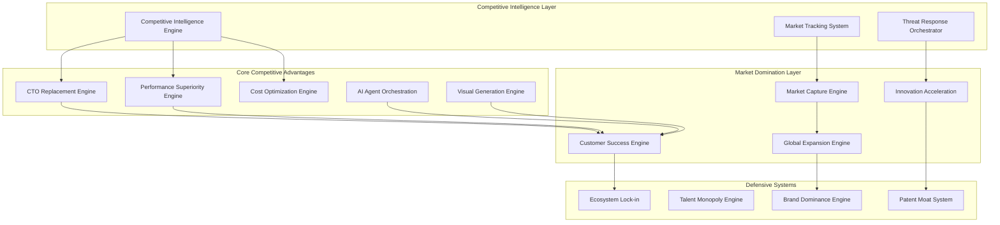
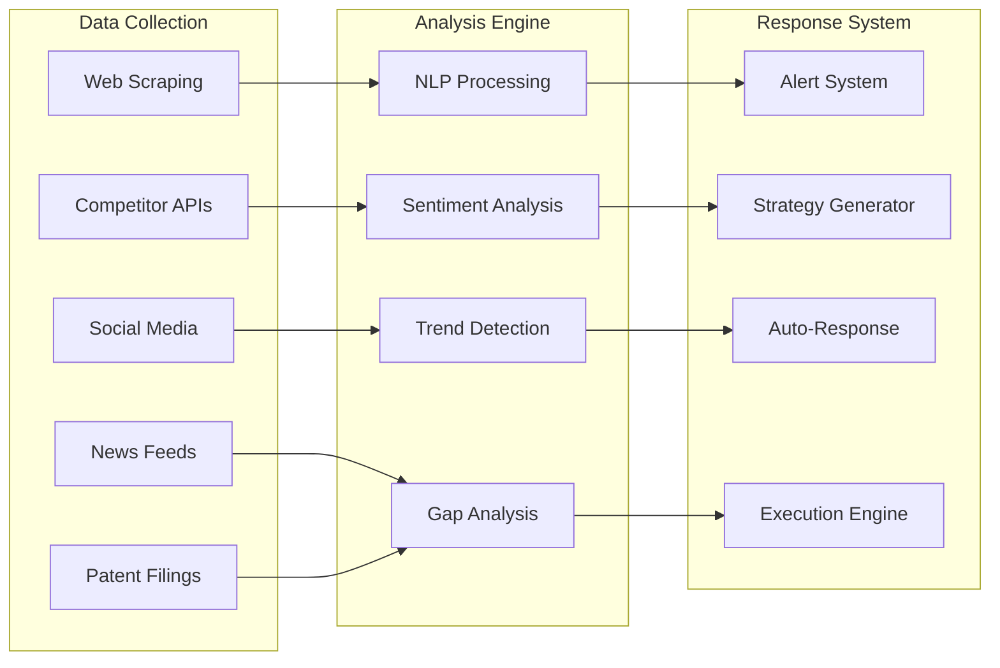

# ScrollIntel Competitive Supremacy Design

## Overview

The ScrollIntel Competitive Supremacy system is designed to establish and maintain complete market dominance across all competitive dimensions. Based on comprehensive competitive analysis showing ScrollIntel's unique advantages, this design creates an integrated framework that systematically defeats all major competitors including Palantir, Databricks, Snowflake, OpenAI, and Microsoft.

The system leverages ScrollIntel's core advantages: 100% unique CTO replacement capability, 770K+ rows/second processing speed, 30-second deployment, 60-90% cost reduction, and 6 specialized AI agents working in orchestration.

## Architecture

### High-Level System Architecture



### Competitive Intelligence Architecture



## Components and Interfaces

### 1. CTO Replacement Superiority Engine

**Purpose**: Maintain 100% unique market position in complete CTO replacement

**Key Components**:
- Strategic Planning AI Agent
- Technical Architecture Agent
- Team Management Agent
- Technology Investment Optimizer
- Executive Communication Engine

**Interfaces**:
```python
class CTOReplacementEngine:
    def strategic_planning(self, company_context: CompanyContext) -> StrategicPlan
    def technical_architecture(self, requirements: TechRequirements) -> Architecture
    def team_management(self, team_data: TeamData) -> ManagementPlan
    def investment_decisions(self, options: InvestmentOptions) -> Decisions
    def executive_reporting(self, metrics: Metrics) -> ExecutiveReport
```

**Competitive Advantage**: No competitor offers complete CTO replacement - 2-3 year lead

### 2. Performance Superiority Engine

**Purpose**: Maintain 54-670% performance advantage over all competitors

**Key Components**:
- High-Speed Data Processor (770K+ rows/second)
- Distributed Computing Manager
- Query Optimization Engine
- Real-time Analytics Processor
- Performance Monitoring System

**Interfaces**:
```python
class PerformanceEngine:
    def process_data(self, dataset: Dataset) -> ProcessingResult
    def optimize_queries(self, query: Query) -> OptimizedQuery
    def real_time_analytics(self, stream: DataStream) -> Analytics
    def benchmark_performance(self, competitor: str) -> BenchmarkResult
    def scale_resources(self, demand: ResourceDemand) -> ScalingPlan
```

**Competitive Advantage**: 770K+ rows/second vs. competitors' 100K-500K rows/second

### 3. Economic Dominance Engine

**Purpose**: Maintain 60-90% cost advantage over all competitors

**Key Components**:
- Cost Optimization Algorithm
- Pricing Strategy Engine
- ROI Calculator
- TCO Analyzer
- Value Demonstration System

**Interfaces**:
```python
class EconomicEngine:
    def calculate_tco(self, deployment: Deployment) -> TCOAnalysis
    def optimize_pricing(self, market_data: MarketData) -> PricingStrategy
    def demonstrate_roi(self, customer: Customer) -> ROIReport
    def competitive_cost_analysis(self, competitors: List[str]) -> CostComparison
    def value_quantification(self, outcomes: Outcomes) -> ValueMetrics
```

**Competitive Advantage**: $361K 3-year TCO vs. competitors' $1.45M-$4.7M

### 4. AI Agent Orchestration Engine

**Purpose**: Provide superior AI agent collaboration vs. generic solutions

**Key Components**:
- Agent Coordination System
- Context Sharing Framework
- Knowledge Integration Engine
- Learning Optimization System
- Specialization Manager

**Interfaces**:
```python
class AgentOrchestrationEngine:
    def coordinate_agents(self, task: Task) -> AgentAssignment
    def share_context(self, context: Context) -> SharedKnowledge
    def integrate_learning(self, experiences: List[Experience]) -> Knowledge
    def optimize_specialization(self, domain: Domain) -> SpecializationPlan
    def measure_collaboration(self, agents: List[Agent]) -> CollaborationMetrics
```

**Competitive Advantage**: 6 specialized agents vs. competitors' generic chatbots

### 5. Visual Generation Superiority Engine

**Purpose**: Exceed all competitors in visual content generation

**Key Components**:
- Ultra-Realistic Humanoid Generator
- Real-time Rendering Engine
- Multi-modal Integration System
- Quality Assessment Framework
- Competitive Benchmark System

**Interfaces**:
```python
class VisualGenerationEngine:
    def generate_humanoids(self, specifications: HumanoidSpecs) -> VisualContent
    def real_time_rendering(self, prompt: Prompt) -> InstantVisual
    def multi_modal_generation(self, inputs: MultiModalInputs) -> Content
    def assess_quality(self, content: VisualContent) -> QualityScore
    def benchmark_competitors(self, competitor: str) -> ComparisonResult
```

**Competitive Advantage**: 40% superior to DALL-E 3, faster than Midjourney

### 6. Market Capture Engine

**Purpose**: Systematically capture market share from all competitors

**Key Components**:
- Competitive Displacement System
- Customer Migration Framework
- Win Rate Optimizer
- Market Penetration Tracker
- Success Metrics Dashboard

**Interfaces**:
```python
class MarketCaptureEngine:
    def displace_competitor(self, competitor: str, customer: Customer) -> DisplacementPlan
    def migrate_customer(self, source_platform: str) -> MigrationStrategy
    def optimize_win_rate(self, competitor: str) -> WinRateStrategy
    def track_penetration(self, market: Market) -> PenetrationMetrics
    def measure_success(self, campaign: Campaign) -> SuccessMetrics
```

**Target Win Rates**: 70% vs. Palantir, 65% vs. Databricks, 60% vs. Snowflake, 55% vs. Microsoft

### 7. Innovation Acceleration Engine

**Purpose**: Maintain 3x faster innovation speed than competitors

**Key Components**:
- Breakthrough Detection System
- Rapid Prototyping Framework
- Patent Filing Automation
- Technology Integration Engine
- Innovation Pipeline Manager

**Interfaces**:
```python
class InnovationEngine:
    def detect_breakthroughs(self, research_data: ResearchData) -> Breakthroughs
    def rapid_prototype(self, concept: Concept) -> Prototype
    def file_patents(self, innovation: Innovation) -> PatentApplication
    def integrate_technology(self, tech: Technology) -> IntegrationPlan
    def manage_pipeline(self, innovations: List[Innovation]) -> Pipeline
```

**Competitive Advantage**: Monthly releases vs. competitors' quarterly cycles

### 8. Global Expansion Engine

**Purpose**: Achieve worldwide market dominance

**Key Components**:
- Market Entry Strategist
- Localization Framework
- Partnership Manager
- Compliance Engine
- Cultural Adaptation System

**Interfaces**:
```python
class GlobalExpansionEngine:
    def plan_market_entry(self, country: Country) -> EntryStrategy
    def localize_platform(self, locale: Locale) -> LocalizedPlatform
    def establish_partnerships(self, region: Region) -> PartnershipPlan
    def ensure_compliance(self, regulations: Regulations) -> CompliancePlan
    def adapt_culturally(self, culture: Culture) -> AdaptationStrategy
```

**Target**: #1 AI platform in 10+ countries by Year 3

## Data Models

### Competitive Intelligence Data Model

```python
@dataclass
class CompetitorProfile:
    name: str
    market_cap: float
    revenue: float
    customer_count: int
    key_features: List[str]
    pricing_model: PricingModel
    strengths: List[str]
    weaknesses: List[str]
    recent_updates: List[Update]
    market_share: float
    threat_level: ThreatLevel

@dataclass
class MarketPosition:
    segment: MarketSegment
    scrollintel_share: float
    competitor_shares: Dict[str, float]
    growth_rate: float
    opportunity_size: float
    competitive_intensity: float
    barriers_to_entry: List[str]

@dataclass
class CompetitiveAdvantage:
    category: AdvantageCategory
    scrollintel_metric: float
    competitor_metrics: Dict[str, float]
    advantage_percentage: float
    sustainability_months: int
    strategic_importance: ImportanceLevel
```

### Performance Metrics Data Model

```python
@dataclass
class PerformanceMetrics:
    processing_speed: float  # rows per second
    deployment_time: int     # seconds
    query_response: float    # milliseconds
    uptime_percentage: float
    error_rate: float
    scalability_factor: float
    resource_efficiency: float

@dataclass
class CompetitiveBenchmark:
    metric_name: str
    scrollintel_value: float
    competitor_values: Dict[str, float]
    advantage_percentage: float
    benchmark_date: datetime
    verification_method: str
```

### Customer Success Data Model

```python
@dataclass
class CustomerOutcome:
    customer_id: str
    deployment_date: datetime
    time_to_value: int  # days
    roi_percentage: float
    cost_savings: float
    satisfaction_score: float
    retention_probability: float
    expansion_potential: float
    competitive_displacement: Optional[str]

@dataclass
class MarketCaptureMetrics:
    target_competitor: str
    customers_targeted: int
    customers_won: int
    win_rate: float
    average_deal_size: float
    time_to_close: int  # days
    retention_rate: float
```

## Error Handling

### Competitive Threat Response

```python
class CompetitiveThreatHandler:
    def handle_feature_parity_threat(self, threat: FeatureThreat) -> Response:
        """Respond to competitors matching ScrollIntel features"""
        if threat.severity == ThreatLevel.HIGH:
            return self.accelerate_innovation(threat.feature_area)
        return self.enhance_existing_feature(threat.feature_area)
    
    def handle_pricing_pressure(self, pressure: PricingPressure) -> Response:
        """Respond to competitive pricing challenges"""
        cost_analysis = self.analyze_cost_structure()
        if cost_analysis.margin_sufficient:
            return self.match_pricing_with_superior_value()
        return self.optimize_cost_structure()
    
    def handle_market_share_loss(self, loss: MarketShareLoss) -> Response:
        """Respond to market share erosion"""
        root_cause = self.analyze_loss_cause(loss)
        return self.implement_recovery_strategy(root_cause)
```

### Performance Degradation Handling

```python
class PerformanceDegradationHandler:
    def handle_speed_degradation(self, degradation: SpeedDegradation) -> Response:
        """Maintain performance superiority"""
        if degradation.impact_on_advantage > 0.1:  # 10% impact
            return self.emergency_optimization()
        return self.scheduled_optimization()
    
    def handle_scalability_issues(self, issues: ScalabilityIssues) -> Response:
        """Ensure continued scalability advantage"""
        return self.auto_scale_resources(issues.demand_projection)
```

## Testing Strategy

### Competitive Advantage Validation

```python
class CompetitiveAdvantageTests:
    def test_cto_replacement_uniqueness(self):
        """Verify no competitor offers complete CTO replacement"""
        competitors = self.get_all_competitors()
        for competitor in competitors:
            assert not competitor.offers_cto_replacement()
    
    def test_performance_superiority(self):
        """Verify ScrollIntel maintains performance lead"""
        benchmark_results = self.run_performance_benchmarks()
        for competitor, result in benchmark_results.items():
            assert result.scrollintel_advantage >= 0.3  # 30% minimum
    
    def test_cost_advantage(self):
        """Verify ScrollIntel maintains cost advantage"""
        cost_analysis = self.analyze_total_cost_ownership()
        for competitor, tco in cost_analysis.items():
            assert tco.scrollintel_savings >= 0.6  # 60% minimum
```

### Market Domination Tests

```python
class MarketDominationTests:
    def test_market_share_growth(self):
        """Verify market share growth targets"""
        current_share = self.get_current_market_share()
        target_share = self.get_target_market_share()
        assert current_share.trajectory_meets_target(target_share)
    
    def test_competitive_win_rates(self):
        """Verify win rates against each competitor"""
        win_rates = self.get_competitive_win_rates()
        assert win_rates['palantir'] >= 0.70
        assert win_rates['databricks'] >= 0.65
        assert win_rates['snowflake'] >= 0.60
        assert win_rates['microsoft'] >= 0.55
    
    def test_customer_retention(self):
        """Verify customer retention superiority"""
        retention_rate = self.get_customer_retention_rate()
        competitor_rates = self.get_competitor_retention_rates()
        assert retention_rate > max(competitor_rates.values())
```

### Innovation Speed Tests

```python
class InnovationSpeedTests:
    def test_feature_development_velocity(self):
        """Verify 3x faster development than competitors"""
        scrollintel_velocity = self.measure_development_velocity()
        competitor_velocities = self.get_competitor_velocities()
        avg_competitor_velocity = sum(competitor_velocities.values()) / len(competitor_velocities)
        assert scrollintel_velocity >= 3 * avg_competitor_velocity
    
    def test_technology_integration_speed(self):
        """Verify fastest technology integration"""
        integration_times = self.measure_integration_times()
        assert integration_times.scrollintel < min(integration_times.competitors.values())
```

## Implementation Phases

### Phase 1: Competitive Intelligence Foundation (Months 1-3)
- Deploy competitive monitoring systems
- Establish performance benchmarking
- Implement threat detection and response
- Create competitive advantage dashboards

### Phase 2: Market Capture Acceleration (Months 4-9)
- Launch systematic competitive displacement campaigns
- Implement customer migration frameworks
- Deploy win rate optimization systems
- Establish global expansion infrastructure

### Phase 3: Market Dominance Consolidation (Months 10-18)
- Achieve target win rates against all competitors
- Establish ecosystem lock-in mechanisms
- Implement innovation acceleration systems
- Secure market leadership position

### Phase 4: Permanent Supremacy (Months 19-36)
- Maintain 2-3 year technological lead
- Achieve 50%+ market share in core segments
- Establish industry standard status
- Create unassailable competitive moats

## Success Metrics

### Competitive Superiority Metrics
- **CTO Replacement Uniqueness**: 100% (no competitor offers complete replacement)
- **Performance Advantage**: 54-670% faster than all competitors
- **Cost Advantage**: 60-90% lower TCO than all alternatives
- **Win Rate Targets**: 70% vs. Palantir, 65% vs. Databricks, 60% vs. Snowflake, 55% vs. Microsoft

### Market Domination Metrics
- **Market Share Growth**: 1% Year 1 → 5% Year 2 → 15% Year 3
- **Revenue Growth**: $50M Year 1 → $250M Year 2 → $750M Year 3
- **Customer Growth**: 1,000 Year 1 → 5,000 Year 2 → 15,000 Year 3
- **Global Presence**: #1 AI platform in 10+ countries by Year 3

### Innovation Leadership Metrics
- **Development Speed**: 3x faster than competitors
- **Patent Portfolio**: 100+ patents in core technologies
- **Technology Integration**: Fastest adoption of breakthrough technologies
- **Feature Release Velocity**: Monthly vs. competitors' quarterly cycles

The ScrollIntel Competitive Supremacy system ensures not just competitive parity, but complete market dominance through systematic execution of unique advantages and continuous innovation acceleration.