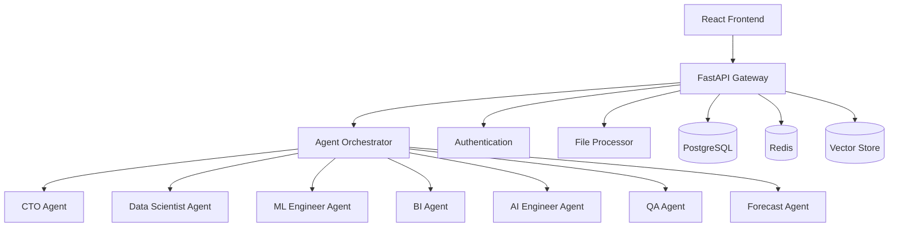

# ScrollIntel Core Focus - Design Document

## Overview

This design document outlines the technical architecture for a focused ScrollIntel platform that delivers exceptional AI-CTO replacement capabilities through 7 core agents. The design prioritizes simplicity, reliability, and user value over feature complexity.

**Core Philosophy**: Build fewer things better. Each component must directly contribute to the AI-CTO value proposition.

## Architecture

### High-Level Architecture



### Core Components

1. **Agent Orchestrator**: Routes requests to appropriate agents
2. **File Processor**: Handles data upload and preprocessing
3. **Natural Language Interface**: Processes user queries
4. **Dashboard Engine**: Generates interactive visualizations
5. **Model Factory**: Builds and deploys ML models
6. **Security Layer**: Handles authentication and permissions

## Components and Interfaces

### 1. Agent Orchestrator

**Purpose**: Central hub that routes user requests to the appropriate AI agent

**Key Classes**:
```python
class AgentOrchestrator:
    def route_request(self, user_input: str, context: dict) -> AgentResponse
    def get_available_agents(self) -> List[Agent]
    def health_check(self) -> dict

class Agent:
    def process(self, request: AgentRequest) -> AgentResponse
    def get_capabilities(self) -> List[str]
    def is_healthy(self) -> bool
```

**Interfaces**:
- REST API: `/api/v1/agents/{agent_name}/process`
- WebSocket: Real-time agent communication
- Internal: Agent-to-agent communication

### 2. File Processor

**Purpose**: Handles data upload, validation, and preprocessing

**Key Classes**:
```python
class FileProcessor:
    def upload_file(self, file: UploadFile) -> ProcessedFile
    def detect_schema(self, file_path: str) -> DataSchema
    def validate_data(self, data: DataFrame) -> ValidationResult
    def preprocess(self, data: DataFrame) -> DataFrame

class DataSchema:
    columns: List[Column]
    data_types: Dict[str, str]
    sample_data: Dict[str, Any]
```

**Supported Formats**: CSV, Excel, JSON, Parquet
**Max File Size**: 100MB
**Processing Time**: < 30 seconds

### 3. Natural Language Interface

**Purpose**: Converts user questions into agent-specific queries

**Key Classes**:
```python
class NLProcessor:
    def parse_intent(self, query: str) -> Intent
    def extract_entities(self, query: str) -> List[Entity]
    def generate_response(self, agent_result: Any) -> str

class Intent:
    agent: str
    action: str
    confidence: float
    parameters: dict
```

### 4. Dashboard Engine

**Purpose**: Creates interactive dashboards and visualizations

**Key Classes**:
```python
class DashboardEngine:
    def create_dashboard(self, data: DataFrame, config: DashboardConfig) -> Dashboard
    def generate_chart(self, data: DataFrame, chart_type: str) -> Chart
    def update_real_time(self, dashboard_id: str, new_data: DataFrame)

class Dashboard:
    id: str
    charts: List[Chart]
    layout: Layout
    auto_refresh: bool
```

**Chart Types**: Line, Bar, Scatter, Heatmap, Table
**Real-time Updates**: WebSocket-based
**Export Formats**: PNG, PDF, Excel

## Data Models

### Core Entities

```python
# User Management
class User:
    id: UUID
    email: str
    name: str
    role: UserRole
    created_at: datetime
    last_active: datetime

class Workspace:
    id: UUID
    name: str
    owner_id: UUID
    members: List[UUID]
    settings: dict

# Data Management
class Dataset:
    id: UUID
    name: str
    file_path: str
    schema: DataSchema
    row_count: int
    created_at: datetime
    workspace_id: UUID

class Analysis:
    id: UUID
    dataset_id: UUID
    agent_type: str
    query: str
    results: dict
    created_at: datetime

# ML Models
class Model:
    id: UUID
    name: str
    type: str
    dataset_id: UUID
    performance_metrics: dict
    status: ModelStatus
    endpoint_url: Optional[str]

# Dashboards
class Dashboard:
    id: UUID
    name: str
    workspace_id: UUID
    config: dict
    charts: List[dict]
    created_at: datetime
```

### Database Schema

**Primary Tables**:
- `users` - User accounts and authentication
- `workspaces` - Project organization
- `datasets` - Uploaded data files
- `analyses` - Agent query results
- `models` - ML model metadata
- `dashboards` - Visualization configurations

**Relationships**:
- Users → Workspaces (many-to-many)
- Workspaces → Datasets (one-to-many)
- Datasets → Analyses (one-to-many)
- Datasets → Models (one-to-many)
- Workspaces → Dashboards (one-to-many)

## Agent Specifications

### 1. CTO Agent
**Capabilities**: Technology stack recommendations, architecture decisions, scaling strategies
**Input**: Business requirements, current tech stack, growth projections
**Output**: Technical recommendations with rationale

### 2. Data Scientist Agent
**Capabilities**: Exploratory data analysis, statistical insights, data quality assessment
**Input**: Raw datasets, analysis questions
**Output**: Statistical summaries, visualizations, insights

### 3. ML Engineer Agent
**Capabilities**: Model selection, training, evaluation, deployment
**Input**: Datasets, prediction targets, performance requirements
**Output**: Trained models, performance metrics, deployment endpoints

### 4. BI Agent
**Capabilities**: Dashboard creation, KPI tracking, business metrics
**Input**: Business data, metric definitions
**Output**: Interactive dashboards, automated reports

### 5. AI Engineer Agent
**Capabilities**: AI strategy, model architecture, integration guidance
**Input**: Business objectives, technical constraints
**Output**: AI implementation roadmaps, technical specifications

### 6. QA Agent
**Capabilities**: Natural language querying of datasets
**Input**: Questions about data in plain English
**Output**: Answers with supporting data and visualizations

### 7. Forecast Agent
**Capabilities**: Time series forecasting, trend analysis, prediction
**Input**: Historical data, forecast horizon
**Output**: Predictions with confidence intervals, trend analysis

## Security Architecture

### Authentication & Authorization
- JWT-based authentication
- Role-based access control (Admin, User, Viewer)
- Workspace-level permissions
- API key management for programmatic access

### Data Security
- Encryption at rest (AES-256)
- Encryption in transit (TLS 1.3)
- Data isolation by workspace
- Audit logging for all operations

### Infrastructure Security
- Network isolation
- Regular security updates
- Vulnerability scanning
- Backup and disaster recovery

## Technology Stack

### Frontend
- **Framework**: React 18 with TypeScript
- **Styling**: Tailwind CSS + ShadCN components
- **State Management**: Zustand
- **Charts**: Recharts
- **Build Tool**: Vite

### Backend
- **API Framework**: FastAPI
- **Language**: Python 3.11+
- **Task Queue**: Celery with Redis
- **ML Libraries**: scikit-learn, pandas, numpy
- **AI Integration**: OpenAI API, Anthropic Claude

### Database & Storage
- **Primary Database**: PostgreSQL 15+
- **Cache**: Redis 7+
- **Vector Database**: Pinecone or Supabase Vector
- **File Storage**: Local filesystem or S3-compatible

### Infrastructure
- **Containerization**: Docker
- **Orchestration**: Docker Compose (MVP), Kubernetes (scale)
- **Monitoring**: Prometheus + Grafana
- **Logging**: Structured logging with JSON format

## Deployment Architecture

### Development Environment
```yaml
services:
  frontend:
    build: ./frontend
    ports: ["3000:3000"]
  
  backend:
    build: ./backend
    ports: ["8000:8000"]
    depends_on: [postgres, redis]
  
  postgres:
    image: postgres:15
    environment:
      POSTGRES_DB: scrollintel
  
  redis:
    image: redis:7-alpine
```

### Production Environment
- **Frontend**: Vercel or Netlify
- **Backend**: Render, Railway, or AWS ECS
- **Database**: Managed PostgreSQL (RDS, Supabase)
- **Cache**: Managed Redis (ElastiCache, Upstash)
- **Monitoring**: Integrated observability stack

## Performance Requirements

### Response Times
- File upload processing: < 30 seconds
- Agent queries: < 5 seconds
- Dashboard loading: < 2 seconds
- Real-time updates: < 1 second

### Scalability
- Concurrent users: 100+ (MVP), 1000+ (scale)
- File size limit: 100MB (MVP), 1GB (scale)
- Data retention: 1 year
- API rate limits: 1000 requests/hour per user

### Reliability
- Uptime target: 99.9%
- Error rate: < 1%
- Data backup: Daily automated backups
- Recovery time: < 4 hours

## Error Handling Strategy

### User-Facing Errors
- Clear, actionable error messages
- Graceful degradation when services are unavailable
- Retry mechanisms for transient failures
- Fallback responses when AI services fail

### System Errors
- Comprehensive logging with correlation IDs
- Automatic error reporting and alerting
- Circuit breakers for external service calls
- Health checks for all critical components

## Testing Strategy

### Unit Testing
- 80%+ code coverage
- Test all agent logic
- Mock external API calls
- Automated test runs on CI/CD

### Integration Testing
- End-to-end user workflows
- Database integration tests
- API contract testing
- File processing pipelines

### Performance Testing
- Load testing with realistic data volumes
- Stress testing for concurrent users
- Memory and CPU profiling
- Database query optimization

## Migration Strategy

### From Current 48-Spec System
1. **Phase 1**: Identify core functionality currently implemented
2. **Phase 2**: Extract and refactor essential components
3. **Phase 3**: Deprecate unused features and complexity
4. **Phase 4**: Optimize and streamline remaining code
5. **Phase 5**: Launch focused platform

### Data Migration
- Export existing user data and configurations
- Migrate essential datasets and models
- Preserve user workspaces and permissions
- Archive deprecated features for reference

This focused design eliminates complexity while delivering maximum value through 7 core AI agents that truly replace CTO functions. The architecture is simple, scalable, and maintainable.