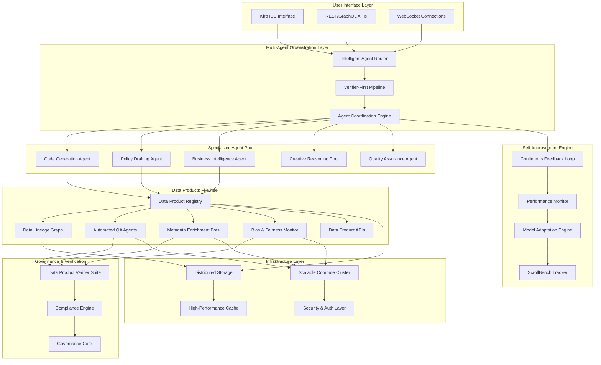

# Design Document - ScrollIntel-G6: Kiro-Ready Integration & Training Platform

## Overview

The ScrollIntel-G6 Kiro-Ready Integration & Training Platform implements a sophisticated multi-agent architecture with a self-reinforcing Data Products Flywheel to achieve GPT-6-class performance. The system combines verifier-first pipelines, continuous self-improvement, and comprehensive data governance to outperform GPT-5 across all critical domains while maintaining ethical AI standards and regulatory compliance.

## Architecture

### High-Level System Architecture



### Data Products Flywheel Architecture

```mermaid
graph LR
    subgraph "Data Ingestion"
        RawData[Raw Data Sources]
        Connectors[Data Connectors]
    end
    
    subgraph "AI Enhancement"
        Cleaning[AI Data Cleaning]
        Labeling[AI Auto-Labeling]
        Enrichment[Metadata Enrichment]
        BiasDetection[Bias Detection AI]
    end
    
    subgraph "Data Products"
        Products[Structured Data Products]
        Versioning[Version Control]
        Governance[Governance Layer]
    end
    
    subgraph "AI Consumption"
        Models[AI Models]
        Training[Model Training]
        Inference[Model Inference]
    end
    
    subgraph "Feedback Loop"
        Performance[Performance Metrics]
        Quality[Quality Feedback]
        Improvement[Continuous Improvement]
    end
    
    RawData --> Connectors
    Connectors --> Cleaning
    Cleaning --> Labeling
    Labeling --> Enrichment
    Enrichment --> BiasDetection
    BiasDetection --> Products
    Products --> Versioning
    Versioning --> Governance
    Governance --> Models
    Models --> Training
    Training --> Inference
    Inference --> Performance
    Performance --> Quality
    Quality --> Improvement
    Improvement --> Cleaning
```



## Components and Interfaces

### 1. Multi-Agent Orchestration Layer

#### Intelligent Agent Router
- **Purpose**: Routes queries to appropriate specialized agents based on domain expertise
- **Key Features**:
  - Intent classification using transformer-based models
  - Dynamic load balancing across agent pool
  - Context-aware routing decisions
  - Fallback mechanisms for edge cases

#### Verifier-First Pipeline
- **Purpose**: Ensures output quality through systematic verification
- **Key Features**:
  - Multi-stage verification process
  - Automated quality scoring
  - Human-in-the-loop validation for critical outputs
  - Rollback mechanisms for failed verifications

#### Agent Coordination Engine
- **Purpose**: Manages collaboration between multiple agents
- **Key Features**:
  - Consensus mechanisms for conflicting outputs
  - Workflow orchestration
  - Resource allocation optimization
  - Inter-agent communication protocols

### 2. Specialized Agent Pool

#### Code Generation Agent
- **Capabilities**: 
  - Multi-language code generation
  - Architecture design and implementation
  - Code review and optimization
  - CI/CD pipeline integration

#### Policy Drafting Agent
- **Capabilities**:
  - Regulatory compliance analysis
  - Policy document generation
  - Legal risk assessment
  - Stakeholder impact analysis

#### Business Intelligence Agent
- **Capabilities**:
  - Data analysis and visualization
  - Strategic roadmap development
  - Market intelligence synthesis
  - Performance metrics analysis

#### Creative Reasoning Pool
- **Capabilities**:
  - Innovative solution generation
  - Design thinking facilitation
  - Brainstorming and ideation
  - Creative problem solving

### 3. Data Products Flywheel Components

#### Data Product Registry
- **Schema**: 
  ```json
  {
    "id": "string",
    "name": "string",
    "version": "string",
    "schema": "object",
    "provenance": "object",
    "compliance_tags": "array",
    "metadata": "object",
    "created_at": "timestamp",
    "updated_at": "timestamp",
    "owner": "string",
    "access_level": "enum"
  }
  ```

#### Data Lineage Graph
- **Structure**: Directed acyclic graph (DAG) representation
- **Nodes**: Data sources, transformations, data products
- **Edges**: Data flow relationships with transformation metadata
- **Storage**: Graph database (Neo4j) for efficient traversal

#### Automated QA Agents
- **Quality Dimensions**:
  - Completeness: Missing value detection and quantification
  - Accuracy: Statistical validation and outlier detection
  - Consistency: Cross-dataset validation and schema compliance
  - Timeliness: Freshness monitoring and SLA validation

#### Metadata Enrichment Bots
- **Enrichment Types**:
  - Semantic tagging using NLP models
  - Statistical profiling and distribution analysis
  - Relationship discovery between datasets
  - Business context annotation

#### Bias & Fairness Monitor
- **Detection Methods**:
  - Statistical parity analysis
  - Equalized odds assessment
  - Demographic parity evaluation
  - Individual fairness metrics

### 4. Governance & Verification

#### Data Product Verifier Suite
- **Verification Stages**:
  1. Schema validation against registered schemas
  2. Compliance scanning for regulatory requirements
  3. Provenance verification for data lineage
  4. Bias and fairness assessment
  5. Freshness SLA validation

#### Compliance Engine
- **Supported Regulations**:
  - GDPR (General Data Protection Regulation)
  - CCPA (California Consumer Privacy Act)
  - HIPAA (Health Insurance Portability and Accountability Act)
  - SOX (Sarbanes-Oxley Act)
  - Industry-specific regulations

### 5. Self-Improvement Engine

#### Continuous Feedback Loop
- **Feedback Sources**:
  - User interaction patterns
  - Performance metrics
  - Error analysis
  - A/B testing results

#### Performance Monitor
- **Metrics Tracked**:
  - Response accuracy and quality
  - Latency and throughput
  - User satisfaction scores
  - Task completion rates

#### Model Adaptation Engine
- **Adaptation Methods**:
  - Fine-tuning on domain-specific data
  - Reinforcement learning from human feedback
  - Knowledge distillation from larger models
  - Continuous learning from new data

## Data Models

### Core Data Entities

#### DataProduct
```python
class DataProduct:
    id: str
    name: str
    version: str
    schema: Dict[str, Any]
    provenance: DataProvenance
    compliance_tags: List[str]
    metadata: Dict[str, Any]
    quality_score: float
    bias_score: float
    freshness_timestamp: datetime
    owner: str
    access_level: AccessLevel
    verification_status: VerificationStatus
```

#### DataProvenance
```python
class DataProvenance:
    source_systems: List[str]
    transformations: List[Transformation]
    lineage_graph: Dict[str, Any]
    creation_timestamp: datetime
    last_modified: datetime
    modification_history: List[ModificationRecord]
```

#### QualityMetrics
```python
class QualityMetrics:
    completeness_score: float
    accuracy_score: float
    consistency_score: float
    timeliness_score: float
    overall_score: float
    issues: List[QualityIssue]
    recommendations: List[str]
```

#### BiasAssessment
```python
class BiasAssessment:
    protected_attributes: List[str]
    statistical_parity: float
    equalized_odds: float
    demographic_parity: float
    individual_fairness: float
    bias_issues: List[BiasIssue]
    mitigation_strategies: List[str]
```

## Error Handling

### Error Categories and Responses

1. **Data Quality Errors**
   - Automatic quarantine of non-compliant data products
   - Detailed error reports with remediation steps
   - Escalation to data owners for critical issues

2. **Agent Coordination Errors**
   - Fallback to single-agent processing
   - Retry mechanisms with exponential backoff
   - Human intervention triggers for persistent failures

3. **Verification Failures**
   - Immediate blocking of non-verified outputs
   - Detailed failure analysis and logging
   - Automatic reprocessing after remediation

4. **Performance Degradation**
   - Automatic scaling of compute resources
   - Load balancing adjustments
   - Circuit breaker patterns for failing components

### Monitoring and Alerting

- **Real-time Monitoring**: Comprehensive dashboards for system health
- **Proactive Alerting**: Predictive alerts based on trend analysis
- **Incident Response**: Automated incident creation and escalation
- **Root Cause Analysis**: AI-powered analysis of system failures

## Testing Strategy

### Testing Levels

1. **Unit Testing**
   - Individual agent functionality
   - Data transformation logic
   - Verification algorithms
   - Quality assessment methods

2. **Integration Testing**
   - Agent coordination workflows
   - Data pipeline end-to-end testing
   - API integration validation
   - Cross-system data flow verification

3. **Performance Testing**
   - Load testing for concurrent users
   - Stress testing for peak workloads
   - Scalability testing for data volume growth
   - Latency testing for real-time requirements

4. **ScrollBench Validation**
   - Continuous benchmarking against GPT-5
   - A/B testing for feature improvements
   - User acceptance testing for key scenarios
   - Regression testing for performance maintenance

### Quality Assurance Framework

- **Automated Testing Pipeline**: CI/CD integration with comprehensive test suites
- **Quality Gates**: Mandatory quality checks before deployment
- **Performance Baselines**: Established benchmarks for all critical metrics
- **Continuous Monitoring**: Real-time quality assessment in production

## Security Considerations

### Data Security
- **Encryption**: End-to-end encryption for data in transit and at rest
- **Access Control**: Role-based access control (RBAC) with fine-grained permissions
- **Audit Logging**: Comprehensive audit trails for all data access and modifications
- **Data Masking**: Automatic PII detection and masking for non-production environments

### AI Security
- **Model Protection**: Secure model storage and deployment
- **Adversarial Defense**: Protection against adversarial attacks
- **Privacy Preservation**: Differential privacy techniques for sensitive data
- **Bias Mitigation**: Continuous monitoring and correction of algorithmic bias

### Infrastructure Security
- **Network Security**: VPC isolation and network segmentation
- **Container Security**: Secure container images and runtime protection
- **Secrets Management**: Centralized secrets management with rotation
- **Compliance**: SOC 2, ISO 27001, and industry-specific compliance standards