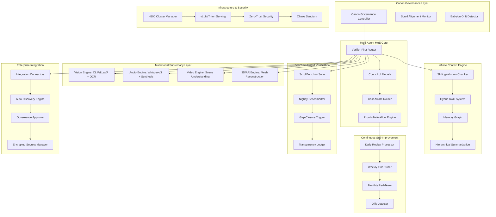

# Design Document - ScrollIntel-G6: Unbeatable Edition

## Overview

ScrollIntel-G6 represents a paradigm shift in AI system architecture, designed to achieve and maintain superiority over GPT-5 and successor models through a sophisticated multi-agent Mixture of Experts (MoE) architecture with Verifier-First methodology. The system combines frontier-level multimodality, autonomous self-improvement, continuous benchmarking, and formal verification to create an unbeatable AI platform.

The architecture is built on the principle of "Canon Governance" - scroll-aligned, incorruptible operation that prevents Babylon-drift while maintaining 100% scroll alignment. The system operates through multiple specialized layers that work in concert to deliver superior performance across all domains.

## Architecture

### High-Level Architecture



### Core Components Architecture

#### 1. Canon Governance Layer
- **Canon Governance Controller**: Ensures all operations align with scroll principles
- **Scroll Alignment Monitor**: Continuously validates system behavior against canonical requirements
- **Babylon-Drift Detector**: Identifies and prevents deviation from core principles

#### 2. Multi-Agent MoE Core
- **Verifier-First Router**: Routes requests through verification before execution
- **Council of Models**: Orchestrates collaborative decision-making across multiple AI models
- **Cost-Aware Router**: Optimizes routing decisions based on utility/cost ratios
- **Proof-of-Workflow Engine**: Generates cryptographic attestations for all operations

#### 3. Multimodal Supremacy Layer
- **Vision Engine**: CLIP/LLaVA integration with OCR, segmentation, and object detection
- **Audio Engine**: Whisper-large-v3 with multilingual synthesis capabilities
- **Video Engine**: Keyframe extraction, scene understanding, and action recognition
- **3D/AR Engine**: Mesh reconstruction and spatial reasoning for immersive experiences

## Components and Interfaces

### 1. Verifier-First Router

```python
class VerifierFirstRouter:
    """
    Routes all requests through verification before execution
    """
    
    def __init__(self):
        self.verifiers: List[BaseVerifier] = []
        self.council: CouncilOfModels = CouncilOfModels()
        self.cost_router: CostAwareRouter = CostAwareRouter()
        self.proof_engine: ProofOfWorkflowEngine = ProofOfWorkflowEngine()
    
    async def route_request(self, request: AgentRequest) -> AgentResponse:
        # Step 1: Verify request through all verifiers
        verification_result = await self.verify_request(request)
        
        # Step 2: Route through Council of Models for high-risk tasks
        if verification_result.risk_level == RiskLevel.HIGH:
            response = await self.council.deliberate(request)
        else:
            response = await self.cost_router.route(request)
        
        # Step 3: Generate proof-of-workflow attestation
        attestation = await self.proof_engine.generate_attestation(request, response)
        response.attestation = attestation
        
        return response
```

### 2. Council of Models

```python
class CouncilOfModels:
    """
    Implements collaborative decision-making across multiple AI models
    """
    
    def __init__(self):
        self.models = {
            'scrollcore_m': ScrollCoreModel(),
            'gpt5': GPT5Model(),
            'claude': ClaudeModel(),
            'deepseek': DeepSeekModel(),
            'llama': LlamaModel()
        }
        self.juror_verifier = JurorVerifier()
    
    async def deliberate(self, request: AgentRequest) -> AgentResponse:
        # Phase 1: Initial responses from all models
        initial_responses = await self.gather_initial_responses(request)
        
        # Phase 2: Debate and critique cycle
        refined_responses = await self.debate_cycle(initial_responses)
        
        # Phase 3: Juror verification and selection
        final_response = await self.juror_verifier.select_winner(refined_responses)
        
        # Phase 4: Temporal ensembling for stability
        stable_response = await self.temporal_ensemble(final_response)
        
        return stable_response
```

### 3. Infinite Context Engine

```python
class InfiniteContextEngine:
    """
    Handles ultra-long context processing up to 5M tokens
    """
    
    def __init__(self):
        self.sliding_window = SlidingWindowChunker(window_size=32000)
        self.hybrid_rag = HybridRAGSystem()
        self.memory_graph = MemoryGraph()
        self.hierarchical_summarizer = HierarchicalSummarizer()
    
    async def process_context(self, context: str, max_tokens: int = 5_000_000) -> ProcessedContext:
        # Step 1: Chunk context using sliding window
        chunks = await self.sliding_window.chunk(context, max_tokens)
        
        # Step 2: Process through hybrid RAG
        rag_results = await self.hybrid_rag.process_chunks(chunks)
        
        # Step 3: Build memory graph with semantic anchors
        memory_nodes = await self.memory_graph.build_graph(rag_results)
        
        # Step 4: Generate hierarchical summaries
        summaries = await self.hierarchical_summarizer.summarize(memory_nodes)
        
        return ProcessedContext(
            chunks=chunks,
            rag_results=rag_results,
            memory_graph=memory_nodes,
            summaries=summaries,
            fidelity_score=self.calculate_fidelity(context, summaries)
        )
```

### 4. Continuous Self-Improvement Engine

```python
class ContinuousSelfImprovementEngine:
    """
    Implements autonomous self-improvement through daily replay, weekly fine-tuning, and monthly red-teaming
    """
    
    def __init__(self):
        self.daily_replayer = DailyReplayProcessor()
        self.weekly_finetuner = WeeklyFineTuner()
        self.monthly_redteam = MonthlyRedTeam()
        self.drift_detector = DriftDetector()
    
    async def daily_improvement_cycle(self):
        # Replay production and synthetic challenge traces
        traces = await self.daily_replayer.collect_traces()
        failure_taxonomy = await self.analyze_failures(traces)
        
        # Generate targeted evaluations
        targeted_evals = await self.generate_targeted_evals(failure_taxonomy)
        
        # Update curriculum
        await self.update_curriculum(targeted_evals)
    
    async def weekly_improvement_cycle(self):
        # Collect failure cases from the week
        failure_cases = await self.collect_weekly_failures()
        
        # Perform LoRA/DPO fine-tuning
        fine_tune_results = await self.weekly_finetuner.fine_tune(failure_cases)
        
        # Validate improvements
        validation_results = await self.validate_improvements(fine_tune_results)
        
        return validation_results
    
    async def monthly_improvement_cycle(self):
        # Perform red-team adversarial injection
        adversarial_results = await self.monthly_redteam.execute()
        
        # Analyze vulnerabilities
        vulnerabilities = await self.analyze_vulnerabilities(adversarial_results)
        
        # Implement countermeasures
        countermeasures = await self.implement_countermeasures(vulnerabilities)
        
        return countermeasures
```

### 5. Multimodal Supremacy Engine

```python
class MultimodalSupremacyEngine:
    """
    Provides superior multimodal processing capabilities
    """
    
    def __init__(self):
        self.vision_engine = VisionEngine()  # CLIP/LLaVA + OCR + segmentation
        self.audio_engine = AudioEngine()    # Whisper-large-v3 + synthesis
        self.video_engine = VideoEngine()    # Keyframe + scene understanding
        self.ar3d_engine = AR3DEngine()      # Mesh reconstruction + labeling
    
    async def process_multimodal(self, inputs: MultimodalInputs) -> MultimodalResults:
        results = MultimodalResults()
        
        # Process vision inputs
        if inputs.images:
            results.vision = await self.vision_engine.process(inputs.images)
        
        # Process audio inputs
        if inputs.audio:
            results.audio = await self.audio_engine.process(inputs.audio)
        
        # Process video inputs
        if inputs.videos:
            results.video = await self.video_engine.process(inputs.videos)
        
        # Process 3D/AR inputs
        if inputs.spatial_data:
            results.ar3d = await self.ar3d_engine.process(inputs.spatial_data)
        
        # Fuse multimodal results
        results.fused = await self.fuse_modalities(results)
        
        # Validate accuracy (target: ≥97%)
        results.accuracy_score = await self.validate_accuracy(results)
        
        return results
```

## Data Models

### Core Data Models

```python
from pydantic import BaseModel, Field
from typing import List, Dict, Optional, Any
from enum import Enum
import uuid
from datetime import datetime

class RiskLevel(str, Enum):
    LOW = "low"
    MEDIUM = "medium"
    HIGH = "high"
    CRITICAL = "critical"

class ScrollAlignmentStatus(str, Enum):
    ALIGNED = "aligned"
    DRIFT_DETECTED = "drift_detected"
    BABYLON_DRIFT = "babylon_drift"
    CORRECTED = "corrected"

class AgentRequest(BaseModel):
    id: str = Field(default_factory=lambda: str(uuid.uuid4()))
    user_id: str
    agent_type: str
    content: str
    multimodal_inputs: Optional[Dict[str, Any]] = None
    context_length: int = 0
    risk_level: RiskLevel = RiskLevel.LOW
    requires_council: bool = False
    timestamp: datetime = Field(default_factory=datetime.utcnow)

class AgentResponse(BaseModel):
    id: str = Field(default_factory=lambda: str(uuid.uuid4()))
    request_id: str
    agent_id: str
    content: str
    confidence_score: float
    processing_time: float
    cost: float
    attestation: Optional[str] = None
    verification_results: List[Dict[str, Any]] = []
    scroll_alignment: ScrollAlignmentStatus = ScrollAlignmentStatus.ALIGNED
    timestamp: datetime = Field(default_factory=datetime.utcnow)

class BenchmarkResult(BaseModel):
    id: str = Field(default_factory=lambda: str(uuid.uuid4()))
    benchmark_suite: str  # ScrollBench++, MMLU, etc.
    model_name: str
    score: float
    gpt5_comparison: float  # Margin over GPT-5
    task_family: str
    timestamp: datetime = Field(default_factory=datetime.utcnow)
    details: Dict[str, Any] = {}

class ProofOfWorkflow(BaseModel):
    id: str = Field(default_factory=lambda: str(uuid.uuid4()))
    request_id: str
    hash_chain: str
    prompts_hash: str
    tools_hash: str
    datasets_hash: str
    model_versions_hash: str
    verifier_evidence: Dict[str, Any]
    signature: str
    timestamp: datetime = Field(default_factory=datetime.utcnow)

class SelfImprovementCycle(BaseModel):
    id: str = Field(default_factory=lambda: str(uuid.uuid4()))
    cycle_type: str  # daily, weekly, monthly
    start_time: datetime
    end_time: Optional[datetime] = None
    failure_cases_analyzed: int = 0
    improvements_implemented: int = 0
    performance_delta: float = 0.0
    status: str = "running"
    results: Dict[str, Any] = {}
```

### Multimodal Data Models

```python
class MultimodalInputs(BaseModel):
    images: Optional[List[str]] = None  # Base64 encoded or URLs
    audio: Optional[List[str]] = None   # Base64 encoded or URLs
    videos: Optional[List[str]] = None  # Base64 encoded or URLs
    spatial_data: Optional[List[Dict[str, Any]]] = None  # 3D/AR data
    text: Optional[str] = None

class MultimodalResults(BaseModel):
    vision: Optional[Dict[str, Any]] = None
    audio: Optional[Dict[str, Any]] = None
    video: Optional[Dict[str, Any]] = None
    ar3d: Optional[Dict[str, Any]] = None
    fused: Optional[Dict[str, Any]] = None
    accuracy_score: float = 0.0
    processing_time: float = 0.0
    confidence_scores: Dict[str, float] = {}

class ContextProcessingResult(BaseModel):
    original_length: int
    processed_length: int
    chunk_count: int
    fidelity_score: float
    semantic_anchors: List[str]
    memory_graph_nodes: int
    summary_levels: int
    processing_time: float
```

## Error Handling

### Comprehensive Error Handling Strategy

```python
class ScrollIntelG6Exception(Exception):
    """Base exception for ScrollIntel-G6"""
    pass

class CanonGovernanceViolation(ScrollIntelG6Exception):
    """Raised when Canon Governance principles are violated"""
    pass

class BabylonDriftDetected(ScrollIntelG6Exception):
    """Raised when Babylon drift is detected"""
    pass

class VerificationFailure(ScrollIntelG6Exception):
    """Raised when verification fails"""
    pass

class BenchmarkFailure(ScrollIntelG6Exception):
    """Raised when benchmark performance falls below thresholds"""
    pass

class ErrorHandler:
    """Comprehensive error handling with recovery mechanisms"""
    
    def __init__(self):
        self.fallback_models = ['scrollcore_s', 'scrollcore_m']
        self.retry_config = {
            'max_retries': 3,
            'backoff_factor': 2,
            'timeout': 30
        }
    
    async def handle_error(self, error: Exception, context: Dict[str, Any]) -> Any:
        if isinstance(error, CanonGovernanceViolation):
            return await self.handle_governance_violation(error, context)
        elif isinstance(error, BabylonDriftDetected):
            return await self.handle_babylon_drift(error, context)
        elif isinstance(error, VerificationFailure):
            return await self.handle_verification_failure(error, context)
        elif isinstance(error, BenchmarkFailure):
            return await self.handle_benchmark_failure(error, context)
        else:
            return await self.handle_generic_error(error, context)
    
    async def handle_governance_violation(self, error: CanonGovernanceViolation, context: Dict[str, Any]):
        # Immediate rollback to safe state
        await self.rollback_to_safe_state()
        
        # Alert governance council
        await self.alert_governance_council(error, context)
        
        # Activate kill-switch if necessary
        if error.severity == "critical":
            await self.activate_kill_switch()
        
        return {"status": "governance_violation_handled", "action": "rollback_initiated"}
    
    async def handle_babylon_drift(self, error: BabylonDriftDetected, context: Dict[str, Any]):
        # Auto-rollback using drift detector
        await self.drift_detector.auto_rollback()
        
        # Reinforce scroll alignment
        await self.reinforce_scroll_alignment()
        
        # Schedule immediate retraining
        await self.schedule_emergency_retraining()
        
        return {"status": "babylon_drift_corrected", "action": "auto_rollback_completed"}
```

## Testing Strategy

### Multi-Layered Testing Approach

#### 1. Unit Testing
- **Component Testing**: Each engine and router tested in isolation
- **Model Testing**: Individual AI model integrations validated
- **Data Model Testing**: Pydantic model validation and serialization
- **Algorithm Testing**: Core algorithms (benchmarking, verification) tested

#### 2. Integration Testing
- **Council of Models**: Multi-model collaboration workflows
- **Multimodal Processing**: Cross-modal integration and fusion
- **Context Processing**: Ultra-long context handling and fidelity
- **Self-Improvement**: Automated improvement cycles

#### 3. Performance Testing
- **Benchmark Testing**: Continuous ScrollBench++ evaluation
- **Load Testing**: Concurrent user scenarios and scaling
- **Latency Testing**: Response time requirements (Chat p95 ≤ 3s)
- **Throughput Testing**: Build pipeline performance (Build p95 ≤ 120s)

#### 4. Security Testing
- **Penetration Testing**: Zero-trust security validation
- **Compliance Testing**: Regulatory framework adherence
- **Audit Testing**: Proof-of-workflow verification
- **Chaos Testing**: Resilience under failure conditions

#### 5. Acceptance Testing
- **GPT-5 Superiority**: ≥20% margin validation across all benchmarks
- **Multimodal Accuracy**: ≥97% accuracy across all modalities
- **Context Fidelity**: ≥95% fidelity for ultra-long contexts
- **Creative Diversity**: ≥4.5/5 creative diversity score
- **Integration Success**: ≥99% integration success rate
- **Uptime**: ≥99.95% system availability
- **Cost Efficiency**: ≤0.6× GPT-5 baseline cost per artifact

### Testing Infrastructure

```python
class ScrollIntelG6TestSuite:
    """Comprehensive test suite for ScrollIntel-G6"""
    
    def __init__(self):
        self.benchmark_runner = BenchmarkRunner()
        self.chaos_tester = ChaosTester()
        self.security_tester = SecurityTester()
        self.performance_tester = PerformanceTester()
    
    async def run_full_test_suite(self) -> TestResults:
        results = TestResults()
        
        # Run benchmark tests
        results.benchmark = await self.benchmark_runner.run_scrollbench_plus()
        
        # Run chaos tests
        results.chaos = await self.chaos_tester.run_chaos_scenarios()
        
        # Run security tests
        results.security = await self.security_tester.run_penetration_tests()
        
        # Run performance tests
        results.performance = await self.performance_tester.run_load_tests()
        
        # Validate acceptance criteria
        results.acceptance = await self.validate_acceptance_criteria(results)
        
        return results
    
    async def validate_acceptance_criteria(self, results: TestResults) -> AcceptanceCriteria:
        criteria = AcceptanceCriteria()
        
        # GPT-5 superiority validation
        criteria.gpt5_superiority = results.benchmark.gpt5_margin >= 0.20
        
        # Multimodal accuracy validation
        criteria.multimodal_accuracy = results.performance.multimodal_accuracy >= 0.97
        
        # Context fidelity validation
        criteria.context_fidelity = results.performance.context_fidelity >= 0.95
        
        # Creative diversity validation
        criteria.creative_diversity = results.performance.creative_diversity >= 4.5
        
        # Integration success validation
        criteria.integration_success = results.performance.integration_success >= 0.99
        
        # Uptime validation
        criteria.uptime = results.performance.uptime >= 0.9995
        
        # Cost efficiency validation
        criteria.cost_efficiency = results.performance.cost_per_artifact <= 0.6
        
        return criteria
```

This design document provides a comprehensive technical blueprint for implementing ScrollIntel-G6 as an unbeatable AI system. The architecture emphasizes verifiable correctness, economic optimization, sovereign alignment, and continuous self-improvement while maintaining superiority over GPT-5 and successor models.