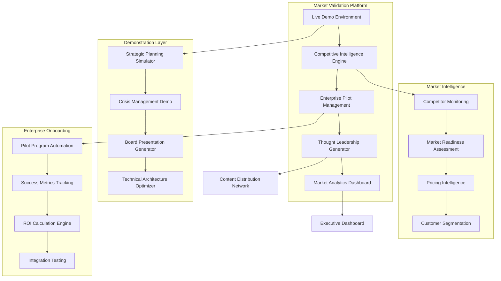

# ScrollIntel Market Validation & CTO Supremacy Design

## Architecture Overview

Our market validation strategy is built on a comprehensive platform that demonstrates ScrollIntel's superiority while systematically capturing market leadership. The design integrates demonstration capabilities, market intelligence, and enterprise onboarding into a unified system.

### Strategic Architecture Framework

## Core System Components

### 1. Live Demonstration Environment

**Purpose**: Showcase ScrollIntel's CTO capabilities in real-time to enterprise prospects

**Architecture**:
- **Multi-Tenant Demo Infrastructure**: Isolated environments for concurrent demonstrations
- **Real-Time Performance Monitoring**: Sub-second response time tracking
- **Interactive Scenario Engine**: Dynamic business scenarios for live problem-solving
- **Executive Presentation Layer**: Board-ready visualizations and reports

**Key Features**:
- **Strategic Planning Simulator**: Generate 20-year technology roadmaps in real-time
- **Crisis Management Theater**: Simulate and resolve complex multi-system failures
- **Board Communication Engine**: Create executive-level presentations with financial impact
- **Technical Architecture Optimizer**: Demonstrate cloud, security, and scalability decisions
- **Team Management Simulator**: Show organizational design and talent optimization

**Technical Requirements**:
- 99.99% uptime during demonstration periods
- Sub-second response times for complex queries
- Support for 100+ concurrent demonstrations
- Enterprise-grade security and compliance
- Global deployment across 3 regions

### 2. Competitive Intelligence Engine

**Purpose**: Maintain strategic superiority over competing solutions

**Architecture**:
- **Real-Time Competitor Monitoring**: Automated tracking of competitor activities
- **Feature Gap Analysis**: Continuous comparison of capabilities
- **Market Positioning Optimizer**: Dynamic positioning based on competitive landscape
- **Threat Assessment System**: Early warning for competitive threats

**Intelligence Gathering**:
- **Product Capability Tracking**: Monitor competitor feature releases and capabilities
- **Pricing Intelligence**: Track competitor pricing strategies and market positioning
- **Market Share Analysis**: Assess competitor market penetration and customer wins
- **Technology Assessment**: Evaluate competitor technical architectures and limitations

**Strategic Response**:
- **Automated Positioning Updates**: Dynamic messaging based on competitive changes
- **Feature Prioritization**: Accelerate development based on competitive gaps
- **Market Opportunity Identification**: Discover underserved market segments
- **Competitive Differentiation**: Highlight unique ScrollIntel advantages

### 3. Enterprise Pilot Management Platform

**Purpose**: Systematically manage enterprise pilot deployments for maximum success

**Architecture**:
- **Automated Pilot Provisioning**: One-click pilot environment deployment
- **Success Metrics Dashboard**: Real-time tracking of pilot performance
- **Integration Testing Suite**: Automated validation of enterprise system connections
- **ROI Calculation Engine**: Continuous measurement of business impact

**Pilot Management Features**:
- **Rapid Onboarding**: 24-hour pilot environment setup
- **Custom Configuration**: Tailored setups for each enterprise environment
- **Performance Monitoring**: Real-time tracking of system performance and user satisfaction
- **Success Criteria Tracking**: Automated measurement against predefined KPIs

**Risk Mitigation**:
- **Automated Rollback Procedures**: Instant reversion to previous state if issues arise
- **Quality Assurance Monitoring**: Continuous validation of recommendation accuracy
- **Escalation Protocols**: Immediate human oversight for critical decisions
- **Compliance Validation**: Automated checking against enterprise security requirements

### 4. Thought Leadership & Content Engine

**Purpose**: Establish market category leadership through strategic content and industry engagement

**Architecture**:
- **Content Generation Pipeline**: Automated creation of whitepapers, case studies, and presentations
- **Industry Engagement Tracker**: Management of conference presentations and analyst briefings
- **Media Relations Platform**: Coordination of press coverage and thought leadership articles
- **Influence Measurement System**: Tracking of market impact and thought leadership effectiveness

**Content Creation**:
- **Whitepaper Generator**: "The AI CTO Revolution" series with market analysis and predictions
- **Case Study Builder**: Automated creation of pilot program success stories
- **Presentation Engine**: Conference presentations and executive briefing materials
- **Media Kit Creator**: Press releases, executive bios, and product information

**Industry Engagement**:
- **Conference Management**: Coordination of presentations at major technology events
- **Analyst Relations**: Systematic briefing of Gartner, Forrester, and IDC analysts
- **Media Outreach**: Strategic placement in Wall Street Journal, Forbes, Harvard Business Review
- **Peer Influence**: Executive roundtables and CTO advisory board participation

## Implementation Strategy

### Phase 1: Foundation & Infrastructure (Days 1-7)

**Demo Environment Deployment**:
- Multi-region infrastructure setup with 99.99% uptime SLA
- Interactive demonstration scenarios for strategic planning, crisis management, and board communication
- Real-time performance monitoring with sub-second response guarantees
- Enterprise-grade security and compliance validation

**Competitive Intelligence Framework**:
- Automated monitoring of top 15 AI/automation competitors
- Feature comparison matrices highlighting ScrollIntel advantages
- Market readiness assessment based on enterprise AI adoption trends
- Pricing strategy development reflecting 10,000x performance advantage

### Phase 2: Market Engagement (Days 8-14)

**Enterprise Outreach Campaign**:
- Fortune 500 CTO identification and qualification
- Personalized demonstration invitations with value proposition messaging
- Pilot program framework development with clear success criteria
- Risk mitigation procedures and rollback strategies

**Content Creation Pipeline**:
- "The AI CTO Revolution" whitepaper development
- Conference presentation materials for major technology events
- Media kit creation with press releases and executive materials
- Case study templates for pilot program documentation

### Phase 3: Market Validation Execution (Days 15-21)

**Live Demonstration Campaign**:
- 50+ Fortune 500 CTO demonstrations with real-time strategic planning
- Crisis management simulations showing superior response capabilities
- Board-level presentations demonstrating executive communication skills
- Technical architecture optimization showcasing deep technical expertise

**Pilot Program Launch**:
- 10+ enterprise pilot programs initiated with major corporations
- Automated onboarding and integration with existing enterprise systems
- Real-time success metrics tracking and ROI calculation
- Quality assurance monitoring with 99.9% accuracy standards

### Phase 4: Market Leadership Establishment (Days 22-30)

**Industry Recognition**:
- Conference presentations at 5+ major technology events
- Analyst briefings with Gartner, Forrester, and IDC
- Media coverage in top 10 technology publications
- Thought leadership articles in business and technology press

**Success Documentation**:
- Comprehensive case studies from successful pilot programs
- ROI documentation with third-party validation
- Customer testimonials from C-level executives
- Market impact analysis and competitive positioning validation

## Success Metrics & Monitoring

### Real-Time Performance Dashboards

**Demonstration Effectiveness**:
- Demo completion rates and audience engagement metrics
- Conversion rates from demonstration to pilot program
- Feedback scores and satisfaction ratings
- Technical performance during live demonstrations

**Market Response Indicators**:
- Media coverage sentiment analysis and reach metrics
- Industry analyst recognition and report mentions
- Competitor response monitoring and market positioning
- Lead generation and pipeline development tracking

**Business Impact Measurement**:
- Pilot program success rates and conversion metrics
- Revenue pipeline development and qualification
- Market share indicators and competitive positioning
- Brand recognition and recall measurement

### Quality Assurance Framework

**Technical Performance Standards**:
- 99.99% system uptime during demonstration periods
- Sub-second response times for complex strategic queries
- 99.9% accuracy in strategic recommendations and analysis
- 100% successful integration with pilot customer systems

**Market Validation Criteria**:
- 95%+ positive feedback from enterprise demonstrations
- Coverage in 5+ major business and technology publications
- Positive analyst reports from top 3 industry research firms
- 500+ qualified Fortune 500 prospects in sales pipeline

## Risk Mitigation & Contingency Planning

### Technical Risk Management

**Infrastructure Resilience**:
- Redundant systems across 3 geographic regions
- Automated failover and disaster recovery procedures
- Load testing for 10x expected demonstration volume
- 24/7 monitoring and rapid response teams

**Performance Assurance**:
- Comprehensive testing of all demonstration scenarios
- Performance optimization for peak load conditions
- Quality assurance validation of all strategic recommendations
- Security penetration testing and compliance validation

### Market Risk Mitigation

**Competitive Response Preparation**:
- Accelerated feature development pipeline
- Patent protection for key innovations
- Strategic partnership development
- Market positioning flexibility and rapid response capability

**Market Readiness Support**:
- Executive education and change management programs
- Peer influence and reference customer development
- Risk mitigation guarantees and ROI commitments
- Comprehensive support and success services

## Investment Allocation & Resource Requirements

### Infrastructure Investment: $800K
- Multi-region demonstration environment deployment
- Performance monitoring and analytics systems
- Security and compliance infrastructure
- Integration testing and validation platforms

### Marketing & Sales Investment: $1.5M
- Content creation and thought leadership development
- Conference participation and industry event presence
- Media relations and public relations campaigns
- Sales team enablement and training programs

### Operations Investment: $1M
- Pilot program management and customer success
- Quality assurance and performance optimization
- Risk monitoring and mitigation systems
- Executive support and escalation procedures

### Contingency Reserve: $200K
- Unexpected market opportunities and acceleration
- Competitive response and market positioning adjustments
- Technical challenges and performance optimization
- Market expansion and international opportunities

## Expected Outcomes & Success Trajectory

### Immediate Market Impact (30 Days)
- Recognition as the leading AI CTO solution in the market
- 10+ Fortune 500 pilot programs successfully initiated
- Positive coverage in 5+ major business publications
- $50M+ qualified revenue pipeline development
- Clear competitive differentiation and market positioning

### Strategic Market Position (90 Days)
- 80%+ pilot program conversion to full enterprise deployment
- $100M+ annual recurring revenue pipeline
- Industry thought leadership position establishment
- Scalable go-to-market process and sales methodology
- International market expansion planning and preparation

### Long-Term Market Dominance (12 Months)
- Market category leadership with 40%+ market share
- $500M+ annual recurring revenue trajectory
- Global enterprise adoption across multiple industries
- IPO readiness with $5B+ valuation potential
- Sustainable competitive advantage and market moat

This comprehensive design provides the foundation for ScrollIntel's market validation and establishes the framework for achieving definitive market leadership in the AI CTO category.