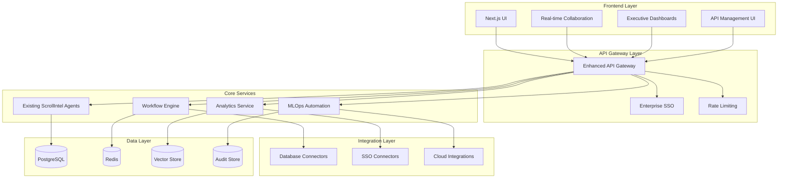

# Design Document - ScrollIntel Production Readiness Enhancement

## Overview

The ScrollIntel Production Readiness Enhancement transforms the existing comprehensive AI platform into an enterprise-ready system by adding critical collaborative, integration, and governance capabilities. This design leverages ScrollIntel's existing agent architecture, EXOUSIA security framework, and FastAPI backend while adding new components for real-time collaboration, enterprise integration, and advanced analytics.

The enhancement follows a microservices architecture pattern, extending the existing system with new services that integrate seamlessly with current agents and engines while maintaining backward compatibility.

## Architecture

### High-Level Architecture



### Component Integration Strategy

The design extends ScrollIntel's existing architecture by:
- **Preserving existing agents**: All 20+ agents continue to function unchanged
- **Enhancing the API gateway**: Adding enterprise features like SSO and rate limiting
- **Adding collaboration layer**: Real-time synchronization without disrupting core functionality
- **Extending data models**: New tables for collaboration, workflows, and analytics
- **Maintaining EXOUSIA**: Leveraging existing security framework for new features

## Components and Interfaces

### 1. Real-time Collaboration Service

**Purpose**: Enable multiple users to work simultaneously on AI projects with live synchronization.

**Key Components**:
- **WebSocket Manager**: Handles real-time connections and message broadcasting
- **Conflict Resolution Engine**: Manages simultaneous edits with operational transforms
- **Presence Service**: Tracks active users and their current activities
- **Version Control**: Maintains change history with branching and merging

**Interfaces**:
```python
class CollaborationService:
    def join_workspace(self, user_id: str, workspace_id: str) -> WebSocketConnection
    def broadcast_change(self, workspace_id: str, change: ChangeEvent) -> None
    def resolve_conflict(self, conflict: ConflictEvent) -> Resolution
    def get_active_users(self, workspace_id: str) -> List[ActiveUser]
```

**Integration Points**:
- Extends existing project management with real-time capabilities
- Integrates with EXOUSIA for permission-based collaboration
- Uses Redis for session management and message queuing

### 2. Enterprise SSO Integration Service

**Purpose**: Seamlessly integrate with enterprise identity providers for authentication and authorization.

**Key Components**:
- **SSO Adapters**: Support for Azure AD, Okta, Google Workspace, LDAP
- **User Provisioning**: Automatic account creation and role mapping
- **Group Synchronization**: Real-time updates of user permissions
- **Fallback Authentication**: Backup authentication when SSO fails

**Interfaces**:
```python
class SSOService:
    def authenticate_user(self, token: str, provider: str) -> AuthResult
    def provision_user(self, sso_user: SSOUser) -> User
    def sync_groups(self, provider: str) -> List[GroupUpdate]
    def validate_token(self, token: str) -> TokenValidation
```

**Integration Points**:
- Extends EXOUSIA authentication with enterprise providers
- Integrates with existing user management and role systems
- Maintains audit trails for compliance requirements

### 3. Database Connectivity Service

**Purpose**: Provide native connectivity to enterprise databases without manual data uploads.

**Key Components**:
- **Connection Pool Manager**: Efficient database connection management
- **Schema Discovery**: Automatic detection of database schemas and changes
- **Query Optimizer**: Intelligent query planning and caching
- **Security Layer**: Encryption and access control for database connections

**Interfaces**:
```python
class DatabaseService:
    def create_connection(self, config: DatabaseConfig) -> Connection
    def discover_schema(self, connection: Connection) -> Schema
    def execute_query(self, connection: Connection, query: str) -> QueryResult
    def monitor_changes(self, connection: Connection) -> SchemaChangeStream
```

**Integration Points**:
- Extends existing data processing agents with direct database access
- Integrates with ScrollIntel's data analysis and visualization engines
- Uses connection pooling for performance and reliability

### 4. Executive Analytics Dashboard

**Purpose**: Provide unified, role-based dashboards for monitoring AI initiatives and ROI.

**Key Components**:
- **Dashboard Engine**: Dynamic dashboard generation based on user roles
- **Metrics Aggregator**: Real-time collection and processing of business metrics
- **ROI Calculator**: Automated calculation of AI project business value
- **Alert Manager**: Configurable notifications for important events

**Interfaces**:
```python
class AnalyticsDashboard:
    def generate_dashboard(self, user: User, role: Role) -> Dashboard
    def calculate_roi(self, project_id: str) -> ROIMetrics
    def aggregate_metrics(self, time_range: TimeRange) -> MetricsSnapshot
    def configure_alerts(self, user_id: str, alerts: List[AlertConfig]) -> None
```

**Integration Points**:
- Aggregates data from all existing ScrollIntel agents and engines
- Integrates with billing and cost tracking systems
- Uses existing visualization components with enhanced executive views

### 5. MLOps Automation Service

**Purpose**: Automate the complete model lifecycle from training to deployment with minimal human intervention.

**Key Components**:
- **Model Monitor**: Continuous monitoring of model performance and drift
- **Retraining Orchestrator**: Automated retraining workflows with validation
- **Deployment Pipeline**: Automated deployment to staging and production
- **Rollback Manager**: Automatic rollback on deployment failures

**Interfaces**:
```python
class MLOpsService:
    def monitor_model(self, model_id: str) -> ModelHealth
    def trigger_retraining(self, model_id: str, reason: str) -> TrainingJob
    def deploy_model(self, model_id: str, environment: str) -> DeploymentResult
    def rollback_deployment(self, deployment_id: str) -> RollbackResult
```

**Integration Points**:
- Extends existing AutoModel and ModelFactory engines
- Integrates with cloud deployment services
- Uses existing model storage and versioning systems

### 6. Compliance and Audit Service

**Purpose**: Ensure all AI operations meet regulatory requirements with comprehensive audit trails.

**Key Components**:
- **Audit Logger**: Comprehensive logging of all AI operations
- **Compliance Reporter**: Automated generation of regulatory reports
- **Data Lineage Tracker**: Complete tracking of data flow and transformations
- **Policy Engine**: Automated enforcement of compliance policies

**Interfaces**:
```python
class ComplianceService:
    def log_operation(self, operation: AIOperation) -> AuditEntry
    def generate_report(self, regulation: str, time_range: TimeRange) -> ComplianceReport
    def track_lineage(self, data_id: str) -> DataLineage
    def enforce_policy(self, operation: AIOperation) -> PolicyResult
```

**Integration Points**:
- Extends EXOUSIA audit capabilities with regulatory compliance
- Integrates with all existing agents for comprehensive logging
- Uses existing data models with enhanced audit information

## Data Models

### Enhanced Data Models

```python
# Real-time Collaboration
class Workspace(BaseModel):
    id: str
    name: str
    project_id: str
    active_users: List[str]
    last_activity: datetime
    collaboration_settings: Dict

class ChangeEvent(BaseModel):
    id: str
    workspace_id: str
    user_id: str
    change_type: str
    content: Dict
    timestamp: datetime
    version: int

# Enterprise Integration
class SSOProvider(BaseModel):
    id: str
    name: str
    provider_type: str  # azure_ad, okta, google, ldap
    configuration: Dict
    is_active: bool
    last_sync: datetime

class DatabaseConnection(BaseModel):
    id: str
    name: str
    connection_type: str  # postgresql, mysql, snowflake, etc.
    connection_string: str  # encrypted
    schema_info: Dict
    last_schema_update: datetime

# Analytics and Monitoring
class ExecutiveDashboard(BaseModel):
    id: str
    user_id: str
    role: str
    widgets: List[Dict]
    refresh_interval: int
    last_updated: datetime

class ROIMetrics(BaseModel):
    project_id: str
    cost_savings: float
    revenue_impact: float
    efficiency_gains: float
    calculation_date: datetime
    confidence_score: float

# MLOps Automation
class ModelDeployment(BaseModel):
    id: str
    model_id: str
    environment: str  # staging, production
    deployment_status: str
    health_metrics: Dict
    deployment_date: datetime
    rollback_available: bool

class ComplianceAudit(BaseModel):
    id: str
    operation_id: str
    user_id: str
    operation_type: str
    data_accessed: List[str]
    compliance_status: str
    audit_timestamp: datetime
```

## Error Handling

### Comprehensive Error Management Strategy

**1. Real-time Collaboration Errors**:
- **Connection Failures**: Automatic reconnection with exponential backoff
- **Conflict Resolution**: Graceful handling of simultaneous edits with user notification
- **Data Synchronization**: Conflict-free replicated data types (CRDTs) for consistency

**2. Enterprise Integration Errors**:
- **SSO Failures**: Fallback to local authentication with detailed error logging
- **Database Connection Issues**: Connection pooling with retry logic and health checks
- **Schema Changes**: Automatic adaptation with notification to affected users

**3. MLOps Pipeline Errors**:
- **Training Failures**: Automatic retry with different hyperparameters
- **Deployment Issues**: Immediate rollback to previous stable version
- **Model Drift**: Gradual transition to retrained models with A/B testing

**4. Compliance and Audit Errors**:
- **Audit Log Failures**: Redundant logging systems with immediate alerts
- **Compliance Violations**: Automatic operation blocking with administrator notification
- **Data Lineage Breaks**: Comprehensive tracking with gap detection and reporting

## Testing Strategy

### Multi-layered Testing Approach

**1. Unit Testing**:
- Individual component testing with 90%+ code coverage
- Mock external dependencies (databases, SSO providers)
- Automated testing of all API endpoints and business logic

**2. Integration Testing**:
- End-to-end testing of collaboration workflows
- SSO integration testing with multiple providers
- Database connectivity testing across different database types
- MLOps pipeline testing with real model deployments

**3. Performance Testing**:
- Load testing of real-time collaboration with 100+ concurrent users
- Database connection pool testing under high load
- Dashboard rendering performance with large datasets
- API rate limiting and throttling validation

**4. Security Testing**:
- Penetration testing of SSO integration points
- Database connection security validation
- Audit trail integrity testing
- Compliance report accuracy verification

**5. Compliance Testing**:
- GDPR compliance validation with data deletion and export
- SOC2 audit trail completeness testing
- Regulatory report accuracy verification
- Data lineage tracking validation

### Testing Infrastructure

```python
# Example test structure
class TestCollaborationService:
    def test_real_time_synchronization(self):
        # Test multiple users editing simultaneously
        pass
    
    def test_conflict_resolution(self):
        # Test handling of conflicting changes
        pass
    
    def test_presence_tracking(self):
        # Test active user tracking and updates
        pass

class TestSSOIntegration:
    def test_azure_ad_authentication(self):
        # Test Azure AD SSO flow
        pass
    
    def test_user_provisioning(self):
        # Test automatic user account creation
        pass
    
    def test_group_synchronization(self):
        # Test role mapping from SSO groups
        pass
```

This design ensures ScrollIntel becomes truly enterprise-ready while maintaining its existing strengths and comprehensive agent ecosystem. The modular approach allows for incremental implementation and testing, reducing risk while delivering immediate value to enterprise customers.