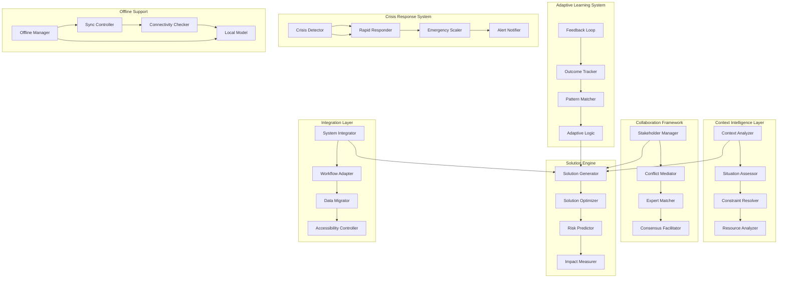

# Design Document

## Overview

This design enhances ScrollIntel with real-world problem-solving capabilities that address practical challenges in deployment, scalability, user experience, and effectiveness. The enhancements focus on context awareness, adaptive learning, multi-stakeholder collaboration, resource optimization, crisis response, and measurable impact tracking to create a truly practical AI solution.

## Architecture

### Enhanced Real-World Problem-Solving Architecture



## Components and Interfaces

### Context Intelligence System

**Purpose**: Analyzes full situational context to provide relevant, actionable solutions.

**Key Features**:
- Multi-dimensional context analysis (technical, business, cultural, regulatory)
- Constraint identification and resource mapping
- Stakeholder analysis and impact assessment
- Environmental factor consideration
- Historical context integration

**Interface**:
```typescript
interface ContextIntelligence {
  // Context Analysis
  analyzeContext(problem: Problem, environment: Environment): Promise<ContextAnalysis>
  identifyConstraints(context: ContextAnalysis): Promise<Constraint[]>
  mapResources(context: ContextAnalysis): Promise<ResourceMap>
  assessStakeholders(context: ContextAnalysis): Promise<StakeholderAnalysis>
  
  // Situational Assessment
  evaluateSituation(context: ContextAnalysis): Promise<SituationAssessment>
  identifyRisks(situation: SituationAssessment): Promise<Risk[]>
  predictOutcomes(situation: SituationAssessment, solutions: Solution[]): Promise<OutcomePrediction[]>
}

interface ContextAnalysis {
  problemDomain: string
  complexity: number
  urgency: number
  stakeholders: Stakeholder[]
  constraints: Constraint[]
  resources: Resource[]
  environment: EnvironmentContext
  historicalContext: HistoricalData[]
}

interface SituationAssessment {
  criticalityLevel: number
  timeConstraints: TimeConstraint[]
  resourceLimitations: ResourceLimitation[]
  successFactors: SuccessFactor[]
  riskFactors: RiskFactor[]
  dependencies: Dependency[]
}
```

### Adaptive Learning Engine

**Purpose**: Continuously learns from real-world outcomes to improve solution quality over time.

**Key Features**:
- Outcome tracking and analysis
- Pattern recognition and learning
- Feedback integration and processing
- Solution effectiveness measurement
- Continuous model improvement

**Interface**:
```typescript
interface AdaptiveLearning {
  // Outcome Tracking
  trackOutcome(solutionId: string, outcome: Outcome): Promise<void>
  measureEffectiveness(solutionId: string): Promise<EffectivenessMetrics>
  analyzeFailures(failures: Failure[]): Promise<FailureAnalysis>
  
  // Pattern Learning
  identifyPatterns(outcomes: Outcome[]): Promise<Pattern[]>
  updateModels(patterns: Pattern[]): Promise<ModelUpdate>
  adaptStrategies(learnings: Learning[]): Promise<StrategyUpdate>
  
  // Feedback Processing
  processFeedback(feedback: UserFeedback): Promise<FeedbackAnalysis>
  integrateLearnings(analysis: FeedbackAnalysis): Promise<void>
  recommendImprovements(analysis: FeedbackAnalysis): Promise<Improvement[]>
}

interface Outcome {
  solutionId: string
  success: boolean
  metrics: PerformanceMetrics
  feedback: UserFeedback
  context: ImplementationContext
  timestamp: Date
  followUpActions: Action[]
}

interface EffectivenessMetrics {
  successRate: number
  timeToResolution: number
  resourceEfficiency: number
  stakeholderSatisfaction: number
  longTermImpact: number
  costEffectiveness: number
}
```

### Multi-Stakeholder Collaboration System

**Purpose**: Facilitates collaboration between multiple stakeholders with different perspectives and expertise.

**Key Features**:
- Stakeholder identification and analysis
- Perspective integration and conflict resolution
- Expert matching and connection
- Consensus building and decision facilitation
- Communication enhancement and translation

**Interface**:
```typescript
interface CollaborationSystem {
  // Stakeholder Management
  identifyStakeholders(problem: Problem): Promise<Stakeholder[]>
  analyzeStakeholderNeeds(stakeholders: Stakeholder[]): Promise<StakeholderNeeds>
  mapInfluenceNetwork(stakeholders: Stakeholder[]): Promise<InfluenceMap>
  
  // Conflict Resolution
  detectConflicts(perspectives: Perspective[]): Promise<Conflict[]>
  mediateConflicts(conflicts: Conflict[]): Promise<Resolution[]>
  findCompromises(positions: Position[]): Promise<Compromise[]>
  
  // Expert Matching
  identifyExpertiseNeeds(problem: Problem): Promise<ExpertiseRequirement[]>
  matchExperts(requirements: ExpertiseRequirement[]): Promise<ExpertMatch[]>
  facilitateConnections(matches: ExpertMatch[]): Promise<Connection[]>
  
  // Consensus Building
  facilitateDiscussion(stakeholders: Stakeholder[], topic: Topic): Promise<Discussion>
  buildConsensus(discussion: Discussion): Promise<Consensus>
  documentAgreements(consensus: Consensus): Promise<Agreement>
}

interface Stakeholder {
  id: string
  name: string
  role: string
  influence: number
  interests: Interest[]
  constraints: Constraint[]
  expertise: Expertise[]
  communicationPreferences: CommunicationPreference[]
}

interface Conflict {
  type: ConflictType
  stakeholders: string[]
  description: string
  severity: number
  resolutionStrategies: ResolutionStrategy[]
}
```

### Solution Optimization Engine

**Purpose**: Optimizes solutions based on available resources and real-world constraints.

**Key Features**:
- Resource-aware solution generation
- Constraint-based optimization
- Multi-objective optimization
- Trade-off analysis and ranking
- Scalability planning

**Interface**:
```typescript
interface SolutionOptimizer {
  // Solution Generation
  generateSolutions(problem: Problem, context: ContextAnalysis): Promise<Solution[]>
  optimizeSolutions(solutions: Solution[], constraints: Constraint[]): Promise<OptimizedSolution[]>
  rankSolutions(solutions: OptimizedSolution[], criteria: RankingCriteria): Promise<RankedSolution[]>
  
  // Resource Optimization
  optimizeResources(solution: Solution, resources: Resource[]): Promise<ResourceOptimization>
  identifyBottlenecks(solution: Solution): Promise<Bottleneck[]>
  suggestAlternatives(bottlenecks: Bottleneck[]): Promise<Alternative[]>
  
  // Constraint Management
  validateConstraints(solution: Solution, constraints: Constraint[]): Promise<ValidationResult>
  relaxConstraints(constraints: Constraint[], priorities: Priority[]): Promise<RelaxedConstraints>
  findWorkarounds(violations: ConstraintViolation[]): Promise<Workaround[]>
}

interface OptimizedSolution {
  id: string
  description: string
  steps: ActionStep[]
  resources: ResourceRequirement[]
  timeline: Timeline
  risks: Risk[]
  benefits: Benefit[]
  metrics: SuccessMetric[]
  scalability: ScalabilityPlan
}

interface ResourceOptimization {
  originalCost: number
  optimizedCost: number
  savings: number
  efficiency: number
  alternatives: ResourceAlternative[]
  recommendations: OptimizationRecommendation[]
}
```

### Crisis Response System

**Purpose**: Provides rapid, effective solutions during crisis situations.

**Key Features**:
- Crisis detection and classification
- Rapid response generation
- Emergency escalation protocols
- Safety prioritization
- Real-time coordination

**Interface**:
```typescript
interface CrisisResponse {
  // Crisis Detection
  detectCrisis(situation: Situation): Promise<CrisisAssessment>
  classifyCrisis(crisis: CrisisAssessment): Promise<CrisisClassification>
  assessUrgency(crisis: CrisisAssessment): Promise<UrgencyLevel>
  
  // Rapid Response
  generateRapidResponse(crisis: CrisisClassification): Promise<RapidResponse>
  prioritizeActions(response: RapidResponse): Promise<PrioritizedActions>
  deployResponse(actions: PrioritizedActions): Promise<ResponseDeployment>
  
  // Emergency Coordination
  notifyAuthorities(crisis: CrisisClassification): Promise<NotificationResult>
  coordinateResources(crisis: CrisisClassification): Promise<ResourceCoordination>
  establishCommunication(stakeholders: Stakeholder[]): Promise<CommunicationChannel>
  
  // Safety Management
  assessSafetyRisks(crisis: CrisisClassification): Promise<SafetyRisk[]>
  implementSafetyMeasures(risks: SafetyRisk[]): Promise<SafetyMeasure[]>
  monitorSafety(measures: SafetyMeasure[]): Promise<SafetyStatus>
}

interface CrisisAssessment {
  type: CrisisType
  severity: number
  scope: CrisisScope
  timeConstraints: TimeConstraint[]
  safetyRisks: SafetyRisk[]
  impactAssessment: ImpactAssessment
  resourceNeeds: ResourceNeed[]
}

interface RapidResponse {
  immediateActions: ImmediateAction[]
  shortTermActions: ShortTermAction[]
  contingencyPlans: ContingencyPlan[]
  escalationTriggers: EscalationTrigger[]
  communicationPlan: CommunicationPlan
}
```

### Integration and Accessibility Framework

**Purpose**: Ensures seamless integration with existing systems and inclusive accessibility.

**Key Features**:
- System integration and API connectivity
- Workflow adaptation and enhancement
- Accessibility compliance and support
- Multi-language and cultural adaptation
- Assistive technology integration

**Interface**:
```typescript
interface IntegrationFramework {
  // System Integration
  analyzeExistingSystems(environment: SystemEnvironment): Promise<SystemAnalysis>
  createIntegrationPlan(systems: SystemAnalysis): Promise<IntegrationPlan>
  implementIntegration(plan: IntegrationPlan): Promise<IntegrationResult>
  
  // Workflow Adaptation
  analyzeWorkflows(workflows: Workflow[]): Promise<WorkflowAnalysis>
  adaptWorkflows(analysis: WorkflowAnalysis, solutions: Solution[]): Promise<AdaptedWorkflow[]>
  validateWorkflowIntegration(workflows: AdaptedWorkflow[]): Promise<ValidationResult>
  
  // Accessibility Support
  assessAccessibilityNeeds(users: User[]): Promise<AccessibilityNeeds>
  implementAccessibilityFeatures(needs: AccessibilityNeeds): Promise<AccessibilityFeatures>
  validateAccessibilityCompliance(features: AccessibilityFeatures): Promise<ComplianceResult>
  
  // Cultural Adaptation
  analyzeCulturalContext(context: CulturalContext): Promise<CulturalAnalysis>
  adaptSolutions(solutions: Solution[], culture: CulturalAnalysis): Promise<AdaptedSolution[]>
  validateCulturalSensitivity(solutions: AdaptedSolution[]): Promise<SensitivityResult>
}

interface AccessibilityFeatures {
  screenReaderSupport: boolean
  keyboardNavigation: boolean
  highContrastMode: boolean
  textToSpeech: boolean
  speechToText: boolean
  languageTranslation: boolean
  simplifiedInterface: boolean
  assistiveTechnology: AssistiveTechnology[]
}
```

### Offline and Connectivity Management

**Purpose**: Provides robust functionality in low-connectivity environments.

**Key Features**:
- Offline capability management
- Intelligent synchronization
- Bandwidth optimization
- Local model deployment
- Graceful degradation

**Interface**:
```typescript
interface OfflineManager {
  // Offline Capability
  enableOfflineMode(capabilities: OfflineCapability[]): Promise<OfflineConfiguration>
  syncWhenOnline(localData: LocalData): Promise<SyncResult>
  manageLocalStorage(data: Data, policies: StoragePolicy[]): Promise<StorageResult>
  
  // Connectivity Management
  monitorConnectivity(): Promise<ConnectivityStatus>
  optimizeBandwidth(operations: Operation[]): Promise<OptimizedOperations>
  prioritizeSync(data: Data[]): Promise<SyncPriority[]>
  
  // Local Processing
  deployLocalModel(model: Model, constraints: ResourceConstraint[]): Promise<LocalDeployment>
  processLocally(request: Request, model: LocalModel): Promise<LocalResponse>
  validateLocalResults(results: LocalResponse): Promise<ValidationResult>
}

interface OfflineConfiguration {
  availableFeatures: Feature[]
  localModels: LocalModel[]
  syncStrategies: SyncStrategy[]
  storageAllocation: StorageAllocation
  degradationPlan: DegradationPlan
}
```

## Data Models

### Enhanced Problem and Solution Models

```typescript
interface EnhancedProblem {
  id: string
  title: string
  description: string
  domain: ProblemDomain
  complexity: ComplexityLevel
  urgency: UrgencyLevel
  context: ProblemContext
  stakeholders: Stakeholder[]
  constraints: Constraint[]
  resources: Resource[]
  successCriteria: SuccessCriterion[]
  historicalAttempts: HistoricalAttempt[]
}

interface ProblemContext {
  organizational: OrganizationalContext
  technical: TechnicalContext
  regulatory: RegulatoryContext
  cultural: CulturalContext
  environmental: EnvironmentalContext
  temporal: TemporalContext
}

interface EnhancedSolution {
  id: string
  problemId: string
  title: string
  description: string
  approach: SolutionApproach
  steps: DetailedStep[]
  resources: ResourcePlan
  timeline: DetailedTimeline
  risks: RiskAssessment
  benefits: BenefitAnalysis
  metrics: MeasurementPlan
  scalability: ScalabilityPlan
  adaptability: AdaptabilityPlan
}

interface DetailedStep {
  id: string
  title: string
  description: string
  type: StepType
  duration: Duration
  dependencies: string[]
  resources: ResourceRequirement[]
  deliverables: Deliverable[]
  successCriteria: SuccessCriterion[]
  risks: Risk[]
  alternatives: Alternative[]
}
```

### Outcome and Learning Models

```typescript
interface OutcomeTracking {
  solutionId: string
  implementationId: string
  status: ImplementationStatus
  progress: ProgressMetrics
  results: ResultMetrics
  feedback: FeedbackCollection
  lessons: LessonLearned[]
  improvements: ImprovementSuggestion[]
  nextActions: NextAction[]
}

interface LessonLearned {
  id: string
  category: LessonCategory
  description: string
  context: LearningContext
  applicability: Applicability[]
  confidence: number
  evidence: Evidence[]
  recommendations: Recommendation[]
}

interface AdaptiveLearningModel {
  modelId: string
  version: string
  trainingData: TrainingData[]
  performance: ModelPerformance
  adaptations: Adaptation[]
  validationResults: ValidationResult[]
  deploymentHistory: DeploymentHistory[]
}
```

### Collaboration and Stakeholder Models

```typescript
interface StakeholderNetwork {
  networkId: string
  stakeholders: NetworkStakeholder[]
  relationships: Relationship[]
  influenceMap: InfluenceMap
  communicationChannels: CommunicationChannel[]
  decisionProcesses: DecisionProcess[]
  conflictHistory: ConflictHistory[]
}

interface CollaborationSession {
  sessionId: string
  participants: Participant[]
  objectives: Objective[]
  agenda: AgendaItem[]
  discussions: Discussion[]
  decisions: Decision[]
  actions: ActionItem[]
  outcomes: SessionOutcome[]
}

interface ConsensusBuilding {
  processId: string
  topic: Topic
  positions: Position[]
  arguments: Argument[]
  compromises: Compromise[]
  agreements: Agreement[]
  dissents: Dissent[]
  finalConsensus: Consensus
}
```

## Error Handling and Resilience

### Enhanced Error Management

```typescript
interface RealWorldErrorHandling {
  // Context-Aware Error Handling
  analyzeError(error: Error, context: OperationalContext): Promise<ErrorAnalysis>
  generateRecoveryPlan(analysis: ErrorAnalysis): Promise<RecoveryPlan>
  implementRecovery(plan: RecoveryPlan): Promise<RecoveryResult>
  
  // Graceful Degradation
  assessDegradationOptions(failure: SystemFailure): Promise<DegradationOption[]>
  implementDegradation(option: DegradationOption): Promise<DegradationResult>
  monitorDegradedOperation(result: DegradationResult): Promise<OperationStatus>
  
  // Crisis Error Handling
  detectCriticalErrors(errors: Error[]): Promise<CriticalError[]>
  escalateEmergency(error: CriticalError): Promise<EscalationResult>
  implementEmergencyProtocols(error: CriticalError): Promise<ProtocolResult>
}

interface ErrorAnalysis {
  errorType: ErrorType
  severity: SeverityLevel
  impact: ImpactAssessment
  rootCause: RootCause
  affectedSystems: System[]
  recoveryOptions: RecoveryOption[]
  preventionMeasures: PreventionMeasure[]
}
```

### Resilience Framework

```typescript
interface ResilienceFramework {
  // System Resilience
  assessSystemResilience(system: System): Promise<ResilienceAssessment>
  implementResilienceMeasures(measures: ResilienceMeasure[]): Promise<ImplementationResult>
  testResilience(scenarios: FailureScenario[]): Promise<ResilienceTestResult[]>
  
  // Adaptive Resilience
  learnFromFailures(failures: SystemFailure[]): Promise<ResilienceLearning>
  adaptResilienceStrategy(learning: ResilienceLearning): Promise<StrategyUpdate>
  predictFailurePoints(system: System): Promise<FailurePrediction[]>
}
```

## Testing Strategy

### Real-World Testing Framework

```typescript
interface RealWorldTesting {
  // Context Testing
  testContextAnalysis(scenarios: ContextScenario[]): Promise<ContextTestResult[]>
  validateSolutionEffectiveness(solutions: Solution[], contexts: Context[]): Promise<EffectivenessResult[]>
  
  // Stakeholder Testing
  testCollaborationFeatures(stakeholderGroups: StakeholderGroup[]): Promise<CollaborationTestResult[]>
  validateConflictResolution(conflicts: TestConflict[]): Promise<ResolutionTestResult[]>
  
  // Crisis Testing
  simulateCrisisScenarios(scenarios: CrisisScenario[]): Promise<CrisisTestResult[]>
  testRapidResponse(emergencies: EmergencyScenario[]): Promise<ResponseTestResult[]>
  
  // Integration Testing
  testSystemIntegration(integrations: Integration[]): Promise<IntegrationTestResult[]>
  validateWorkflowAdaptation(workflows: Workflow[]): Promise<WorkflowTestResult[]>
  
  // Accessibility Testing
  testAccessibilityCompliance(features: AccessibilityFeature[]): Promise<AccessibilityTestResult[]>
  validateInclusiveDesign(designs: Design[]): Promise<InclusivityTestResult[]>
}
```

## Deployment and Operations

### Production-Ready Deployment

```typescript
interface ProductionDeployment {
  // Scalable Deployment
  deployScalableArchitecture(requirements: ScalabilityRequirement[]): Promise<DeploymentResult>
  implementAutoScaling(policies: ScalingPolicy[]): Promise<ScalingResult>
  
  // Monitoring and Observability
  implementComprehensiveMonitoring(metrics: MonitoringMetric[]): Promise<MonitoringResult>
  setupAlertingSystem(alerts: AlertConfiguration[]): Promise<AlertingResult>
  
  // Maintenance and Updates
  implementContinuousDeployment(pipeline: DeploymentPipeline): Promise<PipelineResult>
  manageSystemUpdates(updates: SystemUpdate[]): Promise<UpdateResult>
}
```

This enhanced design creates a comprehensive real-world problem-solving platform that addresses practical challenges while maintaining the spiritual alignment and governance principles of ScrollIntel. The system becomes more adaptive, collaborative, and effective at solving actual problems in production environments.