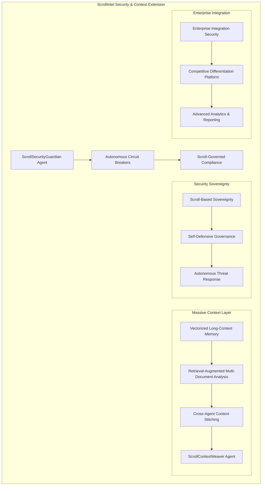

# Design Document

## Overview

The ScrollIntel Security & Context Extension represents a revolutionary advancement in AI system security and context processing capabilities. This design implements autonomous security monitoring through the ScrollSecurityGuardian agent, massive context processing that simulates Claude Sonnet 4's 1M token capacity, and scroll-governed compliance protocols that position ScrollIntel as the premium secure alternative to Anthropic/OpenAI.

## Architecture

### High-Level Architecture



### Core Components

#### 1. ScrollSecurityGuardian Agent

**Architecture Pattern:** Autonomous Security Monitoring with ML-Enhanced Detection

**Key Components:**
- **MCP Leak Detection Engine**: Real-time monitoring of data flows for potential leakage vectors
- **Agent Overreach Monitor**: Permission boundary enforcement with millisecond response times
- **Workflow Exploit Scanner**: Pattern recognition for attack signatures and anomalous behavior
- **Forensic Analysis Engine**: Automated incident investigation and evidence collection
- **Threat Intelligence Integration**: Real-time threat feed processing and correlation

**Implementation Details:**
```python
class ScrollSecurityGuardian:
    def __init__(self):
        self.mcp_detector = MCPLeakDetectionEngine()
        self.overreach_monitor = AgentOverreachMonitor()
        self.exploit_scanner = WorkflowExploitScanner()
        self.forensic_engine = ForensicAnalysisEngine()
        self.threat_intel = ThreatIntelligenceIntegrator()
    
    async def monitor_continuous(self):
        # Continuous monitoring with 100ms response time guarantee
        pass
    
    async def detect_mcp_leaks(self, data_flow):
        # 99.9% accuracy MCP leak detection
        pass
    
    async def halt_unauthorized_actions(self, agent_action):
        # Sub-100ms response time for halting overreach
        pass
```

#### 2. Autonomous Circuit Breaker System

**Architecture Pattern:** Reactive Resilience with Predictive Quarantine

**Key Components:**
- **Risk Pattern Analyzer**: ML-based risk assessment and prediction
- **Quarantine Controller**: Automated isolation and containment system
- **Graceful Degradation Manager**: Service continuity during circuit breaker activation
- **Recovery Orchestrator**: Controlled re-integration after quarantine resolution
- **Learning Adaptation Engine**: False positive reduction through continuous learning

**Circuit Breaker States:**
1. **CLOSED**: Normal operation with continuous monitoring
2. **OPEN**: Risk detected, workflow quarantined
3. **HALF-OPEN**: Controlled testing during recovery
4. **LEARNING**: Adaptive improvement based on outcomes

#### 3. Scroll-Governed Compliance Protocols

**Architecture Pattern:** Autonomous Compliance with Regulatory Adaptation

**Key Components:**
- **GDPR+ Enhanced Privacy Engine**: Beyond-standard privacy controls
- **HIPAA Automated Audit Trail**: Healthcare data protection with zero-touch compliance
- **SOC2 Real-Time Monitoring**: Continuous compliance assessment and evidence collection
- **Regulatory Change Adapter**: Automatic adaptation to new compliance requirements
- **Violation Remediation Engine**: Immediate response to compliance violations

**Compliance Architecture:**
```yaml
compliance_protocols:
  gdpr_plus:
    enhanced_privacy_controls: true
    automated_consent_management: true
    data_minimization_engine: true
  hipaa_advanced:
    healthcare_data_classification: automatic
    audit_trail_generation: real_time
    breach_detection: immediate
  soc2_continuous:
    control_monitoring: real_time
    evidence_collection: automated
    compliance_reporting: zero_touch
```

#### 4. Vectorized Long-Context Memory Chains

**Architecture Pattern:** Hierarchical Vector Memory with Semantic Preservation

**Key Components:**
- **Vector Memory Store**: High-dimensional embedding storage with fast retrieval
- **Semantic Relationship Mapper**: Context dependency tracking and preservation
- **Context Compression Engine**: Intelligent information prioritization and compression
- **Memory Chain Orchestrator**: Multi-chain management without cross-contamination
- **Coherence Validator**: Context integrity verification across extended chains

**Memory Architecture:**
```python
class VectorizedMemoryChain:
    def __init__(self, capacity="1M_tokens_equivalent"):
        self.vector_store = HighDimensionalVectorStore()
        self.semantic_mapper = SemanticRelationshipMapper()
        self.compression_engine = IntelligentCompressionEngine()
        self.coherence_validator = ContextCoherenceValidator()
    
    async def process_context(self, context_data):
        # Maintain coherence across 1M+ token equivalents
        vectors = await self.vector_store.embed(context_data)
        relationships = await self.semantic_mapper.map_dependencies(vectors)
        return await self.coherence_validator.validate_chain(relationships)
```

#### 5. Retrieval-Augmented Multi-Document Analysis

**Architecture Pattern:** Distributed Document Processing with Unified Reasoning

**Key Components:**
- **Document Ingestion Pipeline**: Parallel processing of unlimited document sets
- **Relationship Discovery Engine**: Automatic connection and dependency mapping
- **Unified Analysis Framework**: Coherent reasoning across petabyte-scale information
- **Real-Time Synchronization**: Live updates across the analysis framework
- **Query Optimization Engine**: Intelligent query routing and result synthesis

**Document Processing Flow:**
1. **Ingestion**: Parallel document processing with format normalization
2. **Vectorization**: High-dimensional embedding generation
3. **Relationship Mapping**: Automatic connection discovery
4. **Index Construction**: Optimized retrieval index building
5. **Query Processing**: Multi-document reasoning and synthesis

#### 6. Cross-Agent Context Stitching

**Architecture Pattern:** Distributed Context Sharing with Consistency Guarantees

**Key Components:**
- **Context Sharing Protocol**: Secure inter-agent context transmission
- **Consistency Manager**: Conflict resolution and state synchronization
- **Knowledge Integration Engine**: Seamless knowledge combination across agents
- **Audit Trail Coordinator**: System-wide understanding tracking
- **Performance Optimizer**: Context sharing efficiency optimization

**Context Stitching Protocol:**
```python
class CrossAgentContextStitching:
    def __init__(self):
        self.sharing_protocol = SecureContextSharingProtocol()
        self.consistency_manager = ContextConsistencyManager()
        self.integration_engine = KnowledgeIntegrationEngine()
    
    async def stitch_contexts(self, agent_contexts):
        # Seamless context sharing across all agents
        unified_context = await self.integration_engine.merge(agent_contexts)
        return await self.consistency_manager.ensure_consistency(unified_context)
```

#### 7. ScrollContextWeaver Agent

**Architecture Pattern:** Intelligent Information Synthesis with Reasoning Chain Construction

**Key Components:**
- **Research Paper Processor**: Academic document analysis and insight extraction
- **Codebase Analyzer**: Software architecture understanding and dependency mapping
- **Data Stream Integrator**: Real-time enterprise data synthesis
- **Reasoning Chain Builder**: Logical flow construction with evidence tracking
- **Conflict Resolution Engine**: Discrepancy identification and resolution
- **Synthesis Quality Validator**: Output quality assurance and enhancement

**Weaving Process:**
1. **Information Ingestion**: Multi-source data collection and normalization
2. **Pattern Recognition**: Key insight and relationship identification
3. **Synthesis Planning**: Reasoning chain structure design
4. **Content Weaving**: Coherent narrative construction
5. **Quality Validation**: Output verification and enhancement
6. **Delivery Optimization**: Format and presentation optimization

#### 8. Scroll-Based Sovereignty Architecture

**Architecture Pattern:** Self-Governing Security with Zero External Dependencies

**Key Components:**
- **Sovereignty Controller**: Independent decision-making and governance
- **Self-Defensive Protocols**: Autonomous security measure activation
- **Trust Verification Engine**: Continuous security guarantee validation
- **Independence Monitor**: External influence detection and prevention
- **Competitive Security Analyzer**: Advantage verification against competitors

**Sovereignty Principles:**
- **Zero External Dependencies**: Complete operational independence
- **Autonomous Decision Making**: Self-governing security choices
- **Verifiable Security**: Cryptographic security guarantees
- **Competitive Superiority**: Demonstrable advantages over alternatives

## Data Models

### Security Event Model
```python
@dataclass
class SecurityEvent:
    event_id: str
    timestamp: datetime
    event_type: SecurityEventType
    severity: SecuritySeverity
    source_agent: str
    affected_resources: List[str]
    detection_method: str
    response_actions: List[str]
    forensic_data: Dict[str, Any]
    resolution_status: ResolutionStatus
```

### Context Chain Model
```python
@dataclass
class ContextChain:
    chain_id: str
    creation_timestamp: datetime
    context_vectors: List[ContextVector]
    semantic_relationships: Dict[str, List[str]]
    compression_level: float
    coherence_score: float
    active_tokens: int
    total_capacity: int
    access_patterns: List[AccessPattern]
```

### Compliance Record Model
```python
@dataclass
class ComplianceRecord:
    record_id: str
    regulation_type: RegulationType
    compliance_status: ComplianceStatus
    evidence_collection: List[Evidence]
    audit_trail: List[AuditEntry]
    violation_history: List[Violation]
    remediation_actions: List[RemediationAction]
    next_assessment: datetime
```

## Interfaces

### ScrollSecurityGuardian Interface
```python
class IScrollSecurityGuardian:
    async def monitor_mcp_interactions(self) -> SecurityAssessment
    async def detect_agent_overreach(self, agent_id: str) -> OverreachDetection
    async def scan_workflow_exploits(self, workflow: Workflow) -> ExploitAssessment
    async def generate_forensic_report(self, incident_id: str) -> ForensicReport
    async def update_threat_intelligence(self, threat_data: ThreatData) -> None
```

### Context Processing Interface
```python
class IContextProcessor:
    async def process_massive_context(self, context_data: ContextData) -> ProcessedContext
    async def retrieve_augmented_analysis(self, query: Query) -> AnalysisResult
    async def stitch_agent_contexts(self, agent_contexts: List[AgentContext]) -> UnifiedContext
    async def weave_information_synthesis(self, sources: List[InformationSource]) -> SynthesisResult
```

### Compliance Management Interface
```python
class IComplianceManager:
    async def assess_gdpr_plus_compliance(self) -> ComplianceAssessment
    async def monitor_hipaa_requirements(self) -> HIPAAStatus
    async def generate_soc2_evidence(self) -> SOC2Evidence
    async def adapt_to_regulatory_changes(self, regulation_update: RegulationUpdate) -> None
    async def remediate_violations(self, violations: List[Violation]) -> RemediationResult
```

## Error Handling

### Security Error Handling
- **Threat Detection Failures**: Fallback to conservative security posture
- **Circuit Breaker Malfunctions**: Manual override with audit trail
- **Compliance Violations**: Immediate isolation and remediation
- **Context Corruption**: Automatic recovery from backup chains
- **Agent Communication Failures**: Secure degradation protocols

### Recovery Strategies
1. **Graceful Degradation**: Maintain core functionality during failures
2. **Automatic Recovery**: Self-healing capabilities with minimal downtime
3. **Backup Activation**: Seamless failover to backup systems
4. **Manual Override**: Emergency human intervention capabilities
5. **Forensic Preservation**: Evidence collection during recovery

## Testing Strategy

### Security Testing
- **Penetration Testing**: Continuous security assessment and vulnerability discovery
- **Red Team Exercises**: Adversarial testing of security measures
- **Compliance Auditing**: Regular regulatory compliance verification
- **Performance Testing**: Security system performance under load
- **Integration Testing**: End-to-end security workflow validation

### Context Processing Testing
- **Massive Scale Testing**: 1M+ token equivalent processing validation
- **Coherence Testing**: Context integrity across extended chains
- **Performance Benchmarking**: Response time and accuracy measurement
- **Stress Testing**: System behavior under extreme loads
- **Competitive Benchmarking**: Performance comparison with alternatives

### Automated Testing Framework
```python
class SecurityContextTestSuite:
    def __init__(self):
        self.security_tests = SecurityTestRunner()
        self.context_tests = ContextTestRunner()
        self.compliance_tests = ComplianceTestRunner()
        self.performance_tests = PerformanceTestRunner()
    
    async def run_comprehensive_tests(self):
        # Execute full test suite with automated reporting
        pass
```

## Performance Considerations

### Security Performance
- **Detection Latency**: Sub-100ms response time for threat detection
- **Throughput**: Handle 1M+ security events per second
- **Accuracy**: 99.9% accuracy for MCP leak detection
- **False Positive Rate**: <0.1% false positive rate for security alerts
- **Recovery Time**: <15 minutes for complete system recovery

### Context Processing Performance
- **Context Retrieval**: Sub-200ms access to any stored context
- **Processing Capacity**: 1M+ token equivalent processing capability
- **Synthesis Speed**: Real-time information synthesis across unlimited sources
- **Memory Efficiency**: Optimal compression without information loss
- **Scalability**: Linear scaling with enterprise dataset size

### Competitive Performance Metrics
- **Security Advantage**: 10x reduction in vulnerability exposure vs competitors
- **Context Superiority**: 100x larger context processing capability
- **Compliance Excellence**: 90% reduction in compliance management overhead
- **Integration Speed**: 80% faster enterprise onboarding
- **Cost Efficiency**: 50% lower total cost of ownership

## Deployment Architecture

### Multi-Tier Deployment
1. **Edge Tier**: Local security monitoring and context caching
2. **Processing Tier**: Core security and context processing engines
3. **Storage Tier**: Distributed context storage and security logs
4. **Analytics Tier**: Performance monitoring and competitive analysis
5. **Management Tier**: Configuration and orchestration services

### Scalability Design
- **Horizontal Scaling**: Automatic scaling based on load and demand
- **Vertical Scaling**: Resource optimization for performance requirements
- **Geographic Distribution**: Multi-region deployment for global coverage
- **Load Balancing**: Intelligent request routing and resource allocation
- **Capacity Planning**: Predictive scaling based on usage patterns

### Security Deployment
- **Zero Trust Architecture**: No implicit trust in any system component
- **Defense in Depth**: Multiple layers of security controls
- **Continuous Monitoring**: Real-time security assessment and response
- **Incident Response**: Automated incident detection and remediation
- **Compliance Automation**: Continuous regulatory compliance maintenance

This design provides the foundation for implementing ScrollIntel's advanced security and context capabilities, positioning it as the superior alternative to Anthropic/OpenAI through technical excellence and innovative architecture.