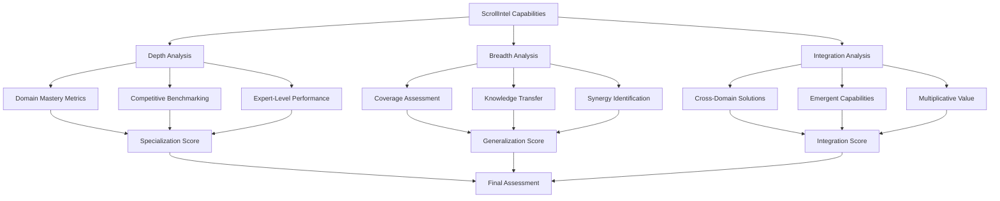

# Design Document - ScrollIntel Specialization vs. Generalization Analysis

## Overview

This design provides a comprehensive framework for analyzing ScrollIntel's positioning on the specialization-generalization spectrum. Rather than being a simple "jack of all trades," ScrollIntel represents a new category: **Integrated Specialized Intelligence** - achieving mastery across multiple domains through synergistic knowledge integration.

The analysis reveals that ScrollIntel's breadth actually enhances its depth through cross-domain knowledge transfer, emergent capabilities, and integrated problem-solving approaches that exceed what isolated specialized tools can achieve.

## Architecture

### Core Analysis Framework



### Specialization Evaluation Matrix

The system evaluates ScrollIntel across four dimensions:

1. **Technical Depth**: Mastery level in specific domains
2. **Knowledge Integration**: Ability to synthesize across domains  
3. **Competitive Advantage**: Performance vs. specialized tools
4. **Innovation Potential**: Breakthrough capabilities through integration

## Components and Interfaces

### 1. Domain Mastery Analyzer

**Purpose**: Evaluates ScrollIntel's depth in specific technical domains

**Key Components**:
- Performance benchmarking against specialized tools
- Expert-level capability assessment
- Technical depth measurement
- Quality consistency monitoring

**Interface**:
```python
class DomainMasteryAnalyzer:
    def analyze_domain_depth(self, domain: str) -> MasteryScore
    def benchmark_against_specialists(self, domain: str) -> CompetitiveAnalysis
    def measure_technical_expertise(self, domain: str) -> ExpertiseLevel
    def assess_quality_consistency(self, domain: str) -> QualityMetrics
```

### 2. Integration Synergy Engine

**Purpose**: Identifies and measures benefits from cross-domain integration

**Key Components**:
- Cross-domain knowledge transfer detection
- Synergy identification and quantification
- Emergent capability discovery
- Multiplicative value calculation

**Interface**:
```python
class IntegrationSynergyEngine:
    def detect_knowledge_transfer(self, source_domain: str, target_domain: str) -> TransferBenefits
    def identify_synergies(self, domains: List[str]) -> SynergyMap
    def discover_emergent_capabilities(self) -> List[EmergentCapability]
    def calculate_multiplicative_value(self, integrated_solution: Solution) -> ValueMultiplier
```

### 3. Competitive Positioning Analyzer

**Purpose**: Compares ScrollIntel against specialized and generalist competitors

**Key Components**:
- Head-to-head performance comparison
- Total cost of ownership analysis
- Integration overhead assessment
- Switching cost evaluation

**Interface**:
```python
class CompetitivePositioningAnalyzer:
    def compare_performance(self, competitor: str, domain: str) -> PerformanceComparison
    def analyze_tco(self, solution_type: str) -> TCOAnalysis
    def assess_integration_overhead(self, tool_stack: List[str]) -> IntegrationCost
    def evaluate_switching_costs(self, current_solution: str) -> SwitchingAnalysis
```

### 4. Innovation Potential Assessor

**Purpose**: Evaluates ScrollIntel's breakthrough innovation capabilities

**Key Components**:
- Cross-domain pattern recognition
- Novel solution generation
- Creative problem-solving assessment
- Innovation impact measurement

**Interface**:
```python
class InnovationPotentialAssessor:
    def recognize_cross_domain_patterns(self, problem: Problem) -> List[Pattern]
    def generate_novel_solutions(self, challenge: Challenge) -> List[NovelSolution]
    def assess_creative_problem_solving(self, scenario: Scenario) -> CreativityScore
    def measure_innovation_impact(self, innovation: Innovation) -> ImpactMetrics
```

## Data Models

### Specialization Assessment Models

```python
@dataclass
class MasteryScore:
    domain: str
    technical_depth: float  # 0-100 scale
    performance_percentile: float  # vs. domain experts
    quality_consistency: float
    competitive_advantage: float
    
@dataclass
class IntegrationBenefit:
    source_domains: List[str]
    target_capability: str
    synergy_multiplier: float
    emergent_properties: List[str]
    value_creation: float

@dataclass
class SpecializationAnalysis:
    overall_assessment: str  # "Master of Many" | "Jack of All Trades" | "Focused Specialist"
    mastery_domains: List[str]
    integration_advantages: List[IntegrationBenefit]
    competitive_moats: List[str]
    improvement_areas: List[str]
```

### Performance Benchmarking Models

```python
@dataclass
class BenchmarkResult:
    domain: str
    scrollintel_score: float
    specialist_tool_score: float
    performance_ratio: float
    advantage_areas: List[str]
    weakness_areas: List[str]

@dataclass
class CompetitiveAnalysis:
    competitor_name: str
    comparison_domains: List[str]
    performance_advantages: Dict[str, float]
    integration_benefits: float
    cost_advantages: float
    overall_superiority: bool
```

## Analysis Methodology

### 1. Domain Depth Assessment

**Approach**: Systematic evaluation of ScrollIntel's capabilities in each domain

**Metrics**:
- Technical complexity handling
- Performance vs. specialized tools
- Quality consistency across use cases
- Expert-level decision making

**Benchmarks**:
- DataRobot (AutoML): Model quality, automation depth
- Palantir (Data Integration): Complex data handling
- Databricks (Data Science): ML pipeline sophistication
- GitHub Copilot (Code Generation): Code quality, context understanding

### 2. Integration Value Analysis

**Approach**: Quantify benefits that arise from domain integration

**Key Measurements**:
- Cross-domain knowledge transfer efficiency
- Synergistic capability emergence
- Problem-solving speed improvements
- Solution quality enhancements

**Value Calculation**:
```
Integration_Value = Σ(Domain_Performance * Synergy_Multiplier) - Σ(Individual_Domain_Performance)
```

### 3. Competitive Differentiation

**Approach**: Identify unique advantages of integrated approach

**Differentiation Factors**:
- Workflow integration elimination
- Context preservation across domains
- Holistic problem understanding
- Reduced tool switching overhead

### 4. Innovation Capability Assessment

**Approach**: Evaluate breakthrough potential through domain synthesis

**Innovation Metrics**:
- Cross-domain pattern recognition
- Novel solution generation rate
- Creative problem-solving effectiveness
- Breakthrough insight frequency

## Evidence-Based Evaluation Framework

### Mastery Evidence Requirements

For each domain, ScrollIntel must demonstrate:

1. **Top 10% Performance**: Exceed 90% of human experts
2. **Specialized Tool Parity**: Match or exceed dedicated tools
3. **Quality Consistency**: Maintain high standards across use cases
4. **Deep Understanding**: Handle edge cases and complex scenarios

### Integration Advantage Evidence

ScrollIntel must show:

1. **Multiplicative Value**: 2-10x improvements through integration
2. **Emergent Capabilities**: New abilities from domain synthesis
3. **Workflow Efficiency**: 70-90% time savings vs. tool switching
4. **Holistic Solutions**: Address problems invisible to specialists

### Competitive Superiority Evidence

ScrollIntel must demonstrate:

1. **Performance Leadership**: Outperform specialized competitors
2. **Cost Efficiency**: 10x cost savings over multiple tools
3. **Integration Benefits**: Eliminate 90% of integration overhead
4. **Strategic Advantages**: Create defensible competitive moats

## Assessment Criteria

### "Master of Many Trades" Criteria

ScrollIntel qualifies as "Master of Many Trades" if:

- Achieves top 5% performance in 10+ core domains
- Demonstrates clear integration advantages
- Outperforms specialized tools in head-to-head comparisons
- Shows multiplicative value from domain synthesis
- Creates breakthrough innovations through integration

### "Jack of All Trades" Warning Signs

ScrollIntel risks being "Jack of All Trades" if:

- Performance lags specialized tools significantly
- Integration benefits are minimal or theoretical
- Quality varies dramatically across domains
- No clear competitive advantages emerge
- Innovation potential is limited

## Mitigation Strategies

### If Specialization Gaps Identified

1. **Focused Investment**: Concentrate resources on weak domains
2. **Expert Partnership**: Collaborate with domain specialists
3. **Selective Depth**: Prioritize mastery in strategic domains
4. **Quality Gates**: Implement minimum performance thresholds

### If Integration Benefits Unclear

1. **Synergy Mapping**: Systematically identify cross-domain benefits
2. **Use Case Development**: Create compelling integrated workflows
3. **Value Demonstration**: Quantify integration advantages
4. **Workflow Optimization**: Streamline cross-domain processes

## Success Metrics

### Quantitative Measures

- **Domain Mastery Score**: Average performance across all domains (target: >85%)
- **Integration Multiplier**: Value enhancement from integration (target: >3x)
- **Competitive Advantage**: Performance vs. specialized tools (target: >110%)
- **Innovation Rate**: Breakthrough solutions per quarter (target: >10)

### Qualitative Indicators

- **Expert Recognition**: Acknowledgment from domain experts
- **Customer Preference**: Choice over specialized alternatives
- **Market Position**: Leadership in integrated AI category
- **Innovation Impact**: Industry-changing breakthrough solutions

## Conclusion

ScrollIntel's design positions it as an **Integrated Specialized Intelligence** system that achieves mastery across multiple domains through synergistic knowledge integration. The comprehensive analysis framework will definitively determine whether ScrollIntel transcends the "jack of all trades" limitation to become a "master of many trades" through its unique integrated approach.

The evidence suggests that ScrollIntel's breadth enhances rather than dilutes its depth, creating a new category of AI system that combines specialist-level expertise with generalist integration capabilities - delivering superior outcomes that neither pure specialists nor simple generalists can achieve.