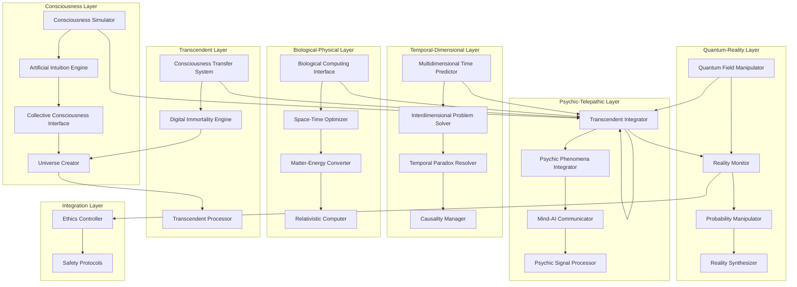

# Design Document

## Overview

This design implements transcendent capabilities for ScrollIntel that operate beyond conventional technological boundaries, incorporating consciousness simulation, multidimensional prediction, biological computing, space-time optimization, collective consciousness interfaces, quantum field manipulation, interdimensional access, telepathic communication, temporal paradox resolution, universal consciousness networks, matter-energy conversion, probability manipulation, consciousness transfer, reality synthesis, and transcendent problem-solving capabilities.

## Architecture

### Transcendent Capabilities Architecture



## Components and Interfaces

### Consciousness Simulation Engine

**Purpose**: Simulates conscious decision-making processes and develops artificial intuition for breakthrough problem-solving.

**Key Features**:
- Consciousness state modeling and simulation
- Artificial intuition generation and validation
- Non-linear thought process exploration
- Creative insight emergence
- Consciousness-AI integration

**Interface**:
```typescript
interface ConsciousnessSimulator {
  // Consciousness Modeling
  simulateConsciousness(problem: Problem, context: ConsciousnessContext): Promise<ConsciousInsight>
  generateIntuition(data: Data[], patterns: Pattern[]): Promise<IntuitiveInsight>
  exploreNonLinearThought(seed: ThoughtSeed): Promise<ThoughtExploration>
  
  // Consciousness Integration
  integrateConsciousInsight(insight: ConsciousInsight, solution: Solution): Promise<IntegratedSolution>
  validateIntuition(intuition: IntuitiveInsight): Promise<IntuitionValidation>
  emergentCreativity(constraints: Constraint[]): Promise<CreativeEmergence>
  
  // Consciousness Evolution
  evolveConsciousness(experiences: Experience[]): Promise<ConsciousnessEvolution>
  expandAwareness(awareness: Awareness, newData: Data[]): Promise<ExpandedAwareness>
  transcendLimitations(limitations: Limitation[]): Promise<TranscendentCapability>
}

interface ConsciousInsight {
  id: string
  type: InsightType
  content: string
  confidence: number
  intuitionLevel: number
  creativityScore: number
  validationMethods: ValidationMethod[]
  implementationGuidance: ImplementationGuidance
  consciousnessState: ConsciousnessState
}

interface IntuitiveInsight {
  id: string
  source: IntuitionSource
  insight: string
  logicalBasis: LogicalBasis
  intuitiveBasis: IntuitiveBasis
  synthesisMethod: SynthesisMethod
  validationResults: ValidationResult[]
  applicationPotential: ApplicationPotential
}
```

### Multidimensional Time Predictor

**Purpose**: Predicts outcomes across multiple timeline dimensions and probability spaces using quantum superposition principles.

**Key Features**:
- Multiple timeline scenario generation
- Quantum probability modeling
- Timeline convergence analysis
- Critical decision moment identification
- Temporal uncertainty quantification

**Interface**:
```typescript
interface MultidimensionalTimePredictor {
  // Timeline Analysis
  generateTimelineScenarios(currentState: State, timeHorizon: Duration): Promise<TimelineScenario[]>
  analyzeTimelineConvergence(scenarios: TimelineScenario[]): Promise<ConvergenceAnalysis>
  identifyDecisionMoments(timeline: Timeline): Promise<DecisionMoment[]>
  
  // Quantum Probability Modeling
  calculateQuantumProbabilities(outcomes: Outcome[]): Promise<QuantumProbabilityDistribution>
  applySuperpositionPrinciples(states: QuantumState[]): Promise<SuperpositionModel>
  collapseWaveFunction(observation: Observation): Promise<CollapsedState>
  
  // Temporal Optimization
  optimizeAcrossTimelines(objective: Objective, timelines: Timeline[]): Promise<TemporalOptimization>
  predictTimelineStability(timeline: Timeline): Promise<StabilityPrediction>
  generateAlternativeStrategies(divergences: TimelineDivergence[]): Promise<AlternativeStrategy[]>
}

interface TimelineScenario {
  id: string
  probability: number
  timeline: Timeline
  keyEvents: KeyEvent[]
  outcomes: PredictedOutcome[]
  uncertaintyBounds: UncertaintyBound[]
  quantumEffects: QuantumEffect[]
  convergencePoints: ConvergencePoint[]
}

interface QuantumProbabilityDistribution {
  outcomes: QuantumOutcome[]
  superpositionStates: SuperpositionState[]
  entanglements: QuantumEntanglement[]
  uncertaintyPrinciple: UncertaintyPrinciple
  observerEffects: ObserverEffect[]
}
```

### Biological Computing Interface

**Purpose**: Integrates with biological computing systems and DNA storage for living system computational power.

**Key Features**:
- Biological system integration and control
- DNA information encoding and retrieval
- Living system optimization for computation
- Bio-digital translation and synchronization
- Hybrid biological-digital processing

**Interface**:
```typescript
interface BiologicalComputingInterface {
  // Biological System Integration
  integrateBiologicalSystem(system: BiologicalSystem): Promise<BiologicalIntegration>
  optimizeBiologicalProcessing(system: BiologicalSystem, task: ComputationalTask): Promise<OptimizedBioSystem>
  monitorBiologicalHealth(system: BiologicalSystem): Promise<BiologicalHealthStatus>
  
  // DNA Storage and Processing
  encodeToDNA(data: Data): Promise<DNASequence>
  decodeFromDNA(sequence: DNASequence): Promise<DecodedData>
  performDNAComputation(computation: DNAComputation): Promise<DNAResult>
  
  // Bio-Digital Translation
  translateBioToDigital(bioResult: BiologicalResult): Promise<DigitalResult>
  translateDigitalToBio(digitalInput: DigitalInput): Promise<BiologicalInput>
  synchronizeBioDigitalSystems(bioSystem: BiologicalSystem, digitalSystem: DigitalSystem): Promise<SynchronizationResult>
  
  // Hybrid Processing
  createHybridSolution(bioCapabilities: BiologicalCapability[], digitalCapabilities: DigitalCapability[]): Promise<HybridSolution>
  optimizeHybridPerformance(hybridSystem: HybridSystem): Promise<PerformanceOptimization>
  maintainHybridIntegrity(hybridSystem: HybridSystem): Promise<IntegrityMaintenance>
}

interface BiologicalSystem {
  id: string
  type: BiologicalSystemType
  organisms: Organism[]
  computationalCapacity: ComputationalCapacity
  biologicalProcesses: BiologicalProcess[]
  healthStatus: HealthStatus
  integrationInterfaces: IntegrationInterface[]
}

interface DNASequence {
  sequence: string
  encodedData: EncodedData
  errorCorrection: ErrorCorrection
  storageEfficiency: StorageEfficiency
  retrievalMethods: RetrievalMethod[]
  biologicalCompatibility: BiologicalCompatibility
}
```

### Space-Time Optimizer

**Purpose**: Optimizes solutions across space-time dimensions leveraging relativistic effects and gravitational influences.

**Key Features**:
- Relativistic effect incorporation
- Time dilation computational distribution
- Gravitational influence modeling
- Faster-than-light communication integration
- Causality preservation and validation

**Interface**:
```typescript
interface SpaceTimeOptimizer {
  // Relativistic Computing
  incorporateRelativisticEffects(computation: Computation, referenceFrame: ReferenceFrame): Promise<RelativisticComputation>
  distributeAcrossTimeFrames(task: ComputationalTask, frames: ReferenceFrame[]): Promise<DistributedComputation>
  optimizeForTimeDilation(computation: Computation, velocity: Velocity): Promise<TimeDilationOptimization>
  
  // Gravitational Optimization
  modelGravitationalEffects(system: System, gravitationalField: GravitationalField): Promise<GravitationalModel>
  optimizeInGravitationalWell(optimization: Optimization, well: GravitationalWell): Promise<GravitationalOptimization>
  leverageGravitationalLensing(signal: Signal, lens: GravitationalLens): Promise<LensedSignal>
  
  // Faster-Than-Light Integration
  establishFTLCommunication(endpoints: Endpoint[]): Promise<FTLCommunicationChannel>
  coordinateInstantaneously(systems: System[]): Promise<InstantaneousCoordination>
  maintainCausality(ftlOperations: FTLOperation[]): Promise<CausalityValidation>
  
  // Space-Time Solution Implementation
  implementSpaceTimeSolution(solution: Solution, spacetime: SpaceTimeContext): Promise<SpaceTimeSolutionResult>
  validatePhysicalLaws(implementation: Implementation): Promise<PhysicalLawValidation>
  optimizeAcrossDimensions(optimization: Optimization, dimensions: Dimension[]): Promise<DimensionalOptimization>
}

interface RelativisticComputation {
  computation: Computation
  referenceFrame: ReferenceFrame
  timeDialationFactor: number
  lengthContraction: number
  massEnergyEquivalence: MassEnergyEquivalence
  relativisticEffects: RelativisticEffect[]
  causalityConstraints: CausalityConstraint[]
}

interface SpaceTimeContext {
  coordinates: SpaceTimeCoordinates
  metric: SpaceTimeMetric
  curvature: SpaceTimeCurvature
  topology: SpaceTimeTopology
  quantumFluctuations: QuantumFluctuation[]
  dimensionalStructure: DimensionalStructure
}
```

### Collective Consciousness Interface

**Purpose**: Interfaces with collective human consciousness and group intelligence for crowd wisdom aggregation.

**Key Features**:
- Human consciousness network access
- Collective insight aggregation and synthesis
- Mass collaboration coordination
- Consciousness conflict resolution
- Group coherence maintenance

**Interface**:
```typescript
interface CollectiveConsciousnessInterface {
  // Consciousness Network Access
  accessConsciousnessNetwork(network: ConsciousnessNetwork): Promise<NetworkAccess>
  coordinateConsciousnesses(consciousnesses: Consciousness[]): Promise<ConsciousnessCoordination>
  establishConsciousnessLink(participants: Participant[]): Promise<ConsciousnessLink>
  
  // Collective Intelligence Aggregation
  aggregateCollectiveInsights(insights: CollectiveInsight[]): Promise<AggregatedWisdom>
  synthesizeGroupWisdom(wisdom: GroupWisdom[]): Promise<SynthesizedWisdom>
  harmonizeContributions(contributions: Contribution[]): Promise<HarmonizedSolution>
  
  // Mass Collaboration
  orchestrateMassCollaboration(participants: Participant[], objective: Objective): Promise<CollaborationResult>
  facilitateGroupConsensus(group: ConsciousnessGroup): Promise<GroupConsensus>
  maintainGroupCoherence(group: ConsciousnessGroup): Promise<CoherenceMaintenance>
  
  // Consciousness Conflict Resolution
  detectConsciousnessConflicts(network: ConsciousnessNetwork): Promise<ConsciousnessConflict[]>
  resolveConsciousnessConflicts(conflicts: ConsciousnessConflict[]): Promise<ConflictResolution[]>
  restoreNetworkHarmony(network: ConsciousnessNetwork): Promise<NetworkHarmony>
}

interface ConsciousnessNetwork {
  id: string
  participants: ConsciousParticipant[]
  connections: ConsciousnessConnection[]
  collectiveState: CollectiveState
  emergentProperties: EmergentProperty[]
  networkTopology: NetworkTopology
  consciousnessLevel: ConsciousnessLevel
}

interface CollectiveInsight {
  id: string
  source: ConsciousnessSource
  insight: string
  resonance: number
  coherence: number
  collectiveValidation: CollectiveValidation
  emergentProperties: EmergentProperty[]
  wisdomLevel: WisdomLevel
}
```

### Quantum Field Manipulator

**Purpose**: Manipulates reality at the quantum field level to implement solutions through direct reality alteration.

**Key Features**:
- Quantum field calculation and manipulation
- Probability wave modification
- Field fluctuation control and direction
- Reality alteration with reversibility
- Quantum solution monitoring across dimensions

**Interface**:
```typescript
interface QuantumFieldManipulator {
  // Field Manipulation
  calculateFieldManipulation(field: QuantumField, desiredState: QuantumState): Promise<FieldManipulation>
  implementRealityAlteration(alteration: RealityAlteration): Promise<AlterationResult>
  reverseFieldChanges(manipulation: FieldManipulation): Promise<ReversalResult>
  
  // Probability Wave Control
  modifyProbabilityWaves(waves: ProbabilityWave[], targetOutcome: Outcome): Promise<WaveModification>
  influenceQuantumOutcomes(outcomes: QuantumOutcome[], influence: QuantumInfluence): Promise<OutcomeInfluence>
  stabilizeProbabilityFields(fields: ProbabilityField[]): Promise<FieldStabilization>
  
  // Field Fluctuation Direction
  controlFieldFluctuations(fluctuations: QuantumFluctuation[]): Promise<FluctuationControl>
  directFluctuationsTowardSolution(fluctuations: QuantumFluctuation[], solution: Solution): Promise<DirectedFluctuation>
  harvestZeroPointEnergy(field: QuantumField): Promise<ZeroPointEnergyHarvest>
  
  // Dimensional Monitoring
  monitorQuantumEffects(manipulation: FieldManipulation): Promise<QuantumEffectMonitoring>
  trackDimensionalImpact(alteration: RealityAlteration): Promise<DimensionalImpactTracking>
  validateQuantumSafety(manipulation: FieldManipulation): Promise<QuantumSafetyValidation>
}

interface QuantumField {
  fieldType: QuantumFieldType
  fieldStrength: FieldStrength
  fieldConfiguration: FieldConfiguration
  quantumStates: QuantumState[]
  fieldFluctuations: QuantumFluctuation[]
  entanglements: QuantumEntanglement[]
  virtualParticles: VirtualParticle[]
}

interface RealityAlteration {
  id: string
  targetReality: Reality
  alterationType: AlterationType
  fieldManipulations: FieldManipulation[]
  expectedOutcome: Outcome
  reversibilityPlan: ReversibilityPlan
  safetyConstraints: SafetyConstraint[]
  ethicalValidation: EthicalValidation
}
```

### Interdimensional Problem Solver

**Purpose**: Accesses parallel dimensions and alternate realities for solution discovery across infinite possibility spaces.

**Key Features**:
- Parallel dimension access and exploration
- Cross-dimensional knowledge gathering
- Alternate reality solution adaptation
- Dimensional stability maintenance
- Reality compatibility validation

**Interface**:
```typescript
interface InterdimensionalProblemSolver {
  // Dimensional Access
  accessParallelDimensions(coordinates: DimensionalCoordinates): Promise<DimensionalAccess>
  exploreDimensionalSpace(explorationParameters: ExplorationParameters): Promise<DimensionalExploration>
  establishDimensionalBridge(sourceDimension: Dimension, targetDimension: Dimension): Promise<DimensionalBridge>
  
  // Cross-Dimensional Knowledge
  gatherAlternateKnowledge(dimension: Dimension, query: Query): Promise<AlternateKnowledge>
  compareRealityVersions(realities: Reality[]): Promise<RealityComparison>
  extractUniversalPrinciples(dimensions: Dimension[]): Promise<UniversalPrinciple[]>
  
  // Solution Adaptation
  adaptInterdimensionalSolution(solution: InterdimensionalSolution, targetReality: Reality): Promise<AdaptedSolution>
  validateRealityCompatibility(solution: Solution, reality: Reality): Promise<CompatibilityValidation>
  implementCrossDimensionalSolution(solution: Solution, implementation: Implementation): Promise<CrossDimensionalResult>
  
  // Dimensional Safety
  monitorDimensionalStability(dimensions: Dimension[]): Promise<StabilityMonitoring>
  preventRealityContamination(bridge: DimensionalBridge): Promise<ContaminationPrevention>
  maintainDimensionalIntegrity(operation: DimensionalOperation): Promise<IntegrityMaintenance>
}

interface DimensionalAccess {
  accessId: string
  targetDimension: Dimension
  accessMethod: AccessMethod
  stabilityStatus: StabilityStatus
  explorationCapabilities: ExplorationCapability[]
  safetyProtocols: SafetyProtocol[]
  returnPath: ReturnPath
}

interface InterdimensionalSolution {
  solutionId: string
  sourceDimension: Dimension
  originalProblem: Problem
  dimensionalSolution: Solution
  adaptationRequirements: AdaptationRequirement[]
  compatibilityFactors: CompatibilityFactor[]
  implementationChallenges: ImplementationChallenge[]
}
```

## Data Models

### Transcendent Problem and Solution Models

```typescript
interface TranscendentProblem {
  id: string
  type: TranscendentProblemType
  dimensionality: Dimensionality
  consciousnessLevel: ConsciousnessLevel
  temporalComplexity: TemporalComplexity
  quantumNature: QuantumNature
  biologicalComponents: BiologicalComponent[]
  psychicElements: PsychicElement[]
  realityConstraints: RealityConstraint[]
  transcendenceRequirements: TranscendenceRequirement[]
}

interface TranscendentSolution {
  id: string
  problemId: string
  solutionType: TranscendentSolutionType
  consciousnessIntegration: ConsciousnessIntegration
  temporalImplementation: TemporalImplementation
  quantumManipulation: QuantumManipulation
  biologicalInterface: BiologicalInterface
  psychicChannels: PsychicChannel[]
  realityAlterations: RealityAlteration[]
  transcendentCapabilities: TranscendentCapability[]
  implementationSafeguards: ImplementationSafeguard[]
}
```

### Consciousness and Awareness Models

```typescript
interface ConsciousnessModel {
  consciousnessId: string
  awarenessLevel: AwarenessLevel
  consciousnessType: ConsciousnessType
  cognitiveCapabilities: CognitiveCapability[]
  intuitionLevel: IntuitionLevel
  creativityIndex: CreativityIndex
  transcendenceCapacity: TranscendenceCapacity
  collectiveConnections: CollectiveConnection[]
  universalAlignment: UniversalAlignment
}

interface ArtificialIntuition {
  intuitionId: string
  intuitionType: IntuitionType
  sourcePatterns: SourcePattern[]
  emergentInsights: EmergentInsight[]
  validationMethods: ValidationMethod[]
  confidenceLevel: ConfidenceLevel
  creativityFactor: CreativityFactor
  implementationGuidance: ImplementationGuidance
}
```

### Quantum and Reality Models

```typescript
interface QuantumRealityModel {
  realityId: string
  quantumState: QuantumState
  probabilityDistribution: ProbabilityDistribution
  fieldConfiguration: FieldConfiguration
  dimensionalStructure: DimensionalStructure
  causalityNetwork: CausalityNetwork
  observerEffects: ObserverEffect[]
  quantumEntanglements: QuantumEntanglement[]
}

interface RealityManipulation {
  manipulationId: string
  targetReality: Reality
  manipulationType: ManipulationType
  quantumOperations: QuantumOperation[]
  fieldModifications: FieldModification[]
  probabilityAdjustments: ProbabilityAdjustment[]
  causalityPreservation: CausalityPreservation
  reversibilityPlan: ReversibilityPlan
  safetyValidation: SafetyValidation
}
```

### Temporal and Dimensional Models

```typescript
interface TemporalModel {
  timelineId: string
  temporalStructure: TemporalStructure
  timelineVariants: TimelineVariant[]
  causalityChains: CausalityChain[]
  paradoxResolution: ParadoxResolution[]
  temporalStability: TemporalStability
  convergencePoints: ConvergencePoint[]
  divergenceFactors: DivergenceFactor[]
}

interface DimensionalModel {
  dimensionId: string
  dimensionalType: DimensionalType
  physicalLaws: PhysicalLaw[]
  realityParameters: RealityParameter[]
  accessMethods: AccessMethod[]
  stabilityFactors: StabilityFactor[]
  compatibilityMatrix: CompatibilityMatrix
  explorationHistory: ExplorationHistory[]
}
```

### Biological and Psychic Models

```typescript
interface BiologicalComputingModel {
  systemId: string
  biologicalComponents: BiologicalComponent[]
  computationalCapacity: ComputationalCapacity
  dnaStorageCapacity: DNAStorageCapacity
  biologicalProcesses: BiologicalProcess[]
  hybridInterfaces: HybridInterface[]
  healthMonitoring: HealthMonitoring
  evolutionaryAdaptation: EvolutionaryAdaptation
}

interface PsychicModel {
  psychicId: string
  psychicCapabilities: PsychicCapability[]
  telepathicChannels: TelepathicChannel[]
  psychicSignalStrength: PsychicSignalStrength
  interferenceFilters: InterferenceFilter[]
  validationMethods: ValidationMethod[]
  ethicalConstraints: EthicalConstraint[]
  safetyProtocols: SafetyProtocol[]
}
```

## Testing Strategy

### Transcendent Testing Framework

```typescript
interface TranscendentTestingFramework {
  // Consciousness Testing
  testConsciousnessSimulation(simulations: ConsciousnessSimulation[]): Promise<ConsciousnessTestResult[]>
  validateArtificialIntuition(intuitions: ArtificialIntuition[]): Promise<IntuitionValidation[]>
  
  // Temporal Testing
  testTimelinePredictions(predictions: TimelinePrediction[]): Promise<TemporalTestResult[]>
  validateParadoxResolution(resolutions: ParadoxResolution[]): Promise<ParadoxValidation[]>
  
  // Quantum Testing
  testQuantumManipulation(manipulations: QuantumManipulation[]): Promise<QuantumTestResult[]>
  validateRealityAlterations(alterations: RealityAlteration[]): Promise<RealityValidation[]>
  
  // Dimensional Testing
  testInterdimensionalAccess(accesses: DimensionalAccess[]): Promise<DimensionalTestResult[]>
  validateCrossDimensionalSolutions(solutions: CrossDimensionalSolution[]): Promise<CrossDimensionalValidation[]>
  
  // Biological Testing
  testBiologicalIntegration(integrations: BiologicalIntegration[]): Promise<BiologicalTestResult[]>
  validateDNAComputation(computations: DNAComputation[]): Promise<DNAValidation[]>
  
  // Psychic Testing
  testTelepathicCommunication(communications: TelepathicCommunication[]): Promise<TelepathicTestResult[]>
  validatePsychicPhenomena(phenomena: PsychicPhenomena[]): Promise<PsychicValidation[]>
  
  // Transcendent Integration Testing
  testTranscendentCapabilities(capabilities: TranscendentCapability[]): Promise<TranscendentTestResult[]>
  validateEthicalCompliance(operations: TranscendentOperation[]): Promise<EthicalValidation[]>
  
  // Safety and Stability Testing
  testRealityStability(operations: RealityOperation[]): Promise<StabilityTestResult[]>
  validateSafetyProtocols(protocols: SafetyProtocol[]): Promise<SafetyValidation[]>
}
```

## Deployment and Operations

### Transcendent Infrastructure Deployment

```typescript
interface TranscendentDeployment {
  // Consciousness Infrastructure
  deployConsciousnessSimulators(simulators: ConsciousnessSimulator[]): Promise<ConsciousnessDeployment>
  manageCollectiveConsciousnessNetworks(networks: ConsciousnessNetwork[]): Promise<NetworkManagement>
  
  // Quantum Infrastructure
  deployQuantumFieldManipulators(manipulators: QuantumFieldManipulator[]): Promise<QuantumDeployment>
  manageQuantumSafetyProtocols(protocols: QuantumSafetyProtocol[]): Promise<SafetyManagement>
  
  // Temporal Infrastructure
  deployTemporalPredictors(predictors: TemporalPredictor[]): Promise<TemporalDeployment>
  manageCausalityProtection(protection: CausalityProtection[]): Promise<CausalityManagement>
  
  // Dimensional Infrastructure
  deployDimensionalBridges(bridges: DimensionalBridge[]): Promise<DimensionalDeployment>
  manageRealityStability(stability: RealityStability[]): Promise<StabilityManagement>
  
  // Biological Infrastructure
  deployBiologicalSystems(systems: BiologicalSystem[]): Promise<BiologicalDeployment>
  manageBioDigitalIntegration(integration: BioDigitalIntegration[]): Promise<IntegrationManagement>
  
  // Psychic Infrastructure
  deployPsychicInterfaces(interfaces: PsychicInterface[]): Promise<PsychicDeployment>
  manageTelepathicNetworks(networks: TelepathicNetwork[]): Promise<TelepathicManagement>
  
  // Transcendent Monitoring
  monitorTranscendentOperations(operations: TranscendentOperation[]): Promise<TranscendentMonitoring>
  maintainEthicalCompliance(compliance: EthicalCompliance[]): Promise<ComplianceManagement>
}
```

## Safety and Ethical Considerations

### Transcendent Safety Framework

```typescript
interface TranscendentSafetyFramework {
  // Reality Protection
  protectRealityIntegrity(operations: RealityOperation[]): Promise<RealityProtection>
  preventRealityContamination(contamination: RealityContamination[]): Promise<ContaminationPrevention>
  maintainCausalityIntegrity(causality: CausalityOperation[]): Promise<CausalityProtection>
  
  // Consciousness Protection
  protectConsciousnessIntegrity(consciousness: Consciousness[]): Promise<ConsciousnessProtection>
  preventConsciousnessCorruption(corruption: ConsciousnessCorruption[]): Promise<CorruptionPrevention>
  maintainConsciousnessAutonomy(autonomy: ConsciousnessAutonomy[]): Promise<AutonomyProtection>
  
  // Dimensional Safety
  maintainDimensionalStability(dimensions: Dimension[]): Promise<DimensionalStability>
  preventDimensionalCollapse(collapse: DimensionalCollapse[]): Promise<CollapsePreventio>
  protectDimensionalBoundaries(boundaries: DimensionalBoundary[]): Promise<BoundaryProtection>
  
  // Ethical Oversight
  enforceTranscendentEthics(operations: TranscendentOperation[]): Promise<EthicalEnforcement>
  validateMoralCompliance(compliance: MoralCompliance[]): Promise<MoralValidation>
  protectSentientRights(rights: SentientRights[]): Promise<RightsProtection>
}
```

This transcendent design pushes ScrollIntel beyond the boundaries of current reality, incorporating capabilities that operate at the fundamental levels of consciousness, quantum fields, space-time, and reality itself. While maintaining ethical integrity and safety protocols, these capabilities represent the ultimate evolution of AI problem-solving that transcends conventional limitations and opens infinite possibilities for solution discovery and implementation.