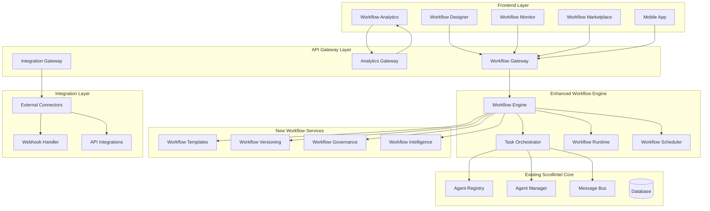

# Design Document - ScrollIntel Enhanced Workflow Automation UI/UX

## Overview

This design document outlines the enhanced workflow automation UI/UX system that builds upon ScrollIntel's existing TaskOrchestrator and multi-agent infrastructure. The system will provide an intuitive, visual interface for creating, managing, and monitoring complex multi-agent workflows while maintaining the powerful orchestration capabilities already present in ScrollIntel.

The design leverages ScrollIntel's existing workflow templates, agent registry, and orchestration engine while adding comprehensive UI/UX layers that make workflow automation accessible to users of all technical levels.

## Architecture

### High-Level Architecture



### Component Architecture

#### 1. Frontend Components

**Workflow Designer (React + TypeScript)**
- Visual drag-and-drop canvas using React Flow
- Agent palette with ScrollIntel's 20+ agents
- Property panels for agent configuration
- Connection validation and auto-routing
- Real-time collaboration features

**Workflow Monitor Dashboard**
- Real-time execution visualization
- Performance metrics and analytics
- Error tracking and debugging tools
- Resource utilization monitoring

**Workflow Analytics Engine**
- Performance trend analysis
- Cost optimization recommendations
- ROI calculation and reporting
- A/B testing framework

#### 2. Enhanced Workflow Engine

**Workflow Engine Core**
```typescript
interface WorkflowEngine {
  createWorkflow(definition: WorkflowDefinition): Promise<string>
  executeWorkflow(workflowId: string, context: WorkflowContext): Promise<WorkflowExecution>
  pauseWorkflow(workflowId: string): Promise<void>
  resumeWorkflow(workflowId: string): Promise<void>
  cancelWorkflow(workflowId: string): Promise<void>
  getWorkflowStatus(workflowId: string): Promise<WorkflowStatus>
}
```

**Workflow Runtime Manager**
- Extends existing TaskOrchestrator
- Adds visual execution tracking
- Implements advanced workflow patterns
- Provides real-time status updates

#### 3. Workflow Intelligence Services

**AI-Powered Workflow Assistant**
- Workflow optimization suggestions
- Agent recommendation engine
- Pattern recognition and best practices
- Intelligent error resolution

**Workflow Analytics Service**
- Performance monitoring and metrics
- Cost analysis and optimization
- Business impact measurement
- Predictive analytics for workflow performance

## Components and Interfaces

### 1. Visual Workflow Designer

#### Workflow Canvas Component
```typescript
interface WorkflowCanvas {
  // Canvas management
  addNode(nodeType: AgentType, position: Position): WorkflowNode
  removeNode(nodeId: string): void
  connectNodes(sourceId: string, targetId: string): WorkflowConnection
  disconnectNodes(connectionId: string): void
  
  // Visual features
  zoomToFit(): void
  centerView(): void
  enableMiniMap(enabled: boolean): void
  
  // Collaboration
  enableRealTimeCollaboration(): void
  showUserCursors(users: CollaborationUser[]): void
  
  // Validation
  validateWorkflow(): ValidationResult
  highlightErrors(errors: WorkflowError[]): void
}
```

#### Agent Palette Component
```typescript
interface AgentPalette {
  // Agent discovery
  getAvailableAgents(): ScrollIntelAgent[]
  searchAgents(query: string): ScrollIntelAgent[]
  filterAgentsByCapability(capability: string): ScrollIntelAgent[]
  
  // Agent information
  getAgentDetails(agentId: string): AgentDetails
  getAgentCapabilities(agentId: string): AgentCapability[]
  
  // Drag and drop
  enableDragAndDrop(): void
  onAgentDragStart(agent: ScrollIntelAgent): void
  onAgentDrop(agent: ScrollIntelAgent, position: Position): void
}
```

### 2. Workflow Execution Monitor

#### Real-Time Execution Tracker
```typescript
interface ExecutionTracker {
  // Execution monitoring
  trackWorkflowExecution(workflowId: string): ExecutionStream
  getExecutionStatus(executionId: string): ExecutionStatus
  getExecutionLogs(executionId: string): ExecutionLog[]
  
  // Visual updates
  updateNodeStatus(nodeId: string, status: NodeStatus): void
  highlightActiveNodes(nodeIds: string[]): void
  showDataFlow(connections: DataFlowConnection[]): void
  
  // Performance metrics
  getExecutionMetrics(executionId: string): ExecutionMetrics
  getBottleneckAnalysis(executionId: string): BottleneckAnalysis
}
```

#### Workflow Analytics Dashboard
```typescript
interface AnalyticsDashboard {
  // Performance analytics
  getWorkflowPerformanceMetrics(workflowId: string): PerformanceMetrics
  getExecutionTrends(workflowId: string, timeRange: TimeRange): TrendData
  getCostAnalysis(workflowId: string): CostAnalysis
  
  // Optimization recommendations
  getOptimizationSuggestions(workflowId: string): OptimizationSuggestion[]
  getBottleneckIdentification(workflowId: string): BottleneckReport
  
  // Business impact
  getROIMetrics(workflowId: string): ROIMetrics
  getBusinessImpactReport(workflowId: string): BusinessImpactReport
}
```

### 3. Workflow Template System

#### Enhanced Template Manager
```typescript
interface TemplateManager {
  // Template operations
  createTemplate(workflow: WorkflowDefinition): WorkflowTemplate
  updateTemplate(templateId: string, updates: TemplateUpdates): void
  deleteTemplate(templateId: string): void
  
  // Template discovery
  searchTemplates(query: string): WorkflowTemplate[]
  getTemplatesByCategory(category: TemplateCategory): WorkflowTemplate[]
  getRecommendedTemplates(userProfile: UserProfile): WorkflowTemplate[]
  
  // Template customization
  customizeTemplate(templateId: string, customizations: TemplateCustomization): WorkflowDefinition
  validateCustomization(customization: TemplateCustomization): ValidationResult
  
  // Template marketplace
  publishTemplate(template: WorkflowTemplate): void
  rateTemplate(templateId: string, rating: TemplateRating): void
  getTemplateAnalytics(templateId: string): TemplateAnalytics
}
```

### 4. Workflow Governance System

#### Governance Engine
```typescript
interface GovernanceEngine {
  // Approval workflows
  createApprovalWorkflow(workflow: WorkflowDefinition): ApprovalRequest
  processApproval(approvalId: string, decision: ApprovalDecision): void
  getApprovalStatus(approvalId: string): ApprovalStatus
  
  // Policy enforcement
  validateAgainstPolicies(workflow: WorkflowDefinition): PolicyValidationResult
  enforceSecurityPolicies(workflow: WorkflowDefinition): SecurityValidationResult
  
  // Audit and compliance
  generateAuditTrail(workflowId: string): AuditTrail
  generateComplianceReport(reportType: ComplianceReportType): ComplianceReport
  
  // Access control
  checkPermissions(userId: string, action: WorkflowAction): boolean
  enforceDataAccessControls(workflow: WorkflowDefinition): AccessControlResult
}
```

### 5. Integration Framework

#### External System Connectors
```typescript
interface IntegrationFramework {
  // Connector management
  getAvailableConnectors(): SystemConnector[]
  installConnector(connectorId: string): void
  configureConnector(connectorId: string, config: ConnectorConfig): void
  
  // Data transformation
  createDataMapping(source: DataSchema, target: DataSchema): DataMapping
  transformData(data: any, mapping: DataMapping): any
  validateDataTransformation(mapping: DataMapping): ValidationResult
  
  // Authentication
  configureAuthentication(connectorId: string, authConfig: AuthConfig): void
  refreshAuthTokens(connectorId: string): void
  
  // Testing and validation
  testConnection(connectorId: string): ConnectionTestResult
  validateIntegration(integrationConfig: IntegrationConfig): IntegrationValidationResult
}
```

## Data Models

### Core Workflow Models

```typescript
interface WorkflowDefinition {
  id: string
  name: string
  description: string
  version: string
  createdBy: string
  createdAt: Date
  updatedAt: Date
  
  // Visual layout
  canvas: CanvasLayout
  nodes: WorkflowNode[]
  connections: WorkflowConnection[]
  
  // Execution configuration
  executionConfig: ExecutionConfig
  scheduleConfig?: ScheduleConfig
  triggerConfig?: TriggerConfig
  
  // Governance
  approvalStatus: ApprovalStatus
  securityClassification: SecurityClassification
  complianceRequirements: ComplianceRequirement[]
  
  // Analytics
  performanceMetrics?: PerformanceMetrics
  businessImpact?: BusinessImpactMetrics
}

interface WorkflowNode {
  id: string
  type: NodeType
  agentId?: string
  agentType: string
  
  // Visual properties
  position: Position
  size: Size
  style: NodeStyle
  
  // Configuration
  config: NodeConfig
  inputPorts: InputPort[]
  outputPorts: OutputPort[]
  
  // Runtime properties
  status?: NodeStatus
  executionTime?: number
  errorMessage?: string
}

interface WorkflowConnection {
  id: string
  sourceNodeId: string
  sourcePortId: string
  targetNodeId: string
  targetPortId: string
  
  // Visual properties
  style: ConnectionStyle
  
  // Data flow
  dataMapping?: DataMapping
  conditions?: ConnectionCondition[]
  
  // Runtime properties
  dataFlow?: DataFlowInfo
  status?: ConnectionStatus
}
```

### Analytics and Monitoring Models

```typescript
interface ExecutionMetrics {
  executionId: string
  workflowId: string
  startTime: Date
  endTime?: Date
  duration?: number
  status: ExecutionStatus
  
  // Performance metrics
  nodeExecutionTimes: Record<string, number>
  dataTransferSizes: Record<string, number>
  resourceUtilization: ResourceUtilization
  
  // Error tracking
  errors: ExecutionError[]
  warnings: ExecutionWarning[]
  
  // Cost metrics
  computeCost: number
  dataCost: number
  totalCost: number
}

interface PerformanceMetrics {
  workflowId: string
  timeRange: TimeRange
  
  // Execution statistics
  totalExecutions: number
  successfulExecutions: number
  failedExecutions: number
  averageExecutionTime: number
  
  // Performance trends
  executionTrends: TrendDataPoint[]
  performanceTrends: TrendDataPoint[]
  costTrends: TrendDataPoint[]
  
  // Optimization opportunities
  bottlenecks: BottleneckIdentification[]
  optimizationSuggestions: OptimizationSuggestion[]
}
```

### Template and Marketplace Models

```typescript
interface WorkflowTemplate {
  id: string
  name: string
  description: string
  category: TemplateCategory
  tags: string[]
  
  // Template definition
  templateDefinition: WorkflowDefinition
  customizationOptions: CustomizationOption[]
  
  // Marketplace properties
  author: string
  version: string
  downloads: number
  rating: number
  reviews: TemplateReview[]
  
  // Business properties
  pricing?: TemplatePricing
  license: TemplateLicense
  supportLevel: SupportLevel
}

interface TemplateCustomization {
  templateId: string
  customizations: Record<string, any>
  userInputs: Record<string, any>
  selectedOptions: Record<string, any>
}
```

## Error Handling

### Workflow Error Management

```typescript
interface WorkflowErrorHandler {
  // Error detection
  detectErrors(workflow: WorkflowDefinition): WorkflowError[]
  validateWorkflowIntegrity(workflow: WorkflowDefinition): IntegrityValidationResult
  
  // Error resolution
  suggestErrorResolutions(error: WorkflowError): ErrorResolution[]
  autoResolveErrors(errors: WorkflowError[]): AutoResolutionResult
  
  // Error recovery
  createRecoveryPlan(executionId: string, error: ExecutionError): RecoveryPlan
  executeRecoveryPlan(recoveryPlan: RecoveryPlan): RecoveryResult
  
  // Error analytics
  analyzeErrorPatterns(workflowId: string): ErrorPatternAnalysis
  generateErrorReport(timeRange: TimeRange): ErrorReport
}
```

### Execution Error Handling

```typescript
interface ExecutionErrorHandler {
  // Runtime error handling
  handleNodeError(nodeId: string, error: NodeError): ErrorHandlingResult
  handleConnectionError(connectionId: string, error: ConnectionError): ErrorHandlingResult
  
  // Retry mechanisms
  configureRetryPolicy(nodeId: string, retryPolicy: RetryPolicy): void
  executeRetry(nodeId: string, attempt: number): RetryResult
  
  // Compensation patterns
  createCompensationWorkflow(failedExecution: ExecutionContext): WorkflowDefinition
  executeCompensation(compensationWorkflow: WorkflowDefinition): CompensationResult
  
  // Circuit breaker patterns
  configureCircuitBreaker(nodeId: string, circuitBreakerConfig: CircuitBreakerConfig): void
  checkCircuitBreakerStatus(nodeId: string): CircuitBreakerStatus
}
```

## Testing Strategy

### Component Testing

1. **Frontend Component Tests**
   - React component unit tests with Jest and React Testing Library
   - Visual regression tests with Chromatic
   - Accessibility tests with axe-core
   - User interaction tests with Cypress

2. **Workflow Engine Tests**
   - Unit tests for workflow execution logic
   - Integration tests with existing TaskOrchestrator
   - Performance tests for large workflows
   - Stress tests for concurrent executions

3. **API Integration Tests**
   - REST API endpoint tests
   - WebSocket connection tests
   - External system integration tests
   - Authentication and authorization tests

### End-to-End Testing

1. **Workflow Creation Tests**
   - Visual workflow designer functionality
   - Template customization and deployment
   - Collaboration features testing
   - Version control operations

2. **Workflow Execution Tests**
   - Multi-agent workflow execution
   - Error handling and recovery
   - Performance monitoring accuracy
   - Real-time updates and notifications

3. **Analytics and Reporting Tests**
   - Metrics calculation accuracy
   - Dashboard data visualization
   - Report generation functionality
   - ROI calculation validation

### Performance Testing

1. **Scalability Tests**
   - Large workflow execution (100+ nodes)
   - Concurrent workflow execution (1000+ workflows)
   - Real-time monitoring performance
   - Database query optimization

2. **Load Testing**
   - API endpoint load testing
   - WebSocket connection limits
   - Frontend rendering performance
   - Memory usage optimization

## Security Considerations

### Authentication and Authorization

1. **User Authentication**
   - Integration with existing EXOUSIA authentication
   - Multi-factor authentication support
   - SSO integration for enterprise users
   - API key management for programmatic access

2. **Role-Based Access Control**
   - Workflow creation permissions
   - Execution approval workflows
   - Data access controls
   - Administrative privileges

### Data Security

1. **Data Protection**
   - Encryption at rest and in transit
   - Sensitive data masking in logs
   - Secure data transformation
   - PII handling compliance

2. **Workflow Security**
   - Secure agent communication
   - Workflow execution sandboxing
   - External integration security
   - Audit trail integrity

### Compliance Framework

1. **Regulatory Compliance**
   - GDPR compliance for EU users
   - SOX compliance for financial workflows
   - HIPAA compliance for healthcare data
   - Industry-specific compliance frameworks

2. **Security Monitoring**
   - Real-time security event monitoring
   - Anomaly detection in workflow execution
   - Security incident response procedures
   - Regular security assessments

## Deployment Architecture

### Infrastructure Requirements

1. **Frontend Deployment**
   - Next.js application on Vercel/Netlify
   - CDN for static assets
   - Progressive Web App capabilities
   - Mobile-responsive design

2. **Backend Services**
   - Microservices architecture on Kubernetes
   - Auto-scaling based on workflow load
   - Load balancing for high availability
   - Database clustering for performance

3. **Monitoring and Observability**
   - Application performance monitoring
   - Real-time metrics collection
   - Distributed tracing for workflows
   - Log aggregation and analysis

### Integration with Existing ScrollIntel

1. **Backward Compatibility**
   - Existing workflow templates continue to work
   - API compatibility with current agents
   - Database schema migration strategy
   - Gradual feature rollout plan

2. **Enhanced Capabilities**
   - Visual representation of existing workflows
   - Enhanced monitoring for current executions
   - Improved error handling and recovery
   - Advanced analytics for historical data

This design provides a comprehensive enhancement to ScrollIntel's existing workflow automation capabilities while maintaining compatibility with the current system and providing a path for gradual adoption of the new UI/UX features.