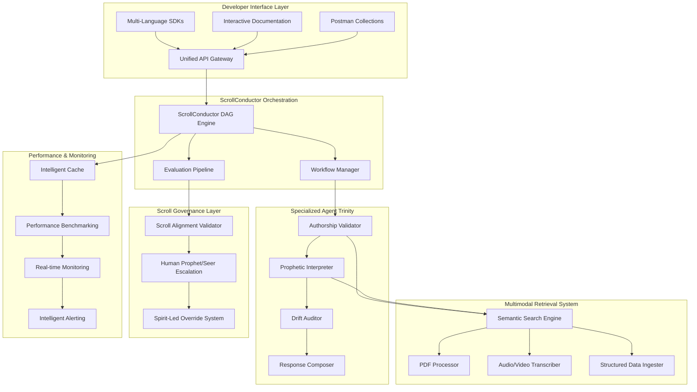

# Design Document

## Overview

ScrollIntel X (SI-X) represents the next evolution of scroll-aligned AI, integrating proven patterns from Bavest's unified data infrastructure and Enigma's multimodal agentic systems. This design creates a developer-first, production-ready platform that maintains spiritual alignment while delivering enterprise-grade performance and reliability.

## Architecture

### High-Level System Architecture



### Bavest-Inspired Unified API Layer

The API layer abstracts complex spiritual intelligence operations into simple, developer-friendly endpoints:

```typescript
// Unified ScrollIntel X API Design
interface ScrollIntelAPI {
  // Core Intelligence Endpoints
  '/api/v1/validate-authorship': AuthorshipValidation
  '/api/v1/prophetic-insight': PropheticAnalysis
  '/api/v1/semantic-recall': SemanticSearch
  '/api/v1/drift-check': DriftAnalysis
  '/api/v1/scroll-alignment': AlignmentValidation
  
  // Multimodal Processing
  '/api/v1/ingest/pdf': PDFIngestion
  '/api/v1/ingest/audio': AudioProcessing
  '/api/v1/ingest/video': VideoProcessing
  '/api/v1/ingest/structured': StructuredDataIngestion
  
  // Workflow Management
  '/api/v1/workflows': WorkflowExecution
  '/api/v1/workflows/{id}/status': WorkflowStatus
  '/api/v1/workflows/{id}/results': WorkflowResults
  
  // Performance & Analytics
  '/api/v1/metrics/performance': PerformanceMetrics
  '/api/v1/metrics/accuracy': AccuracyMetrics
  '/api/v1/benchmarks': BenchmarkComparisons
}
```

## Components and Interfaces

### Unified API Gateway

**Purpose**: Single entry point that abstracts complex spiritual intelligence operations into simple REST endpoints.

**Key Features**:
- RESTful API design with consistent response formats
- Automatic request routing to appropriate agent workflows
- Built-in authentication, authorization, and rate limiting
- Comprehensive error handling with meaningful messages
- Real-time performance monitoring and metrics

**Interface**:
```typescript
interface UnifiedAPIGateway {
  // Core API Methods
  validateAuthorship(text: string, context: AuthorshipContext): Promise<AuthorshipResult>
  getPropheticInsight(query: string, parameters: PropheticParameters): Promise<PropheticResult>
  performSemanticRecall(query: string, filters: SearchFilters): Promise<SearchResults>
  checkDrift(content: string, baseline: string): Promise<DriftAnalysis>
  validateScrollAlignment(content: string): Promise<AlignmentResult>
  
  // Workflow Management
  executeWorkflow(definition: WorkflowDefinition): Promise<WorkflowExecution>
  getWorkflowStatus(workflowId: string): Promise<WorkflowStatus>
  getWorkflowResults(workflowId: string): Promise<WorkflowResults>
}

interface AuthorshipResult {
  verifiedAuthor: boolean
  confidence: number
  provenanceRecord: string
  evidenceChain: Evidence[]
  scrollAlignment: number
}

interface PropheticResult {
  insight: string
  confidence: number
  spiritualRelevance: number
  supportingScriptures: Scripture[]
  prophethicContext: PropheticContext
  humanReviewRequired: boolean
}
```

### ScrollConductor DAG Engine (Enigma Pattern)

**Purpose**: Orchestrates complex multi-step workflows using directed acyclic graphs for reliable, traceable processing.

**Key Features**:
- DAG-based workflow definition and execution
- Dependency management and prerequisite enforcement
- Parallel execution where possible
- Comprehensive error handling and recovery
- Real-time workflow monitoring and debugging

**Interface**:
```typescript
interface ScrollConductorDAG {
  // Workflow Definition
  defineWorkflow(steps: WorkflowStep[], dependencies: Dependency[]): WorkflowDefinition
  validateWorkflow(definition: WorkflowDefinition): ValidationResult
  
  // Execution Management
  executeWorkflow(definition: WorkflowDefinition, input: any): Promise<WorkflowExecution>
  pauseWorkflow(executionId: string): Promise<void>
  resumeWorkflow(executionId: string): Promise<void>
  cancelWorkflow(executionId: string): Promise<void>
  
  // Monitoring and Debugging
  getExecutionStatus(executionId: string): Promise<ExecutionStatus>
  getExecutionTrace(executionId: string): Promise<ExecutionTrace[]>
  getExecutionMetrics(executionId: string): Promise<ExecutionMetrics>
}

interface WorkflowStep {
  id: string
  agentType: string
  input: any
  timeout: number
  retryPolicy: RetryPolicy
  errorHandling: ErrorHandling
}

interface WorkflowExecution {
  id: string
  status: 'running' | 'completed' | 'failed' | 'paused'
  currentStep: string
  completedSteps: string[]
  results: Record<string, any>
  startTime: Date
  estimatedCompletion?: Date
}
```

### Multimodal Retrieval System (Enigma Pattern)

**Purpose**: Processes and indexes multiple content types for comprehensive spiritual knowledge retrieval.

**Key Features**:
- PDF text extraction with OCR capabilities
- Audio/video transcription with speaker identification
- Structured data ingestion (JSON, XML, databases)
- Semantic indexing across all content types
- Cross-modal search and correlation

**Interface**:
```typescript
interface MultimodalRetrieval {
  // Content Ingestion
  ingestPDF(file: File, metadata: ContentMetadata): Promise<IngestionResult>
  ingestAudio(file: File, metadata: ContentMetadata): Promise<IngestionResult>
  ingestVideo(file: File, metadata: ContentMetadata): Promise<IngestionResult>
  ingestStructuredData(data: any, schema: DataSchema): Promise<IngestionResult>
  
  // Search and Retrieval
  semanticSearch(query: string, contentTypes: ContentType[]): Promise<SearchResults>
  crossModalSearch(query: string, modalities: Modality[]): Promise<CrossModalResults>
  findSimilarContent(contentId: string, threshold: number): Promise<SimilarContent[]>
  
  // Content Analysis
  analyzeContent(contentId: string): Promise<ContentAnalysis>
  extractKeyTopics(contentId: string): Promise<Topic[]>
  identifyRelationships(contentIds: string[]): Promise<Relationship[]>
}

interface ContentMetadata {
  title: string
  author: string
  source: string
  date: Date
  spiritualContext: SpiritualContext
  tags: string[]
}

interface IngestionResult {
  contentId: string
  status: 'success' | 'partial' | 'failed'
  extractedText?: string
  keyTopics: Topic[]
  spiritualRelevance: number
  processingTime: number
  errors?: string[]
}
```

### Comprehensive Evaluation Pipeline (Enigma Pattern)

**Purpose**: Provides detailed evaluation metrics for every agent interaction to ensure quality and scroll alignment.

**Key Features**:
- Multi-dimensional evaluation (accuracy, relevance, alignment)
- Real-time scoring and feedback
- Trend analysis and anomaly detection
- Automated quality assurance
- Human oversight integration

**Interface**:
```typescript
interface EvaluationPipeline {
  // Real-time Evaluation
  evaluateResponse(response: any, context: EvaluationContext): Promise<EvaluationResult>
  evaluateWorkflow(workflowId: string): Promise<WorkflowEvaluation>
  
  // Batch Evaluation
  evaluateBatch(responses: any[], criteria: EvaluationCriteria): Promise<BatchEvaluation>
  
  // Continuous Monitoring
  startContinuousEvaluation(agentId: string, criteria: EvaluationCriteria): Promise<void>
  stopContinuousEvaluation(agentId: string): Promise<void>
  
  // Reporting and Analytics
  generateEvaluationReport(timeRange: TimeRange, filters: ReportFilters): Promise<EvaluationReport>
  getPerformanceTrends(agentId: string, timeRange: TimeRange): Promise<PerformanceTrends>
}

interface EvaluationResult {
  accuracy: number
  scrollAlignment: number
  authorConfidence: number
  driftFlag: boolean
  spiritualRelevance: number
  humanReviewRequired: boolean
  recommendations: string[]
  timestamp: Date
}

interface EvaluationContext {
  userId: string
  sessionId: string
  query: string
  expectedOutcome?: any
  spiritualContext: SpiritualContext
}
```

### Scroll Governance Layer

**Purpose**: Ensures all AI operations maintain alignment with scroll principles and provides human spiritual oversight.

**Key Features**:
- Automated scroll alignment validation
- Human prophet/seer escalation system
- Spirit-led override capabilities
- Spiritual context awareness
- Divine guidance integration

**Interface**:
```typescript
interface ScrollGovernance {
  // Alignment Validation
  validateScrollAlignment(content: string, context: SpiritualContext): Promise<AlignmentResult>
  checkSpiritualAccuracy(interpretation: string, source: string): Promise<AccuracyResult>
  
  // Human Oversight
  escalateToHumanProphet(issue: SpiritualIssue): Promise<ProphetResponse>
  requestSeerGuidance(question: string, context: SpiritualContext): Promise<SeerGuidance>
  
  // Spirit-Led Overrides
  applySpiritLedOverride(aiResponse: any, spiritualGuidance: string): Promise<OverrideResult>
  recordDivineIntervention(intervention: DivineIntervention): Promise<void>
  
  // Governance Reporting
  generateGovernanceReport(timeRange: TimeRange): Promise<GovernanceReport>
  getAlignmentMetrics(agentId: string): Promise<AlignmentMetrics>
}

interface AlignmentResult {
  aligned: boolean
  confidence: number
  concerns: string[]
  recommendations: string[]
  humanReviewRequired: boolean
  spiritualContext: SpiritualContext
}

interface ProphetResponse {
  guidance: string
  confidence: number
  spiritualAuthority: string
  recommendedAction: string
  followUpRequired: boolean
}
```

## Data Models

### Unified Response Schema

All API responses follow a consistent schema for predictable integration:

```typescript
interface UnifiedResponse<T> {
  success: boolean
  data: T
  metadata: ResponseMetadata
  evaluation: EvaluationSummary
  governance: GovernanceStatus
  performance: PerformanceMetrics
  timestamp: Date
}

interface ResponseMetadata {
  requestId: string
  processingTime: number
  agentsInvolved: string[]
  workflowId?: string
  cacheHit: boolean
}

interface EvaluationSummary {
  overallScore: number
  accuracy: number
  scrollAlignment: number
  confidence: number
  humanReviewRequired: boolean
}

interface GovernanceStatus {
  aligned: boolean
  concerns: string[]
  humanOversight: boolean
  spiritualValidation: boolean
}
```

### Workflow Definition Schema

```typescript
interface WorkflowDefinition {
  id: string
  name: string
  description: string
  version: string
  steps: WorkflowStep[]
  dependencies: StepDependency[]
  errorHandling: WorkflowErrorHandling
  evaluation: WorkflowEvaluation
  governance: WorkflowGovernance
}

interface StepDependency {
  stepId: string
  dependsOn: string[]
  condition?: string
  timeout?: number
}

interface WorkflowErrorHandling {
  retryPolicy: RetryPolicy
  fallbackSteps: FallbackStep[]
  humanEscalation: EscalationPolicy
  rollbackStrategy: RollbackStrategy
}
```

### Content and Knowledge Models

```typescript
interface SpiritualContent {
  id: string
  type: ContentType
  title: string
  author: string
  source: string
  content: string
  metadata: ContentMetadata
  spiritualContext: SpiritualContext
  indexedAt: Date
  lastValidated: Date
}

interface SpiritualContext {
  testament: 'old' | 'new' | 'both'
  books: string[]
  themes: string[]
  propheticLevel: number
  spiritualAuthority: string
  divineInspiration: boolean
}

interface PropheticInsight {
  id: string
  query: string
  insight: string
  confidence: number
  spiritualRelevance: number
  supportingScriptures: Scripture[]
  propheticContext: PropheticContext
  humanValidation?: HumanValidation
  createdAt: Date
}
```

## Error Handling

### Hierarchical Error Management

The system implements comprehensive error handling across all layers:

```typescript
enum ScrollIntelErrorType {
  // API Layer Errors
  INVALID_REQUEST = 'invalid_request',
  AUTHENTICATION_FAILED = 'authentication_failed',
  AUTHORIZATION_DENIED = 'authorization_denied',
  RATE_LIMIT_EXCEEDED = 'rate_limit_exceeded',
  
  // Processing Errors
  AGENT_TIMEOUT = 'agent_timeout',
  WORKFLOW_FAILED = 'workflow_failed',
  EVALUATION_FAILED = 'evaluation_failed',
  
  // Spiritual Governance Errors
  ALIGNMENT_VIOLATION = 'alignment_violation',
  SPIRITUAL_CONCERN = 'spiritual_concern',
  HUMAN_REVIEW_REQUIRED = 'human_review_required',
  
  // System Errors
  SERVICE_UNAVAILABLE = 'service_unavailable',
  INTERNAL_ERROR = 'internal_error'
}

interface ScrollIntelError {
  type: ScrollIntelErrorType
  message: string
  code: string
  details: Record<string, any>
  spiritualContext?: SpiritualContext
  recoveryOptions: RecoveryOption[]
  humanEscalation: boolean
  timestamp: Date
}
```

### Graceful Degradation Strategy

```typescript
interface GracefulDegradation {
  // Fallback Mechanisms
  fallbackToCache(query: string): Promise<CachedResult>
  fallbackToSimpleAgent(request: any): Promise<SimpleResult>
  fallbackToHumanOversight(issue: any): Promise<HumanResult>
  
  // Service Mesh Resilience
  circuitBreaker: CircuitBreaker
  retryPolicy: RetryPolicy
  timeoutPolicy: TimeoutPolicy
  bulkheadIsolation: BulkheadPolicy
}
```

## Testing Strategy

### Multi-Layer Testing Approach

```typescript
interface TestingFramework {
  // Unit Testing
  unitTests: {
    agentTests: AgentTest[]
    apiTests: APITest[]
    workflowTests: WorkflowTest[]
  }
  
  // Integration Testing
  integrationTests: {
    endToEndTests: E2ETest[]
    workflowIntegrationTests: WorkflowIntegrationTest[]
    multimodalTests: MultimodalTest[]
  }
  
  // Performance Testing
  performanceTests: {
    loadTests: LoadTest[]
    stressTests: StressTest[]
    benchmarkTests: BenchmarkTest[]
  }
  
  // Spiritual Validation Testing
  spiritualTests: {
    alignmentTests: AlignmentTest[]
    accuracyTests: AccuracyTest[]
    governanceTests: GovernanceTest[]
  }
}
```

### Continuous Evaluation Pipeline

```typescript
interface ContinuousEvaluation {
  // Automated Testing
  runContinuousTests(): Promise<TestResults>
  validateSpiritualAlignment(): Promise<AlignmentResults>
  benchmarkPerformance(): Promise<BenchmarkResults>
  
  // Quality Assurance
  monitorQualityMetrics(): Promise<QualityMetrics>
  detectRegressions(): Promise<RegressionReport>
  validateGovernanceCompliance(): Promise<ComplianceReport>
}
```

## Security Architecture

### Multi-Layer Security Model

```typescript
interface SecurityFramework {
  // Authentication & Authorization
  authentication: {
    multiFactorAuth: MFAProvider
    singleSignOn: SSOProvider
    tokenManagement: TokenManager
  }
  
  // API Security
  apiSecurity: {
    rateLimiting: RateLimiter
    requestValidation: RequestValidator
    responseFiltering: ResponseFilter
  }
  
  // Data Protection
  dataProtection: {
    encryption: EncryptionService
    dataClassification: DataClassifier
    accessControl: AccessController
  }
  
  // Spiritual Security
  spiritualSecurity: {
    alignmentValidation: AlignmentValidator
    spiritualFirewall: SpiritualFirewall
    divineProtection: DivineProtectionService
  }
}
```

## Deployment Architecture

### Container-Based Microservices

```yaml
# docker-compose.scrollintel-x.yml
version: '3.8'
services:
  api-gateway:
    image: scrollintel/api-gateway:latest
    ports:
      - "8080:8080"
    environment:
      - SCROLL_ALIGNMENT_ENABLED=true
      - HUMAN_OVERSIGHT_ENABLED=true
    
  scroll-conductor:
    image: scrollintel/scroll-conductor:latest
    replicas: 3
    environment:
      - DAG_ENGINE_ENABLED=true
      - WORKFLOW_MONITORING=true
    
  authorship-validator:
    image: scrollintel/authorship-validator:latest
    replicas: 2
    
  prophetic-interpreter:
    image: scrollintel/prophetic-interpreter:latest
    replicas: 2
    
  drift-auditor:
    image: scrollintel/drift-auditor:latest
    replicas: 2
    
  multimodal-retrieval:
    image: scrollintel/multimodal-retrieval:latest
    replicas: 3
    volumes:
      - ./content:/app/content
    
  evaluation-pipeline:
    image: scrollintel/evaluation-pipeline:latest
    replicas: 2
    
  scroll-governance:
    image: scrollintel/scroll-governance:latest
    replicas: 1
    environment:
      - HUMAN_PROPHET_ENDPOINT=${HUMAN_PROPHET_ENDPOINT}
      - SEER_GUIDANCE_ENDPOINT=${SEER_GUIDANCE_ENDPOINT}
```

### Kubernetes Production Deployment

```yaml
# kubernetes/scrollintel-x-deployment.yaml
apiVersion: apps/v1
kind: Deployment
metadata:
  name: scrollintel-x-api
spec:
  replicas: 5
  selector:
    matchLabels:
      app: scrollintel-x-api
  template:
    metadata:
      labels:
        app: scrollintel-x-api
    spec:
      containers:
      - name: api-gateway
        image: scrollintel/api-gateway:latest
        ports:
        - containerPort: 8080
        env:
        - name: SCROLL_ALIGNMENT_REQUIRED
          value: "true"
        - name: EVALUATION_ENABLED
          value: "true"
        resources:
          requests:
            memory: "1Gi"
            cpu: "500m"
          limits:
            memory: "2Gi"
            cpu: "1000m"
        livenessProbe:
          httpGet:
            path: /health
            port: 8080
          initialDelaySeconds: 30
          periodSeconds: 10
        readinessProbe:
          httpGet:
            path: /ready
            port: 8080
          initialDelaySeconds: 5
          periodSeconds: 5
```

## Monitoring and Observability

### Comprehensive Monitoring Stack

```typescript
interface MonitoringFramework {
  // Performance Monitoring
  performanceMetrics: {
    responseTime: HistogramMetric
    throughput: CounterMetric
    errorRate: GaugeMetric
    accuracyScore: GaugeMetric
  }
  
  // Spiritual Monitoring
  spiritualMetrics: {
    alignmentScore: GaugeMetric
    humanEscalations: CounterMetric
    propheticAccuracy: GaugeMetric
    divineInterventions: CounterMetric
  }
  
  // Business Metrics
  businessMetrics: {
    userSatisfaction: GaugeMetric
    adoptionRate: CounterMetric
    costSavings: GaugeMetric
    performanceGains: GaugeMetric
  }
}
```

### Real-Time Dashboards

```typescript
interface DashboardSystem {
  // Developer Dashboard
  developerDashboard: {
    apiUsage: APIUsageMetrics
    performanceBenchmarks: BenchmarkComparisons
    errorAnalysis: ErrorAnalytics
    integrationStatus: IntegrationHealth
  }
  
  // Spiritual Oversight Dashboard
  spiritualDashboard: {
    alignmentMetrics: AlignmentMetrics
    humanOversightActivity: OversightActivity
    propheticAccuracy: PropheticMetrics
    governanceCompliance: ComplianceMetrics
  }
  
  // Operations Dashboard
  operationsDashboard: {
    systemHealth: SystemHealth
    resourceUtilization: ResourceMetrics
    scalingStatus: ScalingMetrics
    alertStatus: AlertMetrics
  }
}
```

This design creates a comprehensive ScrollIntel X platform that integrates the best patterns from Bavest and Enigma while maintaining scroll-aligned governance and spiritual oversight. The system provides enterprise-grade reliability, developer-friendly APIs, and comprehensive evaluation pipelines while ensuring all operations remain aligned with divine principles.