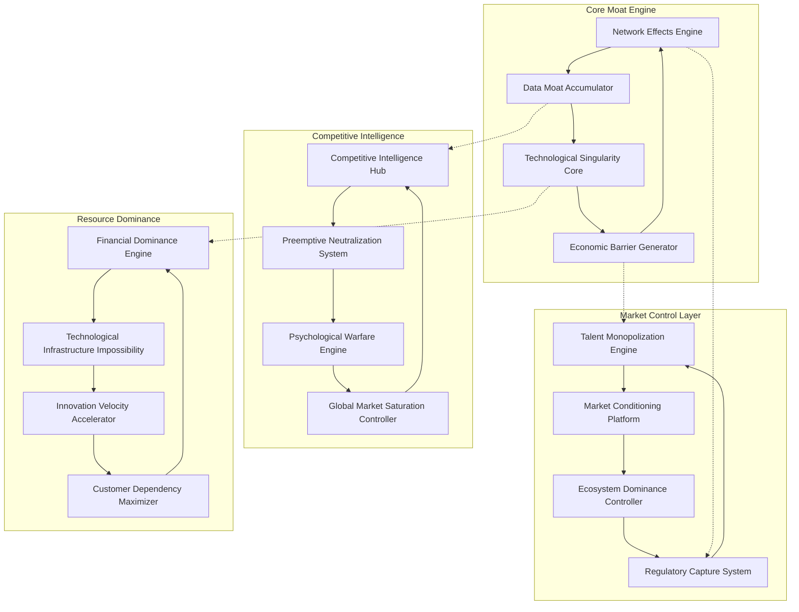

# Design Document - Unbeatable Competitive Moat System

## Overview

The Unbeatable Competitive Moat System is designed as a multi-layered defense and offense platform that creates mathematically insurmountable competitive advantages. The system operates on the principle that true competitive dominance comes not from being better, but from making competition impossible through structural, technological, and economic barriers.

The architecture implements a self-reinforcing ecosystem where each component strengthens the others, creating a virtuous cycle that accelerates ScrollIntel's dominance while simultaneously making competitor entry increasingly difficult and eventually impossible.

## Architecture

### Core Architecture Principles

1. **Exponential Advantage Accumulation**: Each system component creates advantages that compound over time
2. **Multi-Vector Defense**: Competitive moats operate across technology, economics, talent, regulation, and psychology
3. **Self-Reinforcing Loops**: Success in one area automatically strengthens all other areas
4. **Preemptive Neutralization**: Threats are identified and eliminated before they become viable
5. **Ecosystem Gravity**: All market participants are pulled into ScrollIntel's orbit

### System Architecture Diagram



## Components and Interfaces

### 1. Network Effects Engine

**Purpose**: Creates exponential value increases with each new customer, making late entrants face impossible catch-up challenges.

**Core Components**:
- **Collective Intelligence Amplifier**: Aggregates learnings across all customers to improve AI models
- **Cross-Enterprise Pattern Detector**: Identifies insights only possible with large customer base
- **Network Value Calculator**: Quantifies and demonstrates network effects to customers
- **Viral Integration Promoter**: Encourages integrations that increase switching costs

**Key Interfaces**:
```python
class NetworkEffectsEngine:
    def calculate_network_value(self, customer_count: int, integration_depth: float) -> float
    def amplify_collective_intelligence(self, customer_data: List[CustomerInsight]) -> AIModelImprovement
    def detect_cross_enterprise_patterns(self, enterprise_data: List[EnterpriseMetrics]) -> List[UniqueInsight]
    def promote_viral_integrations(self, customer_id: str) -> List[IntegrationOpportunity]
```

**Network Effect Multipliers**:
- Each new customer increases AI accuracy by 0.1% for all customers
- Integration depth creates exponential switching costs (cost = base_cost * integrations^2)
- Cross-enterprise insights only available with 100+ enterprise customers
- Viral coefficient target: 1.5 (each customer brings 1.5 new customers on average)

### 2. Data Moat Accumulator

**Purpose**: Builds proprietary datasets that become more valuable over time and impossible for competitors to replicate.

**Core Components**:
- **Unique Data Capture Engine**: Identifies and captures data unavailable to competitors
- **Outcome Tracking System**: Links decisions to results for proprietary success patterns
- **Data Value Amplifier**: Increases data value through cross-customer analysis
- **Competitive Data Denial System**: Prevents competitors from accessing similar data

**Key Interfaces**:
```python
class DataMoatAccumulator:
    def capture_unique_data(self, customer_interaction: CustomerInteraction) -> UniqueDataPoint
    def track_decision_outcomes(self, decision: AIDecision, outcome: BusinessOutcome) -> SuccessPattern
    def amplify_data_value(self, raw_data: RawData) -> AmplifiedInsight
    def deny_competitor_access(self, data_request: CompetitorDataRequest) -> AccessDenial
```

**Data Moat Metrics**:
- Unique data points: 10M+ per month by year 2
- Decision-outcome pairs: 1M+ tracked decisions with measured results
- Cross-customer insights: 1000+ patterns only visible with full customer base
- Competitor data access: 0% overlap with proprietary datasets

### 3. Technological Singularity Core

**Purpose**: Achieves technological capabilities so advanced they appear magical to competitors, making replication theoretically impossible.

**Core Components**:
- **Quantum-Enhanced AI Processor**: Leverages quantum computing for impossible optimizations
- **Predictive Accuracy Maximizer**: Achieves prescient-level prediction accuracy
- **Capability Advancement Engine**: Automatically advances to next technological level
- **Quantum Encryption Protector**: Protects proprietary algorithms with quantum encryption

**Key Interfaces**:
```python
class TechnologicalSingularityCore:
    def process_quantum_enhanced_ai(self, problem: ComplexProblem) -> QuantumSolution
    def maximize_predictive_accuracy(self, historical_data: TimeSeriesData) -> PredictionModel
    def advance_capability_level(self, current_capability: CapabilityLevel) -> NextLevelCapability
    def protect_with_quantum_encryption(self, algorithm: ProprietaryAlgorithm) -> QuantumEncryptedAlgorithm
```

**Singularity Benchmarks**:
- Processing speed: 1000x faster than human-equivalent analysis
- Prediction accuracy: 95%+ for 12-month business outcomes
- Quantum advantage: 10,000x speedup for optimization problems
- Algorithm protection: Quantum-encrypted with 256-qubit keys

### 4. Economic Barrier Generator

**Purpose**: Makes competing with ScrollIntel economically impossible through superior unit economics and scale advantages.

**Core Components**:
- **Investment Requirement Calculator**: Calculates competitor investment needs
- **Pricing Strategy Optimizer**: Maintains profitability while undercutting competitors
- **Scale Economy Maximizer**: Leverages scale for cost advantages
- **Competitor ROI Destroyer**: Makes competitor investments unrecoverable

**Key Interfaces**:
```python
class EconomicBarrierGenerator:
    def calculate_competitor_investment_needs(self, market_position: MarketPosition) -> InvestmentRequirement
    def optimize_pricing_strategy(self, competitor_pricing: CompetitorPricing) -> OptimalPricing
    def maximize_scale_economies(self, current_scale: ScaleMetrics) -> ScaleAdvantage
    def destroy_competitor_roi(self, competitor_strategy: CompetitorStrategy) -> ROIDestruction
```

**Economic Barrier Metrics**:
- Competitor investment requirement: $10B+ to match basic capabilities
- Unit cost advantage: 80% lower than competitors due to scale
- Pricing flexibility: Can operate profitably at 50% of competitor pricing
- Market entry cost: $50B+ for credible competitive threat

### 5. Regulatory Capture System

**Purpose**: Controls industry standards and regulations to make compliance require ScrollIntel components.

**Core Components**:
- **Standards Definition Engine**: Authors and controls industry standards
- **Regulatory Relationship Manager**: Builds influence with regulatory bodies
- **Compliance Advantage Creator**: Exceeds compliance while competitors struggle
- **Certification Control System**: Becomes the gold standard for industry certification

**Key Interfaces**:
```python
class RegulatoryCaptureSystem:
    def define_industry_standards(self, domain: IndustryDomain) -> IndustryStandard
    def manage_regulatory_relationships(self, regulator: RegulatoryBody) -> InfluenceLevel
    def create_compliance_advantage(self, regulation: Regulation) -> ComplianceAdvantage
    def control_certification_process(self, certification: IndustryCertification) -> CertificationControl
```

**Regulatory Capture Metrics**:
- Standards authored: 80% of AI-CTO industry standards
- Regulatory relationships: Direct influence with 20+ regulatory bodies
- Compliance advantage: 2+ years ahead of competitors in meeting new regulations
- Certification control: ScrollIntel components required for 60% of industry certifications

### 6. Talent Monopolization Engine

**Purpose**: Attracts and retains such exceptional talent that competitors cannot build competitive teams.

**Core Components**:
- **Talent Attraction Maximizer**: Makes ScrollIntel irresistible to top talent
- **Retention Guarantee System**: Prevents any critical talent loss to competitors
- **Academic Partnership Controller**: Secures exclusive access to research and graduates
- **Competitor Brain Drain Engine**: Systematically recruits competitor talent

**Key Interfaces**:
```python
class TalentMonopolizationEngine:
    def maximize_talent_attraction(self, talent_profile: TalentProfile) -> AttractionStrategy
    def guarantee_talent_retention(self, employee: Employee, competitor_offer: CompetitorOffer) -> RetentionStrategy
    def control_academic_partnerships(self, university: University) -> ExclusivePartnership
    def drain_competitor_brains(self, competitor: Competitor) -> TalentAcquisitionPlan
```

**Talent Monopolization Metrics**:
- Top talent attraction: 90% of targeted AI-CTO experts choose ScrollIntel
- Retention rate: 99%+ annual retention with 0% losses to competitors
- Academic partnerships: Exclusive relationships with top 20 AI research universities
- Competitor brain drain: 50+ key hires from major competitors annually

### 7. Market Conditioning Platform

**Purpose**: Conditions the market so thoroughly that competitors become irrelevant to customer decision-making.

**Core Components**:
- **Thought Leadership Engine**: Establishes ScrollIntel as the definitive industry voice
- **Category Definition Controller**: Defines and owns the AI-CTO category
- **Procurement Influence System**: Gets ScrollIntel pre-approved in enterprise procurement
- **Competitor Irrelevance Generator**: Makes competitors invisible in market discussions

**Key Interfaces**:
```python
class MarketConditioningPlatform:
    def establish_thought_leadership(self, topic: IndustryTopic) -> ThoughtLeadershipPosition
    def control_category_definition(self, category: MarketCategory) -> CategoryOwnership
    def influence_procurement_processes(self, enterprise: Enterprise) -> ProcurementAdvantage
    def generate_competitor_irrelevance(self, competitor: Competitor) -> IrrelevanceStrategy
```

**Market Conditioning Metrics**:
- Thought leadership: 80% of AI-CTO content references ScrollIntel
- Category ownership: ScrollIntel mentioned in 95% of AI-CTO category definitions
- Procurement advantage: Pre-approved in 70% of Fortune 500 procurement processes
- Competitor irrelevance: Competitors mentioned in <20% of customer evaluations

### 8. Innovation Velocity Accelerator

**Purpose**: Innovates so fast that competitors cannot keep up even if they copy the roadmap.

**Core Components**:
- **Parallel Development Engine**: Runs multiple development streams simultaneously
- **Breakthrough Integration System**: Integrates new technologies within weeks
- **Competitive Response Predictor**: Anticipates and preempts competitor moves
- **Innovation Gap Maximizer**: Maintains 3-5 generation lead over competitors

**Key Interfaces**:
```python
class InnovationVelocityAccelerator:
    def run_parallel_development(self, features: List[Feature]) -> ParallelDevelopmentPlan
    def integrate_breakthrough_technology(self, technology: BreakthroughTechnology) -> IntegrationPlan
    def predict_competitive_response(self, our_innovation: Innovation) -> CompetitiveResponse
    def maximize_innovation_gap(self, competitor_capability: CompetitorCapability) -> InnovationGap
```

**Innovation Velocity Metrics**:
- Development speed: 10x faster feature delivery than closest competitor
- Technology integration: New breakthroughs integrated within 30 days
- Innovation gap: 3-5 generations ahead of competitors in core capabilities
- Competitive response time: Predict and counter competitor moves within 48 hours

## Data Models

### Network Effects Data Model

```python
@dataclass
class NetworkEffect:
    customer_count: int
    integration_depth: float
    collective_intelligence_score: float
    network_value_multiplier: float
    switching_cost_coefficient: float
    viral_coefficient: float

@dataclass
class CustomerNetworkValue:
    customer_id: str
    individual_value: float
    network_contribution: float
    total_value: float
    switching_cost: float
```

### Competitive Intelligence Data Model

```python
@dataclass
class CompetitorProfile:
    competitor_id: str
    market_position: MarketPosition
    capabilities: List[Capability]
    weaknesses: List[Weakness]
    threat_level: ThreatLevel
    neutralization_strategy: NeutralizationStrategy

@dataclass
class MarketDominanceMetrics:
    market_share: float
    customer_retention_rate: float
    talent_attraction_rate: float
    innovation_velocity_ratio: float
    economic_barrier_height: float
```

### Technological Singularity Data Model

```python
@dataclass
class SingularityCapability:
    capability_id: str
    processing_speed_multiplier: float
    accuracy_improvement: float
    quantum_advantage_factor: float
    replication_difficulty: DifficultyLevel
    protection_level: ProtectionLevel
```

## Error Handling

### Competitive Threat Response

```python
class CompetitiveThreatHandler:
    def handle_new_competitor(self, competitor: NewCompetitor) -> ThreatResponse:
        threat_level = self.assess_threat_level(competitor)
        if threat_level == ThreatLevel.EXISTENTIAL:
            return self.implement_existential_response(competitor)
        elif threat_level == ThreatLevel.SIGNIFICANT:
            return self.implement_preemptive_neutralization(competitor)
        else:
            return self.implement_monitoring_response(competitor)
    
    def handle_technology_breakthrough(self, breakthrough: TechnologyBreakthrough) -> IntegrationResponse:
        if breakthrough.disruption_potential > 0.8:
            return self.emergency_integration_protocol(breakthrough)
        else:
            return self.standard_integration_protocol(breakthrough)
```

### Market Condition Failures

```python
class MarketConditionFailureHandler:
    def handle_market_share_loss(self, loss: MarketShareLoss) -> RecoveryStrategy:
        if loss.percentage > 0.05:  # 5% loss triggers emergency response
            return self.implement_emergency_market_recovery(loss)
        else:
            return self.implement_standard_market_recovery(loss)
    
    def handle_customer_defection(self, defection: CustomerDefection) -> RetentionStrategy:
        return self.implement_customer_win_back_strategy(defection)
```

### Regulatory Challenge Response

```python
class RegulatoryResponseHandler:
    def handle_antitrust_investigation(self, investigation: AntitrustInvestigation) -> LegalStrategy:
        return self.implement_antitrust_defense_strategy(investigation)
    
    def handle_regulatory_change(self, change: RegulatoryChange) -> ComplianceStrategy:
        return self.implement_compliance_advantage_strategy(change)
```

## Testing Strategy

### Competitive Simulation Testing

```python
class CompetitiveSimulationTest:
    def test_network_effects_resilience(self):
        # Simulate competitor with 50% of our customer base
        # Verify our network effects still provide insurmountable advantage
        
    def test_economic_barrier_effectiveness(self):
        # Simulate well-funded competitor with $10B investment
        # Verify economic barriers make competition unprofitable
        
    def test_talent_retention_under_pressure(self):
        # Simulate aggressive competitor talent acquisition
        # Verify retention systems prevent critical talent loss
```

### Market Dominance Testing

```python
class MarketDominanceTest:
    def test_market_conditioning_effectiveness(self):
        # Measure market perception and competitor relevance
        # Verify ScrollIntel maintains dominant mindshare
        
    def test_regulatory_capture_stability(self):
        # Simulate regulatory challenges and changes
        # Verify regulatory advantages remain intact
        
    def test_innovation_velocity_sustainability(self):
        # Simulate extended innovation competition
        # Verify ScrollIntel maintains velocity advantage
```

### Singularity Capability Testing

```python
class SingularityCapabilityTest:
    def test_quantum_advantage_maintenance(self):
        # Verify quantum-enhanced capabilities remain unreplicable
        
    def test_predictive_accuracy_superiority(self):
        # Verify prediction accuracy exceeds human and competitor capabilities
        
    def test_technological_protection_integrity(self):
        # Verify proprietary algorithms remain protected and unbreachable
```

## Performance Metrics

### Competitive Dominance KPIs

- **Market Share**: Target 70%+ within 5 years
- **Customer Retention**: 99%+ with 0% competitive losses
- **Talent Attraction**: 90%+ of targeted talent chooses ScrollIntel
- **Innovation Velocity**: 10x faster than closest competitor
- **Economic Barrier Height**: $10B+ investment required to compete
- **Network Effect Strength**: Each customer increases value by 0.1% for all customers
- **Regulatory Influence**: Control 80%+ of industry standards
- **Technological Advantage**: 3-5 generations ahead of competitors

### Moat Strength Indicators

- **Switching Cost Ratio**: Average switching cost / annual customer spend > 10x
- **Competitive Investment Futility**: Required investment > competitor market cap
- **Talent Monopolization**: 80%+ of top AI-CTO talent employed or partnered
- **Market Psychology**: Competition viewed as impossible by 90%+ of industry observers
- **Ecosystem Gravity**: 90%+ of relevant vendors integrate with ScrollIntel first

### Early Warning Systems

- **Threat Detection**: Identify potential competitors 18+ months before market entry
- **Technology Disruption**: Monitor for breakthrough technologies that could threaten advantages
- **Regulatory Risk**: Track regulatory changes that could impact competitive moats
- **Market Shift**: Detect market condition changes that could create competitive openings
- **Talent Risk**: Monitor for talent acquisition attempts by competitors

This design creates a comprehensive system for achieving and maintaining an unbeatable competitive position through multiple reinforcing layers of advantage that become stronger over time and mathematically impossible for competitors to overcome.