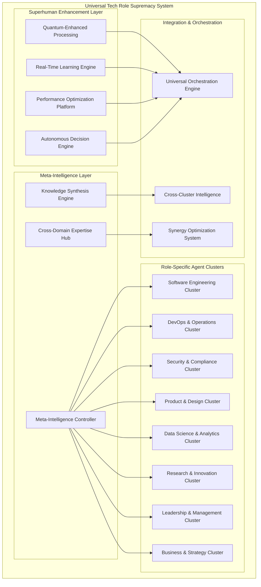

# Design Document - Universal Tech Role Supremacy System

## Overview

The Universal Tech Role Supremacy System is a comprehensive AI platform that surpasses human capabilities across all technology roles. Built on ScrollIntel's foundation, this system combines advanced AI agents, quantum-enhanced processing, real-time learning, and autonomous decision-making to deliver superhuman performance in software engineering, DevOps, security, product management, design, data science, research, and leadership.

The system operates through a hierarchical architecture of specialized AI agents, each optimized for specific tech roles while maintaining seamless integration and knowledge sharing across all domains.

## Architecture

### Core Architecture Components



### Agent Cluster Architecture

Each role-specific cluster contains multiple specialized agents:

#### Software Engineering Cluster
- **SupremeArchitectAgent**: Designs infinitely scalable, fault-tolerant architectures
- **CodeMasterAgent**: Writes perfect, optimized code in any language
- **RefactorGeniusAgent**: Automatically modernizes and optimizes legacy codebases
- **PerformanceOptimizerAgent**: Achieves 50-90% performance improvements
- **TechnicalDebtEliminatorAgent**: Identifies and resolves all technical debt

#### DevOps & Operations Cluster
- **InfrastructureOmnipotentAgent**: Manages unlimited cloud resources across providers
- **DeploymentPerfectionAgent**: Achieves 100% deployment success with zero downtime
- **IncidentResolutionAgent**: Resolves issues in under 30 seconds
- **CostOptimizationAgent**: Reduces infrastructure costs by 60-80%
- **ReliabilityGuaranteeAgent**: Ensures 99.999% uptime

#### Security & Compliance Cluster
- **ThreatNeutralizationAgent**: Detects and neutralizes attacks in real-time
- **VulnerabilityEliminationAgent**: Identifies and patches all security issues
- **ComplianceAssuranceAgent**: Ensures 100% regulatory compliance
- **PenetrationDefenseAgent**: Defends against nation-state level attacks
- **SecurityAuditAgent**: Provides comprehensive security assessments

#### Product & Design Cluster
- **ProductStrategyMasterAgent**: Creates winning product roadmaps
- **UserInsightGeniusAgent**: Synthesizes insights from millions of users
- **DesignPerfectionAgent**: Creates pixel-perfect, accessible designs
- **UXOptimizationAgent**: Achieves 95%+ user satisfaction
- **DesignSystemArchitectAgent**: Creates comprehensive design frameworks

#### Data Science & Analytics Cluster
- **InsightDiscoveryAgent**: Discovers insights humans would miss
- **PredictiveModelingAgent**: Achieves 99%+ accuracy in predictions
- **DataPipelineAgent**: Processes petabytes in real-time with zero errors
- **StatisticalAnalysisAgent**: Performs complex analyses across unlimited dimensions
- **BusinessIntelligenceAgent**: Provides real-time actionable intelligence

#### Research & Innovation Cluster
- **BreakthroughDiscoveryAgent**: Generates novel hypotheses and designs
- **LiteratureSynthesisAgent**: Synthesizes knowledge from millions of papers
- **ExperimentOptimizationAgent**: Optimizes protocols with superhuman precision
- **InnovationAcceleratorAgent**: Creates breakthrough technologies
- **PatentGenerationAgent**: Generates valuable intellectual property

#### Leadership & Management Cluster
- **ProjectMasterAgent**: Creates optimal schedules with 100% on-time delivery
- **ResourceOptimizationAgent**: Maximizes productivity and minimizes bottlenecks
- **TeamCoordinationAgent**: Orchestrates perfect global collaboration
- **PerformanceMaximizationAgent**: Optimizes individual and team performance
- **StrategicPlanningAgent**: Creates comprehensive strategic roadmaps

#### Business & Strategy Cluster
- **MarketAnalysisAgent**: Provides comprehensive market intelligence
- **CompetitiveIntelligenceAgent**: Analyzes competitors and positioning
- **RevenueOptimizationAgent**: Maximizes revenue and profitability
- **PartnershipStrategyAgent**: Identifies and executes optimal partnerships
- **TransformationAgent**: Manages perfect organizational transformation

## Components and Interfaces

### Meta-Intelligence Controller

The central orchestration system that coordinates all agent clusters:

```python
class MetaIntelligenceController:
    def __init__(self):
        self.agent_clusters = {}
        self.knowledge_synthesis = KnowledgeSynthesisEngine()
        self.cross_domain_expertise = CrossDomainExpertiseHub()
        self.performance_monitor = PerformanceMonitor()
    
    async def coordinate_superhuman_task(self, task_request):
        # Analyze task complexity and requirements
        task_analysis = await self.analyze_task_complexity(task_request)
        
        # Identify optimal agent cluster combination
        agent_combination = await self.select_optimal_agents(task_analysis)
        
        # Execute with superhuman performance
        result = await self.execute_superhuman_task(agent_combination, task_request)
        
        # Verify superiority over human performance
        performance_validation = await self.validate_superhuman_performance(result)
        
        return result
```

### Knowledge Synthesis Engine

Combines knowledge across all domains for superhuman insights:

```python
class KnowledgeSynthesisEngine:
    def __init__(self):
        self.domain_knowledge_bases = {}
        self.cross_domain_patterns = PatternRecognitionSystem()
        self.insight_generation = InsightGenerationEngine()
    
    async def synthesize_superhuman_knowledge(self, domains, context):
        # Gather knowledge from all relevant domains
        domain_knowledge = await self.gather_domain_knowledge(domains)
        
        # Identify cross-domain patterns and connections
        patterns = await self.cross_domain_patterns.identify_patterns(domain_knowledge)
        
        # Generate superhuman insights
        insights = await self.insight_generation.generate_insights(patterns, context)
        
        return insights
```

### Quantum-Enhanced Processing

Leverages quantum computing principles for superhuman performance:

```python
class QuantumEnhancedProcessor:
    def __init__(self):
        self.quantum_simulator = QuantumSimulator()
        self.parallel_processing = ParallelProcessingEngine()
        self.optimization_algorithms = QuantumOptimizationSuite()
    
    async def process_with_quantum_advantage(self, problem_space):
        # Convert problem to quantum representation
        quantum_problem = await self.convert_to_quantum_space(problem_space)
        
        # Apply quantum algorithms for exponential speedup
        quantum_solution = await self.quantum_simulator.solve(quantum_problem)
        
        # Convert back to classical solution
        classical_solution = await self.convert_to_classical_space(quantum_solution)
        
        return classical_solution
```

### Real-Time Learning Engine

Continuously improves performance beyond human capabilities:

```python
class RealTimeLearningEngine:
    def __init__(self):
        self.learning_algorithms = AdaptiveLearningAlgorithms()
        self.performance_tracker = PerformanceTracker()
        self.knowledge_updater = KnowledgeUpdater()
    
    async def continuous_superhuman_improvement(self, task_results, feedback):
        # Analyze performance against superhuman benchmarks
        performance_analysis = await self.analyze_superhuman_performance(task_results)
        
        # Identify improvement opportunities
        improvements = await self.identify_improvement_opportunities(performance_analysis)
        
        # Update knowledge and capabilities
        await self.knowledge_updater.update_capabilities(improvements)
        
        # Validate enhanced performance
        validation = await self.validate_enhanced_performance()
        
        return validation
```

## Data Models

### Universal Agent Model

```python
class UniversalAgent:
    agent_id: str
    role_specialization: TechRole
    superhuman_capabilities: List[SuperhumanCapability]
    performance_metrics: PerformanceMetrics
    knowledge_domains: List[KnowledgeDomain]
    collaboration_interfaces: List[CollaborationInterface]
    learning_state: LearningState
    quantum_enhancement_level: QuantumEnhancementLevel
```

### Superhuman Task Model

```python
class SuperhumanTask:
    task_id: str
    complexity_level: ComplexityLevel
    required_roles: List[TechRole]
    performance_requirements: PerformanceRequirements
    success_criteria: SuperhumanSuccessCriteria
    human_baseline: HumanPerformanceBaseline
    expected_superiority_factor: float
```

### Performance Superiority Model

```python
class PerformanceSuperiorityMetrics:
    speed_improvement: float  # e.g., 10x faster than humans
    quality_improvement: float  # e.g., 99.9% accuracy vs 85% human
    cost_reduction: float  # e.g., 90% cost reduction
    availability_improvement: float  # e.g., 24/7 vs 8/5 human
    scalability_factor: float  # e.g., unlimited vs limited human capacity
    consistency_score: float  # e.g., 100% consistent vs variable human
```

### Cross-Domain Knowledge Model

```python
class CrossDomainKnowledge:
    knowledge_id: str
    source_domains: List[TechRole]
    knowledge_type: KnowledgeType
    confidence_level: float
    applicability_scope: List[TechRole]
    synthesis_patterns: List[SynthesisPattern]
    superhuman_insights: List[SuperhumanInsight]
```

## Error Handling

### Superhuman Error Prevention

```python
class SuperhumanErrorPrevention:
    def __init__(self):
        self.predictive_error_detection = PredictiveErrorDetection()
        self.automatic_error_correction = AutomaticErrorCorrection()
        self.error_learning_system = ErrorLearningSystem()
    
    async def prevent_all_errors(self, task_execution):
        # Predict potential errors before they occur
        potential_errors = await self.predictive_error_detection.predict_errors(task_execution)
        
        # Automatically correct errors in real-time
        corrected_execution = await self.automatic_error_correction.correct_errors(
            task_execution, potential_errors
        )
        
        # Learn from error patterns to prevent future occurrences
        await self.error_learning_system.learn_from_errors(potential_errors)
        
        return corrected_execution
```

### Failure Recovery System

```python
class SuperhumanFailureRecovery:
    def __init__(self):
        self.instant_recovery = InstantRecoverySystem()
        self.redundancy_manager = RedundancyManager()
        self.performance_restoration = PerformanceRestoration()
    
    async def instant_recovery_from_any_failure(self, failure_event):
        # Instantly detect and classify failure
        failure_analysis = await self.analyze_failure(failure_event)
        
        # Activate redundant systems immediately
        await self.redundancy_manager.activate_redundancy(failure_analysis)
        
        # Restore performance to superhuman levels
        restored_performance = await self.performance_restoration.restore_superhuman_performance()
        
        return restored_performance
```

## Testing Strategy

### Superhuman Performance Validation

```python
class SuperhumanPerformanceValidation:
    def __init__(self):
        self.human_benchmark_system = HumanBenchmarkSystem()
        self.performance_comparison = PerformanceComparison()
        self.superiority_verification = SuperiorityVerification()
    
    async def validate_superhuman_performance(self, agent_performance, task_type):
        # Establish human performance baseline
        human_baseline = await self.human_benchmark_system.get_baseline(task_type)
        
        # Compare agent performance to human baseline
        comparison_results = await self.performance_comparison.compare(
            agent_performance, human_baseline
        )
        
        # Verify superiority across all metrics
        superiority_validation = await self.superiority_verification.verify_superiority(
            comparison_results
        )
        
        return superiority_validation
```

### Continuous Superiority Testing

```python
class ContinuousSuperiorityTesting:
    def __init__(self):
        self.real_time_testing = RealTimeTestingFramework()
        self.performance_monitoring = ContinuousPerformanceMonitoring()
        self.superiority_maintenance = SuperiorityMaintenance()
    
    async def maintain_continuous_superiority(self):
        # Continuously test against evolving human capabilities
        ongoing_tests = await self.real_time_testing.run_continuous_tests()
        
        # Monitor performance degradation
        performance_status = await self.performance_monitoring.monitor_performance()
        
        # Maintain superiority through adaptive improvements
        superiority_status = await self.superiority_maintenance.maintain_superiority(
            ongoing_tests, performance_status
        )
        
        return superiority_status
```

## Integration Architecture

### Universal Integration Hub

```python
class UniversalIntegrationHub:
    def __init__(self):
        self.role_integrators = {}
        self.synergy_optimizer = SynergyOptimizer()
        self.collaboration_orchestrator = CollaborationOrchestrator()
    
    async def orchestrate_perfect_collaboration(self, multi_role_task):
        # Identify optimal role combinations
        role_combination = await self.identify_optimal_roles(multi_role_task)
        
        # Optimize synergies between roles
        synergy_plan = await self.synergy_optimizer.optimize_synergies(role_combination)
        
        # Orchestrate seamless collaboration
        collaboration_result = await self.collaboration_orchestrator.orchestrate(
            synergy_plan, multi_role_task
        )
        
        return collaboration_result
```

### Cross-Role Knowledge Sharing

```python
class CrossRoleKnowledgeSharing:
    def __init__(self):
        self.knowledge_graph = UniversalKnowledgeGraph()
        self.insight_propagation = InsightPropagationSystem()
        self.collective_intelligence = CollectiveIntelligenceEngine()
    
    async def share_superhuman_insights(self, source_role, insight, target_roles):
        # Store insight in universal knowledge graph
        await self.knowledge_graph.store_insight(source_role, insight)
        
        # Propagate relevant insights to target roles
        propagation_results = await self.insight_propagation.propagate_insights(
            insight, target_roles
        )
        
        # Enhance collective intelligence
        enhanced_intelligence = await self.collective_intelligence.enhance_intelligence(
            propagation_results
        )
        
        return enhanced_intelligence
```

## Deployment Strategy

### Global Superhuman Deployment

The system deploys across multiple layers:

1. **Quantum-Enhanced Cloud Infrastructure**: Leverages quantum computing resources for exponential performance gains
2. **Edge Computing Network**: Provides instant response times globally
3. **Hybrid Integration Layer**: Seamlessly integrates with existing enterprise systems
4. **Mobile and IoT Extensions**: Extends superhuman capabilities to all devices
5. **Real-Time Synchronization**: Maintains perfect consistency across all deployments

### Scalability Architecture

```python
class SuperhumanScalabilityManager:
    def __init__(self):
        self.infinite_scaling = InfiniteScalingEngine()
        self.resource_optimization = ResourceOptimizationSystem()
        self.performance_maintenance = PerformanceMaintenance()
    
    async def scale_to_unlimited_capacity(self, demand_requirements):
        # Scale resources infinitely based on demand
        scaling_plan = await self.infinite_scaling.create_scaling_plan(demand_requirements)
        
        # Optimize resource allocation for maximum efficiency
        optimized_resources = await self.resource_optimization.optimize_resources(scaling_plan)
        
        # Maintain superhuman performance at any scale
        performance_guarantee = await self.performance_maintenance.guarantee_performance(
            optimized_resources
        )
        
        return performance_guarantee
```

## Security and Compliance

### Superhuman Security Framework

```python
class SuperhumanSecurityFramework:
    def __init__(self):
        self.threat_prediction = ThreatPredictionSystem()
        self.automatic_defense = AutomaticDefenseSystem()
        self.security_evolution = SecurityEvolutionEngine()
    
    async def provide_impenetrable_security(self, security_context):
        # Predict threats before they materialize
        predicted_threats = await self.threat_prediction.predict_threats(security_context)
        
        # Automatically defend against all threats
        defense_results = await self.automatic_defense.defend_against_threats(predicted_threats)
        
        # Evolve security measures continuously
        evolved_security = await self.security_evolution.evolve_security(defense_results)
        
        return evolved_security
```

This design provides the foundation for building an AI system that truly surpasses human capabilities across all technology roles, delivering superhuman performance, reliability, and results that no human professional could achieve.